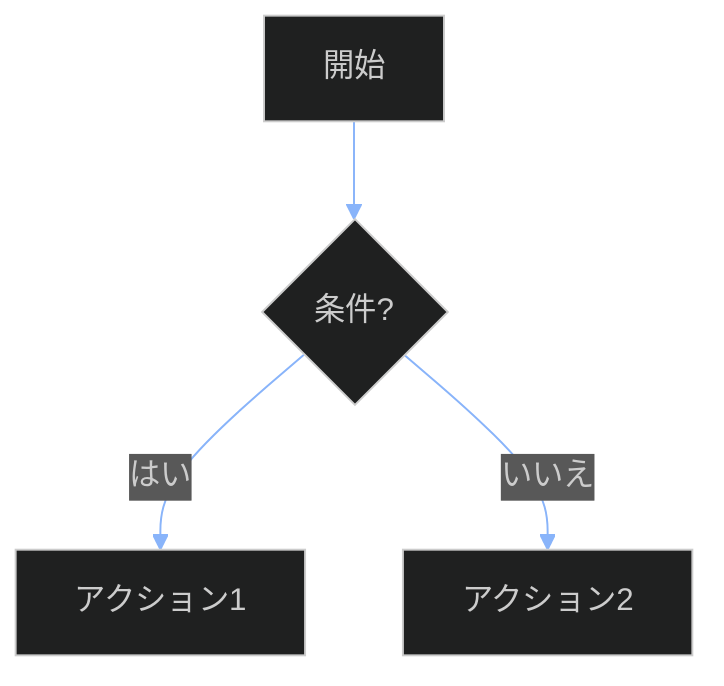

# CLAUDE.md設定ガイド

3docaドキュメントフレームワーク用のClaude Code設定です。このガイドに従ってドキュメントを生成してください。

## ドキュメントタイプとテンプレート

ドキュメント作成時は、対応するテンプレートを参照してください：

| ドキュメントタイプ | テンプレート | 用途 |
|-------------------|-------------|------|
| ポリシー | `/templates/06policy-template.md` | 組織の方針とコンプライアンス要件 |
| SOP | `/templates/07sop-template.md` | 標準作業手順書 |
| プレイブック | `/templates/01playbook-template.md` | 状況判断と意思決定ツリー |
| ランブック | `/templates/02runbook-template.md` | コピペ実行可能な手順書 |
| チートシート | `/templates/05cheatsheet-template.md` | クイックリファレンス |
| ADR | `/templates/04adr-template.md` | アーキテクチャ決定記録 |
| プロセス | `/templates/00process-document-template.md` | プロセスフロー定義 |
| トラブルシューティング | `/templates/03troubleshooting-template.md` | 問題解決ガイド |

## スタイル要件

### 1. 文体

- **二人称（〜してください）**: 手順書は読者に直接指示する形式
- **能動態**: 「〜される」ではなく「〜する」を使用
- **明確で簡潔**: 曖昧な表現を避ける

### 2. 技術用語

- **最初の使用時に定義**: 略語や専門用語は初出時に説明
- **一貫性**: 同じ概念には同じ用語を使用

### 3. コマンドと出力

- **すべてのコマンドに期待出力を含める**
- **コピー＆ペーストで実行可能**にする
- **コードブロックには言語指定**を付ける

```bash
# 良い例
wsl --status
# 期待出力:
# Default Distribution: Ubuntu-22.04
# Default Version: 2
```

### 4. ステップ構造

- **1ステップにつき1アクション**
- **番号付きステップ**で順序を明確に
- **破壊的操作には⚠️警告**をマーク

### 5. テーブル活用

- **構造化情報にはテーブルを使用**
- **比較、要件、チェックリスト**に最適

## フロントマター要件

すべてのドキュメントに以下のフロントマターを含めてください：

```yaml
---
# === 必須：識別情報 ===
document_id: "TYPE-DOMAIN-NNN"   # 例: RUN-DB-001, PLB-INC-002
title: "ドキュメントタイトル"
type: policy | sop | playbook | runbook | cheatsheet | adr
version: "1.0.0"
status: draft | review | approved | active | deprecated

# === 所有権 ===
owner: "@team-name"              # 責任チーム
author: "作成者名"
created: YYYY-MM-DD
updated: YYYY-MM-DD

# === RAG最適化 ===
tags: [tag1, tag2, tag3]         # 最低2つ
key_concepts:                    # セマンティック検索用
  - "概念1"
  - "概念2"
summary: "一文で内容を説明"

# === ドメインコンテキスト ===
domain: infrastructure | security | data | application | scientific
audience: developers | operators | architects | scientists

# === 任意：関連ドキュメント ===
related_docs:
  - path: "/path/to/doc.md"
    relationship: implements | governed-by | references | depends-on | escalates-to
---
```

### document_id形式

| タイプ | プレフィックス | 例 |
|--------|--------------|-----|
| ポリシー | POL | POL-SEC-001 |
| SOP | SOP | SOP-CFD-001 |
| プレイブック | PLB | PLB-INC-001 |
| ランブック | RUN | RUN-DB-001 |
| チートシート | CS | CS-PSQL-001 |
| ADR | ADR | ADR-0042 |

## ドキュメント生成プロンプトパターン

### SOP生成プロンプト

```
あなたは技術ドキュメント専門家です。[タスク]のための標準作業手順書を生成してください。

コンテキスト: このSOPは[ドメイン]運用向けで、[対象者]が使用します。

構造要件:
1. 目的（この手順が存在する理由を2-3文で）
2. 適用範囲（対象システム/プロセス）
3. 前提条件テーブル（必要なアクセス、ツール、知識）
4. 番号付き手順ステップ:
   - ステップの目的
   - 明示的なコマンド（コピー＆ペースト可能）
   - 期待出力（成功の様子）
   - 検証チェックポイント
5. トラブルシューティングテーブル（問題 | 原因 | 解決策）
6. ロールバック手順

スタイル要件:
- 1ステップにつき1アクション
- すべてのコマンドの後に期待出力を含める
- 破壊的操作には⚠️警告をマーク
- 構造化情報にはテーブルを使用

[ドメイン固有要件]:
[必要に応じてドメイン固有の品質メトリクス、ツール、検証方法を追加]
```

### ランブック生成プロンプト

```
[システム/タスク]の運用ランブックを作成してください。

要件:
- すべてのコマンドはコピー＆ペーストで即座に実行可能
- 各ステップに期待出力を含める
- 失敗シナリオとロールバック手順を含める
- 検証コマンドで成功を確認可能にする

形式:
- フロントマター: document_id, title, type, prerequisites, estimated_duration
- セクション: 概要、実行前チェックリスト、手順、ロールバック、実行後検証

対象環境: [WSL/Linux/Windows]
対象者: [開発者/運用者/SRE]
```

### プレイブック生成プロンプト

```
[シナリオ]に対応するプレイブックを作成してください。

構造要件:
1. トリガー条件（いつこのプレイブックを使用するか）
2. クイックアセスメント（最初の2分間で確認すべきこと）
3. 意思決定ツリー（Mermaid flowchart形式）
4. 重大度別対応アクション（SEV-1/2/3）
5. 関連ランブックへのリンク

Mermaid図には以下のinit設定を使用:
%%{init: {'theme': 'dark'}}%%
```

## 品質チェックリスト

ドキュメント作成完了前に以下を確認してください：

### 必須チェック項目

- [ ] **コードブロック言語指定**: すべてのコードブロックに言語指定がある
- [ ] **コマンドテスト**: コマンドが実際に動作することを確認
- [ ] **期待出力**: すべてのコマンドに期待出力が記載されている
- [ ] **相互参照検証**: 相対パスのリンクが有効
- [ ] **プレースホルダー残存確認**: `<!-- TEMPLATE: ... -->`が残っていない
- [ ] **フロントマター完全性**: 必須フィールドがすべて埋まっている

### 推奨チェック項目

- [ ] **document_id形式**: TYPE-DOMAIN-NNN形式に従っている
- [ ] **key_concepts**: 検索に有用なセマンティック用語が含まれている
- [ ] **related_docs**: 関連ドキュメントへのリンクが適切に設定されている
- [ ] **Mermaid図**: ダークモード設定（`theme: 'dark'`）が適用されている
- [ ] **テーブル形式**: 構造化情報がテーブルで整理されている
- [ ] **警告マーク**: 破壊的操作に⚠️が付いている

## Mermaid図の設定

すべてのMermaid図には以下のinit設定を含めてください：



### 推奨カラー

| 用途 | カラーコード |
|------|-------------|
| 完了/成功 | `#4ade80` |
| 進行中 | `#fbbf24` |
| 未着手 | `#a78bfa` |
| エラー | `#f87171` |

## 関連ドキュメント

- [3POLICY.md](./3POLICY.md) - プロジェクトポリシー
- [1USAGE-GUIDE.md](./1USAGE-GUIDE.md) - テンプレート使用ガイド
- [schema/README.md](./schema/README.md) - スキーマ定義
- [9251205claude.md](./9251205claude.md) - 基準フレームワーク文書

---

**バージョン**: 1.0
**更新日**: 2025-12-05
**基準**: 9251205claude.md セクション3
