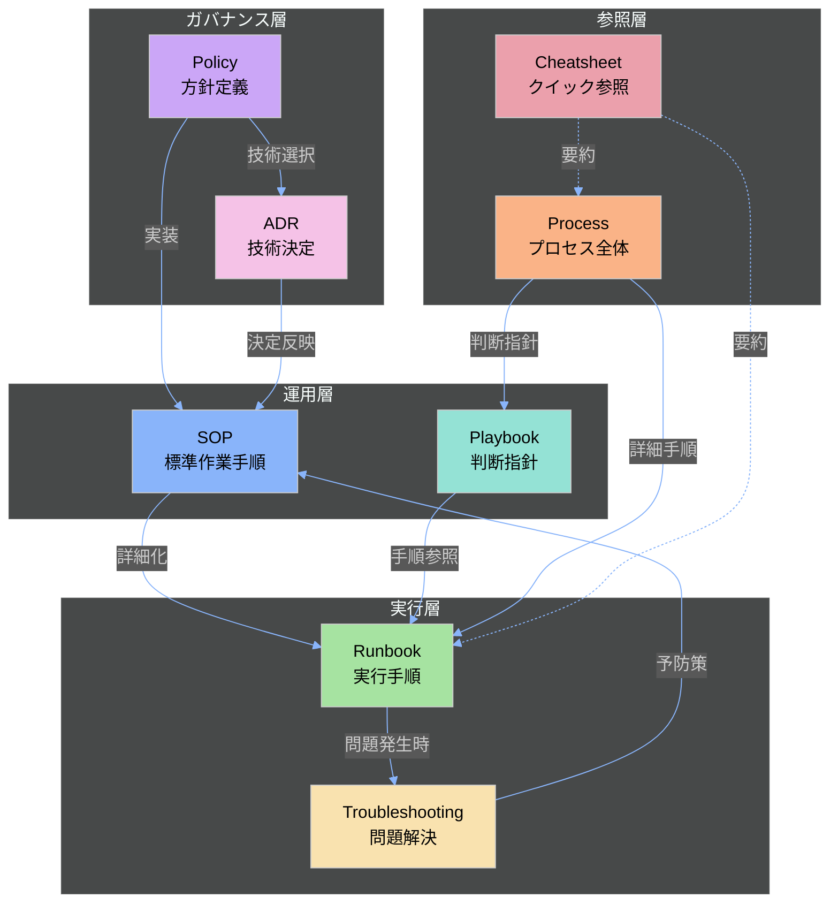
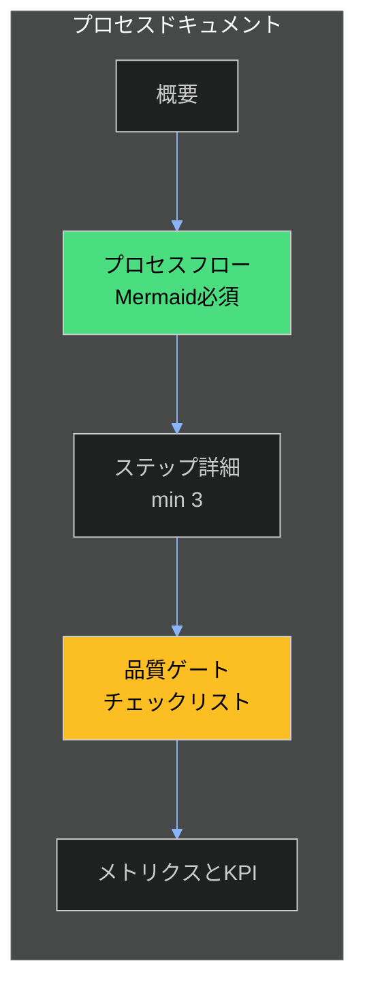
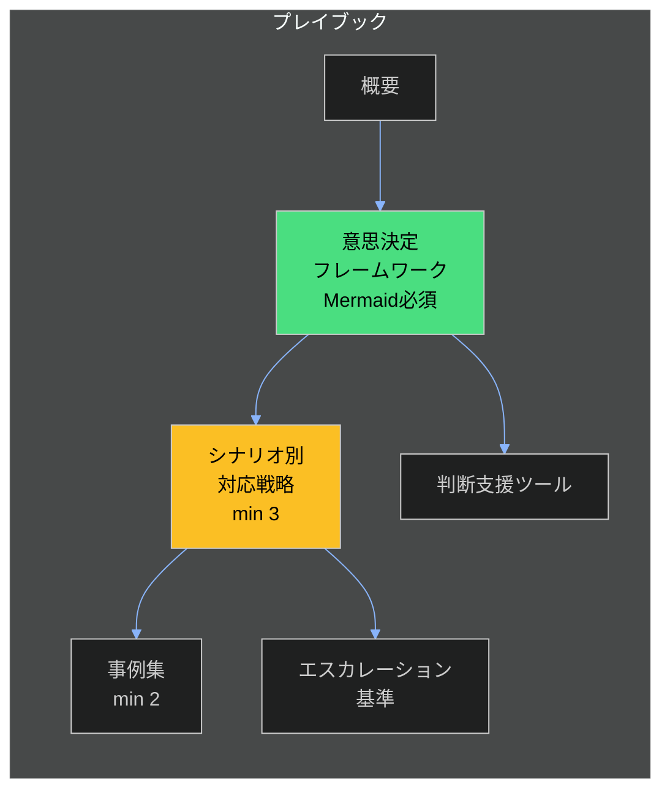
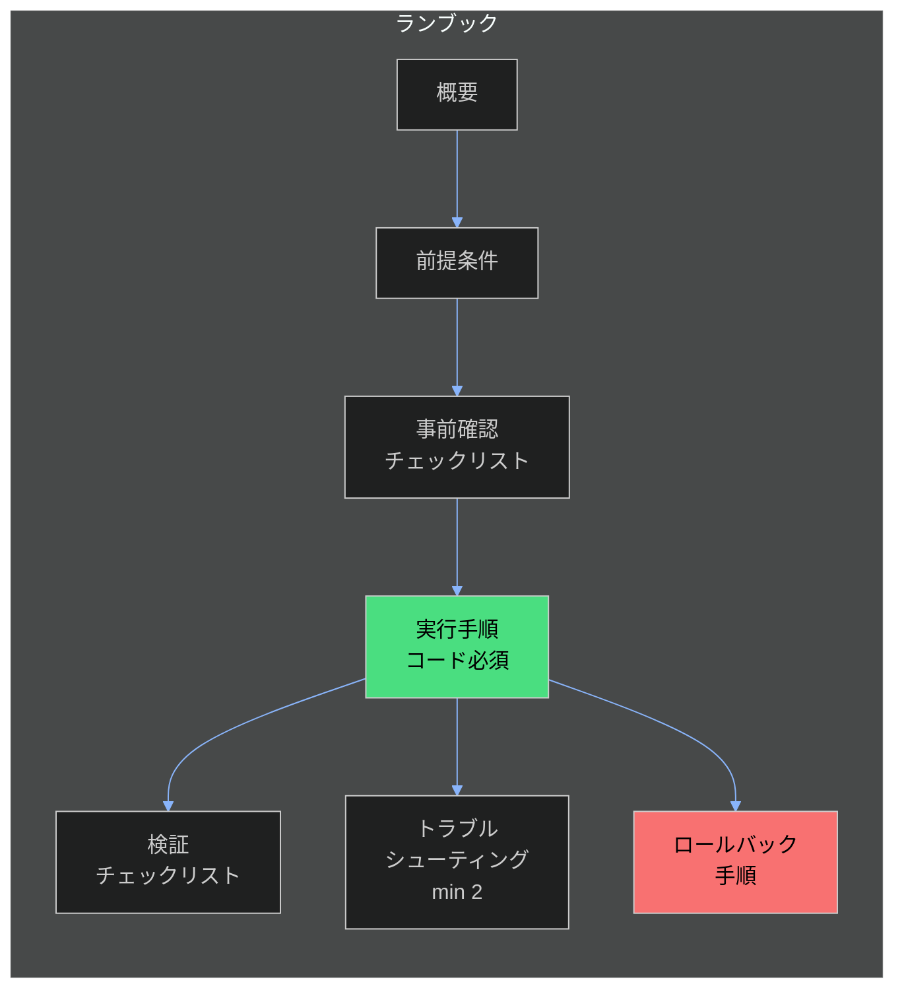
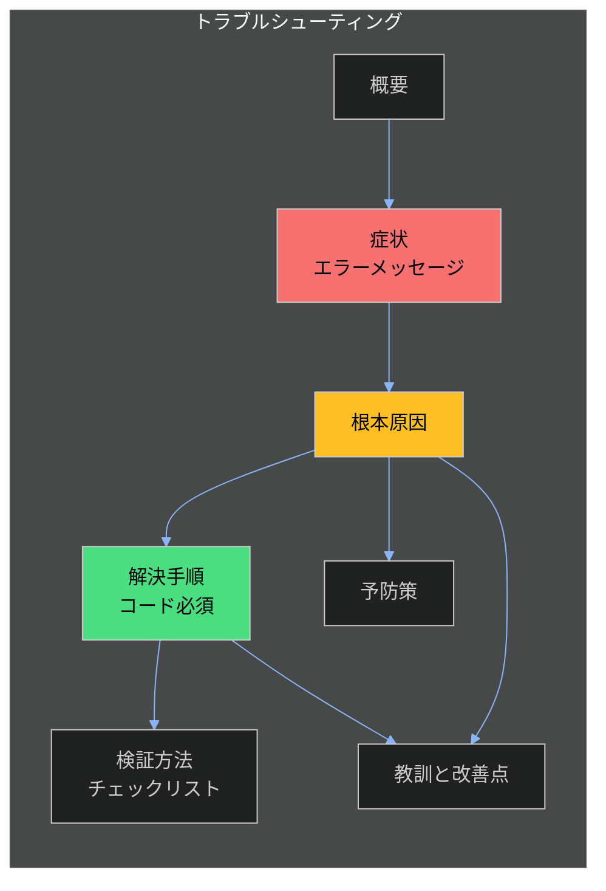
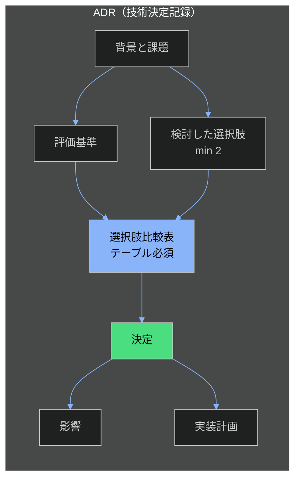
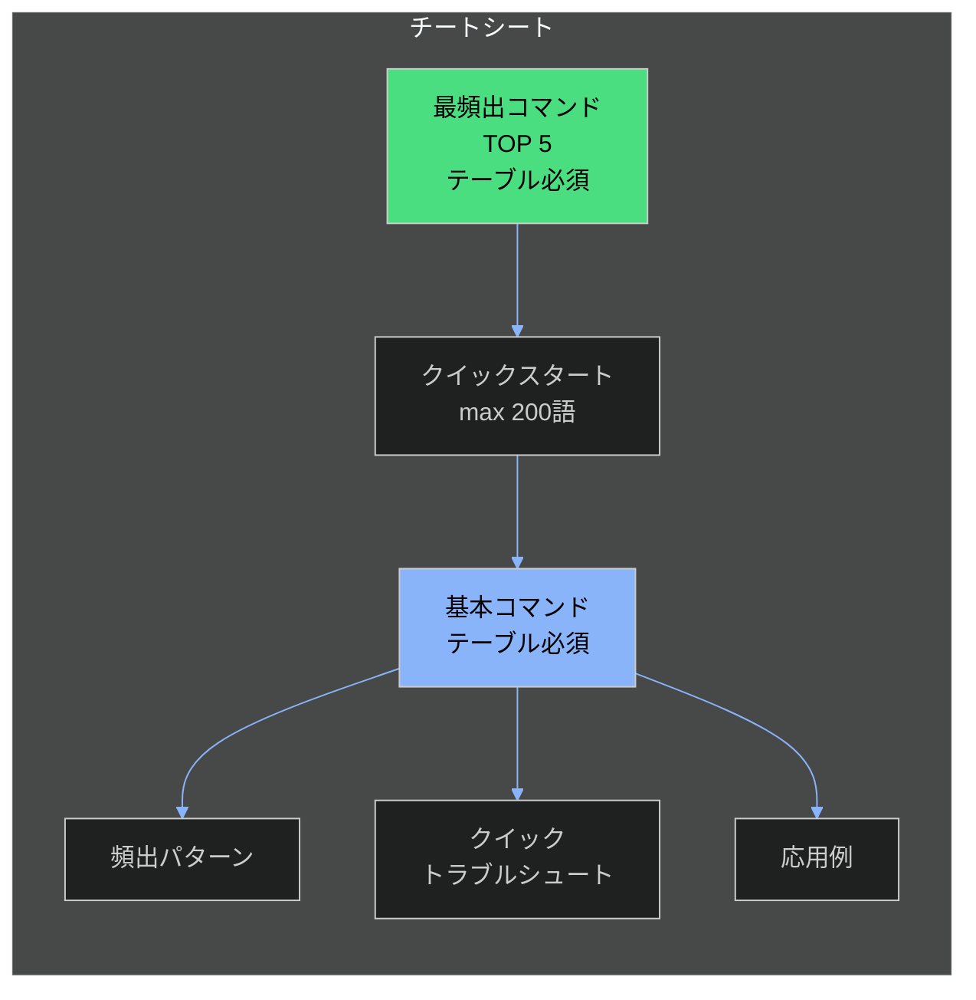
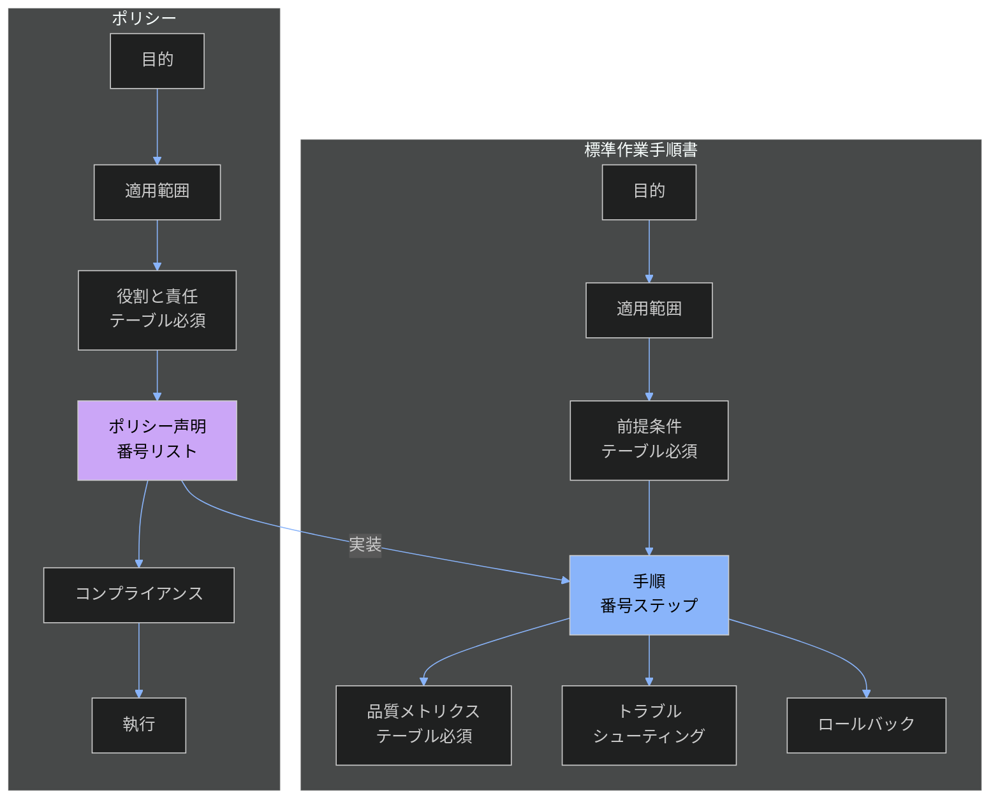
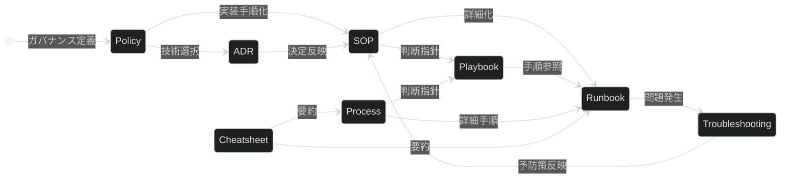

# セクション間依存関係マップ

## 概要

このドキュメントは、3docaフレームワークの8ドキュメントタイプにおけるセクション間の依存関係を可視化します。エージェントがドキュメント構造を理解し、適切な順序でセクションを作成するためのリファレンスです。

## 1. ドキュメントタイプ間の関係

## 2. プロセスドキュメント依存関係

**依存関係ルール:**
- `ステップ詳細` → `プロセスフロー`: ステップはフローで定義されたステップに対応
- `品質ゲート` → `ステップ詳細`: 品質ゲートは各ステップの完了基準を定義
- `メトリクスとKPI` → `品質ゲート`: メトリクスは品質ゲートの達成度を測定

## 3. プレイブック依存関係

**依存関係ルール:**
- `シナリオ別対応戦略` → `意思決定フレームワーク`: シナリオはフローの分岐先
- `事例集` → `シナリオ別対応戦略`: 事例はシナリオに対応した記録
- `判断支援ツール` → `意思決定フレームワーク`: ツールはフレームワークでの判断を補助

## 4. ランブック依存関係

**依存関係ルール:**
- `実行手順` → `前提条件`: 手順は前提条件が満たされた状態で実行
- `検証チェックリスト` → `実行手順`: 検証は実行手順の完了を確認
- `トラブルシューティング` → `実行手順`: 実行中の問題に対応
- `ロールバック手順` → `実行手順`: ロールバックは実行手順の逆操作

## 5. トラブルシューティング依存関係

**依存関係ルール:**
- `根本原因` → `症状`: 原因分析は症状の観察に基づく
- `解決手順` → `根本原因`: 解決策は原因に対処
- `検証方法` → `解決手順`: 検証は解決手順の効果を確認
- `予防策` → `根本原因`: 予防策は原因の再発を防ぐ
- `教訓と改善点` → `根本原因`, `解決手順`: 原因分析と解決過程から導出

## 6. ADR依存関係

**依存関係ルール:**
- `評価基準` → `背景と課題`: 評価基準は課題に基づいて定義
- `検討した選択肢` → `背景と課題`: 選択肢は課題を解決するためのもの
- `選択肢比較表` → `評価基準`, `検討した選択肢`: 比較表は評価基準で選択肢を評価
- `決定` → `選択肢比較表`: 決定は比較結果に基づく
- `影響` → `決定`: 影響は決定の結果として発生
- `実装計画` → `決定`: 実装は決定内容を具体化

## 7. チートシート依存関係

**依存関係ルール:**
- `頻出パターン` → `基本コマンド`: パターンは基本コマンドの組み合わせ
- `応用例` → `基本コマンド`: 応用例は基本コマンドを使用
- `クイックトラブルシュート` → `基本コマンド`: トラブルシュートは基本操作の問題を扱う

## 8. Policy / SOP 依存関係

## 9. 統合依存関係マップ

## 10. ドキュメント作成フロー（推奨順序）

| 順序 | ドキュメントタイプ | 前提条件 | 成果物 |
|------|-------------------|---------|--------|
| 1 | Policy | なし | 組織方針 |
| 2 | ADR | Policy（該当する場合） | 技術決定記録 |
| 3 | Process | なし | 全体フロー |
| 4 | SOP | Policy, ADR | 標準手順 |
| 5 | Playbook | Process | 判断指針 |
| 6 | Runbook | SOP, Playbook | 実行手順 |
| 7 | Cheatsheet | Process, Runbook | 参照カード |
| 8 | Troubleshooting | 運用実績後 | 問題解決記録 |

## 関連ドキュメント

- [USAGE-GUIDE.md](./1USAGE-GUIDE.md) - テンプレート使用ガイド
- [schema/README.md](./schema/README.md) - スキーマ定義リファレンス
- [POLICY.md](./3POLICY.md) - プロジェクトポリシー
