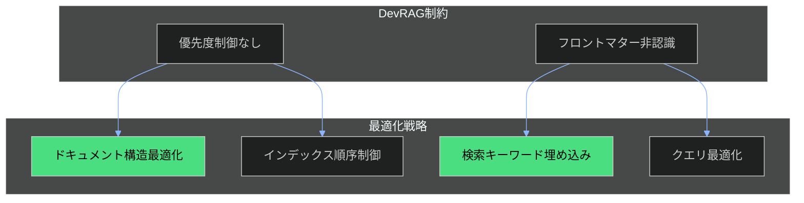

# DevRAGインデックス最適化ガイド

## 概要

このガイドは、3docaフレームワークドキュメントをDevRAGに最適にインデックスし、検索精度を向上させるための手順と最適化戦略を説明します。

**重要**: DevRAG v1.1.0には優先度制御機能（boost/weight）がありません。そのため、ドキュメント構造の最適化によって検索精度を向上させます。

## 1. DevRAG制約事項

### 機能的制約

| 機能 | サポート | 備考 |
|-----|---------|------|
| セマンティック検索 | ✅ | multilingual-e5-small使用 |
| フロントマター認識 | ❌ | 純粋なテキスト検索のみ |
| 優先度パラメータ | ❌ | boost/weightなし |
| ファイルパス優先度 | ❌ | インデックス順序のみ |
| シンボリックリンク | ❌ | 実ファイルコピーが必要 |

### 対応戦略



## 2. インデックス設定手順

### Step 1: ディレクトリ構造準備

```bash
# 3docaプロジェクトルートで実行
cd /mnt/j/pcloud_sync/5agent/1conf/3doca

# DevRAG用ドキュメントディレクトリ作成
mkdir -p documents/3doca
```

### Step 2: フレームワークドキュメントのコピー

```bash
# 優先度順にコピー（最初にコピーしたものがインデックス順序で優先される可能性）

# 1. フレームワーク定義ドキュメント（最優先）
cp 01-doc-framework/0README.md documents/3doca/
cp 01-doc-framework/1USAGE-GUIDE.md documents/3doca/
cp 01-doc-framework/3POLICY.md documents/3doca/
cp 01-doc-framework/4FRONTMATTER-EXTENSION-SPEC.md documents/3doca/
cp 01-doc-framework/5SECTION-DEPENDENCY-MAP.md documents/3doca/

# 2. テンプレート（高優先度）
cp -r 01-doc-framework/templates documents/3doca/

# 3. スキーマ（中優先度）
cp -r 01-doc-framework/schema documents/3doca/

# 4. 実例（参照用）
cp -r 01-doc-framework/examples documents/3doca/
```

### Step 3: DevRAGでインデックス追加

```bash
# MCPツールを使用してインデックス
# Claude Code内で以下を実行

# フレームワーク定義ドキュメント
mcp__devrag__index_markdown(filepath="documents/3doca/0README.md")
mcp__devrag__index_markdown(filepath="documents/3doca/1USAGE-GUIDE.md")
mcp__devrag__index_markdown(filepath="documents/3doca/3POLICY.md")
mcp__devrag__index_markdown(filepath="documents/3doca/4FRONTMATTER-EXTENSION-SPEC.md")
mcp__devrag__index_markdown(filepath="documents/3doca/5SECTION-DEPENDENCY-MAP.md")

# テンプレート
mcp__devrag__index_markdown(filepath="documents/3doca/templates/00process-document-template.md")
mcp__devrag__index_markdown(filepath="documents/3doca/templates/01playbook-template.md")
mcp__devrag__index_markdown(filepath="documents/3doca/templates/02runbook-template.md")
mcp__devrag__index_markdown(filepath="documents/3doca/templates/03troubleshooting-template.md")
mcp__devrag__index_markdown(filepath="documents/3doca/templates/04adr-template.md")
mcp__devrag__index_markdown(filepath="documents/3doca/templates/05cheatsheet-template.md")
mcp__devrag__index_markdown(filepath="documents/3doca/templates/06policy-template.md")
mcp__devrag__index_markdown(filepath="documents/3doca/templates/07sop-template.md")
```

### Step 4: インデックス確認

```bash
# ドキュメント数確認
mcp__devrag__list_documents()

# 検索テスト
mcp__devrag__search(query="プロセスドキュメントテンプレート", top_k=3)
mcp__devrag__search(query="フロントマター必須フィールド", top_k=3)
```

## 3. ドキュメント構造最適化

### 3.1 タイトルとdescriptionの最適化

DevRAGはフロントマターを特別扱いしませんが、テキストとして検索対象になります。

**最適化前**:
```yaml
title: "プロセスドキュメントテンプレート"
description: "プロセス記述用のテンプレート"
```

**最適化後**:
```yaml
title: "プロセスドキュメントテンプレート - ワークフロー作業手順標準化"
description: "プロセスドキュメント作成用テンプレート。ワークフロー全体フロー、品質ゲート、KPI定義、ステップ詳細を標準化。Diátaxisフレームワーク準拠。"
```

**ポイント**:
- titleに主要な同義語を含める
- descriptionに検索されやすいキーワードを複数含める
- 150文字以内で情報密度を最大化

### 3.2 セクションヘッダーの最適化

```markdown
<!-- 最適化前 -->
## 概要

<!-- 最適化後 -->
## 概要 - プロセスドキュメントの目的と適用範囲
```

**ポイント**:
- ヘッダーに内容を示すキーワードを追加
- セマンティック検索でヘッダー周辺が返されやすくなる

### 3.3 セクション冒頭の要約追加

各セクションの冒頭に1-2文の要約を追加：

```markdown
## 品質ゲート - プロセス完了の判定基準

**このセクションでは**: 各ステップ完了時に確認すべき品質基準とチェックリストを定義します。品質ゲートを通過することで、次のステップに進む準備が整ったことを確認できます。

### チェックリスト
...
```

### 3.4 キーワード密度の最適化

フレームワークドキュメントには、以下のキーワードを意識的に含める：

| カテゴリ | 推奨キーワード |
|---------|--------------|
| フレームワーク | Diátaxis, 3doca, ドキュメントフレームワーク, テンプレート |
| ドキュメントタイプ | プロセス, プレイブック, ランブック, ADR, チートシート, トラブルシューティング |
| 品質 | フロントマター, スキーマ, 検証, 品質ゲート, チェックリスト |
| 運用 | Mermaid, RAG, 検索, インデックス |

## 4. 検索クエリ最適化

### 4.1 日英混合クエリ

DevRAGのmultilingual-e5-smallは多言語対応。日英混合で精度向上：

```bash
# 推奨
mcp__devrag__search(query="プロセス process ドキュメント document テンプレート template")

# 非推奨
mcp__devrag__search(query="プロセスドキュメント")
```

### 4.2 同義語展開

```bash
# 推奨
mcp__devrag__search(query="プレイブック playbook 判断 decision シナリオ scenario 対応")

# 非推奨
mcp__devrag__search(query="プレイブック")
```

### 4.3 top_k調整

| ユースケース | top_k | 理由 |
|-------------|-------|------|
| 特定ドキュメント検索 | 3 | 精度重視 |
| 概念調査 | 5-7 | バランス |
| 網羅的検索 | 10+ | 漏れ防止 |

## 5. インデックス更新ワークフロー

### 自動同期スクリプト

```bash
#!/bin/bash
# sync-3doca-to-devrag.sh

# 3docaプロジェクトルート
DOCA_ROOT="/mnt/j/pcloud_sync/5agent/1conf/3doca"
DOC_DIR="${DOCA_ROOT}/documents/3doca"

# ディレクトリ作成
mkdir -p "${DOC_DIR}/templates" "${DOC_DIR}/schema" "${DOC_DIR}/examples"

# フレームワークドキュメントをコピー
cp "${DOCA_ROOT}/01-doc-framework/"*.md "${DOC_DIR}/" 2>/dev/null || true
cp -r "${DOCA_ROOT}/01-doc-framework/templates/"* "${DOC_DIR}/templates/" 2>/dev/null || true
cp -r "${DOCA_ROOT}/01-doc-framework/schema/"* "${DOC_DIR}/schema/" 2>/dev/null || true
cp -r "${DOCA_ROOT}/01-doc-framework/examples/"* "${DOC_DIR}/examples/" 2>/dev/null || true

echo "3doca documents synced to ${DOC_DIR}"
echo "Run DevRAG indexing commands to update index"
```

### 更新トリガー

以下の場合にインデックスを更新：

1. **テンプレート変更時** - 新規テンプレート追加、既存テンプレート修正
2. **スキーマ変更時** - スキーマ定義の追加・修正
3. **フレームワークドキュメント更新時** - README、POLICY、仕様書の更新
4. **週次メンテナンス** - 定期的な再インデックス

## 6. 将来の拡張準備

### フロントマター拡張フィールド

DevRAGが将来フロントマター認識に対応した場合に備え、以下のフィールドを準備：

```yaml
# 4FRONTMATTER-EXTENSION-SPEC.md で定義済み
priority: framework  # framework | template | canonical | example | reference | general
is_canonical: true   # 基準ドキュメントフラグ
search_boost: 1.5    # 将来の重み付け用（現在は効果なし）
```

### 代替RAGソリューション検討

優先度制御が必要な場合の代替案：

| ソリューション | 優先度制御 | 導入コスト | 備考 |
|--------------|----------|----------|------|
| Chroma MCP | ✅ メタデータフィルタ | 中 | Node.js必要 |
| Qdrant MCP | ✅ スコアブースト | 高 | Qdrantサーバー必要 |
| PostgreSQL/pgvector | ✅ クエリ制御 | 高 | DB構築必要 |

## 7. 検証チェックリスト

### インデックス設定完了チェック

- [ ] documents/3doca/ ディレクトリが存在する
- [ ] フレームワークドキュメント（5ファイル）がコピーされている
- [ ] テンプレート（8ファイル）がコピーされている
- [ ] スキーマ（9ファイル）がコピーされている
- [ ] DevRAGでインデックスが追加されている

### 検索精度確認

- [ ] 「プロセスドキュメントテンプレート」で00process-document-template.mdが上位に返る
- [ ] 「フロントマター必須フィールド」でUSAGE-GUIDEまたはFRONTMATTER-EXTENSION-SPECが返る
- [ ] 「ADR 技術決定」でadr-template.mdが返る
- [ ] 日英混合クエリで精度が向上する

## 関連ドキュメント

- [FRONTMATTER-EXTENSION-SPEC.md](./4FRONTMATTER-EXTENSION-SPEC.md) - フロントマター拡張仕様
- [USAGE-GUIDE.md](./1USAGE-GUIDE.md) - テンプレート使用ガイド
- [DevRAG Setup Guide](/mnt/j/pcloud_sync/5agent/1conf/6claude/docs/04-devrag-setup.md) - DevRAG設定ガイド（6claude）
