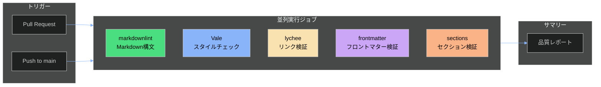

# CI/CDパイプラインガイド

## 概要

このガイドは、3docaフレームワークのドキュメント品質を自動検証するGitHub Actionsパイプラインの設定と使用方法を説明します。

## パイプライン構成



## 検証ジョブ詳細

### 1. Markdownリント

**ツール**: [markdownlint-cli2](https://github.com/DavidAnson/markdownlint-cli2)

**検証内容**:
- 見出しレベルの連続性
- リスト形式の統一
- コードブロックの構文
- 行末の空白

**設定ファイル**: `.markdownlint.json`

**ローカル実行**:
```bash
# インストール
npm install -g markdownlint-cli2

# 実行
markdownlint-cli2 "01-doc-framework/**/*.md"
```

### 2. Valeスタイルチェック

**ツール**: [Vale](https://vale.sh/)

**検証内容**:
- 一貫したスタイル
- 冗長な表現の検出
- カスタムルール（フロントマター、見出し）

**設定ファイル**: `.vale.ini`

**ローカル実行**:
```bash
# インストール
brew install vale  # macOS
# または
sudo snap install vale  # Linux

# パッケージ同期
vale sync

# 実行
vale 01-doc-framework/
```

### 3. リンク検証

**ツール**: [lychee](https://github.com/lycheeverse/lychee)

**検証内容**:
- 内部リンクの有効性
- 外部リンクのアクセス可否
- アンカーリンクの検証

**ローカル実行**:
```bash
# インストール
brew install lychee  # macOS
# または
cargo install lychee  # Rust

# 実行
lychee "01-doc-framework/**/*.md" --verbose
```

### 4. フロントマター検証

**ツール**: `check_frontmatter.py`（カスタム）

**検証内容**:
- 必須フィールドの存在
- フィールド値の形式
- document_id形式
- related_docs関係値

**ローカル実行**:
```bash
# 実行
python 01-doc-framework/check_frontmatter.py \
  01-doc-framework/templates \
  01-doc-framework/examples \
  --format json \
  --output report.json
```

### 5. セクション検証

**ツール**: `check_frontmatter.py --check-sections`

**検証内容**:
- 必須セクションの存在
- セクション順序の推奨
- Mermaid図の存在（該当する場合）

**ローカル実行**:
```bash
python 01-doc-framework/check_frontmatter.py \
  01-doc-framework/examples \
  --check-sections \
  --format json
```

## トリガー条件

| イベント | 対象パス | 説明 |
|---------|---------|------|
| Pull Request | `01-doc-framework/**/*.md`, `docs/**/*.md`, `**.md` | すべてのMD変更 |
| Push (main) | `01-doc-framework/**/*.md` | フレームワーク変更のみ |

## 設定ファイル一覧

| ファイル | 目的 |
|---------|------|
| `.github/workflows/docs-quality.yml` | CI/CDワークフロー定義 |
| `.markdownlint.json` | markdownlint設定 |
| `.vale.ini` | Vale設定 |
| `styles/3doca/*.yml` | カスタムValeルール |

## カスタムValeルール

### 3doca/Frontmatter.yml

フロントマターの存在をチェック：

```yaml
extends: existence
message: "Document should have frontmatter..."
level: warning
scope: raw
```

### 3doca/Headings.yml

見出しにコンテキストを追加することを推奨：

```yaml
extends: existence
message: "Consider adding context to section heading..."
level: suggestion
scope: heading
```

## GitHub Actions無料枠考慮

**制限**:
- パブリックリポジトリ: 無制限
- プライベートリポジトリ: 2,000分/月

**最適化**:
- `concurrency`設定でPRごとに1つのワークフローのみ実行
- `cancel-in-progress: true`で古いワークフローをキャンセル
- 必要最小限のジョブ構成

## トラブルシューティング

### markdownlint失敗

**症状**: `MD013: Line length` エラー

**解決策**: `.markdownlint.json`で`MD013: false`に設定済み

### Valeパッケージ不足

**症状**: `No styles found`

**解決策**:
```bash
vale sync  # パッケージをダウンロード
```

### lycheeタイムアウト

**症状**: 外部リンク検証が遅い

**解決策**: `--timeout 30`オプションを追加

### フロントマター検証失敗

**症状**: `TEMPLATE`プレースホルダーでエラー

**解決策**: テンプレートファイルはスキップ対象（`check_frontmatter.py`で対応済み）

## ローカル開発ワークフロー

```bash
# 1. 変更前にローカルチェック
markdownlint-cli2 "01-doc-framework/**/*.md"
vale 01-doc-framework/
python 01-doc-framework/check_frontmatter.py 01-doc-framework/examples

# 2. 修正
# エディタで修正...

# 3. 再チェック
markdownlint-cli2 "01-doc-framework/**/*.md" --fix  # 自動修正

# 4. コミット＆プッシュ
git add .
git commit -m "docs: update documentation"
git push
```

## 関連ドキュメント

- [USAGE-GUIDE.md](./1USAGE-GUIDE.md) - テンプレート使用ガイド
- [check_frontmatter.py](./check_frontmatter.py) - フロントマター検証スクリプト
- [FRONTMATTER-EXTENSION-SPEC.md](./4FRONTMATTER-EXTENSION-SPEC.md) - フロントマター拡張仕様
