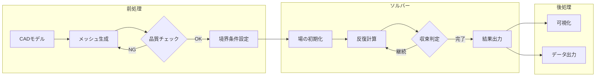

# 技術ドキュメント体系構築ガイド：個人からチーム共有・RAG統合まで

個人用ナレッジベースとして出発し、将来的なチーム共有とPostgreSQL/pgvectorベースの知識ベース統合を見据えた技術ドキュメント体系の構築には、**Diátaxisフレームワーク**と**Documentation-as-Code**アプローチの組み合わせが最適解となる。マークダウン＋Git管理という制約とAIエージェント活用という特性を活かすことで、**最小構成から始めて段階的に拡張可能**な体系を実現できる。

## Diátaxisフレームワークを軸とした階層設計

Diátaxis（ディアタクシス）は、Canonical/Ubuntu、Cloudflare、Djangoが採用する技術ドキュメントのデファクトスタンダードである。ユーザーの4つのニーズに対応する文書タイプを明確に分離する。

| タイプ | 目的 | 想定読者の状態 | CFD/GIS領域での例 |
|--------|------|---------------|------------------|
| **チュートリアル** | 学習体験の提供 | 「学んでいる」 | OpenFOAM初回セットアップ |
| **ハウツーガイド** | 特定タスクの解決 | 「やろうとしている」 | メッシュ品質改善手順 |
| **リファレンス** | 技術仕様の提供 | 「調べている」 | ソルバーパラメータ一覧 |
| **説明** | 概念理解の促進 | 「理解しようとしている」 | 乱流モデルの選定基準 |

この4タイプに加え、**運用系ドキュメント**として以下の階層を設ける。

```
┌─────────────────────────────────────────────────────────┐
│ ポリシー（原則・方針）     ← 変更頻度：年1回程度         │
├─────────────────────────────────────────────────────────┤
│ プレイブック（状況対応指針） ← 複雑シナリオの意思決定枠組 │
├─────────────────────────────────────────────────────────┤
│ プロセスドキュメント       ← ワークフロー全体の流れ      │
├─────────────────────────────────────────────────────────┤
│ ランブック（運用手順書）   ← 具体的なタスク実行手順      │
├─────────────────────────────────────────────────────────┤
│ チートシート（早見表）     ← 即座参照用の要点集約        │
└─────────────────────────────────────────────────────────┘
```

**プレイブック**は判断を伴う複雑なシナリオ（障害対応、リリース管理）に対する戦略的ガイド、**ランブック**は判断不要で順に実行するタスク手順という役割分担が重要である。

## ファイル構造とRAG対応設計

### 推奨フォルダ構成

```
knowledge-base/
├── docs/
│   ├── index.md                    # ルートインデックス
│   ├── 00-getting-started/         # 数字プレフィックスで順序制御
│   │   ├── index.md
│   │   ├── 01-installation.md
│   │   └── 02-quickstart.md
│   ├── tutorials/                  # Diátaxis: チュートリアル
│   │   ├── cfd/
│   │   └── gis/
│   ├── how-to/                     # Diátaxis: ハウツー
│   ├── reference/                  # Diátaxis: リファレンス
│   │   ├── api/
│   │   └── config/
│   ├── concepts/                   # Diátaxis: 説明
│   ├── runbooks/                   # 運用手順書
│   ├── playbooks/                  # 状況対応指針
│   ├── decisions/                  # ADR格納
│   │   └── 0001-use-openfoam.md
│   ├── troubleshooting/            # トラブルシュート
│   └── cheatsheets/                # 早見表
├── templates/                      # ドキュメントテンプレート
└── .github/
    └── workflows/
        └── docs-check.yml          # 自動検証
```

### 命名規則のベストプラクティス

| 規則 | 推奨 | 避けるべき |
|------|------|----------|
| ケース | `kebab-case.md` | `CamelCase.md`, `spaces in name.md` |
| プレフィックス | `01-`, `02-`（2桁ゼロ埋め） | `1-`, `2-`（ソート乱れ） |
| 特別ファイル | `README.md`, `index.md` | `readme.md` |
| 長さ | 31文字以下推奨 | 過度に長い名前 |

数字プレフィックスは**順序が重要なコンテンツ**（チュートリアル、ステップ）にのみ使用し、参照系は意味的な名前（`authentication.md`）を優先する。

### RAG対応フロントマター設計

将来的なpgvector統合を見据え、以下のYAMLフロントマターを標準化する。

```yaml
---
# 必須フィールド
title: "OpenFOAMメッシュ生成ガイド"
description: "blockMeshを使用した構造格子生成の手順"  # 150文字以内、検索用

# 分類（RAGフィルタリング用）
tags:
  - cfd
  - mesh
  - openfoam
category: how-to              # tutorials | how-to | reference | concepts
domain: cfd                   # cfd | gis | data-processing | visualization
difficulty: intermediate      # beginner | intermediate | advanced

# 関連性（グラフ構造用）
related_docs:
  - tutorials/cfd/01-first-simulation
  - reference/openfoam/blockmesh-params
prerequisites:
  - getting-started/openfoam-install

# メタデータ
created_at: 2025-01-15
updated_at: 2025-11-27
version: "1.2"
author: your-name
---
```

### セマンティック検索に最適化された文書構造

**チャンクサイズの目安**は**250〜512トークン**（約1000〜2000文字）が最適バランスとされる。埋め込みモデルは全トークンを単一ベクトルに圧縮するため、大きすぎるチャンクは情報損失を招く。

文書構造の原則：

1. **1文書1概念**：各ドキュメントは単一の主題を扱う
2. **自己完結型セクション**：各見出し配下が独立して意味を持つ
3. **代名詞の回避**：「それ」「この」を避け、具体的な用語を繰り返す
4. **キーワードの前置**：重要な概念は段落・文の冒頭に配置

```markdown
## OpenFOAMのメッシュ品質チェック  ← 見出しに主題を明示

OpenFOAMでは checkMesh コマンドでメッシュ品質を検証する。  ← 主語を省略しない
checkMesh は非直交性、スキューネス、アスペクト比を評価する。  ← 代名詞「それ」を避ける
```

## Mermaidダイアグラムの効果的活用

### 技術ドキュメントで有用な図表タイプ

| ダイアグラム | 用途 | 推奨場面 |
|-------------|------|---------|
| Flowchart | 処理フロー、判断分岐 | データ処理パイプライン |
| Sequence | API連携、通信シーケンス | システム間インタラクション |
| State | 状態遷移、ライフサイクル | ワークフローステータス |
| ER | データモデル | データベース設計 |
| C4 Container | アーキテクチャ | システム全体像 |

### CFD/GISワークフロー図の例



### Marp連携パターン

ドキュメントからスライドを再利用する場合、共通のMermaidコードブロックをincludeできる構成が効率的。

```markdown
---
marp: true
theme: default
paginate: true
---

# CFDワークフロー概要


---

## 詳細手順

- ステップ1: ...
```

## ADRとトラブルシューティング記録

### MADR形式ADRテンプレート

```markdown
---
status: accepted
date: 2025-11-27
decision-makers: [your-name]
---

# OpenFOAMをCFDソルバーとして採用

## 背景と課題
商用ソルバーのライセンスコスト削減と、カスタマイズ性向上が必要。

## 検討した選択肢
* OpenFOAM（オープンソース）
* ANSYS Fluent（商用）
* SU2（オープンソース、航空特化）

## 決定
選択: **OpenFOAM**
理由: コミュニティの活発さ、ドキュメントの充実、カスタムソルバー開発の容易さ

### 影響
* Good: ライセンスコストゼロ、ソースコードアクセス可能
* Bad: GUIが貧弱、学習コストが存在

## 補足情報
- 検証期間: 2025年10月の2週間
- 関連ADR: decisions/0002-mesh-tool-selection.md
```

### トラブルシューティング記録の構造化

```markdown
# エラー: メッシュ非直交性が閾値超過

## 症状
- `checkMesh` で `Max non-orthogonality: 85` と表示
- ソルバー実行時に発散

## 原因
境界レイヤー挿入時のセル変形

## 解決手順
1. `snappyHexMeshDict` の `nSmoothSurfaceNormals` を 5 に増加
2. `maxNonOrtho` を 70 に設定
3. 再メッシュ後に `checkMesh` で検証

## 予防策
境界レイヤー追加前に基本メッシュの品質を確認する

## 関連
- reference/openfoam/mesh-quality-metrics.md
```

### 暗黙知・禁則事項の記録方法

**「やってはいけないこと」リスト**は anti-patterns ディレクトリまたは各ドキュメント末尾の `## 禁則事項` セクションで管理する。

```markdown
# 禁則事項: CFDメッシュ作成

## ❌ 避けるべきパターン

### 高アスペクト比セルの放置
**状況**: 計算時間短縮のため粗いメッシュを使用
**問題**: 数値拡散増大、精度劣化
**正しい対処**: 関心領域のみ細分化、段階的リファインメント

### 境界条件の検証省略
**状況**: 過去ケースからコピー&ペースト
**問題**: 物理的に不整合な設定
**正しい対処**: 各境界のタイプと値を物理的に確認

### ログファイルの未確認
**状況**: ジョブ完了を見てすぐ後処理
**問題**: 収束不良や警告を見落とす
**実例**: 残差1e-3で計算打ち切り、結果が物理的に不正確
```

## AIエージェント活用のベストプラクティス

### ドキュメント作成依頼時のプロンプト設計

**効果的なプロンプト構成**：

```
## タスク
[具体的なドキュメントタイプ]を作成してください。

## コンテキスト
- 対象読者: [経験レベル、役割]
- 使用ツール: [ソフトウェア、バージョン]
- 関連する既存ドキュメント: [リンク]

## 要件
- フォーマット: templates/runbook-template.md に従う
- フロントマター: 必須フィールドを含める
- トーン: 技術的だが平易な日本語

## 含めるべき内容
1. [必須セクション1]
2. [必須セクション2]

## 参考例
[類似の良いドキュメントの例]
```

### レビューチェックリスト

AIが生成したドキュメントには以下の検証が必須：

| チェック項目 | 検証方法 | 優先度 |
|------------|---------|-------|
| **事実の正確性** | 公式ドキュメントと照合 | 必須 |
| **コード例の動作** | 実際に実行して確認 | 必須 |
| **バージョン情報** | 現在の環境と一致確認 | 必須 |
| **専門用語の適切さ** | ドメイン知識で判断 | 高 |
| **スタイルガイド準拠** | Vale等のリンターで検証 | 中 |
| **リンクの有効性** | 自動リンクチェッカー | 中 |

### AI生成コンテンツの明示

将来のチーム共有時に混乱を避けるため、AI生成ドキュメントにはフロントマターで明示：

```yaml
---
generated_by: ai
reviewed_by: your-name
reviewed_at: 2025-11-27
---
```

## 実践テンプレート集

### ランブックテンプレート

```markdown
# ランブック: [タスク名]

**サービス**: [対象システム]
**所要時間**: [目安]
**前提条件**: [必要なアクセス権、ツール]

## 概要
このランブックは[目的]を達成するための手順を提供する。

## 事前確認
- [ ] [確認事項1]
- [ ] [確認事項2]

## 手順

### ステップ1: [動詞で始まる説明]
```bash
# 実行コマンド
```
**期待される結果**: [出力例]

### ステップ2: [動詞で始まる説明]
...

## 検証
完了確認のためのチェック項目：
- [ ] [検証項目1]
- [ ] [検証項目2]

## トラブルシューティング
| 症状 | 原因 | 対処 |
|------|------|------|
| [エラー] | [理由] | [解決策] |

## ロールバック
問題発生時の復旧手順：
1. ...
```

### チートシートテンプレート

```markdown
# [ツール名] チートシート

## 基本コマンド
| コマンド | 説明 |
|---------|------|
| `cmd1` | [機能] |
| `cmd2 -o` | [オプション付き] |

## 頻出パターン
```bash
# パターン1: [説明]
command input | process > output

# パターン2: [説明]
command --config file.yaml
```

## 設定スニペット
```yaml
# 最小構成
key: value
```

## クイックトラブルシュート
| 問題 | 解決 |
|------|------|
| [症状] | `fix-command` |

## 関連リンク
- [公式ドキュメント](url)
```

## 段階的導入ロードマップ

### フェーズ1: 基盤構築（1-2週間）

```
docs/
├── index.md              # プロジェクト概要
├── README.md             # リポジトリ説明
├── 00-getting-started/
│   └── 01-quickstart.md  # 最重要ワークフロー1つ
└── templates/
    └── document-template.md
```

**成果物**：最小限で動くドキュメントサイト

### フェーズ2: コアコンテンツ（3-4週間）

- 主要ワークフローのハウツー 2-3本
- 基本設定リファレンス
- 初回トラブルシューティングガイド
- 最初のADR 1-2件

### フェーズ3: 運用ドキュメント（5-6週間）

- ランブック（最頻出タスク）
- プロセスドキュメント（標準ワークフロー）
- チートシート（日常使用ツール）

### フェーズ4: 拡充と統合（7週間以降）

- pgvector対応：フロントマターの標準化完了
- インデックススクリプト作成
- 検索API実装
- チーム共有のための権限・レビュー設計

### 優先順位の判断基準

| 高インパクト＋高頻度 | 高インパクト＋低頻度 |
|---------------------|---------------------|
| **即座に文書化** | 時間があるときに |
| 新メンバーが最初に聞く質問 | 年1回の大規模作業 |

| 低インパクト＋高頻度 | 低インパクト＋低頻度 |
|---------------------|---------------------|
| 簡易チートシートで対応 | **文書化不要** |
| コマンドリファレンス | エッジケース |

## PostgreSQL/pgvector統合設計

将来的なRAG統合に備え、以下のスキーマを想定したフロントマター設計を維持する。

```sql
CREATE TABLE documents (
  id UUID PRIMARY KEY DEFAULT gen_random_uuid(),
  content TEXT NOT NULL,
  title VARCHAR(255) NOT NULL,
  category VARCHAR(50),
  
  -- フロントマターをJSONBで格納
  metadata JSONB NOT NULL DEFAULT '{}',
  
  -- 埋め込みベクトル（OpenAI text-embedding-3-smallの場合1536次元）
  embedding vector(1536),
  
  source_file VARCHAR(500),
  created_at TIMESTAMP DEFAULT NOW(),
  updated_at TIMESTAMP DEFAULT NOW()
);

-- ベクトル検索用インデックス
CREATE INDEX ON documents USING hnsw (embedding vector_cosine_ops);

-- メタデータフィルタリング用
CREATE INDEX idx_metadata ON documents USING gin (metadata);
```

クエリ例：特定ドメインで類似検索

```sql
SELECT title, content, 1 - (embedding <=> query_embedding) AS similarity
FROM documents
WHERE metadata->>'domain' = 'cfd'
ORDER BY embedding <=> query_embedding
LIMIT 5;
```

## 運用上の注意点

**Documentation-as-Code**の原則に従い、以下を維持する：

1. **PRベースの変更管理**：ドキュメント変更もコードと同様にレビュー
2. **自動リンティング**：markdownlint、Vale（Googleスタイル）をCIで実行
3. **定期レビュー**：四半期ごとに古いドキュメントを棚卸し
4. **単一の情報源**：同じ情報を複数箇所に書かない

ラーニングコスト低減という目的達成には、**ドキュメントの発見可能性**が鍵となる。検索性を高めるフロントマター設計と、直感的なナビゲーション構造の両立が重要である。最初から完璧を目指さず、MVD（Minimum Viable Documentation）の考え方で「まず使えるものを出し、フィードバックで改善」のサイクルを回すことを推奨する。