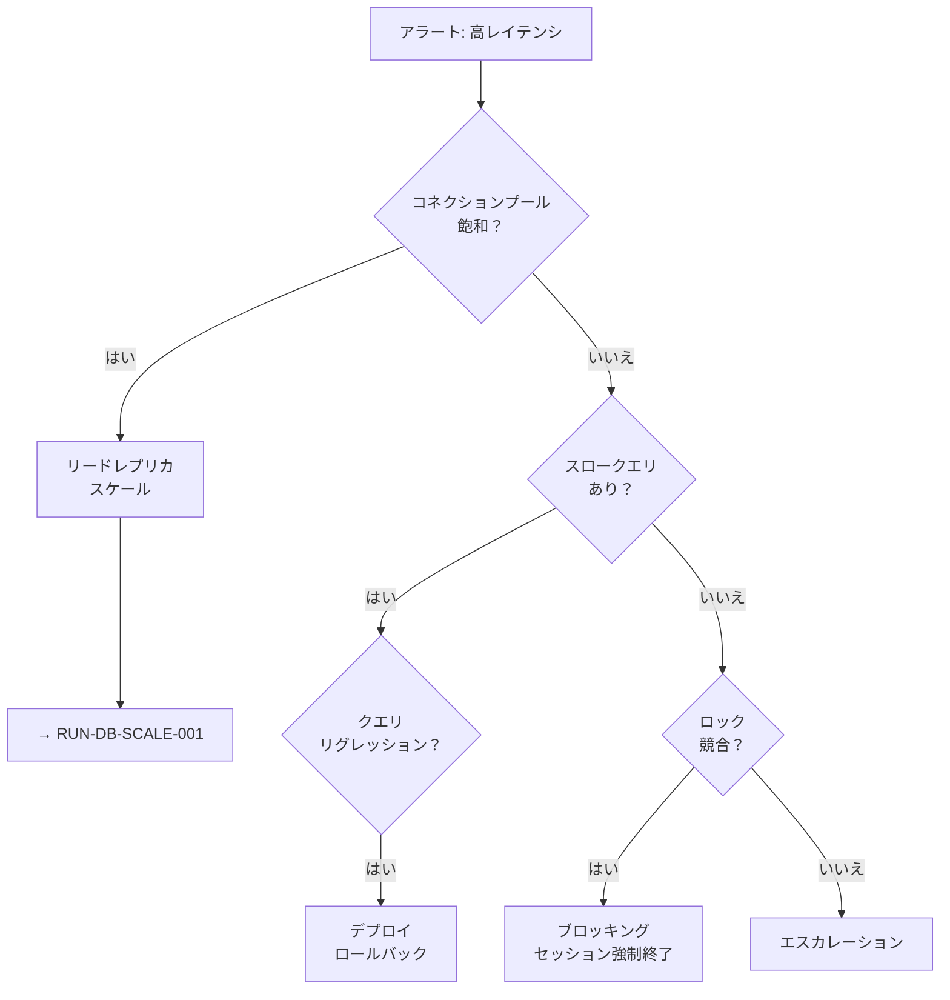

# AIエージェントによる技術ドキュメント作成フレームワーク（RAG最適化対応）

Claude Codeなどのエージェントは、**構造化されたスキーマ、明確なテンプレート、RAG最適化フォーマット**があれば、技術ドキュメントを大規模に生成・維持できます。本フレームワークは、ドキュメントタイプ、ADR標準、AI生成パターン、メンテナンス戦略のベストプラクティスを統合し、CFD、海洋モデリング、GIS、DevOps、データベース運用などのドメインに対応します。

---

## 1. 統一フロントマタースキーマ

すべてのドキュメントは、RAG検索、相互参照、ライフサイクル管理を可能にする**共通のフロントマター構造**を共有します。

### 1.1 基本スキーマ（全ドキュメント共通）

```yaml
---
# === 必須：識別情報 ===
document_id: "DOC-TYPE-NNN"           # 一意識別子（例: RUN-DB-001, PLB-INC-002）
title: "人間が読めるタイトル"
type: policy | sop | playbook | runbook | cheatsheet | adr
version: "1.0.0"                       # セマンティックバージョニング
status: draft | review | approved | active | deprecated | superseded

# === 所有権 ===
owner: "@team-name"                    # 責任チーム
author: "山田太郎"
created: 2024-01-15
updated: 2024-12-01
next_review: 2025-06-01

# === RAG最適化 ===
tags: [database, postgresql, backup]   # 検索可能なキーワード
key_concepts:                          # セマンティックマッチング用語
  - "災害復旧"
  - "データ保護"
summary: "検索結果とコンテキスト組み立て用の一文説明"

# === 関連ドキュメント（グラフエッジ） ===
related_docs:
  - path: "/adr/0042-postgresql.md"
    relationship: "implements"         # 実装する
  - path: "/runbooks/db-backup.md"
    relationship: "references"         # 参照する
supersedes: null                       # このドキュメントが置き換えるもの
superseded_by: null                    # このドキュメントを置き換えるもの

# === ドメインコンテキスト ===
domain: infrastructure | security | data | application | scientific
audience: developers | operators | architects | scientists
---
```

**重要な原則**: 
- `related_docs`配列はGraphRAG実装用の明示的なグラフエッジを作成
- `key_concepts`は単純なキーワードマッチングを超えたセマンティック検索を強化
- すべてのドキュメントタイプは、この基本スキーマを拡張して型固有のフィールドを追加

---

## 2. ドキュメントタイプ別テンプレート

### 2.1 ポリシードキュメント（Policy）

ポリシーは組織の方針とコンプライアンス要件を定義します。正式な承認ワークフローとコンプライアンスマッピングが必要です。

#### 拡張フロントマター

```yaml
---
document_id: "POL-SEC-001"
title: "データ分類ポリシー"
type: policy
classification: internal | confidential | public

# ポリシー固有フィールド
effective_date: 2024-03-01
review_frequency: annual
approval_signatures:
  - name: "情報セキュリティ責任者"
    date: 2024-02-15
  - name: "法務担当"
    date: 2024-02-20

# コンプライアンスマッピング
frameworks:
  - name: "ISO 27001:2022"
    controls: ["5.12", "5.13"]
  - name: "NIST CSF"
    controls: ["PR.DS-1", "PR.DS-2"]
---
```

#### 必須セクション

| セクション | 内容 |
|-----------|------|
| 目的（Purpose） | このポリシーが存在する理由 |
| 適用範囲（Scope） | 対象となる人員・システム |
| 役割と責任（Roles & Responsibilities） | 責任マトリクス |
| ポリシー声明（Policy Statements） | 明確な指令 |
| コンプライアンス要件 | 規制マッピング |
| 執行（Enforcement） | 違反時の結果 |
| レビュースケジュール | 次回見直し日 |

#### テンプレート例

```markdown
---
document_id: "POL-DATA-001"
title: "シミュレーションデータ管理ポリシー"
type: policy
version: "1.0"
status: approved
domain: scientific
---

# シミュレーションデータ管理ポリシー

## 目的

本ポリシーは、CFDおよび海洋モデリングプロジェクトで生成されるシミュレーションデータの分類、保存、アクセス制御、および保持期間に関する基準を定めます。

## 適用範囲

本ポリシーは以下に適用されます：

- すべてのCFD/海洋シミュレーションプロジェクト
- 計算結果データ（NetCDF、CSV、バイナリ形式）
- 前処理・後処理の中間ファイル
- 可視化出力

## 役割と責任

| 役割 | 責任 |
|------|------|
| プロジェクトリーダー | データ分類の決定、アクセス権限の承認 |
| データ管理者 | ストレージ割り当て、バックアップ実行 |
| 研究者 | 分類ガイドラインの遵守、メタデータ入力 |

## ポリシー声明

1. **データ分類**: すべてのシミュレーションデータは生成後24時間以内に分類すること
2. **保存場所**: 承認されたストレージシステムのみを使用すること
3. **保持期間**: プロジェクト完了後最低5年間保持すること
4. **アクセス制御**: 最小権限の原則に従うこと

## 関連SOP

- [SOP-DATA-001: データ分類手順](/sops/data-classification.md)
- [SOP-BACKUP-001: バックアップ実行手順](/sops/backup-procedure.md)
```

---

### 2.2 標準作業手順書（SOP: Standard Operating Procedure）

SOPはポリシー要件を再現可能なプロセスに変換します。**前提条件、ステップバイステップの手順、検証チェックポイント**を重視します。

#### 拡張フロントマター

```yaml
---
document_id: "SOP-CFD-001"
title: "CFDメッシュ生成手順"
type: sop
version: "2.0"
domain: scientific
estimated_duration: "2-4時間"
roles: [CFDエンジニア, 品質レビュアー]

prerequisites:
  access: ["HPCクラスタ認証情報", "ライセンスサーバーアクセス"]
  tools: ["OpenFOAM 11+", "snappyHexMesh", "ParaView"]
  knowledge: ["TRN-CFD-101: メッシュ基礎"]

related_docs:
  - path: "/policies/simulation-quality.md"
    relationship: "governed-by"
  - path: "/cheatsheets/openfoam-commands.md"
    relationship: "references"
---
```

#### 必須セクション

| セクション | 内容 |
|-----------|------|
| 目的 | この手順が何を達成するか |
| 適用範囲 | 対象システム・プロセス |
| 前提条件テーブル | アクセス、ツール、知識要件と検証方法 |
| 手順（番号付き） | 目的、コマンド、期待出力、検証チェックポイント |
| 品質メトリクス | 定量的な閾値と検証コマンド |
| トラブルシューティング | 問題・原因・解決策のテーブル |
| ロールバック手順 | 失敗時の復旧方法 |

#### テンプレート例

```markdown
---
document_id: "SOP-CFD-001"
title: "CFDメッシュ生成手順"
type: sop
version: "2.0"
status: active
domain: scientific
estimated_duration: "2-4時間"
---

# CFDメッシュ生成手順

## 目的

本手順は、海流シミュレーションの品質閾値を満たす計算メッシュを生成するための標準ワークフローを定義します。

## 適用範囲

潮汐および波浪モデリングプロジェクトにおける構造格子・非構造格子メッシュを使用するすべてのCFDシミュレーションに適用されます。

## 前提条件

| 要件 | 検証方法 |
|------|----------|
| HPCクラスタアクセス | `ssh cluster.example.com` を実行 |
| OpenFOAM環境 | `foamVersion` → "11" を確認 |
| ジオメトリファイル | `/case/constant/triSurface/` にSTLファイルがあることを確認 |

## 手順

### ステップ1: ドメイン分割
**目的:** 並列メッシュ生成のためにジオメトリを準備する

```bash
surfaceFeatureExtract
decomposePar -force
```

**期待出力:**
```
Processor directories 0-15 created
```

⚠️ **停止条件**: 分割が失敗した場合、`surfaceCheck`でジオメトリの水密性を確認してください。

---

### ステップ2: ベースメッシュ生成
**目的:** 初期六面体メッシュを作成する

```bash
mpirun -np 16 blockMesh -parallel
```

**検証:** セル数がターゲットの±10%以内（5M ± 500Kセル）

---

### ステップ3: リファインメントとスナッピング
**目的:** 境界近傍のメッシュを細分化し、ジオメトリにフィットさせる

```bash
mpirun -np 16 snappyHexMesh -parallel -overwrite
```

**検証:** `checkMesh`で品質メトリクスを確認

## 品質メトリクス

| メトリクス | 閾値 | 検証コマンド |
|-----------|------|--------------|
| 最大歪度（Skewness） | < 4.0 | `checkMesh -allGeometry` |
| 最大非直交性 | < 70° | `checkMesh` |
| 最小セル体積 | > 1e-12 | `checkMesh` |

## トラブルシューティング

| 問題 | 原因 | 解決策 |
|------|------|--------|
| 境界でメッシュリーク | 非水密STL | `surfaceAutoPatch`で修復 |
| 特徴部近傍の高歪度 | リファインメント不足 | `nCellsBetweenLevels`を増加 |
| メモリ不足 | 分割数が少ない | `numberOfSubdomains`を増加 |

## ロールバック手順

メッシュが破損した場合：

```bash
# 既存メッシュを削除
rm -rf constant/polyMesh
rm -rf processor*/constant/polyMesh

# ステップ1から再実行
```
```

---

### 2.3 プレイブック（Playbook）

プレイブックは**いつどのアプローチを使用するか**と**トリアージのための意思決定ツリー**に焦点を当てます。インシデント対応や複雑な運用シナリオに不可欠です。

#### 拡張フロントマター

```yaml
---
playbook_id: "PLB-INC-001"
title: "データベースパフォーマンス低下対応"
type: playbook
trigger:
  alert_name: "PostgreSQL Query Latency High"
  condition: "p99レイテンシ > 500ms が5分間継続"
  source: "Prometheus/AlertManager"

severity_classification:
  sev1: "全リージョン影響、顧客向けサービス低下"
  sev2: "単一リージョン、エラー率上昇"
  sev3: "内部サービスのみ、顧客影響なし"

escalation:
  primary: "オンコールDBA"
  secondary: "データベースチームリード"
  tertiary: "エンジニアリング部長"

related_runbooks:
  - id: "RUN-DB-SCALE-001"
    title: "水平リードレプリカスケーリング"
  - id: "RUN-DB-VACUUM-001"
    title: "緊急VACUUM手順"
---
```

#### 必須セクション

| セクション | 内容 |
|-----------|------|
| クイックアセスメント | 最初の2分間で確認すべきこと |
| 意思決定ツリー | 状況に応じた分岐図（Mermaid推奨） |
| 重大度別対応アクション | SEV-1/2/3ごとの初動とエスカレーション条件 |
| 関連ランブックへのリンク | 実行すべき具体的手順への参照 |

#### テンプレート例

```markdown
---
playbook_id: "PLB-INC-001"
title: "データベースパフォーマンス低下対応"
type: playbook
status: active
---

# データベースパフォーマンス低下対応

## トリガー条件

| 条件 | 閾値 |
|------|------|
| アラート名 | PostgreSQL Query Latency High |
| 発動条件 | p99レイテンシ > 500ms が5分間継続 |
| 監視元 | Prometheus/AlertManager |

## クイックアセスメント（最初の2分間）

1. **顧客影響があるか？** エッジでのエラー率を確認
2. **何台のDBが影響を受けているか？** Grafanaでスコープを確認
3. **いつ始まったか？** 過去2時間のデプロイと相関確認

## 意思決定ツリー



## 重大度別対応アクション

| 重大度 | 初動対応 | エスカレーション条件 |
|--------|----------|---------------------|
| SEV-1 | インシデントコマンダーをページ、顧客通知開始 | 即時 |
| SEV-2 | 調査と緩和 | 15分間進展なし |
| SEV-3 | ログに記録、営業時間内に対応 | 次回スタンドアップ |

## 関連ランブック

| ID | タイトル | 使用シナリオ |
|----|----------|--------------|
| [RUN-DB-SCALE-001](/runbooks/db-scale.md) | 水平リードレプリカスケーリング | コネクションプール飽和時 |
| [RUN-DB-VACUUM-001](/runbooks/db-vacuum.md) | 緊急VACUUM手順 | テーブル膨張検出時 |
| [RUN-DB-KILL-001](/runbooks/db-kill-session.md) | セッション強制終了 | ロック競合時 |
```

**プレイブックとランブックの違い**:
- **プレイブック**: 状況に応じて**どのランブックを実行するか**を判断する
- **ランブック**: 特定の手順を**どのように実行するか**を詳細に記述する

---

### 2.4 ランブック（Runbook）

ランブックは戦術的で、自動化対応可能なドキュメントです。明示的なコマンド、期待出力、ロールバック手順を含みます。**すべてのコマンドはコピー＆ペーストで動作する**必要があります。

#### 拡張フロントマター

```yaml
---
runbook_id: "RUN-WSL-DEV-001"
title: "WSL開発環境セットアップ"
type: runbook
version: "1.2"
domain: infrastructure

# 実行メタデータ
estimated_duration: "30-45分"
downtime_required: false
automation:
  supported: true
  platform: "PowerShell/Bash"
  script: "/scripts/wsl-setup.ps1"

prerequisites:
  system:
    - "Windows 11 22H2以上"
    - "RAM 16GB以上"
    - "空きディスク容量 50GB以上"
  access:
    - "ローカル管理者権限"
---
```

#### 必須セクション

| セクション | 内容 |
|-----------|------|
| 概要 | このランブックが何を構成するか |
| 実行前チェックリスト | 開始前に確認すべき項目 |
| 手順（番号付き） | 目的、コマンド、期待出力、検証 |
| ロールバック手順 | 失敗時の復旧コマンド |
| 実行後検証 | 成功確認のためのテストテーブル |

#### テンプレート例

```markdown
---
runbook_id: "RUN-WSL-DEV-001"
title: "WSL開発環境セットアップ"
type: runbook
version: "1.2"
status: active
---

# WSL開発環境セットアップ

## 概要

このランブックは、Python/Node.js開発とDocker統合のためのWindows Subsystem for Linux環境を構成します。

## 実行前チェックリスト

- [ ] Windowsバージョン確認: `winver` → 22H2以降
- [ ] BIOSで仮想化が有効
- [ ] 管理者PowerShellが利用可能

## 手順

### ステップ1: WSL機能の有効化
**目的:** WSLとUbuntuディストリビューションをインストールする

```powershell
# 管理者として実行
wsl --install -d Ubuntu-22.04
```

**期待出力:**
```
Installing: Virtual Machine Platform
Installing: Windows Subsystem for Linux
Installing: Ubuntu 22.04 LTS
The requested operation is successful.
```

**検証:**
```powershell
wsl --status
# 期待: Default Distribution: Ubuntu-22.04
```

⚠️ **再起動が必要です。** 続行前に作業を保存してください。

---

### ステップ2: WSLメモリ制限の設定
**目的:** WSLによる過剰なメモリ消費を防止する

`%USERPROFILE%\.wslconfig`を作成:

```ini
[wsl2]
memory=8GB
processors=4
swap=4GB
```

**設定を適用:**
```powershell
wsl --shutdown
wsl
```

**検証:**
```bash
# WSL内で実行
free -h
# 期待: Mem: 8.0Gi
```

---

### ステップ3: 開発ツールのインストール
**目的:** Python、Node.js、Dockerをセットアップする

```bash
# WSL Ubuntu内で実行
sudo apt update && sudo apt upgrade -y

# Python環境
sudo apt install -y python3.11 python3.11-venv python3-pip
python3 --version  # 期待: Python 3.11.x

# Node.js（nvm経由）
curl -o- https://raw.githubusercontent.com/nvm-sh/nvm/v0.39.0/install.sh | bash
source ~/.bashrc
nvm install --lts
node --version  # 期待: v20.x.x

# Docker（Windows Docker Desktopを使用）
# Docker DesktopのWSL統合が有効であることを確認
docker --version  # 期待: Docker version 24.x.x
```

## ロールバック手順

環境が破損した場合:

```powershell
wsl --unregister Ubuntu-22.04
wsl --install -d Ubuntu-22.04
```

## 実行後検証

| コンポーネント | テストコマンド | 期待結果 |
|---------------|---------------|----------|
| WSL | `wsl -l -v` | Ubuntu-22.04 Running |
| Python | `python3 --version` | 3.11.x |
| Node | `node --version` | 20.x.x |
| Docker | `docker run hello-world` | Hello from Docker! |
```

---

### 2.5 チートシート（Cheatsheet）

チートシートは情報密度を最大化したクイックリファレンスカードです。**単一ページまたは単一画面**で、テーブル形式で整理します。

#### 設計原則

- テーブルを多用（コマンド | 説明 | 例）
- 関連コマンドを論理的にグループ化
- 一般的なフラグとオプションを含める
- 非自明な動作に対する「注意」警告を追加

#### 拡張フロントマター

```yaml
---
cheatsheet_id: "CS-PSQL-001"
title: "PostgreSQL運用チートシート"
type: cheatsheet
version: "1.0"
technology: "PostgreSQL 15+"
format: single_page
print_optimized: true
---
```

#### テンプレート例

```markdown
---
cheatsheet_id: "CS-PSQL-001"
title: "PostgreSQL運用チートシート"
type: cheatsheet
version: "1.0"
status: active
---

# PostgreSQL運用チートシート

## 接続とセッション

| コマンド | 説明 |
|---------|------|
| `psql -h host -U user -d db` | データベースに接続 |
| `\c dbname` | データベース切り替え |
| `\conninfo` | 接続情報表示 |
| `\q` | psql終了 |

## データベース調査

| コマンド | 説明 |
|---------|------|
| `\l` | データベース一覧 |
| `\dt` | テーブル一覧 |
| `\d+ tablename` | テーブル詳細 |
| `\di` | インデックス一覧 |
| `\df` | 関数一覧 |

## クエリ分析

```sql
-- 実行統計付きEXPLAIN
EXPLAIN (ANALYZE, BUFFERS, FORMAT TEXT) 
SELECT * FROM large_table WHERE id = 1;

-- スロークエリの検出
SELECT query, mean_exec_time, calls 
FROM pg_stat_statements 
ORDER BY mean_exec_time DESC LIMIT 10;
```

## メンテナンスコマンド

| タスク | コマンド |
|--------|---------|
| テーブルVACUUM | `VACUUM (VERBOSE, ANALYZE) tablename;` |
| インデックス再構築 | `REINDEX INDEX indexname;` |
| クエリ強制終了 | `SELECT pg_terminate_backend(pid);` |
| チェックポイント強制 | `CHECKPOINT;` |

## 緊急対応

| シナリオ | コマンド |
|----------|---------|
| 全接続切断 | `SELECT pg_terminate_backend(pid) FROM pg_stat_activity WHERE datname = 'dbname';` |
| 読み取り専用モード | `ALTER DATABASE dbname SET default_transaction_read_only = on;` |

## よく使うWHERE句パターン

```sql
-- 日付範囲
WHERE created_at BETWEEN '2024-01-01' AND '2024-12-31'

-- NULL安全比較
WHERE column IS DISTINCT FROM 'value'

-- 配列含有
WHERE tags @> ARRAY['tag1', 'tag2']
```
```

---

### 2.6 ADR（Architecture Decision Record）

ADRは技術的選択の**理由（Why）**を記録します。MADR 4.0形式が完全性と使いやすさのバランスが最も良く、RAG最適化のための構造化フロントマターを追加します。

#### 拡張フロントマター

```yaml
---
adr_id: "ADR-0042"
title: "海洋モデル出力ストレージにPostgreSQLを使用"
slug: "postgresql-ocean-model-storage"
type: adr

# ステータスライフサイクル
status: accepted | proposed | deprecated | superseded
supersedes: "ADR-0023"
superseded_by: null
date: 2024-11-15

# 分類（フィルタリング用）
domain: data
category: storage
decision_type: technology-choice

# セマンティック強化
tags: [database, postgresql, ocean-modeling, netcdf, time-series]
key_concepts:
  - "科学データストレージ"
  - "時系列最適化"
  - "空間インデックス"
summary: "時系列クエリ性能とPostGIS空間機能により、海洋モデル出力にはMongoDBよりPostgreSQL+TimescaleDBを選択"

# ステークホルダー
decision_makers: ["@data-team", "@ocean-modeling"]
consulted: ["@infrastructure", "@research-scientists"]

# トレーサビリティ
related_adrs: ["ADR-0023", "ADR-0045"]
related_docs:
  - path: "/runbooks/database/timescale-maintenance.md"
    relationship: "implements"
  - path: "/playbooks/data-pipeline-failure.md"
    relationship: "references"
---
```

#### 必須セクション（MADR 4.0準拠）

| セクション | 内容 |
|-----------|------|
| コンテキストと問題声明 | 何を決定する必要があるか、背景情報 |
| 決定要因（Decision Drivers） | 重要な要件と制約 |
| 検討したオプション | 評価した選択肢のリスト |
| 決定結果 | 選択したオプションと理由 |
| 結果（Consequences） | ポジティブ/ネガティブな影響 |
| 確認方法 | コンプライアンス検証方法 |
| 各オプションの長所と短所 | 詳細な比較 |
| 関連情報 | 関連ADRとドキュメントへのリンク |

#### テンプレート例

```markdown
---
adr_id: "ADR-0042"
title: "海洋モデル出力ストレージにPostgreSQLを使用"
type: adr
status: accepted
date: 2024-11-15
---

# ADR-0042: 海洋モデル出力ストレージにPostgreSQLを使用

## コンテキストと問題声明

海洋予測モデルは**毎日50GBの出力データ**を生成し、1,000以上のグリッドポイントで1時間ごとの時間分解能があります。時間範囲クエリ、空間フィルタリング、既存のPython分析ツールとの統合を効率的にサポートするストレージソリューションが必要です。

**主要な問い:** 海洋モデリングパイプラインにおける大容量時系列データと地理空間クエリを最もよくサポートするデータベース技術はどれか？

## 決定要因

* **時系列性能**: 週/月単位のデータに対する効率的なクエリをサポートする必要がある
* **空間インデックス**: 地理的領域（バウンディングボックス、ポリゴン）でのフィルタリングが必要
* **Pythonエコシステム**: xarray、pandas、既存のnetCDFワークフローと統合する必要がある
* **運用成熟度**: チームにPostgreSQLの専門知識がある；学習曲線を最小化
* **コスト**: クラウド管理オプションのあるオープンソースソリューションを優先

## 検討したオプション

1. **PostgreSQL + TimescaleDB + PostGIS** - 空間機能を持つ時系列拡張
2. **MongoDB** - 地理空間インデックスを持つドキュメントストア
3. **InfluxDB** - 専用時系列データベース
4. **オブジェクトストレージ上の生NetCDFファイル** - 現状のアプローチ

## 決定結果

**選択したオプション:** PostgreSQL + TimescaleDB + PostGIS

**理由:** 時系列最適化（自動パーティショニングによるハイパーテーブル）、成熟した空間インデックス（PostGIS）、強力なPython統合（psycopg2、SQLAlchemy）を組み合わせています。チームの専門知識により運用リスクが軽減されます。

### 結果

**ポジティブ:**
* NetCDFファイルスキャンと比較して**時間範囲クエリが10倍高速**
* **ネイティブ地理空間サポート**により、カスタム空間フィルタリングコードが不要に
* **馴染みのあるSQLインターフェース**により研究者の採用が加速
* TimescaleDBによる**圧縮**でストレージコストが約60%削減

**ネガティブ:**
* **スキーマの固定性**により、新しいモデル出力変数にはマイグレーションが必要
* **メモリ要件**がファイルベースアプローチより高い（レプリカあたり16GB以上）
* データベースメンテナンスのための**追加の運用オーバーヘッド**

### 確認方法

以下によりコンプライアンスを検証:
- [ ] ベンチマークテスト: 30日間の時間範囲クエリが5秒未満
- [ ] 統合テスト: PythonパイプラインがSQLAlchemy経由で読み書き
- [ ] 容量テスト: 予測データ量の2倍を処理

## 各オプションの長所と短所

### PostgreSQL + TimescaleDB + PostGIS
* 良い点: 時系列ハイパーテーブルが自動パーティショニングを提供
* 良い点: PostGISが複雑な空間クエリを可能に
* 良い点: チームに既存のPostgreSQL専門知識がある
* 中立: 新しい変数にはスキーママイグレーションが必要
* 悪い点: ファイルベースストレージより高いメモリ要件

### MongoDB
* 良い点: 柔軟なスキーマが様々なモデル出力を処理
* 良い点: ネイティブ地理空間インデックス
* 悪い点: 組み込みの時系列最適化がない
* 悪い点: チームにMongoDB運用経験がない

## 関連情報

### 関連ADR
| ADR | タイトル | 関係 |
|-----|---------|------|
| [ADR-0023](./0023-netcdf-storage.md) | NetCDFファイルストレージ | この決定により置き換え |
| [ADR-0045](./0045-data-pipeline.md) | データパイプラインアーキテクチャ | この決定に依存 |

### 関連運用ドキュメント
- [ランブック: TimescaleDBメンテナンス](/runbooks/database/timescale-maintenance.md)
- [プレイブック: データパイプライン障害](/playbooks/data-pipeline-failure.md)
```

---

## 3. Claude Codeによるドキュメント生成

### 3.1 CLAUDE.md設定

ドキュメントプロジェクト用のCLAUDE.md設定例:

```markdown
# ドキュメント生成ガイドライン

## ドキュメントタイプとテンプレート
- ポリシードキュメント: /templates/policy.md を使用
- SOP: /templates/sop.md を使用（番号付きステップと検証チェックポイント付き）
- ランブック: /templates/runbook.md を使用（明示的なコマンドと期待出力付き）
- ADR: /templates/adr.md からMADR 4.0形式を使用

## スタイル要件
- 文体: 二人称（「～してください」）、能動態
- 技術用語: 最初に使用する際に定義
- コマンド: 常に期待出力を含める
- ステップ: 1つのアクションにつき1つの番号付きステップ
- 警告: 破壊的操作には⚠️絵文字を使用

## フロントマター要件
すべてのドキュメントに必須:
- document_id（形式: TYPE-DOMAIN-NNN）
- title, type, version, status
- owner, created, updated
- tags, key_concepts, summary
- related_docs配列

## 品質チェックリスト
ドキュメントタスク完了前に確認:
- [ ] すべてのコードブロックに言語指定あり
- [ ] コマンドをテストし出力を検証
- [ ] 相互参照は相対パスを使用
- [ ] フロントマターがスキーマに対して検証済み
- [ ] プレースホルダーテキストが残っていない
```

### 3.2 ドキュメント生成プロンプトパターン

#### SOP生成プロンプト

```
あなたは技術ドキュメント専門家です。[タスク]のための標準作業手順書を生成してください。

コンテキスト: このSOPは[ドメイン]運用向けで、[対象者]が使用します。

構造要件:
1. 目的（この手順が存在する理由を2-3文で）
2. 適用範囲（対象システム/プロセス）
3. 前提条件テーブル（必要なアクセス、ツール、知識）
4. 番号付き手順ステップ:
   - ステップの目的
   - 明示的なコマンド（コピー＆ペースト可能）
   - 期待出力（成功の様子）
   - 検証チェックポイント
5. トラブルシューティングテーブル（問題 | 原因 | 解決策）
6. ロールバック手順

スタイル要件:
- 1ステップにつき1アクション
- すべてのコマンドの後に期待出力を含める
- 破壊的操作には⚠️警告をマーク
- 構造化情報にはテーブルを使用

[CFD/GIS/Database]のドメイン固有要件:
[ドメイン固有の品質メトリクス、ツール、検証方法を追加]
```

#### ランブック生成プロンプト

```
[システム/タスク]の運用ランブックを作成してください。

要件:
- すべてのコマンドはコピー＆ペーストで即座に実行可能
- 各ステップに期待出力を含める
- 失敗シナリオとロールバック手順を含める
- 検証コマンドで成功を確認可能にする

形式:
- フロントマター: document_id, title, type, prerequisites, estimated_duration
- セクション: 概要、実行前チェックリスト、手順、ロールバック、実行後検証

対象環境: [WSL/Linux/Windows]
対象者: [開発者/運用者/SRE]
```

### 3.3 品質保証ワークフロー

| レビュー層 | 基準 | レビュー方法 |
|-----------|------|--------------|
| 自動承認 | フォーマット修正、タイポ修正 | 自動リンティング |
| クイックレビュー | 新しい例、軽微な追加 | 単一レビュアー |
| 専門家レビュー | 新しい手順、セキュリティ内容 | SME + テクニカルライター |
| フルレビュー | アーキテクチャ決定、コンプライアンス文書 | 委員会承認 |

---

## 4. RAG統合のためのドキュメント構造化

### 4.1 最適なチャンキングパラメータ

| コンテンツタイプ | チャンクサイズ | オーバーラップ | 理由 |
|----------------|--------------|---------------|------|
| 概念説明 | 256-512トークン | 15% | より広いコンテキストが必要 |
| ステップバイステップ手順 | 128-256トークン | 10% | 精密な検索 |
| コード例 | そのまま保持 | N/A | コードブロックを分割しない |
| APIリファレンス | 256トークン | 10% | 精度とコンテキストのバランス |

### 4.2 セマンティックチャンキングのための構造化

```markdown
# メインタイトル（H1 - チャンク境界）

検索用にこのドキュメントの本質を捉える簡潔な要約。

## 主要セクション（H2 - チャンク境界）

このセクションの内容を要約する開始段落。このテキストは
関連するクエリにマッチするのに十分なセマンティック情報を持つべきです。

### サブセクション（H3 - ここでチャンク分割される可能性あり）

より具体的な内容。各セクションがある程度自己完結し、
独立して検索できるように情報を構造化します。
```

### 4.3 検索品質のためのヘッダー要件

- **各H2の後に要約段落を追加**してセマンティックカバレッジを増加
- **説明的なヘッダー**を使用（「設定」→「PostgreSQLコネクションプールの設定方法」）
- **略語は最初の段落で定義**
- **コードブロックは分割せず保持**—チャンキング設定で中間分割を防ぐ

### 4.4 グラフ走査のための相互参照メタデータ

```yaml
related_docs:
  - path: "/adr/0042-postgresql.md"
    relationship: "governed-by"    # このドキュメントはそのADRに従う
  - path: "/runbooks/db-backup.md"  
    relationship: "depends-on"     # そのランブックを先に完了する必要がある
  - path: "/playbooks/incident.md"
    relationship: "escalates-to"   # 失敗時にそのプレイブックを使用
```

これらの明示的な関係により、GraphRAG実装はランブックからその根拠となるADR、関連するプレイブックへと走査できます。「このバックアップ手順の根拠は？」や「このデータベースがダウンした場合、他に何が失敗する可能性があるか？」といった質問に答えられます。

### 4.5 relationship値の標準化

| relationship値 | 意味 | 使用例 |
|---------------|------|--------|
| `implements` | このドキュメントがそのドキュメントを実装 | ランブック → ADR |
| `governed-by` | このドキュメントがそのドキュメントの管理下 | SOP → ポリシー |
| `references` | 単純な参照関係 | プレイブック → ランブック |
| `depends-on` | 前提条件として依存 | ランブックA → ランブックB |
| `escalates-to` | 失敗時のエスカレーション先 | ランブック → プレイブック |
| `supersedes` | このドキュメントが置き換える | 新ADR → 旧ADR |
| `superseded-by` | このドキュメントを置き換えるもの | 旧ADR → 新ADR |

---

## 5. Diátaxisフレームワークの適用

Diátaxisフレームワークは運用ドキュメントタイプに直接マッピングされます:

| ユーザーニーズ | Diátaxisタイプ | 運用ドキュメント |
|--------------|---------------|-----------------|
| 学習 | チュートリアル | オンボーディングガイド、トレーニング資料 |
| 達成 | ハウツーガイド | ランブック、SOP |
| 情報 | リファレンス | チートシート、APIドキュメント、スキーマ |
| 理解 | 説明 | ADR、アーキテクチャドキュメント、ポリシー |

### 5.1 マッピングの適用

- **プレイブック** = ハウツーガイド（タスク指向、目標中心）
- **ランブック** = より詳細なステップを持つハウツーガイド
- **ADR** = 説明（理解指向、コンテキスト提供）
- **チートシート** = リファレンス（情報指向、ルックアップ中心）

**重要**: タイプを混ぜないこと。アーキテクチャがなぜこのように動作するかを説明し始めるランブックは、代わりに関連するADRにリンクすべきです。各ドキュメントは目的に集中させてください。

---

## 6. メンテナンスとドキュメントドリフト防止

### 6.1 CI/CDパイプライン

```yaml
name: Documentation Quality
on:
  pull_request:
    paths: ['docs/**', '*.md']

jobs:
  validate:
    runs-on: ubuntu-latest
    steps:
      - uses: actions/checkout@v4
      
      - name: Markdown Lint
        uses: DavidAnson/markdownlint-cli2-action@v14
        with:
          globs: 'docs/**/*.md'
          
      - name: Vale Style Check
        uses: errata-ai/vale-action@v2
        with:
          files: docs/
          
      - name: Link Validation
        uses: lycheeverse/lychee-action@v1
        with:
          args: --verbose docs/
          fail: true
          
      - name: Frontmatter Schema Validation
        run: |
          npm install -g ajv-cli
          ajv validate -s schemas/frontmatter.json -d "docs/**/*.md"
```

### 6.2 陳腐化検出

フロントマターを使用した自動検出:

```yaml
---
title: "データベースバックアップ手順"
updated: 2024-06-01
next_review: 2024-12-01
review_cycle_days: 180
owner: "@database-team"
---
```

自動ジョブがフロントマターをスキャンし、`next_review`日が過ぎた場合や`review_cycle_days`内に更新されていない場合にアラートを発行します。

### 6.3 CODEOWNERS設定

```
# .github/CODEOWNERS
/docs/                    @doc-team
/docs/runbooks/database/  @database-team @doc-team
/docs/adr/                @architecture-team @doc-team
/docs/scientific/         @research-team @doc-team
*.md                      @doc-team
```

### 6.4 バージョン管理ベストプラクティス

- **ドキュメントリリースをタグ付け** - ソフトウェアリリースと一緒に
- **ADRは削除しない** - supersededとしてマークし、置き換え先にリンク
- **機能PRの一部としてドキュメント更新を必須に** - PRテンプレートにドキュメントチェックボックスを使用
- **各ドキュメント領域の変更ログを維持** - 最近の更新をリスト

---

## 7. ドメイン固有テンプレート

### 7.1 CFD/海洋モデリングドキュメント

科学計算ドキュメントには**検証と妥当性確認（V&V）セクション**、不確かさの定量化、コミュニティ標準への参照が必要です。

#### 追加フロントマター

```yaml
---
# V&Vメタデータ
validation_cases:
  - name: "チャネル流DNS"
    reference: "Kim et al., 1987"
    metrics: ["壁面せん断応力", "速度プロファイル"]
verification:
  grid_convergence: "Richardson外挿"
  solution_verification: "残差監視"
  
# 品質標準
standards:
  - "ASME V&V 20-2009"
  - "ERCOFTAC Best Practice Guidelines"
  
# 計算要件
hpc_requirements:
  cores: 256
  memory_per_core: "4GB"
  walltime: "48時間"
---
```

### 7.2 GIS処理ランブック

GISランブックには**座標参照系（CRS）仕様**、サンプル入出力ジオメトリ、GDAL/OGRコマンドパターンを含めます。

```markdown
## ステップ3: ターゲットCRSへの再投影
**目的:** WGS84からローカルUTMゾーンに変換する

```bash
ogr2ogr -t_srs EPSG:32654 output.gpkg input.shp

# CRS検証
ogrinfo -al -so output.gpkg | grep "SRS"
# 期待: PROJCS["WGS 84 / UTM zone 54N"...
```

**座標サンプル:**
- 入力（WGS84）: 135.5023, 34.6937（大阪）
- 出力（UTM 54N）: 523456.0, 3836789.0
```

### 7.3 Excel自動化ランブック

Office自動化用の特定のVBAパターン、COMオブジェクト参照、エラーハンドリングを含めます:

```markdown
## ステップ2: COM経由でワークブックを開く
**目的:** Excelインスタンスに接続する

```python
import win32com.client

excel = win32com.client.Dispatch("Excel.Application")
excel.Visible = False  # バックグラウンド処理
wb = excel.Workbooks.Open(r"C:\data\report.xlsx")

# 接続確認
print(f"ワークブック: {wb.Name}")  # 期待: report.xlsx
print(f"シート数: {wb.Sheets.Count}")  # 期待: 3
```

⚠️ **警告:** 孤立プロセスを防ぐため、常にExcelオブジェクトを明示的に閉じてください:

```python
wb.Close(SaveChanges=False)
excel.Quit()
```
```

---

## 8. 実装ロードマップ

このドキュメントフレームワークを段階的に構築するには:

### 第1-2週: 基盤構築
- [ ] 基本フロントマタースキーマと各ドキュメントタイプのテンプレートを作成
- [ ] スタイルガイドラインとテンプレート参照を含むCLAUDE.mdを設定
- [ ] markdownlintとリンクチェックを含むCI/CDをセットアップ

### 第3-4週: コアドキュメント作成
- [ ] 主要なアーキテクチャ決定のADRをAI支援+人間レビューで生成
- [ ] 重要な運用手順のランブックを作成（インシデント対応を優先）
- [ ] 頻繁に使用するツールのチートシートを構築

### 第5-6週: 統合
- [ ] 相互参照規約を確立し、双方向リンクを検証
- [ ] 最適なチャンキングパラメータでRAGシステムを設定
- [ ] 代表的なクエリで検索品質をテスト

### 第7-8週: メンテナンス体制
- [ ] 陳腐化検出とレビューリマインダーを実装
- [ ] CODEOWNERSとレビューワークフローをセットアップ
- [ ] ドキュメントヘルスダッシュボードを作成

### 継続的運用
- [ ] 確立されたテンプレートを使用してClaude Codeで新規ドキュメントを生成
- [ ] 階層化レビュープロセスでAI生成コンテンツをレビュー
- [ ] 四半期ごとのドキュメント監査でドリフトを防止

---

## 9. まとめ

このフレームワークは、技術ドキュメントを散在するファイルから、AIエージェントが効果的に生成、維持、検索できる**構造化された検索可能なナレッジベース**に変換します。

キーポイント:
- **明示的な構造**: 機械がパースできるフロントマター
- **関係性の定義**: グラフ走査を可能にするrelated_docs
- **一貫性のあるテンプレート**: 人間とAI両方の著者に対応
- **RAG最適化**: セマンティック検索に適したドキュメント構造
- **メンテナンス自動化**: CI/CDによる品質保証

DevRAGと組み合わせることで、プレイブックやランブック作成時にどのADRやトラブルシューティングガイドを引用したかの追跡が可能になり、構築の高速化とメンテナンス・拡張の容易化を実現できます。