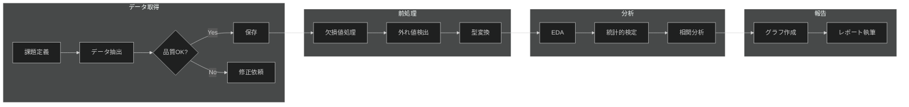

# データ解析プロセスドキュメント

**対象読者**: データアナリスト（Python中級レベル）
**プロセスオーナー**: data-lead@company.com

## 📋 概要

生データを取得・前処理・分析・可視化し、ビジネス意思決定に資するレポートを作成する。

## 🔄 プロセスフロー



## フェーズ1: データ取得

**目的**: 分析に必要なデータを品質確認の上で取得
**所要時間**: 0.5〜2日

**活動**:
1. 課題定義の明確化
2. データソース特定
3. データ抽出（SQL, pandas）

**完了基準**:
- [ ] データが保存されている
- [ ] 主キーの重複がない
- [ ] 明らかなデータ破損がない

## フェーズ2: 前処理

**目的**: データをクリーニングし分析可能な形式に整形
**所要時間**: 1〜3日

**活動**:
1. 欠損値処理（中央値補完/削除）
2. 外れ値検出（IQR法/Z-score）
3. データ型変換
4. 正規化・標準化

**Python例**:
```python
import pandas as pd
import numpy as np

# 欠損率確認
missing_rate = df.isnull().sum() / len(df) * 100

# 外れ値検出
Q1 = df['column'].quantile(0.25)
Q3 = df['column'].quantile(0.75)
IQR = Q3 - Q1
outliers = df[(df['column'] < Q1 - 1.5*IQR) | 
              (df['column'] > Q3 + 1.5*IQR)]
```

## フェーズ3: 分析

**目的**: 統計的に分析し、ビジネス課題への洞察を得る
**所要時間**: 2〜5日

**活動**:
1. EDA（基本統計量、分布確認）
2. 統計的検定（t検定、ANOVA）
3. 相関分析

## フェーズ4: 可視化・報告

**目的**: 分析結果をビジネス担当者に分かりやすく伝達
**所要時間**: 1〜2日

**成果物**:
- 最終レポート（PDF/Markdown）
- グラフ集
- プレゼンテーション資料（オプション）

## 📚 関連ドキュメント

- [playbooks/data-quality-issues.md]
- [runbooks/data-preprocessing.md]
- [cheatsheets/pandas-operations.md]
