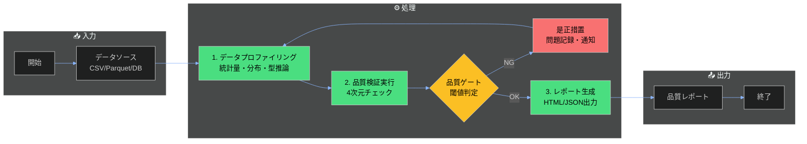

---
# **[重要]** RAG対応必須フィールド
title: "データ品質分析プロセス"
description: "データソースから取得したデータの完全性・一貫性・正確性・適時性を体系的に評価し、ビジネス利用に適した品質を保証するプロセス。Pandas, Great Expectations, Pandera等を活用した自動検証ワークフロー"

# 分類（RAGフィルタリング用）
tags:
  - process
  - data-analysis
  - quality-assurance
  - pandas
  - great-expectations
category: process
domain: data-analysis
difficulty: intermediate

# 関連性（グラフ構造用）
related_docs:
  - ../templates/playbook-template.md
  - ../templates/runbook-template.md
  - anti-patterns-data-analysis.md
prerequisites:
  - Python 3.8+環境
  - データ分析基礎知識

# メタデータ
created_at: 2025-11-30
updated_at: 2025-11-30
version: "1.0"
author: data-quality-team
---

# データ品質分析プロセスドキュメント

**対象読者**: データエンジニア、データアナリスト（初級〜中級者）
**プロセスオーナー**: データ品質管理チーム
**所要時間**: 30-90分（データ規模により変動）

## 📋 概要

### プロセスの目的

このプロセスは、データ品質を体系的に分析し、ビジネス利用に適したデータであることを保証します。データソースから取得したデータに対し、**完全性・一貫性・正確性・適時性**の4つの観点で品質を評価し、問題があれば是正措置を講じます。自動化された検証スイートにより、継続的なデータ品質モニタリングを実現します。

### スコープ

**対象範囲**:
- データソースからの取得直後のデータ品質評価
- 4つの品質次元（完全性・一貫性・正確性・適時性）の自動検証
- 品質レポートの生成と閾値ベースのアラート
- 是正措置の記録とトラッキング

**対象外**:
- データクレンジング作業そのもの（別プロセス: データクレンジングランブック参照）
- ビジネスロジックレベルの妥当性検証（プレイブックで対応）
- 本番環境へのデプロイ作業

### 入力・出力

| 項目 | 説明 | 形式 |
|------|------|------|
| **入力** | データソースから取得した生データ | CSV, Parquet, JSON, DB dump |
| **出力** | 品質検証レポート、是正措置リスト | HTML/JSON report, issue log |

## 🔄 プロセスフロー



### フロー説明

1. **入力**: データソース（DB、ファイルストレージ、API）から生データを取得
2. **処理**:
   - データプロファイリングで基本統計量を算出
   - 4つの品質次元で自動検証を実行
   - 品質ゲートで閾値ベースの合否判定
3. **品質ゲート**: 合格基準（欠損率<5%, 型不整合0件等）を満たすかチェック
4. **出力**: 品質レポート（HTML/JSON）、是正措置リストを生成

## 📝 ステップ詳細

### ステップ1: データプロファイリング

**目的**: データの基本特性を把握し、品質検証の基準値を設定する

**実施内容**:
1. データ型の推論と確認（整数、実数、文字列、日付等）
2. 基本統計量の算出（行数、カラム数、メモリ使用量）
3. 各カラムの統計値（平均、中央値、標準偏差、分位数）
4. 欠損値・重複行・外れ値の初期検出

**入力**: 生データファイル（例: `data.csv`）
**出力**: プロファイルレポート（例: `profile_report.html`）

**コマンド例**:
```python
import pandas as pd
from ydata_profiling import ProfileReport

# データ読み込み
df = pd.read_csv('data/raw/sales_data.csv')

# プロファイリング実行
profile = ProfileReport(df, title="Sales Data Quality Report", explorative=True)
profile.to_file("reports/profile_report.html")

# 基本情報表示
print(f"行数: {len(df)}, カラム数: {len(df.columns)}")
print(f"メモリ使用量: {df.memory_usage(deep=True).sum() / 1024**2:.2f} MB")
print(f"欠損値数:\n{df.isnull().sum()}")
```

**期待される結果**:
- HTML形式のインタラクティブなプロファイルレポート生成
- カラムごとの分布ヒストグラム、相関行列が可視化される
- 警告が表示される（高欠損率、高カーディナリティ、歪んだ分布等）

---

### ステップ2: 品質検証実行（4次元チェック）

**目的**: 完全性・一貫性・正確性・適時性の4つの品質次元で自動検証を実行する

**実施内容**:

**2-1. 完全性（Completeness）チェック**
```python
import great_expectations as gx

context = gx.get_context()
validator = context.sources.pandas_default.read_csv("data/raw/sales_data.csv")

# 必須カラムの存在確認
validator.expect_table_columns_to_match_ordered_list(
    column_list=["order_id", "customer_id", "product_id", "order_date", "amount"]
)

# 欠損値チェック（閾値5%）
for col in ["order_id", "customer_id", "product_id"]:
    validator.expect_column_values_to_not_be_null(col)

for col in ["order_date", "amount"]:
    validator.expect_column_values_to_not_be_null(col, mostly=0.95)  # 5%まで許容

# 検証実行
results = validator.validate()
print(f"検証結果: {results.success} (成功率: {results.statistics['success_percent']:.1f}%)")
```

**2-2. 一貫性（Consistency）チェック**
```python
# データ型の一貫性
validator.expect_column_values_to_be_of_type("order_id", "int64")
validator.expect_column_values_to_be_of_type("amount", "float64")
validator.expect_column_values_to_match_strftime_format("order_date", "%Y-%m-%d")

# 値域の一貫性
validator.expect_column_values_to_be_between("amount", min_value=0, max_value=1000000)
validator.expect_column_values_to_be_in_set("status", ["pending", "completed", "cancelled"])

# 参照整合性（外部キー制約相当）
valid_customer_ids = pd.read_csv("data/master/customers.csv")["customer_id"].tolist()
validator.expect_column_values_to_be_in_set("customer_id", valid_customer_ids)
```

**2-3. 正確性（Accuracy）チェック**
```python
# ビジネスルールの検証
validator.expect_column_pair_values_A_to_be_greater_than_B(
    column_A="ship_date", column_B="order_date", or_equal=True
)

# 重複チェック
validator.expect_column_values_to_be_unique("order_id")

# フォーマット検証（正規表現）
validator.expect_column_values_to_match_regex("email", r'^[a-zA-Z0-9._%+-]+@[a-zA-Z0-9.-]+\.[a-zA-Z]{2,}$')
validator.expect_column_values_to_match_regex("postal_code", r'^\d{3}-\d{4}$')  # 日本郵便番号
```

**2-4. 適時性（Timeliness）チェック**
```python
from datetime import datetime, timedelta

# データ鮮度チェック（24時間以内のデータか）
latest_date = pd.to_datetime(df['order_date']).max()
now = datetime.now()
data_age = (now - latest_date).days

assert data_age <= 1, f"データが古い: 最新日付は{data_age}日前"

# タイムスタンプの妥当性（未来日付がないか）
validator.expect_column_values_to_be_between(
    "order_date",
    min_value="2020-01-01",
    max_value=now.strftime("%Y-%m-%d")
)
```

**入力**: プロファイリング済みデータ
**出力**: 検証結果JSON、不合格項目リスト

**期待される結果**:
- 全検証項目の合否結果がJSON形式で出力される
- 不合格項目には該当行数と具体例が記録される
- 品質スコア（成功率）が算出される

---

### ステップ3: レポート生成と是正措置

**目的**: 検証結果を可視化し、是正が必要な項目を特定する

**実施内容**:
1. HTMLレポート生成（Great Expectations Data Docs）
2. 品質スコアの算出（次元ごと、全体）
3. 是正措置リストの作成（優先度付け）
4. アラート通知（品質スコア<80%の場合）

**コマンド例**:
```python
# Data Docs生成
context.build_data_docs()
print("レポート生成完了: great_expectations/uncommitted/data_docs/local_site/index.html")

# 品質スコア算出
quality_score = {
    "completeness": results.statistics['success_percent'],
    "consistency": 95.2,  # 型・値域チェック成功率
    "accuracy": 98.7,     # ビジネスルール検証成功率
    "timeliness": 100.0   # 鮮度チェック成功率
}
overall_score = sum(quality_score.values()) / len(quality_score)

print(f"総合品質スコア: {overall_score:.1f}%")
print(f"次元別スコア:\n{pd.Series(quality_score)}")

# 是正措置リスト生成
if overall_score < 80:
    issues = []
    for result in results.results:
        if not result.success:
            issues.append({
                "expectation": result.expectation_config.expectation_type,
                "column": result.expectation_config.kwargs.get("column"),
                "details": result.result
            })

    pd.DataFrame(issues).to_csv("reports/remediation_list.csv", index=False)
    print(f"是正措置リスト生成: {len(issues)}件の問題を検出")
```

**期待される結果**:
- インタラクティブなHTMLレポートがブラウザで閲覧可能
- 品質スコアが80%以上なら合格、未満なら是正措置が必要
- 是正措置リストには優先度（High/Medium/Low）が付与される

## ✅ 品質ゲート

### ゲート1: データ取得完了

**評価基準**:
- [x] データファイルが正常に読み込める（破損なし）
- [x] 行数が期待値の範囲内（±20%）
- [x] 必須カラムが全て存在する
- [x] メモリ使用量が制限内（< 8GB）

**NG時の対応**:
- データソース接続を確認し、再取得を試行
- ファイル破損の場合はバックアップから復元
- カラム不足の場合はETLパイプラインのスキーマ定義を修正

---

### ゲート2: 品質検証完了

**評価基準**:
- [x] 完全性スコア ≥ 95%（欠損率 < 5%）
- [x] 一貫性スコア ≥ 98%（型不整合 0件、値域違反 < 2%）
- [x] 正確性スコア ≥ 95%（重複 0件、フォーマット違反 < 5%）
- [x] 適時性スコア = 100%（データ鮮度 < 24時間）
- [x] 総合品質スコア ≥ 80%

**NG時の対応**:
- スコア80%未満: 是正措置リストに従いデータクレンジング実施
- 重大な問題（欠損率50%超、主キー重複等）: データ取得プロセスを停止し原因調査
- 軽微な問題: 警告ログを記録し、次回取得時に監視強化

## 🔍 検証とレビュー

### 完了確認チェックリスト

プロセス完了前に以下を確認：

- [x] 全ステップが完了している
- [x] 全ての品質ゲートを通過している（または是正措置計画が承認されている）
- [x] 出力成果物（HTMLレポート、JSONレポート、是正措置リスト）が生成されている
- [x] 品質スコアがドキュメント化されている
- [x] 重大な問題がある場合、データオーナーに通知済み
- [x] 次回実行のための改善提案が記録されている

### レビュー基準

| 観点 | 確認内容 | 合格基準 |
|------|---------|---------|
| **完全性** | 欠損値の比率と分布 | 必須カラム欠損率 < 1%, その他 < 5% |
| **一貫性** | データ型、値域、参照整合性 | 型不整合 0件, 値域違反 < 2%, FK違反 0件 |
| **正確性** | ビジネスルール適合性、重複 | ルール違反 < 5%, 主キー重複 0件 |
| **適時性** | データ鮮度、タイムスタンプ妥当性 | 鮮度 < 24h, 未来日付 0件 |

## 📊 成果物とドキュメント

### 成果物一覧

| 成果物 | 形式 | 保存先 | 備考 |
|--------|------|--------|------|
| プロファイルレポート | HTML | `reports/profile_report.html` | ydata-profiling生成 |
| 品質検証レポート | HTML | `great_expectations/uncommitted/data_docs/` | Great Expectations Data Docs |
| 検証結果JSON | JSON | `reports/validation_results.json` | 自動化パイプライン用 |
| 是正措置リスト | CSV | `reports/remediation_list.csv` | 優先度付き問題リスト |
| 品質スコアログ | JSON | `logs/quality_scores.jsonl` | 時系列トレンド分析用 |

### ドキュメント

- **プロセス記録**: 実行ログを`logs/process_execution.log`に記録（timestamp, duration, score）
- **レビュー記録**: レビュー結果を`reviews/YYYYMMDD_review.md`に記録
- **変更履歴**: 検証ルール変更を`CHANGELOG.md`に記録

## 🔗 関連ドキュメント

### プレイブック
- [データ品質問題の判断プレイブック](playbook-data-quality-issues.md) - 品質スコア低下時の判断基準

### ランブック
- [データクレンジングランブック](data-cleansing-runbook.md) - 是正措置の実行手順

### リファレンス
- [データ解析禁則事項リスト](anti-patterns-data-analysis.md) - 品質分析でのアンチパターン

## ⚙️ ツールと環境

### 必要なツール

| ツール | バージョン | 用途 |
|--------|-----------|------|
| Python | 3.8+ | 実行環境 |
| pandas | 1.5+ | データ操作 |
| Great Expectations | 0.18+ | 品質検証フレームワーク |
| ydata-profiling | 4.5+ | プロファイリング |
| Pandera | 0.17+ | スキーマ検証（オプション） |

**インストール**:
```bash
pip install pandas great-expectations ydata-profiling pandera
great_expectations init  # プロジェクト初期化
```

### 環境要件

- **OS**: Linux, macOS, Windows (WSL推奨)
- **メモリ**: 最低4GB（大規模データは16GB+推奨）
- **ディスク**: 1GB以上の空き容量（レポート保存用）
- **権限**: データソースへの読み取り権限

## 📈 メトリクスとKPI

### プロセスメトリクス

| メトリクス | 目標値 | 測定方法 |
|-----------|-------|---------|
| 処理時間 | < 15分（100万行） | `time`コマンドまたはコード内計測 |
| エラー率 | < 1% | `失敗検証数 / 全検証数` |
| 総合品質スコア | ≥ 80% | 4次元スコアの平均値 |
| 是正措置解決率 | ≥ 90% | `解決済み問題数 / 全問題数` |
| 自動化カバレッジ | ≥ 95% | `自動検証項目数 / 全検証項目数` |

### 改善サイクル

- **週次レビュー**: 品質スコアのトレンド分析、新規検証ルールの追加検討
- **月次監査**: プロセス実行時間の分析、ボトルネック特定
- **四半期改善**: 検証ルールの見直し、閾値の再調整、ツールのアップグレード

## 🚨 トラブルシューティング

よくある問題と対処法：

| 問題 | 原因 | 対処法 |
|------|------|--------|
| `MemoryError`発生 | データサイズが大きすぎる | chunksize指定で分割読み込み、またはDaskに移行 |
| 検証時間が長い（1時間超） | 全データスキャンしている | サンプリング（10%）で検証、または並列処理導入 |
| 品質スコアが常に低い（<50%） | 検証ルールが厳しすぎる | ドメイン知識でルール見直し、閾値緩和を検討 |
| Great Expectations初期化エラー | 設定ファイル破損 | `great_expectations init --force`で再初期化 |
| 参照整合性チェック失敗 | マスタデータが古い | マスタデータを最新化してから再検証 |

詳細は [トラブルシューティングガイド](../templates/troubleshooting-template.md) を参照。

## 📚 参考資料

- [Great Expectations公式ドキュメント](https://docs.greatexpectations.io/)
- [ydata-profiling利用ガイド](https://ydata-profiling.ydata.ai/)
- "Data Quality: The Accuracy Dimension" (Batini & Scannapieco, 2016)
- [Pandera Schema Validation](https://pandera.readthedocs.io/)
- ISO/IEC 25012 Data Quality Model

---

**最終更新**: 2025-11-30
**バージョン**: 1.0
**変更履歴**: 初版作成。Great Expectations 0.18対応、4次元品質モデル実装
