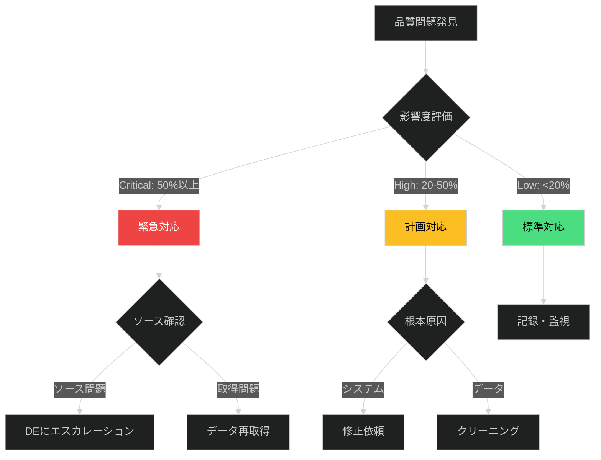

# データ品質問題対応プレイブック

**重要度**: 🟡 High
**想定対応時間**: 2時間〜2日

## 📋 概要

データ分析中に発見した品質問題に対して、適切な診断・対処・エスカレーションを行う。

### 適用シナリオ

✅ **適用すべき場合**:
- データ取得後の初期確認で大量の欠損値を発見
- EDA中に明らかな外れ値や異常なパターンを検出
- 複数データソース結合時に不整合を発見

❌ **適用すべきでない場合**:
- 正常な範囲内の自然なデータ分散
- データベース障害（インシデント対応プレイブック参照）

## 🎯 意思決定フレームワーク



### 優先順位決定

| 基準 | Critical | High | Medium | Low |
|------|----------|------|--------|-----|
| 欠損率 | ≥50% | 20-50% | 5-20% | <5% |
| 影響範囲 | キー変数 | 分析対象 | 補助変数 | 参考のみ |

## 🔍 診断ガイド

### 初期トリアージ（15分）

**チェックリスト**:
- [ ] 問題タイプ: 欠損/外れ値/不整合
- [ ] 影響範囲: 何行・何列？
- [ ] データソース: どのテーブル？
- [ ] 過去比較: 異常か？

**診断コマンド**:
```python
import pandas as pd

# 欠損率確認
missing_rate = df.isnull().sum() / len(df) * 100
print(missing_rate[missing_rate > 0])

# 重複確認
print(f"Duplicates: {df.duplicated().sum()}")

# 外れ値検出（IQR法）
Q1 = df['column'].quantile(0.25)
Q3 = df['column'].quantile(0.75)
IQR = Q3 - Q1
outliers = df[(df['column'] < Q1 - 1.5*IQR) | 
              (df['column'] > Q3 + 1.5*IQR)]
print(f"Outliers: {len(outliers)}")
```

## 🛠️ 対応戦略

### 戦略A: 緊急データ再取得（Critical時）

**判断基準**:
- 欠損率≥50%
- キー変数が影響を受けている
- DEからソース側問題の報告あり

**手順**:
1. DEにエスカレーション（通知テンプレート使用）
2. データ再取得
3. 品質検証

**Python品質検証例**:
```python
df_new = pd.read_csv('data/raw/retried.csv')

# 欠損率比較
missing_before = df_old.isnull().sum() / len(df_old) * 100
missing_after = df_new.isnull().sum() / len(df_new) * 100

print(pd.DataFrame({
    'Before': missing_before, 
    'After': missing_after
}))
```

### 戦略B: データクリーニング（High時）

**判断基準**:
- 欠損率20〜50%
- ソース側修正が困難
- 納期が迫っている

**欠損値処理戦略**:
| 欠損率 | データ型 | 推奨戦略 |
|--------|---------|---------|
| <5% | 数値 | 削除 |
| 5-20% | 数値 | 中央値補完 |
| >20% | 数値 | 回帰補完/MICE |
| 任意 | カテゴリ | 最頻値/"Unknown" |

**Python例**:
```python
# 中央値補完
df['column'].fillna(df['column'].median(), inplace=True)

# カテゴリ正規化
gender_map = {'Male': 'M', 'male': 'M', 'm': 'M'}
df['gender'] = df['gender'].map(gender_map)
```

### 戦略C: 部分データで継続（Low時）

**判断基準**:
- 欠損率<20%、非キー変数
- ビジネス的に許容可能

**手順**:
1. 影響範囲記録
2. レポートに制限事項明記
3. 監視継続

## 🚨 エスカレーション

### 連絡先

| レベル | 役割 | 連絡先 |
|--------|------|--------|
| L1 | アナリスト | 自己解決 |
| L2 | DE | #data-eng |
| L3 | チームリード | data-lead@company.com |

### 通知テンプレート（Critical時）

```
件名: [CRITICAL] データ品質問題 - [ソース名]

発見時刻: YYYY-MM-DD HH:MM
影響範囲: [テーブル], 影響率: [X%]
問題タイプ: [欠損/異常値/不整合]
ビジネス影響: 分析不可/納期遅延リスク

対応依頼: データソース側の確認と修正
期限: [YYYY-MM-DD]
```

## 📝 禁則事項

❌ **避けるべき行動**:
- 問題を隠蔽・軽視する
- 無断でデータを削除・改変
- 統計的根拠なしに補完
- ビジネス側に技術詳細を押し付ける

✅ **正しい対処**:
- 必ず記録し影響を評価
- 元データは不変、処理後データを別名保存
- 補完戦略を明示し感度分析
- 平易な言葉で説明

## 📚 関連ドキュメント

- [process-documents/data-analysis-process.md]
- [runbooks/missing-value-handling.md]
- [runbooks/outlier-detection.md]
