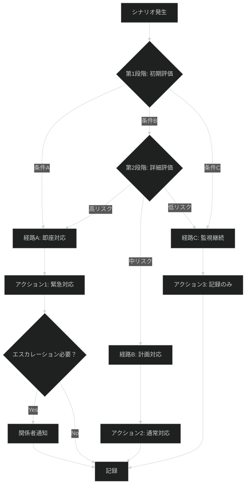
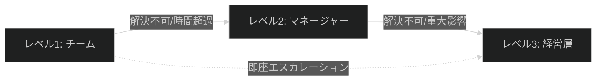

---
# === 必須：識別情報 ===
document_id: "PLB-DOMAIN-NNN"  # PLB-data-001, PLB-ops-001等
title: "<!-- TEMPLATE: シナリオ名プレイブック（例: 異常検知結果判断プレイブック） -->"
type: playbook
version: "1.0"
status: active  # draft | review | approved | active | deprecated

# === 所有権 ===
owner: "@team-name"
author: "<!-- TEMPLATE: 作成者名 -->"
created: <!-- TEMPLATE: YYYY-MM-DD -->
updated: <!-- TEMPLATE: YYYY-MM-DD -->

# === RAG最適化 ===
tags:
  - playbook
  - <!-- TEMPLATE: シナリオタグ（例: anomaly-detection, incident-response） -->
  - <!-- TEMPLATE: ドメインタグ（例: data-analysis, operations） -->
key_concepts:
  - "<!-- TEMPLATE: セマンティック用語1（例: 異常検知、統計的有意性） -->"
  - "<!-- TEMPLATE: セマンティック用語2（例: ビジネス影響、エスカレーション） -->"
summary: "<!-- TEMPLATE: 検索結果用の一文説明（150文字以内） -->"

# === ドメインコンテキスト ===
category: playbook
domain: <!-- TEMPLATE: data-analysis | cfd | gis | visualization | infrastructure -->
difficulty: <!-- TEMPLATE: beginner | intermediate | advanced -->
severity: <!-- TEMPLATE: critical | high | medium | low -->
audience: <!-- TEMPLATE: developers | operators | architects | scientists -->

# === 関連ドキュメント ===
related_docs:
  - path: "<!-- TEMPLATE: /path/to/related-process.md -->"
    relationship: "references"  # implements | governed-by | references | depends-on | escalates-to
  - path: "<!-- TEMPLATE: /path/to/related-runbook.md -->"
    relationship: "depends-on"

# === メンテナンス ===
next_review: <!-- TEMPLATE: YYYY-MM-DD -->
review_cycle_days: 180
---

# <!-- TEMPLATE: シナリオ名 --> プレイブック

---

## 必須セクション一覧

このテンプレートには以下の必須セクションが含まれています：

| セクション | 目的 | 省略時の影響 |
|-----------|------|-------------|
| トリガー条件 | インシデント発動条件を定義 | 対応開始タイミングが不明確 |
| 意思決定ツリー | 状況判断フローを提供 | 判断に時間がかかる |
| 重大度別対応 | レベル別対応手順 | 過剰/過小対応が発生 |
| エスカレーション | 上位報告基準 | 必要な支援が得られない |
| 振り返り | 継続的改善 | 同じ問題が再発する |

---

**重要度**: <!-- TEMPLATE: 🔴 Critical | 🟡 High | 🟢 Medium | ⚪ Low -->
**想定対応時間**: <!-- TEMPLATE: 目安時間（例: 30分〜2時間） -->
**対象読者**: <!-- TEMPLATE: 役割（例: データサイエンティスト、SRE） -->

## 📋 概要

<!--
なぜ必要か: プレイブックの目的と適用範囲を明確化し、対応者が状況判断に迷わないため
省略するとどうなるか: 誤った対応や過剰反応が発生し、リソースが無駄になる
-->

### プレイブックの目的

<!-- TEMPLATE: 2-3文でこのプレイブックの目的を記述 -->
<!-- 例: このプレイブックは、異常検知アルゴリズムが検出した結果を解釈し、実際に対応が必要な真の異常か、誤検知かを判断するための指針を提供します。統計的判断とビジネス判断の両面から評価し、適切な対応を決定します。 -->

### 適用シナリオ

**✅ 適用すべき場合**:
- <!-- TEMPLATE: 具体的な状況1（例: 統計的手法で異常スコアが閾値を超えた場合） -->
- <!-- TEMPLATE: 具体的な状況2 -->
- <!-- TEMPLATE: 具体的な状況3 -->

**❌ 適用すべきでない場合**:
- <!-- TEMPLATE: 除外シナリオ1（例: 既知の定期メンテナンス期間中） -->
- <!-- TEMPLATE: 除外シナリオ2 -->

### 前提条件

- <!-- TEMPLATE: 前提条件1（例: 異常検知システムが正常稼働している） -->
- <!-- TEMPLATE: 前提条件2 -->
- <!-- TEMPLATE: 前提条件3 -->

## 🎯 意思決定フレームワーク

<!--
なぜ必要か: 状況判断を体系化し、一貫性のある判断を可能にするため
省略するとどうなるか: 対応者によって判断がばらつき、適切な対応ができない
-->

**⚠️ [重要]** 以下のMermaid意思決定ツリーを実際の判断フローに合わせて調整してください。

### フレームワーク説明

1. **第1段階: 初期評価**
   - <!-- TEMPLATE: 初期評価の基準を説明 -->
   - 条件A: <!-- TEMPLATE: 条件Aの定義 -->
   - 条件B: <!-- TEMPLATE: 条件Bの定義 -->
   - 条件C: <!-- TEMPLATE: 条件Cの定義 -->

2. **第2段階: 詳細評価**
   - <!-- TEMPLATE: 詳細評価の基準を説明 -->
   - 高リスク: <!-- TEMPLATE: 高リスクの定義 -->
   - 中リスク: <!-- TEMPLATE: 中リスクの定義 -->
   - 低リスク: <!-- TEMPLATE: 低リスクの定義 -->

## 🛠️ シナリオ別対応戦略

<!--
なぜ必要か: 重大度別の具体的な対応手順を提供し、迅速な対応を可能にするため
省略するとどうなるか: 対応が遅れたり、過剰/過小対応が発生する
-->

### シナリオA: <!-- TEMPLATE: シナリオ名（例: 統計的に有意＋高ビジネス影響） -->

**判断基準**:
- [ ] <!-- TEMPLATE: 判断基準1（例: p値 < 0.05） -->
- [ ] <!-- TEMPLATE: 判断基準2（例: 影響顧客数 > 1000） -->
- [ ] <!-- TEMPLATE: 判断基準3 -->

**対応手順**:
1. <!-- TEMPLATE: 手順1 -->
2. <!-- TEMPLATE: 手順2 -->
3. <!-- TEMPLATE: 手順3 -->

**期待される結果**:
<!-- TEMPLATE: この対応による期待結果 -->

**リスクと注意点**:
- ⚠️ <!-- TEMPLATE: リスク1 -->
- ⚠️ <!-- TEMPLATE: リスク2 -->

**参考**: [関連ランブック](<!-- TEMPLATE: パス -->)

---

### シナリオB: <!-- TEMPLATE: シナリオ名 -->

**判断基準**:
- [ ] <!-- TEMPLATE: 判断基準1 -->
- [ ] <!-- TEMPLATE: 判断基準2 -->
- [ ] <!-- TEMPLATE: 判断基準3 -->

**対応手順**:
1. <!-- TEMPLATE: 手順1 -->
2. <!-- TEMPLATE: 手順2 -->
3. <!-- TEMPLATE: 手順3 -->

**期待される結果**:
<!-- TEMPLATE: この対応による期待結果 -->

**リスクと注意点**:
- ⚠️ <!-- TEMPLATE: リスク1 -->
- ⚠️ <!-- TEMPLATE: リスク2 -->

---

### シナリオC: <!-- TEMPLATE: シナリオ名 -->

**⚠️ 必要に応じてシナリオを追加または削除してください**

<!-- TEMPLATE: 上記と同様の構造でシナリオを記述 -->

## 📊 判断支援ツール

<!--
なぜ必要か: 定量的な評価基準を提供し、客観的な判断を支援するため
省略するとどうなるか: 主観的な判断で一貫性が失われる
-->

### 評価マトリクス

| 要素 | 低 (1) | 中 (2) | 高 (3) | 評価方法 |
|------|--------|--------|--------|---------|
| **<!-- TEMPLATE: 要素1（例: 統計的有意性） -->** | <!-- TEMPLATE: 定義 --> | <!-- TEMPLATE: 定義 --> | <!-- TEMPLATE: 定義 --> | <!-- TEMPLATE: 評価方法 --> |
| **<!-- TEMPLATE: 要素2（例: ビジネス影響） -->** | <!-- TEMPLATE: 定義 --> | <!-- TEMPLATE: 定義 --> | <!-- TEMPLATE: 定義 --> | <!-- TEMPLATE: 評価方法 --> |
| **<!-- TEMPLATE: 要素3 -->** | <!-- TEMPLATE: 定義 --> | <!-- TEMPLATE: 定義 --> | <!-- TEMPLATE: 定義 --> | <!-- TEMPLATE: 評価方法 --> |

**総合スコア計算**:
- スコア 7-9: シナリオA（高優先度対応）
- スコア 4-6: シナリオB（通常対応）
- スコア 1-3: シナリオC（監視継続）

### チェックリスト

対応前に以下を確認：

- [ ] **データ確認**: <!-- TEMPLATE: 確認内容 -->
- [ ] **影響範囲**: <!-- TEMPLATE: 確認内容 -->
- [ ] **過去事例**: <!-- TEMPLATE: 確認内容 -->
- [ ] **リソース**: <!-- TEMPLATE: 確認内容 -->
- [ ] **承認**: <!-- TEMPLATE: 確認内容 -->

## 🚨 エスカレーション基準

<!--
なぜ必要か: 上位報告のタイミングと方法を明確化し、適切な支援を得るため
省略するとどうなるか: 重大な問題が見逃されたり、不要なエスカレーションで混乱する
-->

### レベル1: チーム内対応

**条件**:
- <!-- TEMPLATE: レベル1の条件 -->

**対応者**: <!-- TEMPLATE: 役割 -->
**対応時間**: <!-- TEMPLATE: 目安時間 -->

### レベル2: マネージャーエスカレーション

**条件**:
- <!-- TEMPLATE: レベル2の条件 -->

**対応者**: <!-- TEMPLATE: 役割 -->
**対応時間**: <!-- TEMPLATE: 目安時間 -->

### レベル3: 経営層エスカレーション

**条件**:
- <!-- TEMPLATE: レベル3の条件 -->

**対応者**: <!-- TEMPLATE: 役割 -->
**対応時間**: <!-- TEMPLATE: 目安時間 -->

### エスカレーションフロー

## 📚 事例集

<!--
なぜ必要か: 過去の事例から学び、判断の精度を高めるため
省略するとどうなるか: 同じ問題で毎回一から判断が必要になる
-->

### 事例1: <!-- TEMPLATE: 事例タイトル -->

**状況**: <!-- TEMPLATE: 状況説明 -->

**判断**: <!-- TEMPLATE: どう判断したか -->

**対応**: <!-- TEMPLATE: どう対応したか -->

**結果**: <!-- TEMPLATE: 結果と学び -->

**教訓**: <!-- TEMPLATE: この事例から得られた教訓 -->

---

### 事例2: <!-- TEMPLATE: 事例タイトル -->

**⚠️ 事例を3つ以上追加することを推奨**

<!-- TEMPLATE: 上記と同様の構造で事例を記述 -->

## 🔍 レビューと改善

<!--
なぜ必要か: プレイブックを継続的に改善し、効果を高めるため
省略するとどうなるか: プレイブックが陳腐化し、実態と乖離する
-->

### 対応後レビュー

対応完了後、以下をレビュー：

- [ ] **判断の正確性**: <!-- TEMPLATE: レビュー内容 -->
- [ ] **対応の適切性**: <!-- TEMPLATE: レビュー内容 -->
- [ ] **時間の妥当性**: <!-- TEMPLATE: レビュー内容 -->
- [ ] **改善点**: <!-- TEMPLATE: レビュー内容 -->

### プレイブック改善

- **定期レビュー**: <!-- TEMPLATE: レビュー頻度（例: 四半期ごと） -->
- **トリガー**: <!-- TEMPLATE: 改善トリガー（例: 誤判断が3回発生） -->
- **更新プロセス**: <!-- TEMPLATE: 更新プロセス -->

## 🔗 関連ドキュメント

### プロセスドキュメント
- [<!-- TEMPLATE: プロセス名 -->](<!-- TEMPLATE: パス -->) - <!-- TEMPLATE: 説明 -->

### ランブック
- [<!-- TEMPLATE: ランブック名 -->](<!-- TEMPLATE: パス -->) - <!-- TEMPLATE: 説明 -->

### トラブルシューティング
- [<!-- TEMPLATE: トラブルシューティング名 -->](<!-- TEMPLATE: パス -->) - <!-- TEMPLATE: 説明 -->

### 参考資料
- <!-- TEMPLATE: 参考資料1 -->
- <!-- TEMPLATE: 参考資料2 -->

## ⚙️ ツールとリソース

### 必要なツール

| ツール | 用途 | アクセス方法 |
|--------|------|-------------|
| <!-- TEMPLATE: ツール名 --> | <!-- TEMPLATE: 用途 --> | <!-- TEMPLATE: URL/コマンド --> |

### 連絡先

| 役割 | 担当者/チーム | 連絡方法 |
|------|--------------|---------|
| <!-- TEMPLATE: 役割 --> | <!-- TEMPLATE: 担当者 --> | <!-- TEMPLATE: Slack/Email等 --> |

## 📈 メトリクスとKPI

### プレイブックメトリクス

| メトリクス | 目標値 | 現在値 | 測定方法 |
|-----------|-------|--------|---------|
| <!-- TEMPLATE: メトリクス名（例: 平均判断時間） --> | <!-- TEMPLATE: 目標 --> | <!-- TEMPLATE: 現在値 --> | <!-- TEMPLATE: 測定方法 --> |
| <!-- TEMPLATE: メトリクス名（例: 誤判断率） --> | <!-- TEMPLATE: 目標 --> | <!-- TEMPLATE: 現在値 --> | <!-- TEMPLATE: 測定方法 --> |

---

**最終更新**: <!-- TEMPLATE: YYYY-MM-DD -->
**バージョン**: 1.0
**変更履歴**: <!-- TEMPLATE: 主な変更内容 -->
**レビュー予定**: <!-- TEMPLATE: 次回レビュー日 -->
