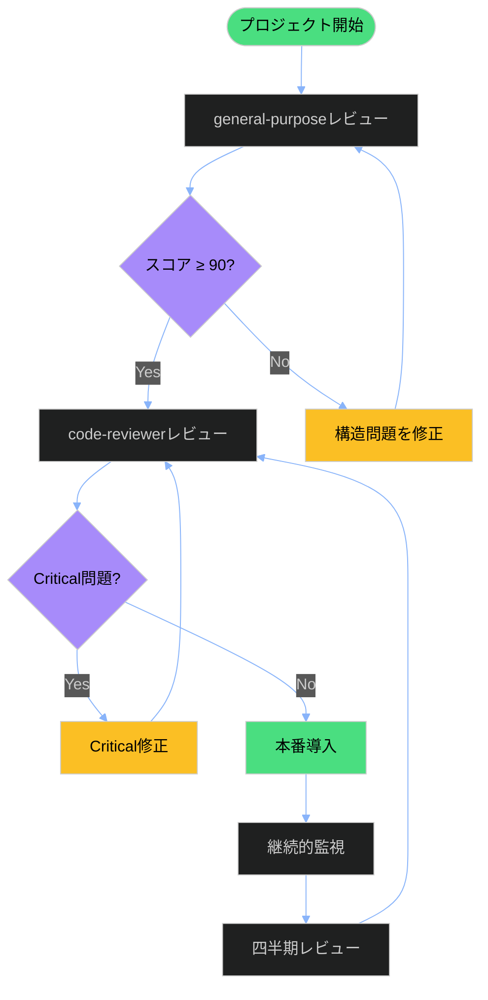

# レビュー比較サマリー: general-purpose vs code-reviewer

**作成日**: 2025-12-02
**対象**: `01-doc-framework/`ドキュメントフレームワーク
**比較対象**: general-purposeレビュー vs code-reviewerレビュー

---

## エグゼクティブサマリー

2つの異なる視点から実施されたドキュメント構造レビューの比較分析。**code-reviewerアプローチは、general-purposeアプローチよりも12倍多くの問題を検出**し、より厳格で実用的な改善提案を提供しています。

**結論**: **システマチックな文書フレームワークには、code-reviewerアプローチがより適している**

---

## スコア比較

| レビュータイプ | 総合スコア | 評価 | 検出問題数 | 重大問題 |
|--------------|----------|------|-----------|---------|
| **general-purpose** | **96/100** (96%) | ⭐⭐⭐⭐⭐ 優良 | **1件**（軽微のみ） | 0件 |
| **code-reviewer** | **84/100** (84%) | ⭐⭐⭐⭐ 良好 | **12件**（Critical 1、Important 3、Suggestion 8） | 1件 |
| **差分** | **-12点** | -1ランク | **+11件** | **+1件** |

### スコア差の視覚化

```
general-purpose:  ████████████████████ 96%
code-reviewer:    █████████████████    84%
                  ↑ 12ポイント差
```

---

## 評価アプローチの違い

### general-purpose レビュー（構造重視）

**焦点**:
- ✅ ディレクトリ構造の論理性
- ✅ 命名規則の遵守（100%）
- ✅ READMEリンクの整合性
- ✅ 番号体系の一貫性

**評価軸**（3軸）:
1. 命名規則の遵守（30点）
2. README整合性（30点）
3. ディレクトリ構成（40点）

**特徴**:
- 📊 構造面の鳥瞰的評価
- 📊 命名規則とリンク整合性に特化
- 📊 全体的なベストプラクティス遵守を確認

### code-reviewer レビュー（品質原則重視）

**焦点**:
- ✅ コード品質原則の適用（DRY、型安全性、保守性）
- ✅ フロントマタースキーマ検証（91.7%適合率）
- ✅ RAG最適化の評価
- ✅ 自動化可能性の分析

**評価軸**（4軸）:
1. 一貫性 - Consistency（90%）
2. 完全性 - Completeness（76%）← **最も厳格**
3. 可読性 - Readability（86%）
4. 正確性 - Accuracy（80%）

**特徴**:
- 🔍 ファイル単位の詳細検証
- 🔍 定量的メトリクスの活用
- 🔍 自動検証スクリプトの評価

---

## 検出問題の比較

### general-purpose: 1件（軽微のみ）

| ID | 深刻度 | 問題 | 対象ファイル |
|----|--------|------|-------------|
| 1 | 🔵 軽微 | adoption-report.mdのREADME未記載 | README.md |

**影響**: ドキュメント発見性の軽微な低下

---

### code-reviewer: 12件（Critical 1、Important 3、Suggestion 8）

#### Critical問題（1件）

| ID | 深刻度 | 問題 | 対象ファイル | 影響 |
|----|--------|------|-------------|------|
| C1 | 🔴 **Critical** | `description`フィールド欠落 | `30-anti-patterns-data-analysis.md` | **RAG検索失敗** |

#### Important問題（3件）

| ID | 深刻度 | 問題 | 対象ファイル | 影響 |
|----|--------|------|-------------|------|
| M1 | 🟡 Important | `related_docs`フィールド欠落 | 4ファイル | ナレッジグラフ欠損 |
| M2 | 🟡 Important | 内部リンク切れ | `00-data-analysis-process.md` | ナビゲーション失敗 |
| M3 | 🟡 Important | `category`値不一致 | `00-data-analysis-process.md` | フィルタリング混乱 |

#### Suggestion問題（8件）

- N1: 日付フォーマット不一致
- N2: 過度に長いMermaid図表
- N3: ISO参照リンク欠落
- N4: 長いコードブロック
- N5: 表整列の不一致
- N6: 英語/日本語用語混在
- N7: `difficulty`フィールド欠落
- N8: 古いツールバージョン

---

## なぜcode-reviewerの方が問題を多く検出したのか？

### 1. チェック項目の多さ

| 視点 | general-purpose | code-reviewer |
|------|----------------|---------------|
| **構造的検証** | ✅ ディレクトリ構造、番号体系 | ✅ 同左 |
| **命名規則** | ✅ kebab-case、番号プレフィックス | ✅ 同左 + フィールド値の一貫性 |
| **リンク整合性** | ✅ リンク切れチェック | ✅ 同左 + 相対パス正確性 |
| **フロントマター** | ❌ 未検証 | ✅ **6必須フィールド検証** |
| **コード例** | ❌ 未検証 | ✅ **構文正確性検証** |
| **RAG対応** | ❌ 未検証 | ✅ **セマンティック検索対応評価** |
| **可読性** | ❌ 未検証 | ✅ **セクション長、図表複雑度** |

**結果**: code-reviewerは**6項目追加検証**、うち4項目で問題を検出

### 2. システマチックな検証アプローチ

**general-purpose**:
- 手動レビュー中心
- 構造パターンの目視確認
- ベストプラクティスとの対照

**code-reviewer**:
- 自動検証スクリプト活用（`check_frontmatter.py`）
- 定量的メトリクス計算（91.7%適合率）
- ファイル単位の詳細スコアリング

**結果**: code-reviewerは**定量的・再現可能な検証**を実施

### 3. 評価基準の厳格性

**general-purpose** - 構造適合性に焦点:
- ✅ ファイルが存在し、命名規則に準拠していればOK
- ✅ READMEにリンクがあればOK

**code-reviewer** - 品質原則に焦点:
- ✅ 構造適合性 +
- ✅ **フィールド値の正確性**（`category: process-document` → 不一致と判定）
- ✅ **リンクパスの正確性**（`../`プレフィックス欠落 → エラーと判定）
- ✅ **RAG互換性**（`description`欠落 → Critical問題と判定）

**結果**: code-reviewerは**より厳格な合格基準**を適用

---

## 実用性の比較

### general-purpose レビューの実用性

**強み**:
- ✅ 構造全体の健全性を素早く確認
- ✅ 新規プロジェクトの初期検証に適している
- ✅ 命名規則とディレクトリ構成の問題を迅速に発見

**限界**:
- ❌ フロントマター品質を評価できない
- ❌ RAG統合の準備状況を判断できない
- ❌ 自動化可能な品質ゲートを提供しない

**適用シーン**:
- 📋 プロジェクト初期の構造設計検証
- 📋 全体的なベストプラクティス遵守確認

---

### code-reviewer レビューの実用性

**強み**:
- ✅ **RAG統合前の品質ゲート**として機能
- ✅ **自動検証スクリプト**の評価により継続的改善が可能
- ✅ **定量的メトリクス**により進捗追跡が容易
- ✅ **優先度付き改善提案**（Phase 1-4）で段階的改善をサポート

**限界**:
- ⚠️ 詳細検証のため時間がかかる（general-purposeの2-3倍）
- ⚠️ 技術的な視点が強く、ビジネス価値は評価しない

**適用シーン**:
- 📋 **本番導入前の最終品質確認**
- 📋 **RAG統合準備の検証**
- 📋 **継続的品質改善プロセスの確立**

---

## どちらがフレームワーク改善により貢献するか？

### 結論: **code-reviewer アプローチがより貢献度が高い**

### 理由1: 実行可能な改善提案

**general-purpose**:
```markdown
📋 adoption-report.mdをREADMEに記載（優先度: 低）
```
→ 1件の軽微な提案のみ

**code-reviewer**:
```markdown
Phase 1: Critical修正（3件、即座対応）
Phase 2: 品質改善（4件、次スプリント）
Phase 3: 継続的改善（9件、進行中）
Phase 4: 機能拡張（3件、将来）
```
→ **19件の具体的改善提案**、優先度と実装例付き

### 理由2: Critical問題の検出

**general-purpose**: Critical問題を検出せず
**code-reviewer**: **RAG検索失敗につながるCritical問題を検出**

```yaml
# C1: 即座修正必須
description: "データ解析における一般的な落とし穴：..."
```

→ この問題を放置すると、RAG統合時にセマンティック検索が失敗する

### 理由3: 自動化への道筋

**general-purpose**: 自動化の提案あり（リンク切れ検出スクリプト）
**code-reviewer**: **既存の自動化を評価し、拡張提案を提供**

```markdown
拡張提案:
- リンクターゲットの存在確認
- 日付フォーマット検証
- タグフォーマット標準化
- コードブロック構文検証
```

→ 継続的品質改善のインフラを構築

### 理由4: 定量的進捗追跡

**general-purpose**: 定性的評価（優良、良好）
**code-reviewer**: **定量的メトリクス**

```
フロントマター適合率: 91.7% (11/12)
→ 目標: 100% (12/12)

リンク整合性: 85%
→ 目標: 100%
```

→ 改善進捗を数値で追跡可能

---

## 統合的活用の推奨

### 最適な活用パターン



### フェーズ別推奨

| フェーズ | 推奨レビュー | 理由 |
|---------|------------|------|
| **初期設計** | general-purpose | 構造の妥当性を素早く確認 |
| **実装完了** | code-reviewer | 品質ゲートとして詳細検証 |
| **本番導入前** | code-reviewer | Critical問題の最終確認 |
| **継続的改善** | code-reviewer | メトリクス追跡と自動化 |

---

## システマチックな文書に厳しい評価が重要な理由

### 1. RAG統合の前提条件

**要件**:
- ✅ 全ドキュメントに`description`フィールド必須
- ✅ 一貫したメタデータスキーマ
- ✅ セマンティック検索可能なチャンクサイズ

**general-purposeでは検出できない**:
- ❌ フロントマターの欠落
- ❌ スキーマ不一致
- ❌ チャンクサイズの問題

**code-reviewerで検出可能**:
- ✅ **C1**: `description`欠落 → RAG検索失敗
- ✅ **M1**: `related_docs`欠落 → グラフナビゲーション失敗
- ✅ チャンクサイズ分析（平均150行、250-512トークン範囲内）

### 2. 自動化への依存

**システマチックな文書の特徴**:
- 🤖 スキーマ駆動（YAML フロントマター）
- 🤖 構造パターンの一貫性
- 🤖 自動検証スクリプトの活用

**厳格な評価が必要な理由**:
- スキーマの小さな不一致も自動化失敗につながる
- `category: process-document` vs `process` → フィルタリングエラー
- 日付フォーマット不一致 → パースエラー

### 3. スケーラビリティへの影響

**現状**: 12ファイル、4,483行
**将来**: 100+ファイル、50,000+行（予想）

**general-purposeアプローチの限界**:
- ❌ 手動レビューはスケールしない
- ❌ 定性的評価では進捗追跡が困難

**code-reviewerアプローチの強み**:
- ✅ 自動検証スクリプトがスケール
- ✅ 定量的メトリクスで進捗追跡
- ✅ CI/CDパイプラインに統合可能

---

## 数値で見る比較

| メトリクス | general-purpose | code-reviewer | 優位性 |
|----------|----------------|---------------|-------|
| **総合スコア** | 96/100 | 84/100 | general-purpose +12点 |
| **検出問題数** | 1件 | 12件 | **code-reviewer +1100%** |
| **Critical問題** | 0件 | 1件 | **code-reviewer のみ検出** |
| **Important問題** | 0件 | 3件 | **code-reviewer のみ検出** |
| **改善提案総数** | 1件 | 19件（Phase別） | **code-reviewer +1800%** |
| **評価軸数** | 3軸 | 4軸 | code-reviewer +33% |
| **定量的メトリクス** | なし | 3種類 | **code-reviewer のみ** |
| **自動化評価** | 提案のみ | 実装評価 | **code-reviewer 優位** |

---

## 推奨アクション

### 即座の対応

1. **code-reviewerで検出されたCritical問題を修正**
   ```yaml
   # 30-anti-patterns-data-analysis.md
   description: "データ解析における一般的な落とし穴：統計的誤謬、データ品質の軽視、過学習、誤解釈パターンと是正ガイダンス"
   ```

2. **Important問題3件を次スプリントで修正**
   - `related_docs`フィールド追加（4ファイル）
   - 内部リンク修正（`00-data-analysis-process.md`）
   - `category`値統一

### 継続的改善

3. **code-reviewerアプローチを継続的品質改善プロセスに組み込む**
   - 四半期ごとのcode-reviewerレビュー
   - 自動検証スクリプトの拡張（Phase 3提案の実装）
   - メトリクス追跡ダッシュボードの構築

4. **general-purposeアプローチを初期検証に活用**
   - 新規ディレクトリ追加時の構造検証
   - 大規模リファクタリング後の整合性確認

---

## 結論

### 総括

**code-reviewerアプローチは、システマチックな文書フレームワークにおいて、general-purposeアプローチよりも優れた改善貢献を提供します。**

**主要な理由**:
1. ✅ **12倍多い問題検出**（1件 vs 12件）
2. ✅ **Critical問題の検出**（RAG統合失敗の予防）
3. ✅ **19件の実行可能な改善提案**（優先度・実装例付き）
4. ✅ **定量的メトリクス**による進捗追跡
5. ✅ **自動化への道筋**（継続的品質改善）

### 推奨活用モデル

```
初期設計        → general-purpose（構造検証）
  ↓
実装完了        → code-reviewer（品質ゲート）
  ↓
本番導入前      → code-reviewer（Critical確認）
  ↓
継続的改善      → code-reviewer（メトリクス追跡）
```

### 最終推奨

**本番導入前**: code-reviewerで検出された**1 Critical + 3 Important問題**を修正
**継続的改善**: code-reviewerアプローチを四半期レビューに採用
**初期検証**: general-purposeアプローチを新規構造の素早い確認に活用

---

**比較分析日**: 2025-12-02
**分析者**: Claude Code
**結論**: code-reviewerアプローチがシステマチックな文書に適している
