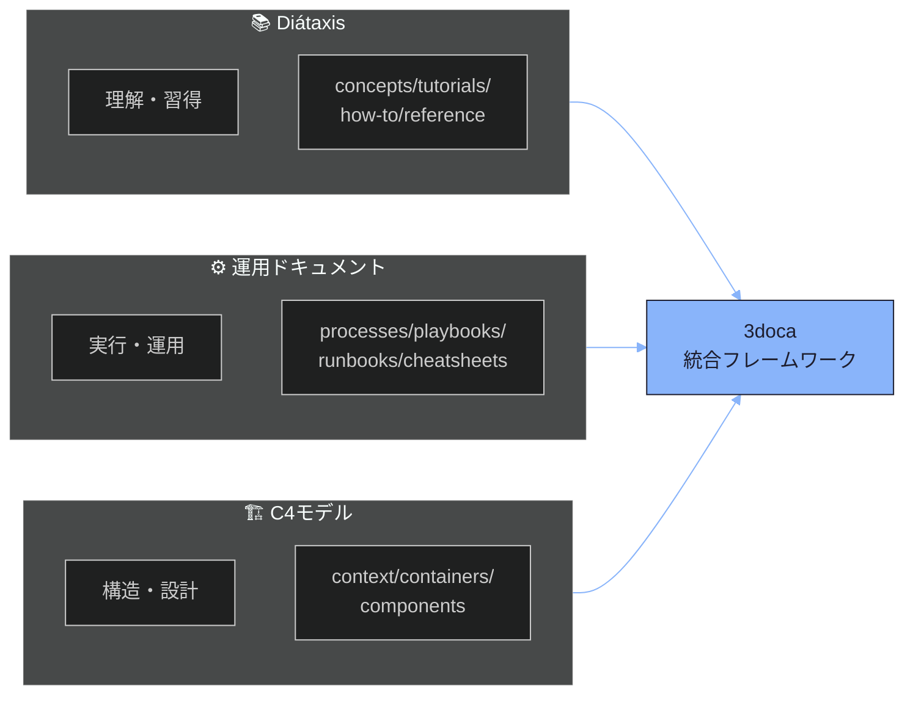
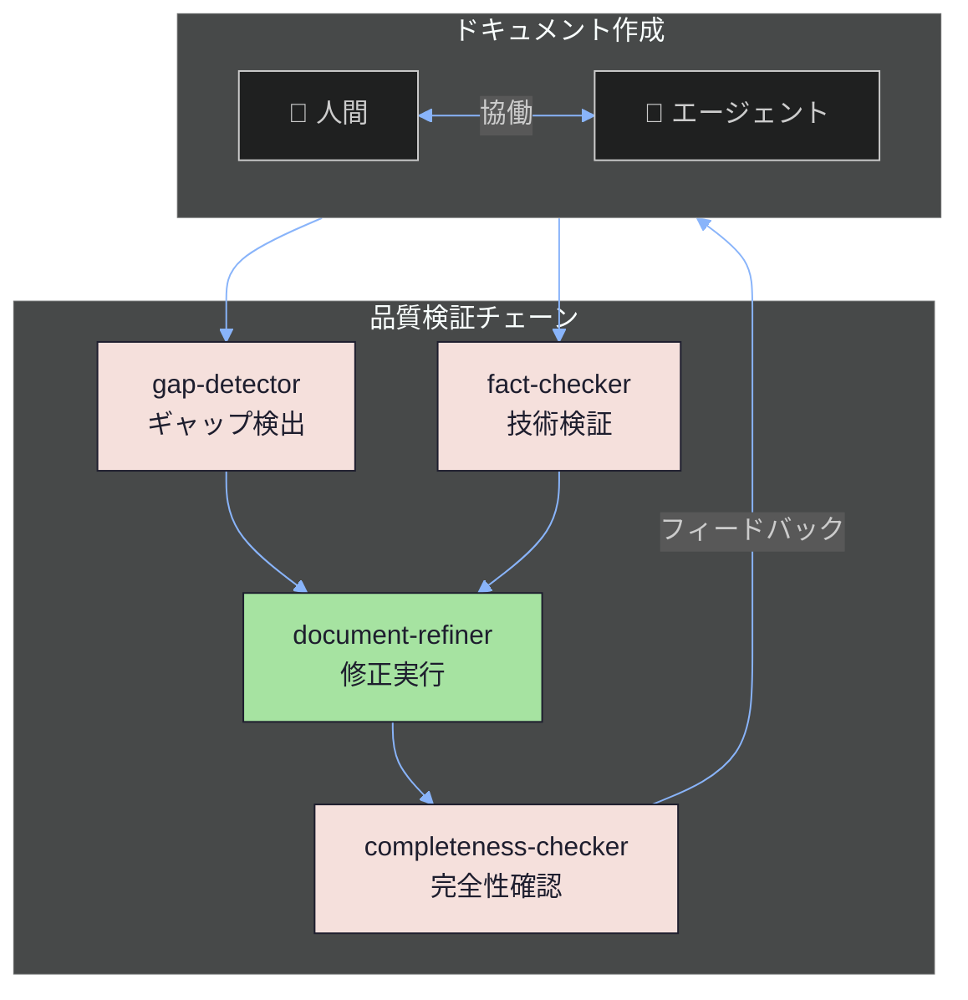

# 3doca プロジェクトビジョン

## 概要

3doca（**3**-axis **doc**umentation framework with **a**gent assistance）は、AIエージェントと人間が協働してドキュメントを作成・管理するためのフレームワークです。

本ドキュメントでは、プロジェクトの背景、目的、設計思想を説明します。

## 背景と動機

### ドキュメント作成の課題

技術ドキュメントの作成には、以下の本質的な課題があります：

| 課題 | 説明 | 従来のアプローチ |
|------|------|------------------|
| **情報の散逸** | 知識が複数の場所に分散し、探しにくい | 検索ツールに依存 |
| **品質のばらつき** | 作成者によって詳細度・形式が異なる | スタイルガイドの策定 |
| **陳腐化** | 実装と乖離したドキュメントが放置される | 定期レビューの義務化 |
| **不完全な情報** | 推測や不正確な記述が紛れ込む | レビュープロセス |

### エージェント支援という解決策

AIエージェント（Claude Code等）の登場により、新しいアプローチが可能になりました：

- **構造化された知識**: フレームワークに基づく一貫した構造
- **自動検証**: エージェントによる品質チェック
- **不確実性の明示**: 推測ではなくギャップマーカーで明示
- **継続的改善**: 検出→検証→修正のサイクル

## 3軸フレームワークの目的

3docaは、3つの確立されたフレームワークを統合しています：



### 各軸の役割

| 軸 | 源流 | 目的 | 対象読者 |
|----|------|------|---------|
| **Diátaxis** | [diataxis.fr](https://diataxis.fr/) | 理解と習得 | 学習者、新規参加者 |
| **運用** | SRE/DevOps文化 | 作業の実行 | オペレーター、実務者 |
| **C4** | [c4model.com](https://c4model.com/) | 構造の可視化 | アーキテクト、設計者 |

詳細は [3軸ドキュメントフレームワーク](./01-three-axis-framework.md) を参照してください。

## エージェント支援の仕組み

3docaでは、4種類の検証エージェントが品質保証を担います：



### 各エージェントの役割

| エージェント | 役割 | 権限 |
|-------------|------|------|
| **gap-detector** | ギャップマーカーの検出、リンク有効性確認 | 読み取りのみ |
| **fact-checker** | 技術的主張の検証、コードとの整合性確認 | 読み取りのみ |
| **document-refiner** | 検出された問題の修正 | **書き込み可能** |
| **completeness-checker** | 体系全体の完全性評価 | 読み取りのみ |

### ギャップマーカーシステム

推測や不確実な情報を埋めるのではなく、明示的にマーカーで示します：

```markdown
## 計算パラメータ

最小メッシュサイズは [NEEDS_VERIFICATION: デフォルト値要確認] に設定される。

[NEEDS_EXAMPLE: iRIC Nays2DFloodでのメッシュ設定コード例]

境界条件については [LINK_NEEDED: 境界条件リファレンスへのリンク] を参照。
```

**原則**: 不完全でも正確なドキュメントは、完全だが不正確なドキュメントより価値がある。

## 自己言及的設計

### 実例としてのドキュメント

3docaのドキュメント群は、フレームワークの**説明であると同時に実例**です：

| ドキュメント | 説明 | 実例 |
|-------------|------|------|
| テンプレート使用ガイド | テンプレートの使い方を説明 | そのテンプレートで作成されている |
| ギャップマーカー仕様 | マーカーの使い方を説明 | 実際のマーカーが含まれている |
| 品質検証プロセス | 検証手順を説明 | そのプロセスで検証されている |

### なぜ自己言及的なのか

1. **信頼性**: フレームワークが自分自身に適用できなければ、他に適用できるとは言えない
2. **具体性**: 抽象的な説明より、実例を見る方が理解しやすい
3. **保守性**: ドキュメントを更新すると、実例も自動的に更新される
4. **検証可能性**: フレームワークの問題はドキュメント自体に現れる

## 適用可能なドメイン

3docaは技術ドキュメントに限らず、汎用的に適用できます：

### ソフトウェアプロジェクト

- **API仕様**: reference/ + components/
- **運用手順**: runbooks/ + playbooks/
- **アーキテクチャ設計**: context/ + containers/

### 研究プロジェクト

- **実験手順**: tutorials/ + runbooks/
- **データ処理パイプライン**: processes/ + how-to/
- **結果の解釈**: concepts/ + reference/

### 業務プロセス

- **標準作業手順（SOP）**: runbooks/
- **トラブルシューティング**: playbooks/
- **引き継ぎ資料**: tutorials/ + cheatsheets/

### 適用の判断基準

| 条件 | 推奨 |
|------|------|
| ドキュメント数 < 20 | シンプルなREADME構造で十分 |
| ドキュメント数 20-50 | Diátaxis軸のみ採用を検討 |
| ドキュメント数 > 50 | 3軸フレームワークの導入を推奨 |
| 運用手順が重要 | 運用軸の追加を強く推奨 |
| システム構造が複雑 | C4軸の追加を強く推奨 |

## 他フレームワークとの比較

### vs. Diátaxisのみ

| 観点 | 3doca | Diátaxisのみ |
|------|-------|--------------|
| 運用手順のカバー | ✅ 専用軸あり | ⚠️ how-toに混在 |
| アーキテクチャ可視化 | ✅ C4軸で体系化 | ❌ 非対応 |
| エージェント支援 | ✅ 検証チェーン組込み | ❌ 非対応 |
| 学習コスト | 中（3軸の理解が必要） | 低（4象限のみ） |

### vs. ADR（Architecture Decision Records）

| 観点 | 3doca | ADR |
|------|-------|-----|
| 意思決定の記録 | ⚠️ conceptsで対応可能 | ✅ 専用フォーマット |
| 運用手順 | ✅ 専用軸あり | ❌ 非対応 |
| 学習支援 | ✅ tutorials軸あり | ❌ 非対応 |

**推奨**: ADRは3doca内で併用可能（03_architecture/adr/ として配置）

### vs. GitBook/Docusaurus

| 観点 | 3doca | GitBook/Docusaurus |
|------|-------|-------------------|
| 構造の指針 | ✅ 3軸で明確 | ⚠️ 自由形式 |
| ホスティング | ⚠️ 別途必要 | ✅ 組込み |
| エージェント連携 | ✅ MCP経由で連携 | ⚠️ 限定的 |

**推奨**: 3docaで構造を定義し、GitBook/Docusaurusでホスティング

## 次のステップ

このビジョンを理解したら：

- **フレームワーク詳細**: [3軸ドキュメントフレームワーク](./01-three-axis-framework.md)
- **品質保証**: [品質保証フレームワーク](./02-quality-assurance-framework.md)
- **実践**: [初めてのドキュメント作成](../02-tutorials/01-first-document.md)
- **テンプレート**: [テンプレート一覧](../../_templates/00-INDEX.md)

## 参考資料

- [Diátaxis公式サイト](https://diataxis.fr/) - Diátaxisフレームワークの詳細
- [C4 Model](https://c4model.com/) - C4モデルの公式サイト
- [Google SRE Book](https://sre.google/sre-book/table-of-contents/) - 運用ドキュメントの参考

---

<!-- 検証チェックリスト
✓ プロジェクトの背景と動機が説明されているか
✓ 3軸フレームワークの目的が明確か
✓ エージェント支援の仕組みがMermaid図で可視化されているか
✓ 自己言及的設計の意図が説明されているか
✓ 適用可能なドメインが具体的か
✓ 他フレームワークとの比較があるか
-->
