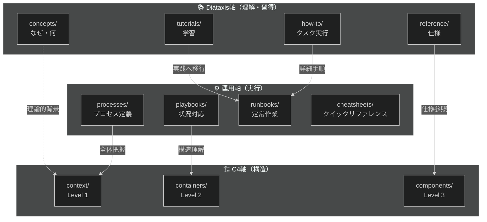
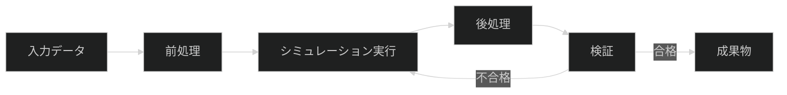
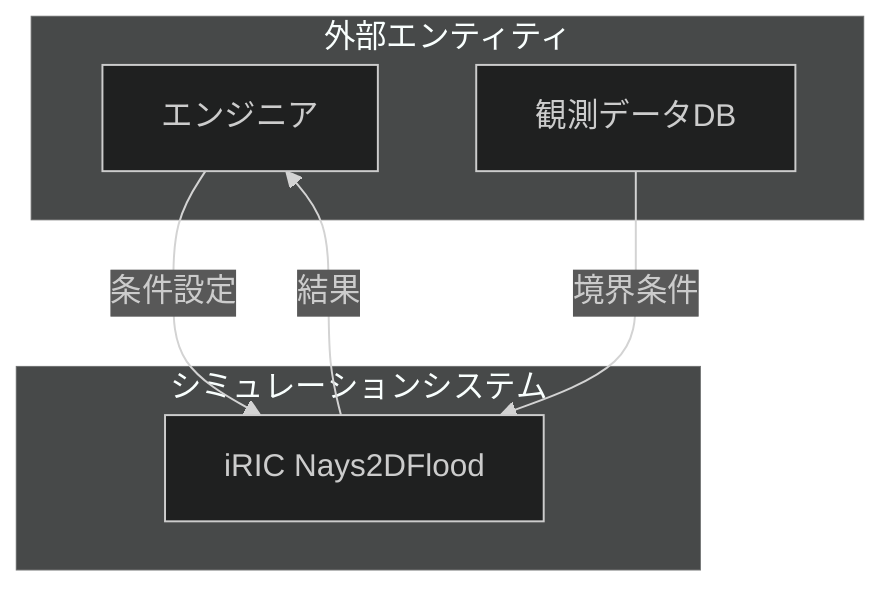
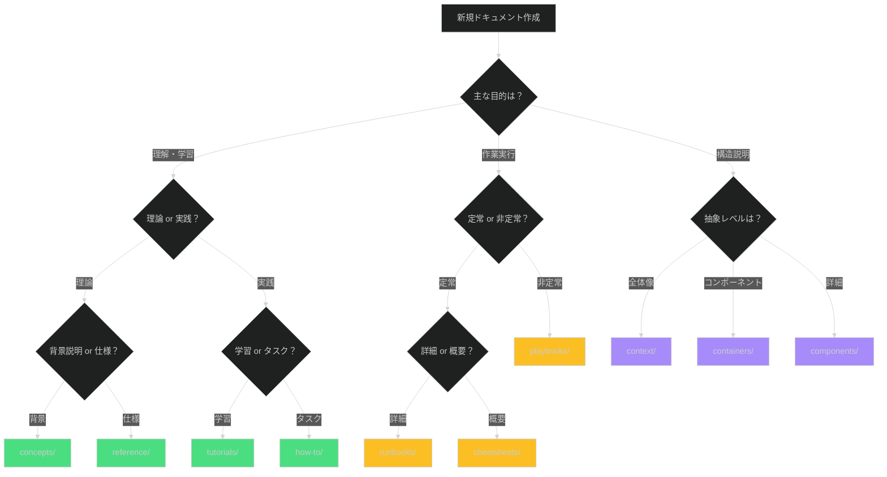

# 3軸ドキュメントフレームワーク

## 概要

3軸ドキュメントフレームワークは、技術ドキュメントを「理解・習得」「実行」「構造」の3つの視点で整理する体系です。
従来の単一階層のドキュメント構造では、同じトピックが複数の文脈で現れた際に情報の重複や配置の迷いが生じていました。
このフレームワークでは、各ドキュメントに明確な役割を与えることで、作成者の迷いを減らし、読者が目的に応じた情報に素早くアクセスできます。

本フレームワークは以下の3軸で構成されます：

- **Diátaxis軸**（01_knowledge/）: 理解と学習のためのドキュメント群
- **運用軸**（02_operations/）: 日々の業務実行のためのドキュメント群
- **C4モデル軸**（03_architecture/）: システム構造の可視化と理解

## なぜ重要か

技術ドキュメントの品質問題は、しばしば「情報が存在しない」ことではなく「適切な場所に配置されていない」ことに起因します。
3軸フレームワークを採用することで、以下のメリットが得られます：

- **作成者視点**: 「このドキュメントはどこに置くべきか？」の判断基準が明確になる
- **読者視点**: 「今必要な情報はどの軸を見ればいいか？」が直感的に分かる
- **保守視点**: 役割が明確なため、情報の重複や陳腐化を防ぎやすい
- **拡張性**: 新しいトピックを追加する際、既存構造との整合性を保ちやすい

## 基本概念

### 3軸の相互関係

### 各軸の役割

| 軸 | 主な目的 | 対象読者 | 更新頻度 |
|----|----------|----------|----------|
| **Diátaxis** | 理解と習得を支援 | 学習者、新規参加者 | 中（機能追加時） |
| **運用** | 日々の作業を効率化 | 運用担当者、開発者 | 高（手順変更時） |
| **C4モデル** | システム構造の可視化 | アーキテクト、開発者 | 低（アーキテクチャ変更時） |

## 第1軸: Diátaxis（理解・習得）

Diátaxisは、技術ドキュメントを「学習」と「作業」、「理論」と「実践」の2軸で4象限に分類するフレームワークです。

### concepts/（概念説明）

**目的**: 「なぜそうなっているのか」「何であるのか」を説明する

**特徴**:
- 背景、設計思想、原理の解説
- 抽象的な概念の理解を促進
- コード例は最小限（理解を助ける範囲で）

**例**: 「メッシュ生成アルゴリズムの選択基準」「CFDソルバーの収束判定理論」

**C4モデルとの連携**: Level 1-2 の Context/Containers と関連付け、システムの「なぜそう設計されたか」を説明

### tutorials/（チュートリアル）

**目的**: 初学者が手を動かしながら学ぶ

**特徴**:
- 学習目標を冒頭に明記
- 完走可能（途中で詰まらない）
- 各ステップに検証ポイント
- 所要時間15-30分程度（Tier 1相当）

**例**: 「初めてのiRIC Nays2DFloodシミュレーション」「ParaViewによる可視化入門」

**運用ドキュメントへの移行**: チュートリアル完了後、実務で使うための runbooks/ へ誘導

### how-to/（ハウツーガイド）

**目的**: 特定のタスクを達成する方法を示す

**特徴**:
- 前提条件を明確に記載
- 1ドキュメント1タスク
- 結果の確認方法を含める
- 問題解決志向

**例**: 「境界条件の変更方法」「計算結果の精度検証手順」

**運用ドキュメントへの差異**: how-to は「理解しながら実行」、runbooks は「機械的に実行」

### reference/（リファレンス）

**目的**: 仕様・パラメータ・API等の網羅的な情報提供

**特徴**:
- 体系的・網羅的
- 構造化された形式（テーブル、定義リスト）
- 検索性重視
- バージョン情報必須

**例**: 「入力ファイルフォーマット仕様」「パラメータ一覧表」

**C4モデルとの連携**: Level 3 Components の詳細仕様として参照される

## 第2軸: 運用ドキュメント（実行）

運用ドキュメント軸は、日々の業務実行に特化したドキュメント群です。「今すぐ何をすべきか」に焦点を当てます。

### processes/（プロセス定義）

**目的**: ワークフロー全体を定義

**特徴**:
- 全体像を図示（Mermaid flowchart）
- 入力・出力を明記
- 各ステップの責任範囲
- 関連する playbook/runbook へのリンク

**例**: 「シミュレーションプロジェクト実行プロセス」「品質検証プロセス」

### playbooks/（プレイブック）

**目的**: 非定常的な状況への対応手順

**特徴**:
- トリガー条件を冒頭に明記
- 判断分岐を明確に（フローチャート推奨）
- エスカレーション基準
- 完了条件・確認事項

**例**: 「計算が収束しない場合の対処法」「異常な結果が出た時のチェックリスト」

**Diátaxisとの差異**: how-to は「特定タスクの実行方法」、playbooks は「問題発生時の対応フロー」

### runbooks/（ランブック）

**目的**: 定常作業の手順書

**特徴**:
- 実行可能なコマンド・手順
- コピー&ペースト可能
- 前提条件チェックリスト
- ロールバック手順

**例**: 「週次計算実行手順」「結果レポート生成手順」

**自動化の前段階**: runbook を作成し手順を標準化した後、スクリプト化やCI/CD化を検討

### cheatsheets/（チートシート）

**目的**: 頻繁に参照する情報の一覧化

**特徴**:
- 1ページ以内（Tier 0相当）
- 視覚的構成（テーブル中心）
- 説明は最小限
- 印刷可能なレイアウト

**例**: 「コマンドオプション早見表」「単位換算表」「エラーコード一覧」

## 第3軸: C4モデル（構造）

C4モデルは、システムアーキテクチャを4つの抽象レベルで可視化するフレームワークです。
本プロジェクトでは Level 1-3 を採用しています。

### context/（Level 1: コンテキスト図）

**目的**: システム全体と外部との関係を示す

**特徴**:
- 非技術者にも理解可能
- 人・システムの相互作用
- Mermaid flowchart で代替

**例**: 「シミュレーションシステム全体図」

### containers/（Level 2: コンテナ図）

**目的**: 主要な技術コンポーネントとその関係

**特徴**:
- 実行環境、データストア、サービス
- 通信プロトコル・データフロー
- 技術選択の理由（概要）

**例**: 「計算サーバー・可視化クライアント・データストレージ構成」

### components/（Level 3: コンポーネント図）

**目的**: 内部構造の詳細

**特徴**:
- クラス・モジュール・関数レベル
- 実装詳細へのリンク
- reference/ ドキュメントとの連携

**例**: 「メッシュ生成モジュールの内部構造」

## 仕組み

### ドキュメント配置の判断フロー

新しいドキュメントを作成する際、以下のフローで配置先を決定します：

### 軸間の参照関係

各軸のドキュメントは独立していますが、適切に相互参照することで理解が深まります：

**推奨される参照パターン**:

- `concepts/` → `context/`: 概念の全体構造を示す
- `tutorials/` → `runbooks/`: 学習から実践への移行
- `how-to/` → `playbooks/`: タスク実行から問題対応へ
- `reference/` → `components/`: 仕様の実装詳細
- `processes/` → `context/`: プロセス全体の位置づけ

## 設計思想・背景

### なぜ3軸なのか

単一の階層構造では、以下の問題が発生します：

1. **配置の迷い**: 「シミュレーション実行手順」は「シミュレーション」配下？「手順書」配下？
2. **重複の発生**: 同じ情報が複数の文脈で必要になり、コピーが増える
3. **目的の混在**: 1つのドキュメントに「概念説明」と「手順」と「リファレンス」が混在

3軸構造は、各ドキュメントに単一の責務を与えることで、これらの問題を解決します。

### Diátaxisの選択理由

Diátaxisは実績のあるドキュメントフレームワークであり、Django、Gatsby等の大規模プロジェクトで採用されています。
「学習/作業」「理論/実践」の2軸による4象限分類は、技術ドキュメントの本質的な性質を捉えています。

[Diátaxis公式サイト](https://diataxis.fr/)

### 運用ドキュメントの追加理由

Diátaxisは「理解・習得」には強いが、「日々の業務実行」の視点が弱い傾向があります。
特にDevOps/SRE文化では、runbooksやplaybooksが重要な役割を果たすため、独立した軸として追加しました。

### C4モデルの採用理由

システムアーキテクチャの説明は、抽象レベルに応じて異なる図が必要です。
C4モデルは、Context → Containers → Components → Code の4レベルで段階的に詳細化する明確な指針を提供します。

[ASSUMPTION: 本プロジェクトでは Code レベル（Level 4）は UML等の既存ツールに委ね、Level 1-3 のみを採用しています]

## 制約と限界

| 制約 | 説明 | 対処法 |
|------|------|--------|
| **学習コスト** | 3軸の使い分けを理解するまで時間がかかる | チュートリアルと判断フローチャートを提供 |
| **過度な分割** | 小さなトピックでも3軸すべてが必要とは限らない | 不要な軸は省略可（例: 小さなツールなら concepts のみ） |
| **リンク管理** | 軸間の相互参照リンクの保守負担 | Markdown linter でリンク切れを自動検出 |
| **ツール依存** | C4図の Mermaid 代替は表現力に限界 | 複雑な図は PlantUML や draw.io を併用 |

## 関連概念との比較

### vs. 単一階層のトピックベース構造

| 観点 | 3軸フレームワーク | トピックベース |
|------|------------------|----------------|
| **配置の明確性** | 高（役割で分類） | 低（主観的判断） |
| **情報の重複** | 少ない（役割が明確） | 多い（同じ内容が複数箇所） |
| **初見の理解** | 要学習（3軸の理解が必要） | 直感的（トピック名で検索） |
| **拡張性** | 高（新トピックも既存構造に配置） | 中（トピック増加で構造が複雑化） |

**使い分け**: 小規模プロジェクト（ドキュメント数 < 20）ならトピックベースで十分。
中規模以上（ドキュメント数 > 50）なら3軸フレームワークの導入を推奨。

### vs. Microsoft Documentation Pattern

Microsoft Docs は「Concepts」「Quickstarts」「Tutorials」「How-to guides」「Reference」の5分類を採用しています。
これは Diátaxis に近いですが、運用ドキュメント（runbooks/playbooks）の視点が欠けています。

**適用シーン**:
- **Microsoft パターン**: エンドユーザー向けソフトウェアドキュメント
- **本フレームワーク**: 運用・開発の両方を含む技術システムのドキュメント

## 次のステップ

この概念を理解したら：

- **実践**: [初めてのドキュメント作成チュートリアル](../02-tutorials/01-first-document.md)
- **品質保証**: [品質保証フレームワーク](./02-quality-assurance-framework.md) - ギャップマーカーと検証エージェント
- **詳細**: [ギャップマーカー仕様書](../04-reference/01-GAP-MARKER-SPEC.md)
- **適用**: [テンプレート使用ガイド](../03-how-to/01-template-usage-guide.md)
- **運用**: [ドキュメント作成プロセス](../../02_operations/01-processes/01-document-creation-process.md)

## 参考資料

- [Diátaxis公式サイト](https://diataxis.fr/) - Diátaxis framework の詳細
- [C4 Model](https://c4model.com/) - C4 モデルの公式サイト
- [CLAUDE.md](../../../CLAUDE.md) - 本プロジェクトのルール（ギャップマーカー仕様含む）

---

<!-- 検証チェックリスト（作成完了時に確認）
✓ 「なぜ」「何」に焦点を当てているか
✓ 対象読者に適切な抽象レベルか
✓ 図解は理解を助けているか
✓ 関連ドキュメントへのリンクがあるか
✓ ギャップマーカーは適切に配置されているか
-->
