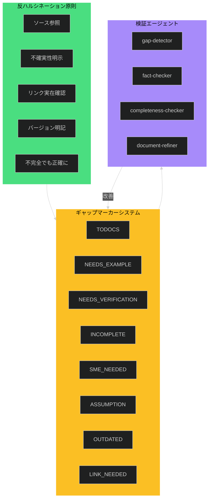
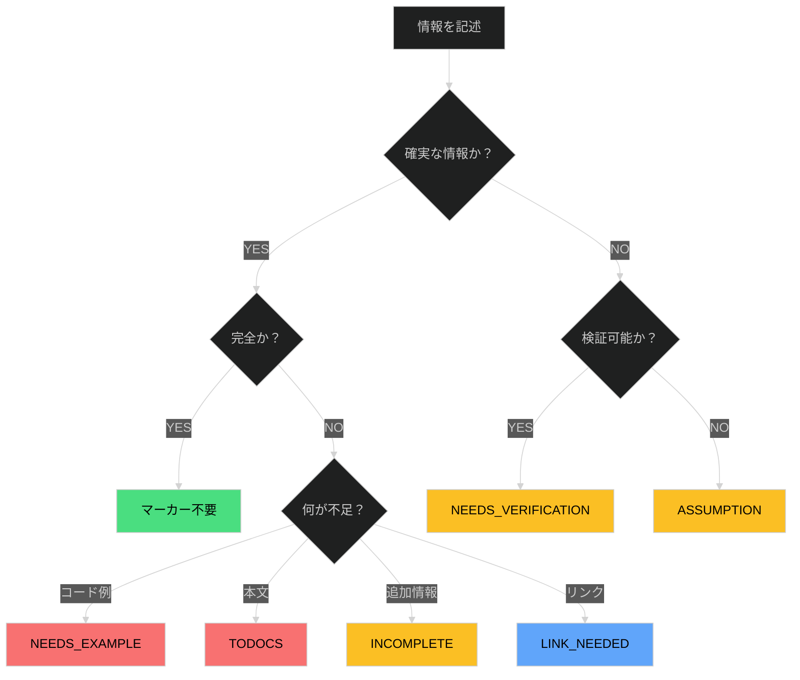
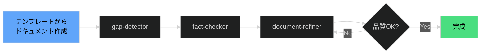
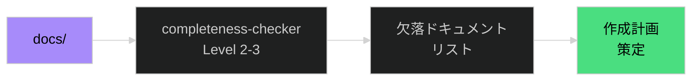

# 品質保証フレームワーク

## 概要

品質保証フレームワークは、ドキュメントの**正確性**と**完全性**を体系的に担保するための仕組みです。
AI/LLM支援によるドキュメント作成が一般化する中、「もっともらしいが不正確な情報」（ハルシネーション）のリスクが増大しています。

本フレームワークは以下の3つの柱で構成されます：

1. **反ハルシネーション原則**: 推測を排除し、不確実性を明示するルール
2. **ギャップマーカーシステム**: 不完全・未検証箇所を構造的に記録する仕組み
3. **検証エージェント**: 自動化された品質検証と改善のワークフロー

> **本プロジェクトでの実装状況**: このフレームワークは概念だけでなく、実際に本プロジェクトで運用しています。
> `.claude/agents/` に検証エージェントを配置し、CLAUDE.md にギャップマーカー仕様を定義しています。

## なぜ重要か

### AI支援ドキュメント作成の課題

AI/LLMは高品質なドキュメントを効率的に生成できますが、以下のリスクがあります：

- **ハルシネーション**: 存在しないAPIや誤ったパラメータ値を自信を持って記述
- **バージョン混在**: 異なるバージョンの情報を混ぜて記述
- **過度な補完**: 不明な点を推測で埋めてしまう
- **検証困難**: 一見正しく見える記述の誤りを見落とす

### フレームワークの効果

品質保証フレームワークを導入することで：

- **不確実性の可視化**: 何が確実で何が不確実かが明確になる
- **レビュー効率向上**: 検証が必要な箇所が特定しやすい
- **継続的改善**: 検証エージェントによる定期的な品質チェック
- **知識の蓄積**: 検証済み情報と未検証情報の区別が保持される

## 基本概念

### フレームワーク全体像



## 反ハルシネーション原則

AI/LLMによるドキュメント作成時に遵守すべき5つの原則：

### 1. ソース参照の原則

**技術的主張には必ず根拠を示す**

```markdown
<!-- 悪い例 -->
このAPIは毎秒1000リクエストを処理できます。

<!-- 良い例 -->
このAPIは毎秒1000リクエストを処理できます（[公式ベンチマーク](https://example.com/benchmark)より）。

<!-- 不明な場合 -->
このAPIは [NEEDS_VERIFICATION: スループット値を公式ドキュメントで確認] を処理できます。
```

### 2. 不確実性明示の原則

**確信度が低い場合は明示的にマーカーを使用**

- 確実な情報 → そのまま記述
- 推測を含む → `[ASSUMPTION: 説明]`
- 検証が必要 → `[NEEDS_VERIFICATION: 説明]`

### 3. リンク実在確認の原則

**存在しないファイル・URLへのリンクを作成しない**

```markdown
<!-- 悪い例：存在しないファイルへのリンク -->
詳細は [設定ガイド](./config-guide.md) を参照。

<!-- 良い例：未作成の場合はマーカー -->
詳細は [LINK_NEEDED: 設定ガイドを作成後にリンク] を参照。
```

### 4. バージョン明記の原則

**バージョン依存情報には必ずバージョンを記載**

```markdown
<!-- 悪い例 -->
`--new-flag` オプションが追加されました。

<!-- 良い例 -->
v2.5.0 以降で `--new-flag` オプションが追加されました。
```

### 5. 不完全でも正確にの原則

> **完全だが不正確なドキュメントより、不完全でも正確なドキュメントの方が価値がある。**

推測で埋めるのではなく、ギャップマーカーを残すことで品質を保証します。

## ギャップマーカーシステム

### マーカー一覧

| マーカー | 優先度 | 用途 |
|----------|--------|------|
| `[TODOCS: 説明]` | **HIGH** | 未完成セクション、後で記述が必要 |
| `[NEEDS_EXAMPLE: 説明]` | **HIGH** | コード例・実行例が必要 |
| `[NEEDS_VERIFICATION: 説明]` | MEDIUM | 未検証の主張、要確認 |
| `[INCOMPLETE: 説明]` | MEDIUM | 情報不足、追加調査が必要 |
| `[OUTDATED: 説明]` | MEDIUM | 古い可能性がある情報 |
| `[SME_NEEDED: 説明]` | LOW | 専門家レビューが必要 |
| `[LINK_NEEDED: 説明]` | LOW | 関連ドキュメントへのリンクが必要 |
| `[ASSUMPTION: 説明]` | INFO | 仮定に基づく記述（明示的に） |

### 優先度の意味

| 優先度 | 対応目標 | 説明 |
|--------|----------|------|
| **HIGH** | 公開前に解消 | ドキュメントとして成立するために必須 |
| **MEDIUM** | 次回レビュー時 | 1-3ヶ月以内に対応 |
| **LOW** | 機会があれば | 必須ではないが改善点 |
| **INFO** | 解消不要 | 明示的な注記として残す |

### 使用フロー



詳細な仕様は [ギャップマーカー仕様書](../04-reference/01-GAP-MARKER-SPEC.md) を参照してください。

## 検証エージェント

本フレームワークでは、4つの専門エージェントがドキュメント品質を検証・改善します。

### エージェント一覧

| エージェント | 目的 | 権限 |
|-------------|------|------|
| **gap-detector** | ギャップ検出 | read: docs → write: reports |
| **fact-checker** | ファクト検証 | read: docs+src → write: reports |
| **completeness-checker** | 完全性確認 | read: docs+reports → write: reports |
| **document-refiner** | ドキュメント改善 | read: all → **write: docs+reports** |

> **重要**: `document-refiner` のみがソースドキュメントを修正可能です。
> 他のエージェントは検出・レポートのみを行い、実際の修正は別途承認を経て行います。

### 権限モデル

```
┌─────────────────────────────────────────────────────────────┐
│                    Permission Levels                         │
├─────────────────────────────────────────────────────────────┤
│  gap-detector        : READ docs → WRITE reports            │
│  fact-checker        : READ docs+src → WRITE reports        │
│  completeness-checker: READ docs+reports → WRITE reports    │
│  document-refiner    : READ all → WRITE docs+reports        │
└─────────────────────────────────────────────────────────────┘
```

### 各エージェントの役割

#### gap-detector（ギャップ検出）

ドキュメント内のギャップマーカーを検出し、集計・分析します。

**検出対象**:
- 8種類のギャップマーカー
- 優先度別の集計
- ファイル別の分布

**出力**: `reports/gap-reports/` にレポートを生成

#### fact-checker（ファクト検証）

技術的主張の正確性を検証します。

**検証対象**:
- コード例の構文正確性
- APIパラメータの存在確認
- バージョン情報の整合性

**出力**: `reports/fact-check-reports/` にレポートを生成

#### completeness-checker（完全性確認）

ドキュメント体系全体の完全性を確認します。

**確認対象**:
- Diátaxis/運用/C4各軸の必須ドキュメント
- フロントマター必須項目
- 相互リンクの整合性

**出力**: `reports/completeness-reports/` にレポートを生成

#### document-refiner（ドキュメント改善）

検出された問題を実際に修正します。

**改善対象**:
- ギャップマーカーの解消
- リンク切れの修正
- フォーマットの統一

**出力**: ドキュメント修正 + `reports/refine-reports/` にレポートを生成

## ワークフロー

### ワークフロー1: 新規ドキュメント作成



**手順**:
1. `_templates/` からテンプレートをコピー
2. 内容を記述（不明点はギャップマーカーを使用）
3. `gap-detector` でギャップを検出
4. `fact-checker` で技術的正確性を検証
5. `document-refiner` で修正・改善
6. 品質基準を満たすまで繰り返し

### ワークフロー2: 既存ドキュメント監査


**手順**:
1. 対象ドキュメントを選定
2. `gap-detector` でギャップを洗い出し
3. `fact-checker` で古い情報や誤りを検出
4. `completeness-checker` で体系全体の欠落を確認
5. 優先順位を付けて改善計画を策定

### ワークフロー3: 体系的監査



**手順**:
1. `completeness-checker` を docs/ 全体に実行
2. 3軸フレームワークの観点で欠落を特定
3. 欠落ドキュメントのリストを作成
4. 優先度に基づいて作成計画を策定

## 本プロジェクトでの実装状況

### 実装済みの仕組み

| 要素 | 実装場所 | 状態 |
|------|----------|------|
| ギャップマーカー仕様 | `CLAUDE.md` | 運用中 |
| エージェント定義 | `.claude/agents/` | 運用中 |
| エージェントテンプレート | `docs/_templates/04_agents/` | 運用中 |
| レポート出力先 | `reports/` | 運用中 |

### 運用実績

- **Phase 8**: 全ドキュメントに対して gap-detector を実行し、31件のフロントマター欠落、25件のリンク切れを検出
- **定期監査**: 週次で completeness-checker を実行予定

### 今後の拡張予定

- [ ] GitHub Actions での自動検証
- [ ] PR 時のギャップマーカーレポート自動生成
- [ ] ダッシュボードでの品質メトリクス可視化

## 設計思想・背景

### なぜ「マーカー」なのか

コメントやメタデータではなく、本文中にマーカーを埋め込む理由：

1. **可視性**: 読者にも不完全な箇所が見える
2. **検索性**: grep で一括検出可能
3. **強制力**: マーカーが残っていると目立つため、解消を促進
4. **履歴**: Git で追跡可能

### なぜ4つのエージェントに分割するのか

単一の「品質チェッカー」ではなく、役割を分割する理由：

1. **責任の明確化**: 各エージェントの責務が明確
2. **権限の最小化**: 書き込み権限は document-refiner のみ
3. **段階的検証**: 検出 → 検証 → 改善のパイプライン
4. **選択的実行**: 必要なエージェントのみ実行可能

## 制約と限界

| 制約 | 説明 | 対処法 |
|------|------|--------|
| **手動トリガー** | エージェントは手動実行が必要 | CI/CD統合を計画中 |
| **マーカー記述コスト** | マーカー記述は手間がかかる | テンプレートにマーカーを事前配置 |
| **過剰なマーカー** | マーカーが多すぎると読みにくい | 優先度に基づく段階的解消 |
| **SME依存** | SME_NEEDED は人間の介入が必要 | 定期レビュー会で対応 |

## 次のステップ

この概念を理解したら：

- **詳細仕様**: [ギャップマーカー仕様書](../04-reference/01-GAP-MARKER-SPEC.md)
- **早見表**: [ギャップマーカー早見表](../../02_operations/04-cheatsheets/01-gap-markers-quick-reference.md)
- **エージェント使用**: [検証エージェント早見表](../../02_operations/04-cheatsheets/02-verification-agents-quick-reference.md)
- **テンプレート**: [検証エージェントテンプレート](../../_templates/04_agents/README.md)
- **関連概念**: [3軸ドキュメントフレームワーク](./01-three-axis-framework.md)

## 参考資料

- [CLAUDE.md](../../../CLAUDE.md) - プロジェクトルール（ギャップマーカー仕様の原典）
- [Diátaxis](https://diataxis.fr/) - ドキュメントフレームワーク
- [Write the Docs](https://www.writethedocs.org/) - ドキュメント品質のベストプラクティス

---

<!-- 検証チェックリスト（作成完了時に確認）
✓ 反ハルシネーション5原則が記述されているか
✓ ギャップマーカー8種が記述されているか
✓ 検証エージェント4種が記述されているか
✓ ワークフロー3種がMermaid図で記述されているか
✓ 「実装・実用形態として取り入れている」ことが明記されているか
✓ 関連ドキュメントへのリンクがあるか
-->
