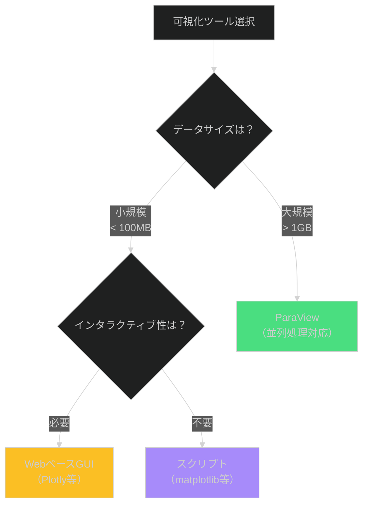

# 初めてのドキュメント作成

## 学習目標

このチュートリアルを完了すると、以下ができるようになります：

- [ ] テンプレートから新しいドキュメントを作成する
- [ ] フロントマター（YAMLヘッダー）を正しく記述する
- [ ] ギャップマーカーを使って不完全な情報を明示する
- [ ] 3軸フレームワークに基づいてドキュメントを配置する
- [ ] Mermaid図を含む基本的なドキュメントを完成させる

**所要時間**: 約15分

## 前提条件

始める前に、以下が必要です：

- **テキストエディタ**: VS Code推奨（Markdown Preview Enhanced拡張機能があると便利）
- **基本知識**: Markdownの見出し、リスト、コードブロックの記法
- **プロジェクト環境**: 本ドキュメントフレームワークのリポジトリをクローン済み

### 環境確認

```bash
# ドキュメントディレクトリの存在確認
ls -la docs/01_knowledge/ docs/02_operations/ docs/03_architecture/ docs/_templates/

# 期待される出力: 各ディレクトリが存在すること
```

期待される出力：
```text
docs/01_knowledge/
docs/02_operations/
docs/03_architecture/
docs/_templates/
```

もしディレクトリが存在しない場合は、リポジトリのREADMEに従ってセットアップしてください。

## 概要

このチュートリアルでは、「シミュレーション結果の可視化」に関する簡単な概念説明ドキュメントを作成します。
以下のステップで進めます：


## Step 1: テンプレートの選択

### このステップの目的

作成するドキュメントの種類を決定し、対応するテンプレートを特定します。

### 手順

1. **ドキュメントの目的を明確化**

今回は「可視化の重要性と基本的な考え方」を説明するため、**概念説明（concept）**ドキュメントを作成します。

2. **配置先ディレクトリの決定**

判断フロー：
- 主な目的: 理解・学習 → **Diátaxis軸（01_knowledge/）**
- 理論 or 実践: 理論 → **concepts/ または reference/**
- 背景説明 or 仕様: 背景説明 → **concepts/**

よって、配置先は `docs/01_knowledge/01-concepts/` です。

3. **テンプレートの確認**

```bash
# 利用可能なテンプレート一覧
ls docs/_templates/01_knowledge/
```

期待される出力：
```text
01-concept.md
02-tutorial.md
03-how-to.md
04-reference.md
```

今回は `01-concept.md` を使用します。

### 確認ポイント ✓

以下を確認してください：

- [ ] 作成するドキュメントの目的が明確である
- [ ] 配置先ディレクトリ（01_knowledge/01-concepts/）が決定している
- [ ] 使用するテンプレート（01-concept.md）が特定できている

---

## Step 2: ファイルの作成

### このステップの目的

テンプレートをコピーして、適切なファイル名で新規ドキュメントを作成します。

### 手順

1. **ファイル名の決定**

命名規則：
- **番号**: ディレクトリ内での表示順序（01-, 02-, 03-...）
- **名前**: トピックを表すケバブケース（lowercase-with-hyphens）
- **拡張子**: `.md`

今回は `02-visualization-concepts.md` とします（01は3軸フレームワークで既に使用済み）。

2. **テンプレートのコピー**

```bash
# テンプレートをコピー
cp docs/_templates/01_knowledge/01-concept.md \
   docs/01_knowledge/01-concepts/02-visualization-concepts.md

# ファイルが作成されたことを確認
ls -l docs/01_knowledge/01-concepts/02-visualization-concepts.md
```

3. **エディタで開く**

```bash
# VS Codeで開く場合
code docs/01_knowledge/01-concepts/02-visualization-concepts.md
```

### 確認ポイント ✓

- [ ] ファイルが正しいディレクトリに作成されている
- [ ] ファイル名が命名規則に従っている（番号-トピック名.md）
- [ ] エディタでファイルが開かれている

> **トラブルシューティング**: ファイルが作成されない場合
> - ディレクトリのパスが正しいか確認（`pwd` で現在位置を確認）
> - 書き込み権限があるか確認（`ls -ld docs/01_knowledge/01-concepts/`）

---

## Step 3: フロントマターの記述

### このステップの目的

YAMLフロントマターを記述し、ドキュメントのメタデータを定義します。

### 手順

1. **テンプレートのプレースホルダー確認**

ファイルを開くと、冒頭に以下のようなYAMLブロックがあります：

```yaml
---
title: "[TODOCS: タイトル]"
type: concept
category: "[TODOCS: カテゴリ]"
tags: []
audience: intermediate
# ... その他のフィールド
---
```

`[TODOCS: ...]` はギャップマーカーで、後で埋める必要があることを示しています。

2. **基本フィールドの記入**

以下のように書き換えます：

```yaml
---
title: "シミュレーション結果の可視化"
type: concept
category: "visualization"
tags: [visualization, post-processing, paraview, data-analysis]
audience: beginner
summary: |
  数値シミュレーション結果を効果的に可視化するための基本概念。
  可視化の目的、一般的な手法、ツールの選択基準について説明する。
keywords:
  - 可視化
  - ポスト処理
  - ParaView
  - データ分析
prerequisites:
  - シミュレーション実行の基礎知識
related:
  - "[LINK_NEEDED: ParaView使用ガイド]"
version: "1.0.0"
status: draft
created: "2025-12-10"
updated: "2025-12-10"
---
```

3. **各フィールドの意味**

| フィールド | 説明 | 例 |
|-----------|------|-----|
| `title` | ドキュメントのタイトル | "シミュレーション結果の可視化" |
| `type` | ドキュメントタイプ | concept / tutorial / how-to / reference |
| `category` | トピックのカテゴリ | "visualization" |
| `tags` | 検索用タグ（配列） | [visualization, paraview] |
| `audience` | 対象読者レベル | beginner / intermediate / advanced |
| `summary` | 2-3文の要約（`\|` で複数行） | 簡潔な説明 |
| `status` | 執筆状況 | draft / review / published |

### 確認ポイント ✓

- [ ] すべての `[TODOCS: ...]` が実際の値に置き換わっている
- [ ] `tags` は配列形式（`[tag1, tag2]`）で記述されている
- [ ] `summary` は `|` を使って複数行で記述されている
- [ ] `created` と `updated` の日付が適切である

> **よくある間違い**:
> - `summary` の `|` を忘れる → YAML構文エラーになる
> - `tags` を文字列で書く（`tags: visualization`）→ 配列で書く（`tags: [visualization]`）

---

## Step 4: 本文の記述

### このステップの目的

ドキュメントの本文を記述し、ギャップマーカーを適切に使用します。

### 手順

1. **テンプレートの構造確認**

テンプレートには以下のセクションがあります：

- 概要
- なぜ重要か
- 基本概念
- 仕組み
- 設計思想・背景
- 制約と限界
- 関連概念との比較
- 次のステップ

**すべてのセクションを埋める必要はありません**。不要なセクションは削除してOKです。

2. **最小限の本文を記述**

以下の内容をテンプレートの該当箇所に記入します：

```markdown
# シミュレーション結果の可視化

## 概要

数値シミュレーション（CFD、構造解析、GIS等）の結果は、多次元の大規模データです。
可視化は、このデータから物理現象の理解や異常検出を行うための重要なプロセスです。

本ドキュメントでは、可視化の目的、基本的な手法、ツールの選択基準を説明します。

## なぜ重要か

可視化を適切に行うことで、以下のメリットが得られます：

- **理解の促進**: 複雑な現象を直感的に把握できる
- **異常の早期発見**: 数値表だけでは見逃す問題を視覚的に発見
- **コミュニケーション**: 非専門家にも結果を伝えられる
- **検証の効率化**: 計算結果の妥当性を素早く確認

## 基本概念

### 可視化の種類

シミュレーション結果の可視化には、主に以下の手法があります：

| 手法 | 用途 | 例 |
|------|------|-----|
| **等高線図** | スカラー場の分布 | 温度分布、圧力分布 |
| **ベクトル図** | ベクトル場の方向と大きさ | 流速場、変位場 |
| **流線・パスライン** | 流れの軌跡 | 渦の可視化 |
| **アニメーション** | 時間変化 | 過渡現象の観察 |

### 可視化ツールの選択



**注**: データサイズの閾値は実行環境のメモリやCPU性能により異なります。目安として、小規模（〜100MB）、中規模（100MB〜1GB）、大規模（1GB〜）と分類していますが、実際の処理時間やメモリ使用量は環境により大きく変動します。

## 仕組み

可視化は**パイプライン**と呼ばれる一連の処理ステップで構成されます。データを段階的に変換し、最終的に人間が理解できる視覚表現に変換します。

### 可視化パイプラインの構成

一般的な可視化パイプラインは以下の4ステップで構成されます：

1. **データ読み込み（Source）**
   - シミュレーション結果ファイル（.vtk, .vtu, .csv等）を読み込む
   - データの構造（メッシュ、時系列、変数名等）を解析

2. **フィルタリング（Filter）**
   - 必要な領域・時刻・変数を抽出
   - データの変換（勾配計算、ベクトル合成等）
   - 幾何学的操作（断面作成、等値面抽出等）

3. **マッピング（Mapper）**
   - データ値を視覚要素に変換
   - 色: カラーマップ適用（値 → RGB）
   - 形状: グリフ生成（ベクトル → 矢印）
   - 透明度: 値に応じた可視/不可視

4. **レンダリング（Renderer）**
   - 最終的な画像または動画として出力
   - ライティング、カメラ位置の適用
   - アンチエイリアス、影の生成等

### ParaViewでのパイプライン設定例

ParaViewを使った具体的な可視化手順：

```text
ParaView パイプライン設定手順:

1. データ読み込み
   File > Open > 結果ファイル（例: output.vtk）を選択
   → Apply ボタンをクリック

2. 断面作成（Clip フィルタ）
   Filters > Common > Clip
   - Plane を選択（XY平面、Z=0など）
   → Apply をクリック

3. 等値線表示（Contour フィルタ）
   Filters > Common > Contour
   - Contour By: 表示したい変数（例: Pressure）
   - Value Range: 等値線の値を指定
   → Apply をクリック

4. カラーマッピング設定
   - Color By: 変数を選択（例: Velocity）
   - Edit Color Map: カラーマップを選択（Rainbow, Viridis等）
   - Rescale to Data Range: データの最小/最大に合わせる

5. 視点調整と保存
   - マウスドラッグで視点を回転/移動
   - File > Save Screenshot: 画像として保存（PNG, JPEG）
   - File > Save Animation: アニメーションとして保存（AVI, MP4）
```

**一般的な操作フロー**:
```
データ読み込み → フィルタ適用 → カラー設定 → 視点調整 → 画像保存
```

各ステップで Apply ボタンを押すことで、パイプラインに新しい処理が追加され、結果が更新されます。

## 制約と限界

| 制約 | 説明 | 対処法 |
|------|------|--------|
| **データサイズ** | 大規模データはメモリ不足になる | ダウンサンプリング、並列処理 |
| **解釈の主観性** | カラーマップの選択で印象が変わる | 標準的なカラーマップ使用 |
| **2D表示の限界** | 3D現象を2Dで表現すると情報が失われる | 複数断面、アニメーションで補完 |

## 次のステップ

この概念を理解したら：

- **実践**: [LINK_NEEDED: ParaView基礎チュートリアル]
- **詳細**: [LINK_NEEDED: カラーマップリファレンス]
- **適用**: [LINK_NEEDED: 可視化結果のレポート作成（how-to）]

## 参考資料

- [ParaView公式サイト](https://www.paraview.org/)
- [LINK_NEEDED: 本プロジェクトの可視化ガイドライン]
```

3. **ギャップマーカーの使用**

注目すべき点：

- **環境依存の情報**: データサイズの閾値などは、確定値ではなく目安として範囲で記載し、環境依存であることを明記します
- **詳細説明の追加**: パイプラインなどの複雑な概念は、ステップバイステップで具体的に説明します
- **具体例の提供**: 抽象的な概念には、具体的な操作手順やコマンド例を添えます
- `[LINK_NEEDED: ...]`: 関連ドキュメントが未作成またはリンク先が未確定の場合に使用します

**重要**: 不明な点を推測で埋めず、必要に応じてギャップマーカーで明示してください。ただし、一般的な知識や公式ドキュメントに基づく情報は、具体的に記述してかまいません。

### 確認ポイント ✓

- [ ] 各セクションに最低限の内容が記述されている
- [ ] Mermaid図が含まれている（任意だが推奨）
- [ ] 不明・未検証の情報にはギャップマーカーが付いている
- [ ] コードブロックに言語指定がある（\`\`\`bash, \`\`\`yaml等）

---

## Step 5: 検証とプレビュー

### このステップの目的

作成したドキュメントが仕様を満たしているか検証します。

### 手順

1. **作成時チェックリストの実行**

CLAUDE.md に記載されているチェックリストを確認：

```markdown
□ フロントマターは完全か（type, category, tags, summary）
□ ギャップマーカーは適切に配置されているか
□ 内部リンクは実在するファイルを指しているか
□ コードブロックに言語指定があるか
□ Mermaid図は構文エラーがないか
□ 次のステップ/関連ドキュメントのリンクがあるか
```

2. **Mermaid図のプレビュー**

VS Code の場合、Markdown Preview Enhanced 拡張機能で図を確認：

- `Ctrl+Shift+V`（または `Cmd+Shift+V`）でプレビューを開く
- Mermaid図が正しく表示されることを確認

オンラインエディタでも確認可能：
- [Mermaid Live Editor](https://mermaid.live/)

3. **ギャップマーカーの確認**

```bash
# 作成したファイル内のギャップマーカーを抽出
grep -n "\[TODOCS:\|\[NEEDS_EXAMPLE:\|\[NEEDS_VERIFICATION:\|\[INCOMPLETE:\|\[LINK_NEEDED:" \
  docs/01_knowledge/01-concepts/02-visualization-concepts.md
```

期待される出力：
```text
236:  - "[LINK_NEEDED: ParaView使用ガイド]"
373:- **実践**: [LINK_NEEDED: ParaView基礎チュートリアル]
374:- **詳細**: [LINK_NEEDED: カラーマップリファレンス]
375:- **適用**: [LINK_NEEDED: 可視化結果のレポート作成（how-to）]
380:- [LINK_NEEDED: 本プロジェクトの可視化ガイドライン]
```

これらの `[LINK_NEEDED:]` マーカーは、関連ドキュメントが作成された時点でリンクを追加します。現時点では、推測でリンクを作成せず、マーカーを残しておきます。

### 確認ポイント ✓

- [ ] チェックリストのすべての項目を確認した
- [ ] Mermaid図がエラーなく表示される
- [ ] ギャップマーカーが適切に配置されている（推測で埋めていない）

> **トラブルシューティング**:
> - Mermaid図が表示されない → 構文エラーの可能性。Live Editorで確認
> - リンクが機能しない → ファイルパスが相対パスで正しいか確認

---

## 完了確認

おめでとうございます！以下がすべて完了していれば、チュートリアルは成功です：

- [ ] テンプレートから新しいドキュメントを作成した
- [ ] フロントマターを適切に記述した
- [ ] 本文に最低限の内容とMermaid図を含めた
- [ ] ギャップマーカーを使って不明点を明示した
- [ ] 検証チェックリストを実行した

### 成果物

このチュートリアルで作成したもの：

- `docs/01_knowledge/01-concepts/02-visualization-concepts.md` - 約100行の概念説明ドキュメント

## まとめ

このチュートリアルで学んだこと：

1. **3軸フレームワークに基づく配置**: ドキュメントの目的から適切なディレクトリを決定
2. **テンプレートの活用**: 構造を再利用し、一貫性を保つ
3. **フロントマターの重要性**: メタデータによる検索性とメンテナンス性の向上
4. **ギャップマーカーの実践**: 不完全な情報を明示し、反ハルシネーションを実現
5. **Mermaid図の組み込み**: 視覚的な理解を促進

## 次のステップ

- **深く理解する**: [3軸ドキュメントフレームワーク](../01-concepts/01-three-axis-framework.md)を読み返す
- **他のタイプを作成**: チュートリアル、ハウツー、リファレンスも作成してみる
- **運用ドキュメントを学ぶ**: [LINK_NEEDED: プロセス定義の書き方]
- **C4図を作成**: [LINK_NEEDED: C4モデルによるアーキテクチャ図作成]

## よくある質問

### Q: ギャップマーカーを残したまま公開していいのですか？

**A**: はい、それがこのフレームワークの特徴です。不完全でも正確な情報の方が、完全だが不正確な情報より価値があります。ギャップマーカーは「ここは今後改善が必要」という明示的なコミュニケーションです。

### Q: すべてのセクションを埋める必要がありますか？

**A**: いいえ。テンプレートは最大限の構造を示していますが、不要なセクションは削除してかまいません。例えば、シンプルな概念なら「関連概念との比較」は不要かもしれません。

### Q: Mermaid図は必須ですか？

**A**: 必須ではありませんが、強く推奨されます。特に concepts/ や processes/ では、図があることで理解が大幅に向上します。

### Q: フロントマターの `status` はいつ更新すればいいですか？

**A**: 以下のライフサイクルを推奨します：
- `draft`: 初稿作成中
- `review`: レビュー待ち
- `published`: 公開済み（ただし、ギャップマーカーが残っていてもOK）

### Q: 既存のドキュメントをこのフレームワークに移行するには？

**A**: [LINK_NEEDED: ドキュメント移行ガイド] を参照してください。既存のドキュメントを3軸のどこに配置すべきか、判断フローが記載されています。

---

<!-- 検証チェックリスト（作成完了時に確認）
✓ 学習目標が明確か
✓ 前提条件が具体的か
✓ 各ステップに確認ポイントがあるか
✓ コマンド/コードはコピー&ペーストで動作するか
✓ 所要時間は適切か（目安: 15-30分で完走可能）
✓ 途中で詰まるポイントがないか
✓ 次のステップへの誘導があるか
-->
