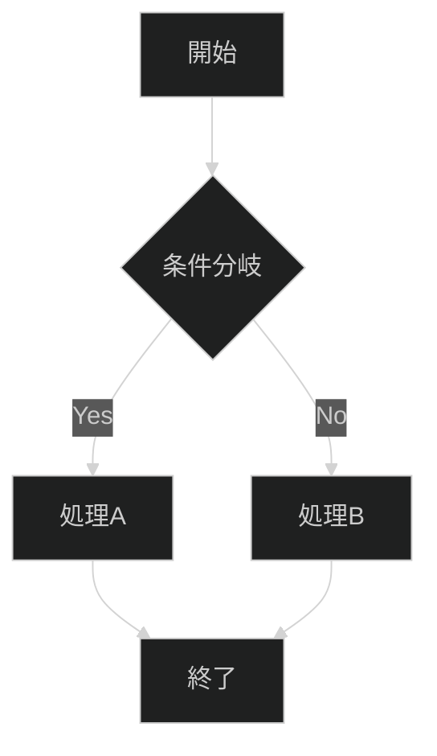
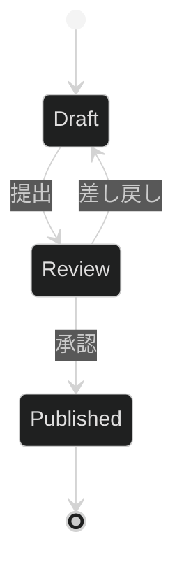
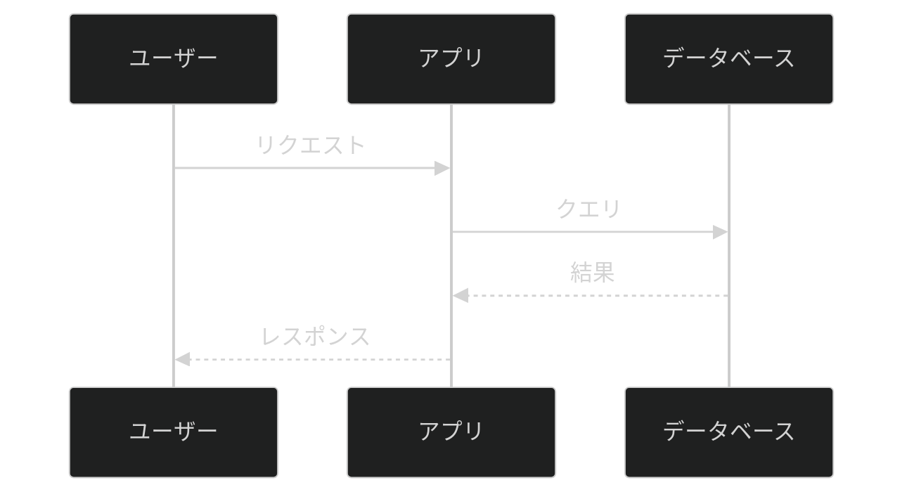

# Mermaidで図を作成する

## 学習目標

このチュートリアルを完了すると、以下ができるようになります：

1. **フローチャート**でプロセスフローを可視化できる
2. **状態図**でシステム状態の遷移を表現できる
3. **シーケンス図**でコンポーネント間の通信を図示できる
4. **ダークモード対応**のスタイリングを適用できる

**所要時間**: 約15分

## 前提条件

- Markdownの基本知識
- テキストエディタ（VS Code推奨）

## ステップ1: ダークモード設定（2分）

すべてのMermaid図に共通する設定から始めます。

### 基本設定

```markdown
%%{init: {'theme': 'dark'}}%%
```

この1行を図の先頭に追加することで、ダークモードに対応した配色になります。

### 詳細設定（オプション）

より細かいカスタマイズが必要な場合：

```markdown
%%{init: {'theme': 'dark', 'themeVariables': {'primaryBorderColor': '#1E1E2E', 'lineColor': '#89B4FA'}}}%%
```

**検証ポイント**: 設定を含めて図を作成し、背景が暗い色になることを確認してください。

## ステップ2: フローチャートの作成（5分）

フローチャートは最も汎用的な図タイプです。プロセスフロー、意思決定、ワークフローに使用します。

### 基本構文

```markdown
%%{init: {'theme': 'dark'}}%%
flowchart TD
    A[開始] --> B{条件分岐}
    B -->|Yes| C[処理A]
    B -->|No| D[処理B]
    C --> E[終了]
    D --> E
```

### 出力結果



### ノード形状の種類

| 構文 | 形状 | 用途 |
|------|------|------|
| `[テキスト]` | 四角形 | 一般的な処理 |
| `{テキスト}` | ひし形 | 条件分岐 |
| `([テキスト])` | 角丸四角形 | 開始/終了 |
| `[(テキスト)]` | 円筒形 | データベース |
| `((テキスト))` | 円形 | 接続点 |

### 方向指定

| 指定 | 意味 |
|------|------|
| `TD` / `TB` | 上から下 |
| `LR` | 左から右 |
| `RL` | 右から左 |
| `BT` | 下から上 |

### 実践演習

以下のドキュメント作成フローを図にしてみましょう：

```markdown
%%{init: {'theme': 'dark'}}%%
flowchart LR
    A([テンプレート選択]) --> B[内容作成]
    B --> C{品質チェック}
    C -->|OK| D([公開])
    C -->|NG| B
```

**検証ポイント**: 図が左から右に流れ、品質チェックNGでループすることを確認。

## ステップ3: 状態図の作成（4分）

状態図はシステムやオブジェクトの状態遷移を表現します。

### 基本構文

```markdown
%%{init: {'theme': 'dark'}}%%
stateDiagram-v2
    [*] --> Draft
    Draft --> Review: 提出
    Review --> Draft: 差し戻し
    Review --> Published: 承認
    Published --> [*]
```

### 出力結果



### 特殊記法

| 記法 | 意味 |
|------|------|
| `[*]` | 開始/終了状態 |
| `-->` | 遷移 |
| `--> : ラベル` | ラベル付き遷移 |

### 複合状態

```markdown
%%{init: {'theme': 'dark'}}%%
stateDiagram-v2
    state "編集中" as Editing {
        [*] --> Writing
        Writing --> Reviewing
        Reviewing --> Writing: 修正
        Reviewing --> [*]: 完了
    }

    [*] --> Editing
    Editing --> Published
    Published --> [*]
```

**検証ポイント**: ネストされた状態が表示され、内部の遷移が見えることを確認。

## ステップ4: シーケンス図の作成（4分）

シーケンス図はコンポーネント間の通信を時系列で表現します。

### 基本構文

```markdown
%%{init: {'theme': 'dark'}}%%
sequenceDiagram
    participant U as ユーザー
    participant A as アプリ
    participant D as データベース

    U->>A: リクエスト
    A->>D: クエリ
    D-->>A: 結果
    A-->>U: レスポンス
```

### 出力結果



### 矢印の種類

| 構文 | 意味 |
|------|------|
| `->>` | 同期メッセージ（実線、塗り矢印） |
| `-->>` | 応答メッセージ（点線、塗り矢印） |
| `-x` | 非同期メッセージ |
| `-)` | 非同期応答 |

### 高度な機能

```markdown
%%{init: {'theme': 'dark'}}%%
sequenceDiagram
    participant C as クライアント
    participant S as サーバー

    C->>S: 認証リクエスト

    alt 認証成功
        S-->>C: トークン発行
    else 認証失敗
        S-->>C: エラー
    end

    Note over C,S: セッション確立
```

**検証ポイント**: `alt/else/end`で分岐が表示され、`Note`が両者の間に表示されることを確認。

## まとめ

### 学んだこと

| 図タイプ | 用途 | キーワード |
|----------|------|-----------|
| フローチャート | プロセス、ワークフロー | `flowchart` |
| 状態図 | 状態遷移 | `stateDiagram-v2` |
| シーケンス図 | 通信フロー | `sequenceDiagram` |

### ダークモード設定

すべての図に以下を追加：

```markdown
%%{init: {'theme': 'dark'}}%%
```

### よくあるエラー

| エラー | 原因 | 解決策 |
|--------|------|--------|
| 図が表示されない | 構文エラー | 括弧の対応を確認 |
| 文字化け | 特殊文字 | 引用符で囲む `["テキスト (注釈)"]` |
| レイアウト崩れ | 予約語使用 | `end`を小文字で使わない |

## 次のステップ

- [リファレンス: Mermaid仕様](../04-reference/README.md) - 全構文の詳細
- [ハウツー: Diátaxis分類](../03-how-to/03-diataxis-categorization.md) - 図を含むドキュメントの配置

## 関連リンク

- [Mermaid公式ドキュメント](https://mermaid.js.org/intro/)
- [Mermaid Live Editor](https://mermaid.live/)
