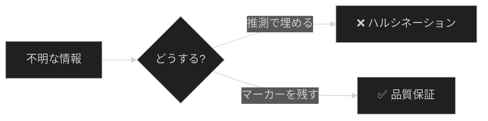

# ギャップマーカーで品質管理

## 学習目標

このチュートリアルを完了すると、以下ができるようになります：

1. **8種類のギャップマーカー**を適切に使い分けられる
2. **マーカーを検索**してレポートを生成できる
3. **優先度に基づいて**ギャップを解消できる
4. **反ハルシネーション原則**を実践できる

**所要時間**: 約15分

## 前提条件

- Markdownの基本知識
- コマンドライン操作（grep）の基礎

## ステップ1: ギャップマーカーとは（2分）

### 概念

ギャップマーカーは、ドキュメント内の「不完全」「未検証」「要確認」な箇所を明示的にマークするための規約です。

**重要な原則**: 推測で埋めるのではなく、マーカーを残すことで品質を保証します。

```
不完全でも正確 > 完全だが不正確
```

### なぜ必要か



**検証ポイント**: この原則を理解することが、以降のステップの基礎になります。

## ステップ2: 8種類のマーカーを覚える（5分）

### マーカー一覧

| マーカー | 優先度 | 用途 |
|----------|--------|------|
| `[TODOCS: 説明]` | HIGH | 未完成セクション |
| `[NEEDS_EXAMPLE: 説明]` | HIGH | コード例が必要 |
| `[NEEDS_VERIFICATION: 説明]` | MEDIUM | 未検証の主張 |
| `[INCOMPLETE: 説明]` | MEDIUM | 情報不足 |
| `[OUTDATED: 説明]` | MEDIUM | 古い可能性 |
| `[SME_NEEDED: 説明]` | LOW | 専門家レビュー必要 |
| `[LINK_NEEDED: 説明]` | LOW | リンクが必要 |
| `[ASSUMPTION: 説明]` | INFO | 仮定に基づく記述 |

### 使用例

#### HIGH優先度

```markdown
## メッシュ生成

[TODOCS: メッシュ生成の詳細手順を記述する]

デフォルト設定は以下の通りです：

[NEEDS_EXAMPLE: iRIC Nays2DFloodでのメッシュ設定コード例]
```

#### MEDIUM優先度

```markdown
最小メッシュサイズは通常 0.5m に設定されます。

[NEEDS_VERIFICATION: デフォルト値がバージョンによって異なる可能性]

このAPIは2024年に非推奨になりました。

[OUTDATED: 最新の代替APIを確認する]
```

#### LOW優先度 / INFO

```markdown
詳細は境界条件リファレンスを参照してください。

[LINK_NEEDED: ../04-reference/boundary-conditions.md]

CFDの計算精度は通常10^-6程度と仮定しています。

[ASSUMPTION: プロジェクト要件に応じて調整が必要]
```

**検証ポイント**: 各マーカーの用途の違いを理解できましたか？

## ステップ3: マーカーを挿入する（3分）

### 実践演習

以下の不完全なドキュメントにマーカーを挿入してみましょう：

**Before（マーカーなし）**:
```markdown
## シミュレーション設定

時間ステップは適切な値に設定します。

境界条件の詳細は別ドキュメントを参照。

この設定は最新バージョンで動作確認済み。
```

**After（マーカーあり）**:
```markdown
## シミュレーション設定

時間ステップは適切な値に設定します。

[NEEDS_EXAMPLE: 具体的な時間ステップ値とその選定基準]

境界条件の詳細は別ドキュメントを参照。

[LINK_NEEDED: 境界条件リファレンスへのリンク]

この設定は最新バージョンで動作確認済み。

[NEEDS_VERIFICATION: バージョン番号と確認日を明記する]
```

**検証ポイント**: 3つのマーカーが適切に挿入されていることを確認。

## ステップ4: マーカーを検索する（3分）

### 基本検索コマンド

すべてのマーカーを検索：

```bash
grep -rn "\[TODOCS:\|\[NEEDS_EXAMPLE:\|\[NEEDS_VERIFICATION:\|\[INCOMPLETE:\|\[SME_NEEDED:\|\[ASSUMPTION:\|\[OUTDATED:\|\[LINK_NEEDED:" docs/
```

### 優先度別検索

**HIGH優先度のみ**:
```bash
grep -rn "\[TODOCS:\|\[NEEDS_EXAMPLE:" docs/
```

**MEDIUM優先度のみ**:
```bash
grep -rn "\[NEEDS_VERIFICATION:\|\[INCOMPLETE:\|\[OUTDATED:" docs/
```

### カウント

マーカー数を数える：

```bash
grep -rc "\[TODOCS:" docs/ | grep -v ":0$"
```

### 出力例

```
docs/01_knowledge/02-tutorials/sample.md:15:[TODOCS: 手順の詳細を追加]
docs/01_knowledge/03-how-to/guide.md:42:[NEEDS_EXAMPLE: コード例を追加]
docs/02_operations/runbooks/deploy.md:8:[NEEDS_VERIFICATION: 手順を検証]
```

**検証ポイント**: 実際にコマンドを実行し、プロジェクト内のマーカーを確認してみましょう。

## ステップ5: レポートを生成する（2分）

### 簡易レポート生成

```bash
echo "# ギャップマーカーレポート"
echo ""
echo "## HIGH優先度"
grep -rn "\[TODOCS:\|\[NEEDS_EXAMPLE:" docs/ 2>/dev/null || echo "なし"
echo ""
echo "## MEDIUM優先度"
grep -rn "\[NEEDS_VERIFICATION:\|\[INCOMPLETE:\|\[OUTDATED:" docs/ 2>/dev/null || echo "なし"
echo ""
echo "## LOW優先度"
grep -rn "\[SME_NEEDED:\|\[LINK_NEEDED:" docs/ 2>/dev/null || echo "なし"
```

### 自動化（オプション）

定期的なレポート生成は品質検証エージェント（gap-detector）で自動化できます。

詳細: [品質検証の実行方法](../03-how-to/02-quality-verification.md)

**検証ポイント**: レポートが優先度別に整理されることを確認。

## まとめ

### 学んだこと

| 項目 | 内容 |
|------|------|
| マーカー種類 | 8種類（HIGH/MEDIUM/LOW/INFO） |
| 原則 | 推測より不完全でも正確に |
| 検索 | grep + 正規表現 |
| 優先度 | HIGH → MEDIUM → LOW の順で解消 |

### ベストプラクティス

1. **書く時**: 不明点は即座にマーカーを挿入
2. **レビュー時**: マーカーの妥当性を確認
3. **解消時**: HIGH優先度から着手
4. **残す時**: SME_NEEDED, ASSUMPTIONは意図的に残すことも

### よくある間違い

| 間違い | 正しい対応 |
|--------|-----------|
| 推測で埋める | マーカーを残す |
| マーカーを忘れる | 不明点は必ずマーク |
| 説明が曖昧 | 具体的に記述 |

## 次のステップ

- [リファレンス: ギャップマーカー仕様](../04-reference/01-GAP-MARKER-SPEC.md) - 詳細仕様
- [ハウツー: 品質検証の実行](../03-how-to/02-quality-verification.md) - 自動検証

## 関連リンク

- [反ハルシネーション原則](../01-concepts/00-project-vision.md#反ハルシネーション原則)
- [品質検証エージェント](../../02_operations/README.md)
