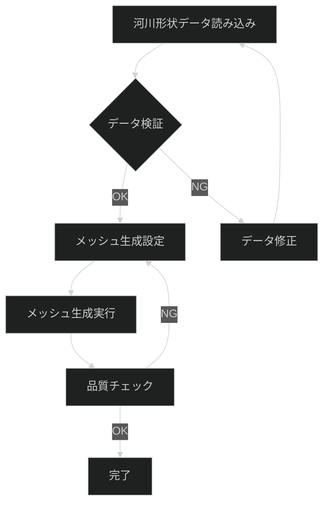

# テンプレートを使用してドキュメントを作成する方法

## 前提条件

このガイドを実行するには：

- 3docaフレームワークの基本構造（3軸構成）を理解していること
- Git操作の基本知識（ファイルのコピー、編集）
- [ギャップマーカー仕様](../04-reference/01-GAP-MARKER-SPEC.md)の理解（推奨）

## 目的

このガイドでは、`docs/_templates/`にあるテンプレートを使用して、各タイプのドキュメントを効率的に作成する手順を習得します。

## 手順概要


## 1. テンプレートの選択

### 1.1 ドキュメントタイプの決定

作成するドキュメントの目的に応じて、適切なテンプレートを選択します。

#### Diátaxis軸（`docs/01_knowledge/`）

| テンプレート | 用途 | 使用場面 |
|-------------|------|---------|
| `01-concepts.md` | 概念・説明 | 設計思想、理論、背景を説明したいとき |
| `02-tutorials.md` | チュートリアル | 学習者向けの手順（15分で完了する内容） |
| `03-how-to.md` | ハウツー | 特定タスクの実行手順 |
| `04-reference.md` | リファレンス | 仕様、パラメータ、エラーコード一覧 |

#### 運用軸（`docs/02_operations/`）

| テンプレート | 用途 | 使用場面 |
|-------------|------|---------|
| `process-template.md` | プロセス定義 | ワークフロー全体を文書化 |
| `playbook-template.md` | プレイブック | 障害対応、トラブルシューティング |
| `runbook-template.md` | ランブック | 定常作業の手順書 |
| `cheatsheet-template.md` | チートシート | クイックリファレンス |

#### C4軸（`docs/03_architecture/`）

| テンプレート | 用途 | 使用場面 |
|-------------|------|---------|
| [`01-context.md`](../../_templates/03_architecture/01-context.md) | Context (Level 1) | システム全体と外部との関係 |
| [`02-container.md`](../../_templates/03_architecture/02-container.md) | Container (Level 2) | 主要な技術コンポーネント |
| [`03-component.md`](../../_templates/03_architecture/03-component.md) | Component (Level 3) | 内部構造の詳細 |

**実装方式**: Mermaidの `flowchart + subgraph` を使用したC4ダイアグラム。テンプレートにはダークモード対応の設定が含まれています。

### 1.2 テンプレートの場所

すべてのテンプレートは以下に配置されています：

```bash
docs/_templates/
├── 01_knowledge/
│   ├── 01-concept.md
│   ├── 02-tutorial.md
│   ├── 03-how-to.md
│   └── 04-reference.md
├── 02_operations/
│   ├── 01-process.md
│   ├── 02-playbook.md
│   ├── 03-runbook.md
│   └── 04-cheatsheet.md
└── 03_architecture/
    ├── 01-context.md
    ├── 02-container.md
    └── 03-component.md
```

## 2. ファイルのコピー

### 2.1 配置先フォルダの決定

ドキュメントタイプに応じて配置先を選択：

```bash
# Diátaxis軸の例
docs/01_knowledge/01-concepts/    # 概念・説明
docs/01_knowledge/02-tutorials/   # チュートリアル
docs/01_knowledge/03-how-to/      # ハウツー
docs/01_knowledge/04-reference/   # リファレンス

# 運用軸の例
docs/02_operations/01-processes/     # プロセス
docs/02_operations/02-playbooks/     # プレイブック
docs/02_operations/03-runbooks/      # ランブック
docs/02_operations/cheatsheets/   # チートシート
```

### 2.2 テンプレートをコピー

```bash
# 例: ハウツーガイドを作成
cp docs/_templates/01_knowledge/03-how-to.md \
   docs/01_knowledge/03-how-to/my-task-guide.md

# 例: プレイブックを作成
cp docs/_templates/02_operations/playbook-template.md \
   docs/02_operations/02-playbooks/data-quality-issue.md
```

**命名規則**:
- 小文字とハイフン区切り（`my-task-guide.md`）
- 連番を使用する場合は2桁（`01-getting-started.md`）
- 拡張子は`.md`

## 3. フロントマターの編集

### 3.1 必須フィールドの編集

コピーしたファイルを開き、フロントマター（`---`で囲まれた部分）を編集します。

```yaml
---
title: "メッシュ品質を検証する方法"  # 実際のタイトルに変更
type: how-to                   # テンプレートに応じて設定済み
category: "mesh-quality"       # 例: "simulation", "data-processing"
tags: [mesh, quality, validation, cfd]  # 関連タグを追加
audience: intermediate         # beginner/intermediate/advanced
summary: |                     # 2-3文の具体的な要約
  CFDシミュレーション用メッシュの品質を検証する手順を説明します。
  メッシュの歪み、アスペクト比、直交性などの品質指標を確認し、計算精度を確保します。
keywords:                      # 検索キーワード追加
  - mesh quality
  - validation
  - aspect ratio
  - orthogonality
prerequisites:                 # 前提ドキュメントへのリンク
  - ../04-reference/01-GAP-MARKER-SPEC.md
  - ../04-reference/04-FRONTMATTER-REFERENCE.md
related:                       # 関連ドキュメントへのリンク
  - ../03-how-to/mesh-generation-guide.md
  - ../04-reference/mesh-quality-criteria.md
version: "1.0.0"               # そのまま
status: draft                  # draft → review → published
created: "2025-12-10"          # 今日の日付
updated: "2025-12-10"          # 今日の日付
---
```

### 3.2 フロントマター編集例

**変更前**:
```yaml
---
title: "[TODOCS: 〜する方法]"
category: "[TODOCS: カテゴリ]"
tags: []
summary: |
  [TODOCS: このガイドで達成できるタスクの説明]
created: "[TODOCS: YYYY-MM-DD]"
---
```

**変更後**:
```yaml
---
title: "iRICでメッシュを生成する方法"
category: "simulation"
tags: [mesh, iric, nays2dflood, cfd]
summary: |
  iRIC Nays2DFloodでメッシュを生成する手順を説明します。
  河川形状データから計算用メッシュを作成し、品質検証まで行います。
created: "2025-12-10"
updated: "2025-12-10"
---
```

### 3.3 タイプ別追加フィールド

#### チュートリアルの場合

```yaml
estimated_time: "15分"
difficulty: beginner
prerequisites:
  - ../04-reference/iric-installation.md
```

#### プレイブックの場合

```yaml
severity: high
triggers:
  - "シミュレーションが収束しない"
  - "計算結果が物理的に不合理"
owner: "CFDチーム"
last_tested: "2025-12-10"
```

詳細は[フロントマターリファレンス](../04-reference/04-FRONTMATTER-REFERENCE.md)を参照してください。

## 4. コンテンツの作成

### 4.1 セクション構造の維持

テンプレートの基本構造を維持しながら、`[TODOCS:]`マーカー部分を埋めていきます。

```markdown
## 前提条件

このガイドを実行するには：

- iRIC 4.0以降がインストールされていること
- Nays2DFloodソルバーが利用可能であること
- 河川形状データ（地形データ、境界条件データ）が準備されていること
- メッシュ生成に関する基礎知識（推奨：チュートリアル完了済み）
```

### 4.2 コード例の追加

`[NEEDS_EXAMPLE:]`マーカーがある箇所にコード例を追加します。

```bash
# 変更前
# [このセクションは具体的なコマンド例で置き換える]

# 変更後（具体例）
# テンプレートファイルを目的のディレクトリにコピー
cp docs/_templates/01_knowledge/03-how-to.md \
   docs/01_knowledge/03-how-to/mesh-quality-validation.md

# エディタで開いてフロントマターを編集
vim docs/01_knowledge/03-how-to/mesh-quality-validation.md
```

### 4.3 Mermaid図の活用

ワークフローや手順は視覚化します。



**ダークモード必須**: 必ず`%%{init: {'theme': 'dark'}}%%`を追加してください。

## 5. ギャップマーカーの配置

### 5.1 ギャップマーカーの基本

不完全・未検証・要確認の情報には**必ず**ギャップマーカーを配置します。

**推測で埋めない！** 不明な点はマーカーで明示します。

| マーカー | 優先度 | 使用場面 |
|----------|--------|---------|
| `[TODOCS: 説明]` | HIGH | 未完成セクション |
| `[NEEDS_EXAMPLE: 説明]` | HIGH | コード例が必要 |
| `[NEEDS_VERIFICATION: 説明]` | MEDIUM | 未検証の主張 |
| `[INCOMPLETE: 説明]` | MEDIUM | 情報不足 |
| `[LINK_NEEDED: 説明]` | LOW | リンクが必要 |
| `[ASSUMPTION: 説明]` | INFO | 仮定に基づく記述 |

詳細は[ギャップマーカー仕様](../04-reference/01-GAP-MARKER-SPEC.md)を参照してください。

### 5.2 マーカー配置例

```markdown
## メッシュ生成パラメータ

最小メッシュサイズは通常 [NEEDS_VERIFICATION: デフォルト値を公式ドキュメントで確認必要] に設定されます。

**メッシュ設定画面での操作例**:
iRIC Nays2DFloodのメッシュ設定画面で、以下のパラメータを指定します：
- 格子サイズ: 河川幅の1/20〜1/10（推奨）
- 境界適合: ON（河岸形状に沿う）
- 品質チェック: 自動実行

詳細なパラメータ説明は [メッシュパラメータリファレンス](../04-reference/mesh-parameters.md) を参照してください。
```

### 5.3 マーカーの解消

ドキュメントをレビュー・公開する前に、**HIGH優先度**のマーカーを解消します。

```bash
# HIGH優先度マーカーの検索
grep -rn "\[TODOCS:\|\[NEEDS_EXAMPLE:" docs/01_knowledge/03-how-to/my-task-guide.md
```

## 6. 結果の確認

### 6.1 チェックリストによる検証

テンプレートの末尾にある検証チェックリストを確認します。

**ハウツーガイドのチェックリスト例**:
```markdown
<!-- 検証チェックリスト（作成完了時に確認）
□ タイトルが「〜する方法」形式か
□ 前提条件が明確か
□ 1ドキュメント1タスクになっているか
□ 手順は実行可能か
□ 結果の確認方法があるか
□ トラブルシューティングがあるか
□ 運用ドキュメントへの遷移リンクがあるか
-->
```

### 6.2 フロントマターの検証

```bash
# YAMLシンタックスチェック（Python使用）
python3 -c "import yaml; yaml.safe_load(open('docs/01_knowledge/03-how-to/my-task-guide.md').read().split('---')[1])"
```

期待される結果：エラーなし（何も表示されない）

### 6.3 リンクの検証

```bash
# 内部リンクの確認
# markdownlint-cli2を使用してリンク検証を実行
npx markdownlint-cli2 "docs/01_knowledge/03-how-to/my-task-guide.md"

# または、手動でリンク先の存在確認
grep -o '\](\.\./' docs/01_knowledge/03-how-to/my-task-guide.md | \
  sed 's/](\.\.\///' | while read -r link; do
    target="docs/01_knowledge/03-how-to/../$link"
    if [ -f "$target" ]; then
      echo "✓ $link"
    else
      echo "✗ $link (not found)"
    fi
  done
```

リンク検証には `markdownlint-cli2` を使用することを推奨します。`npx markdownlint-cli2 "docs/**/*.md"` で実行可能です。

### 6.4 ギャップマーカー数の確認

```bash
# ドキュメント内のギャップマーカー数をカウント
for marker in TODOCS NEEDS_EXAMPLE NEEDS_VERIFICATION INCOMPLETE LINK_NEEDED; do
  count=$(grep -c "\[$marker:" docs/01_knowledge/03-how-to/my-task-guide.md 2>/dev/null || echo 0)
  echo "$marker: $count"
done
```

**公開前の目標**:
- HIGH優先度（TODOCS, NEEDS_EXAMPLE）: 0個
- MEDIUM優先度（NEEDS_VERIFICATION, INCOMPLETE）: 可能な限り少なく

## バリエーション

### バリエーション1: 既存ドキュメントからの変換

既存のドキュメントを3docaフレームワークに移行する場合：

1. テンプレートをコピー
2. フロントマターを新規作成
3. 既存コンテンツをコピー&ペースト
4. セクション構造をテンプレートに合わせて調整
5. ギャップマーカーを配置（不確実な情報に）

```bash
# 既存ドキュメントのバックアップ
cp old-docs/mesh-guide.md old-docs/mesh-guide.md.bak

# テンプレートベースで再作成
cp docs/_templates/01_knowledge/03-how-to.md \
   docs/01_knowledge/03-how-to/mesh-generation.md

# 既存コンテンツを参照しながら編集
# エディタで old-docs/mesh-guide.md と新ファイルを並べて表示
```

### バリエーション2: 複数人での共同作成

複数人で分担してドキュメントを作成する場合：

1. テンプレートをコピー
2. フロントマター + セクション見出しのみを作成
3. 各セクションに担当者名とギャップマーカーを配置
4. 各担当者が自分のセクションを埋める

```markdown
## メッシュ生成手順

[TODOCS: 担当: 山田太郎, 期限: 2025-02-28]

## 品質検証手順

[TODOCS: 担当: 鈴木花子, 期限: 2025-02-28]
```

## トラブルシューティング

| 症状 | 原因 | 対処法 |
|------|------|--------|
| フロントマターのYAMLエラー | インデント不正、コロン後のスペース不足 | YAMLシンタックスチェックを実行し、エラー行を修正 |
| Mermaid図が表示されない | 構文エラー、ダークモード指定忘れ | `%%{init: {'theme': 'dark'}}%%`を追加、Mermaid構文を検証 |
| テンプレートが見つからない | パス指定ミス | `docs/_templates/`直下を確認、`find docs/_templates -name "*.md"`で検索 |
| ギャップマーカーをどこに置くべきか不明 | マーカー仕様の理解不足 | [ギャップマーカー仕様](../04-reference/01-GAP-MARKER-SPEC.md)を参照 |
| リンクが404になる | 相対パスの間違い、ファイル名の間違い | `ls`でファイル存在確認、相対パス計算を見直す |

詳細なトラブルシューティングは[ドキュメント作成プレイブック](../../02_operations/02-playbooks/documentation-issues.md)を参照してください。

## 関連ドキュメント

- **概念理解**: [ティア設計仕様](../04-reference/02-TIER-DESIGN-SPEC.md) - テンプレートの設計思想
- **仕様**: [ギャップマーカー仕様](../04-reference/01-GAP-MARKER-SPEC.md) - マーカーの使い方
- **仕様**: [フロントマターリファレンス](../04-reference/04-FRONTMATTER-REFERENCE.md) - フロントマターの詳細
- **ガイド**: [ドキュメント移行ガイド](../03-how-to/migration-guide.md) - 既存ドキュメントの移行方法

---

<!-- 検証チェックリスト（作成完了時に確認）
✅ タイトルが「〜する方法」形式か
✅ 前提条件が明確か
✅ 1ドキュメント1タスクになっているか（テンプレート使用方法に特化）
✅ 手順は実行可能か（6つのステップで構成）
✅ 結果の確認方法があるか（セクション6で提供）
✅ トラブルシューティングがあるか
✅ 運用ドキュメントへの遷移リンクがあるか
-->
