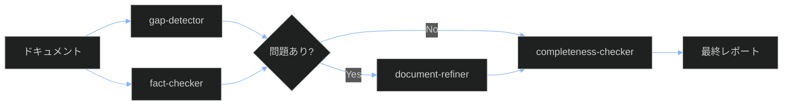

# 品質検証を実行する

## 目的

ドキュメントの品質を自動検証し、問題を早期に発見・修正する。

## 前提条件

- [テンプレート使用ガイド](./01-template-usage-guide.md)を完了していること
- Claude Code環境が設定されていること
- 検証対象のドキュメントが`docs/`配下に存在すること

## 検証フローの概要



## 検証エージェントの役割

| エージェント | 役割 | 権限 |
|-------------|------|------|
| gap-detector | ギャップマーカー・リンク検証 | 読み取りのみ |
| fact-checker | 技術的正確性検証 | 読み取りのみ |
| completeness-checker | 体系全体の完全性評価 | 読み取りのみ |
| document-refiner | 問題の修正 | **書き込み可能** |

## 手順1: gap-detectorの実行

### 目的

- ギャップマーカーの検出とカウント
- 内部リンクの有効性確認
- Mermaid図の構文検証

### 実行方法

Claude Codeで以下のようにリクエスト：

```
gap-detectorサブエージェントを起動して、docs/配下のギャップマーカーを検出してください。
結果をreports/01-gap-reports/に出力してください。
```

### 出力例

```markdown
# ギャップ検出レポート

## サマリー
- ギャップマーカー: 15個
- 無効リンク: 2個
- Mermaid構文エラー: 0個

## 詳細
### HIGH優先度
- docs/tutorials/sample.md:15 - [TODOCS: 手順追加]
...
```

### 結果の解釈

| 指標 | 良好 | 要注意 | 要対応 |
|------|------|--------|--------|
| ギャップマーカー | 0-10個 | 11-50個 | 51個以上 |
| 無効リンク | 0個 | 1-5個 | 6個以上 |
| Mermaid構文エラー | 0個 | - | 1個以上 |

## 手順2: fact-checkerの実行

### 目的

- 技術的主張の正確性確認
- コード例の動作検証
- バージョン情報の妥当性確認

### 実行方法

```
fact-checkerサブエージェントを起動して、docs/配下の技術的正確性を検証してください。
結果をreports/02-fact-check-reports/に出力してください。
```

### チェック項目

1. **コード例**: 構文的に正しいか
2. **コマンド**: 実行可能か
3. **パス参照**: 存在するか
4. **バージョン**: 最新か、明記されているか

### 結果の解釈

| 評価 | 意味 | アクション |
|------|------|-----------|
| ✅ 正確 | 問題なし | なし |
| ⚠️ 要確認 | 軽微な問題 | レビュー |
| ❌ 不正確 | 重大な問題 | 即時修正 |

## 手順3: 問題の修正（必要な場合）

### document-refinerの実行

gap-detectorまたはfact-checkerで問題が検出された場合：

```
document-refinerサブエージェントを起動して、検出された問題を修正してください。
- 入力: reports/01-gap-reports/latest.md
- 対象: docs/配下の該当ファイル
```

### 修正の原則

1. **最小限の変更**: 問題箇所のみ修正
2. **マーカー解消**: 根拠がある場合のみ解消
3. **新規マーカー**: 調査で新たな不明点が見つかれば追加

## 手順4: completeness-checkerの実行

### 目的

- Diátaxis軸の完全性評価
- 運用軸の完全性評価
- C4軸の完全性評価
- 全体スコアの算出

### 実行方法

```
completeness-checkerサブエージェントを起動して、docs/配下全体の完全性を検証してください。
結果をreports/03-completeness-reports/に出力してください。
```

### スコアリング基準

| 軸 | 評価項目 | 配点 |
|---|----------|------|
| Diátaxis | concepts, tutorials, how-to, reference | 40点 |
| 運用 | processes, playbooks, runbooks, cheatsheets | 30点 |
| C4 | context, containers, components | 20点 |
| リンク整合性 | 内部リンク有効率 | 10点 |

### 目標スコア

| スコア | 評価 |
|--------|------|
| 80-100 | 優秀 - リリース可能 |
| 60-79 | 良好 - 軽微な改善推奨 |
| 40-59 | 要改善 - 主要ギャップあり |
| 0-39 | 不十分 - 大幅な追加必要 |

## トラブルシューティング

### エージェントが起動しない

**原因**: Claude Code環境の問題

**解決策**:
1. セッションを再起動
2. `claude mcp list`で接続確認
3. Serenaプロジェクトをアクティベート

### レポートが生成されない

**原因**: 出力ディレクトリが存在しない

**解決策**:
```bash
mkdir -p reports/{01-gap-reports,02-fact-check-reports,03-completeness-reports,04-refine-reports}
```

### 検証に時間がかかる

**原因**: 対象ファイルが多すぎる

**解決策**:
- ディレクトリを絞って実行: `docs/01_knowledge/02-tutorials/`のみ
- 変更ファイルのみ検証

### スコアが低い

**原因**: コンテンツ不足（意図的な場合あり）

**解決策**:
- ギャップマーカー（TODOCS）は段階的拡充を示す
- LOW優先度マーカー（SME_NEEDED, LINK_NEEDED）は残して良い
- HIGH優先度から順に解消

## 自動化（オプション）

### Git hookとの連携

pre-commitフックでgap-detectorを実行：

```bash
#!/bin/bash
# .git/hooks/pre-commit

# HIGH優先度マーカーがあればコミット中止
if grep -r "\[TODOCS:\|\[NEEDS_EXAMPLE:" docs/; then
    echo "ERROR: HIGH優先度のギャップマーカーがあります"
    exit 1
fi
```

### CI/CDパイプライン

GitHub Actionsでの自動検証：

```yaml
- name: Quality Check
  run: |
    grep -rc "\[TODOCS:" docs/ | grep -v ":0$" && exit 1 || exit 0
```

## 次のステップ

- [プロセス: 品質レビューフロー](../../02_operations/01-processes/README.md)
- [リファレンス: ギャップマーカー仕様](../04-reference/01-GAP-MARKER-SPEC.md)

## 関連リンク

- [検証エージェント定義](.claude/agents/)
- [レポート出力先](../../reports/)
