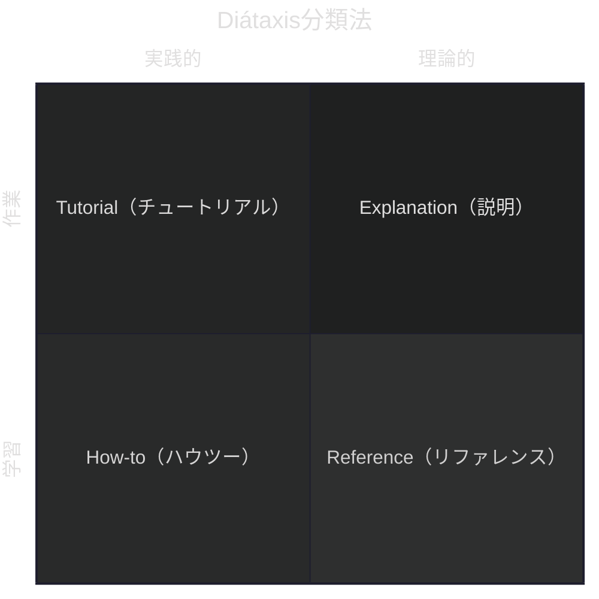
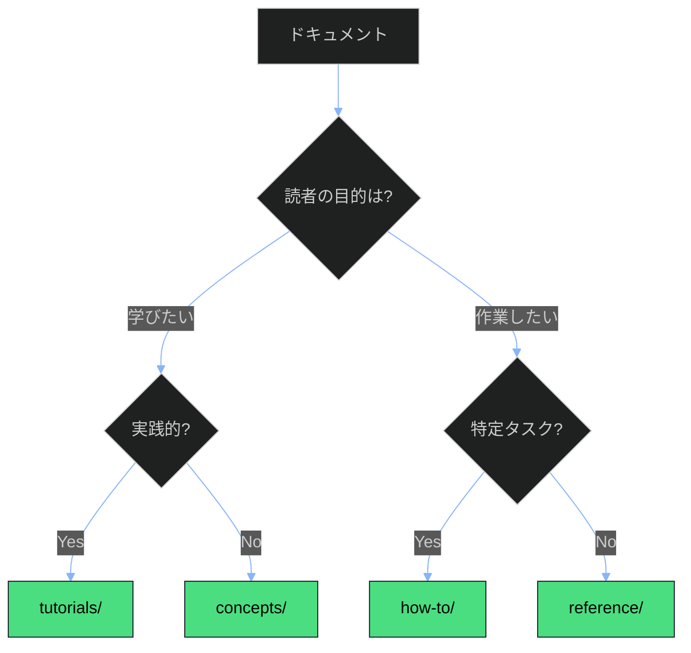

# Diátaxis分類法でコンテンツを整理する

## 目的

ドキュメントをDiátaxis分類法に基づいて適切なカテゴリに配置し、ユーザーが必要な情報に素早くアクセスできるようにする。

## 前提条件

- [プロジェクトビジョン](../01-concepts/00-project-vision.md)を読んでいること
- ドキュメントフレームワークの構造を理解していること

## Diátaxis分類法の概要



### 4つのカテゴリ

| カテゴリ | 目的 | 対象読者 | キーワード |
|----------|------|----------|-----------|
| **concepts** | 理解を深める | 背景を知りたい人 | なぜ、何、概念 |
| **tutorials** | 学習させる | 初心者 | 学ぶ、始める、最初の |
| **how-to** | 問題を解決する | 経験者 | 方法、手順、〜するには |
| **reference** | 情報を提供する | 詳細を確認したい人 | 仕様、一覧、API |

## 分類デシジョンツリー



## 判定基準の詳細

### concepts/（説明）に分類する場合

**特徴**:
- 「なぜ」「何」を説明している
- 背景や設計意図を述べている
- 具体的な手順がない

**例**:
- アーキテクチャの設計思想
- フレームワークの概念説明
- ベストプラクティスの背景

**判定質問**:
> このドキュメントを読んだ後、読者は「理解」が深まるか？

### tutorials/（チュートリアル）に分類する場合

**特徴**:
- 最初から最後まで手順がある
- 成功体験を提供する
- 前提知識を最小限に抑えている

**例**:
- 初めての〇〇
- 〇〇入門
- クイックスタート

**判定質問**:
> このドキュメントを最後まで実行すると、読者は「できた！」と感じるか？

### how-to/（ハウツー）に分類する場合

**特徴**:
- 特定の問題を解決する
- 前提条件がある
- 1ドキュメント1タスク

**例**:
- 〇〇の設定方法
- 〇〇を〇〇するには
- トラブルシューティング

**判定質問**:
> このドキュメントは特定の「タスク」を完了させることが目的か？

### reference/（リファレンス）に分類する場合

**特徴**:
- 網羅的な情報
- 検索しやすい構造
- 手順ではなく仕様

**例**:
- API仕様
- 設定パラメータ一覧
- エラーコード一覧

**判定質問**:
> このドキュメントは「参照」するために使われるか？

## よくある分類ミスと修正

### ミス1: チュートリアルとハウツーの混同

**誤り**: 「APIの使い方」をtutorials/に配置

**正しい配置**:
- tutorials/: 「初めてのAPI呼び出し」（学習目的）
- how-to/: 「認証エラーを解決する」（タスク目的）
- reference/: 「APIエンドポイント一覧」（参照目的）

### ミス2: 概念説明をリファレンスに配置

**誤り**: 「アーキテクチャ概要」をreference/に配置

**理由**: リファレンスは「仕様」であり「説明」ではない

**正しい配置**: concepts/

### ミス3: 複数目的を1ドキュメントに

**誤り**: 「〇〇完全ガイド」に概念説明、チュートリアル、リファレンスを混在

**解決策**: 分割する

```
❌ complete-guide.md (1ファイルに全部)

✅ concepts/overview.md (概念)
✅ tutorials/quickstart.md (入門)
✅ how-to/common-tasks.md (タスク)
✅ reference/specification.md (仕様)
```

## 分類の実践手順

### 手順1: 既存ドキュメントの棚卸し

```bash
# ファイル一覧を取得
find docs/ -name "*.md" -type f > doc-inventory.txt
```

### 手順2: 各ドキュメントを判定

デシジョンツリーに従って分類：

| ファイル | 現在地 | 判定結果 | 移動先 |
|----------|--------|----------|--------|
| guide.md | docs/ | タスク指向 | how-to/ |
| intro.md | docs/ | 学習指向 | tutorials/ |
| spec.md | docs/ | 参照用 | reference/ |

### 手順3: ファイルを移動

```bash
# Git履歴を保持して移動
git mv docs/guide.md docs/01_knowledge/03-how-to/
git mv docs/intro.md docs/01_knowledge/02-tutorials/
git mv docs/spec.md docs/01_knowledge/04-reference/
```

### 手順4: リンクを更新

移動後、参照しているリンクを更新：

```bash
# 旧パスの参照を検索
grep -r "guide.md" docs/
```

### 手順5: READMEにリンクを追加

各カテゴリのREADME.mdに新規ドキュメントを追加。

## 分類チェックリスト

新規ドキュメント作成時：

- [ ] デシジョンツリーで分類を決定
- [ ] 適切なディレクトリに配置
- [ ] フロントマターのcategoryが正しい
- [ ] 親READMEにリンクを追加
- [ ] 関連ドキュメントからの相互リンク

既存ドキュメント整理時：

- [ ] 複数目的が混在していないか確認
- [ ] 混在している場合は分割を検討
- [ ] 移動後のリンク更新を忘れない

## トラブルシューティング

### どのカテゴリにも当てはまらない

**原因**: ドキュメントの目的が不明確

**解決策**:
1. 主目的を特定（最も強い要素）
2. 必要なら分割
3. 運用ドキュメント（02_operations/）の可能性も検討

### カテゴリ間で迷う

**チュートリアル vs ハウツー**:
- 「完走」が目的 → チュートリアル
- 「タスク完了」が目的 → ハウツー

**概念 vs リファレンス**:
- 「なぜ」を説明 → 概念
- 「何」を列挙 → リファレンス

## 次のステップ

- [チュートリアル: 初めてのドキュメント作成](../02-tutorials/01-first-document.md)
- [リファレンス: ティア設計仕様](../04-reference/02-TIER-DESIGN-SPEC.md)
- [プロセス: ドキュメント作成フロー](../../02_operations/01-processes/README.md)

## 関連リンク

- [Diátaxis公式サイト](https://diataxis.fr/)
- [プロジェクトビジョン](../01-concepts/00-project-vision.md)
