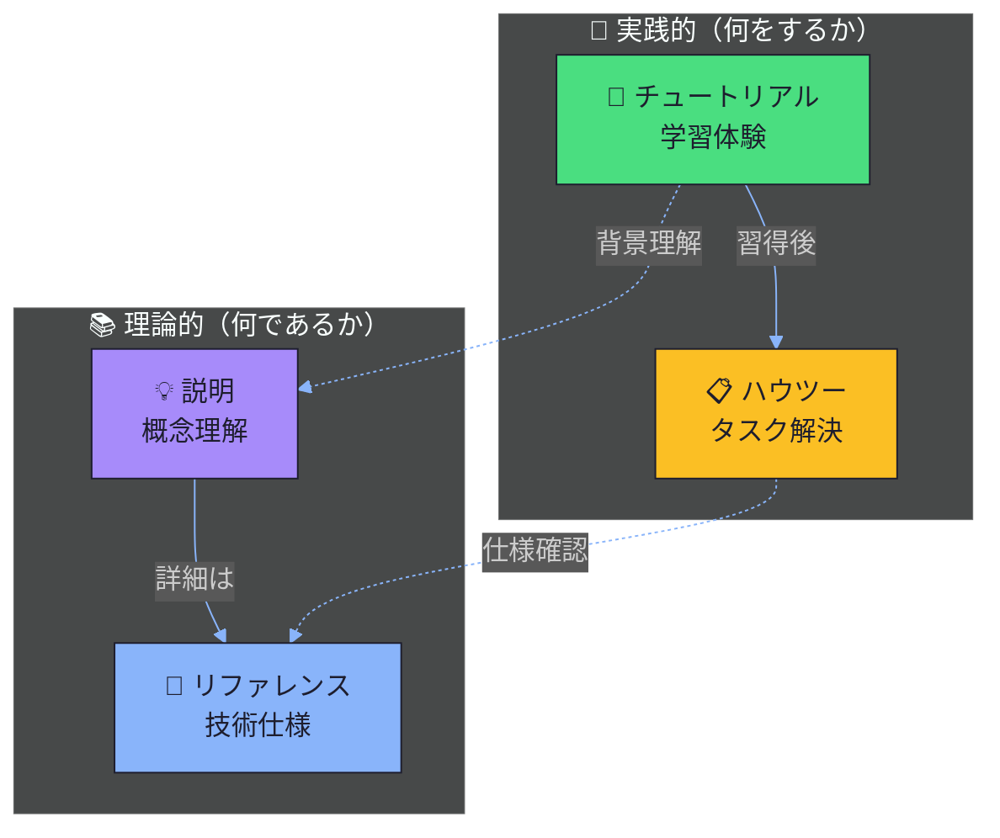

# 01_knowledge - Diátaxis軸（理解・習得）

Diátaxisフレームワークの4タイプに基づく知識習得のためのドキュメント体系。

## Diátaxisフレームワーク

| タイプ | 目的 | 読者の状態 | 対応フォルダ | ティア |
|--------|------|-----------|-------------|-------|
| **説明** | 概念理解の促進 | 「理解しようとしている」 | 01-concepts/ | Tier 4 |
| **チュートリアル** | 学習体験の提供 | 「学んでいる」 | 02-tutorials/ | Tier 1 |
| **ハウツー** | 特定タスクの解決 | 「やろうとしている」 | 03-how-to/ | Tier 2 |
| **リファレンス** | 技術仕様の提供 | 「調べている」 | 04-reference/ | Tier 3 |

## サブディレクトリ

### [01-concepts/](./01-concepts/README.md) - 説明（Tier 4）
- **目的**: 「なぜ」「何」に焦点を当てた概念説明
- **ビジュアル/テキスト比率**: 25/75
- **特徴**: 背景・理論・設計意図を説明
- **主要ドキュメント**: [3軸フレームワーク概念](./01-concepts/01-three-axis-framework.md)

### [02-tutorials/](./02-tutorials/README.md) - チュートリアル（Tier 1）
- **目的**: 15分以内に初回成功を体験させる
- **ビジュアル/テキスト比率**: 60/40
- **特徴**: 完走可能な手順、各ステップに検証ポイント
- **主要ドキュメント**: [初めてのドキュメント作成](./02-tutorials/01-first-document.md)

### [03-how-to/](./03-how-to/README.md) - ハウツー（Tier 2）
- **目的**: 特定タスクの完了方法を提供
- **ビジュアル/テキスト比率**: 40/60
- **特徴**: 前提条件明確、1ドキュメント1タスク
- **主要ドキュメント**: [テンプレート使用ガイド](./03-how-to/01-template-usage-guide.md)

### [04-reference/](./04-reference/README.md) - リファレンス（Tier 3）
- **目的**: 包括的なルックアップドキュメント
- **ビジュアル/テキスト比率**: 20/80
- **特徴**: 網羅性重視、検索・スキャン最適化
- **主要ドキュメント**:
  - [ギャップマーカー仕様](./04-reference/01-GAP-MARKER-SPEC.md)
  - [ティア設計仕様](./04-reference/02-TIER-DESIGN-SPEC.md)
  - [移行マップ](./04-reference/03-MIGRATION-MAP.md)
  - [フロントマターリファレンス](./04-reference/04-FRONTMATTER-REFERENCE.md)

## Diátaxisの4タイプの関係

Diátaxisは「学習/作業」と「理論/実践」の2軸で4象限に分類するフレームワークです。

| 分類 | 学習指向 | 作業指向 |
|------|----------|----------|
| **実践的** | チュートリアル | ハウツー |
| **理論的** | 説明（concepts） | リファレンス |

## このドキュメント群について

このディレクトリのドキュメントは、3docaフレームワークの**実例として機能**します。

### 自己言及的な実演

| ドキュメント | 説明していること | 実演していること |
|-------------|------------------|------------------|
| [プロジェクトビジョン](./01-concepts/00-project-vision.md) | フレームワークの目的 | concepts/の書き方 |
| [3軸フレームワーク](./01-concepts/01-three-axis-framework.md) | 3軸の使い分け | Mermaid図の使い方 |
| [初めてのドキュメント作成](./02-tutorials/01-first-document.md) | チュートリアルの作り方 | tutorials/の構造 |
| [ギャップマーカー仕様](./04-reference/01-GAP-MARKER-SPEC.md) | マーカーの使い方 | reference/のフォーマット |

### 使用例

**学習したい場合**:
1. [プロジェクトビジョン](./01-concepts/00-project-vision.md) で全体像を把握
2. [チュートリアル](./02-tutorials/01-first-document.md) で実際に手を動かす
3. [ハウツー](./03-how-to/01-template-usage-guide.md) で特定タスクを実行

**実務で参照したい場合**:
1. [リファレンス](./04-reference/) で仕様を確認
2. [運用軸](../02_operations/) で手順を実行

## 関連リンク

- [プロジェクトビジョン](./01-concepts/00-project-vision.md) - フレームワークの目的と設計思想
- [運用軸（02_operations）](../02_operations/README.md)
- [C4軸（03_architecture）](../03_architecture/README.md)
- [ティア設計仕様](./04-reference/02-TIER-DESIGN-SPEC.md)
