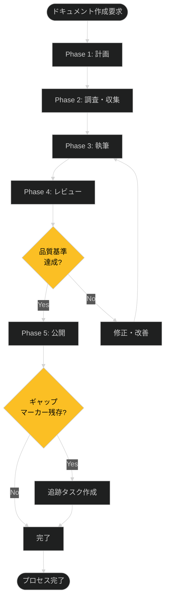

# 技術ドキュメント作成プロセス

## 概要

| 項目 | 内容 |
|------|------|
| **目的** | 技術ドキュメントを3軸構造で体系的に作成し、ギャップマーカーで品質を担保する |
| **オーナー** | Documentation Team |
| **実行頻度** | 随時（ドキュメント作成要求発生時） |
| **所要時間** | 2-8時間（ドキュメントタイプと複雑度による） |

## プロセスフロー



## 入力

| 入力項目 | 形式 | 提供元 | 備考 |
|----------|------|--------|------|
| ドキュメント作成要求 | Issue/Task | Product Owner, Engineers | 目的・対象読者を明記 |
| 既存ドキュメント | Markdown | リポジトリ | 参照・更新対象 |
| ソースコード/設定 | 各種ファイル | リポジトリ | 技術的根拠 |
| SME（専門家）の知見 | インタビュー/レビュー | Subject Matter Experts | [SME_NEEDED: 専門分野により要調整] |

## 出力

| 出力項目 | 形式 | 提供先 | 備考 |
|----------|------|--------|------|
| 技術ドキュメント | Markdown | docs/ディレクトリ | フロントマター付き |
| ギャップ追跡レポート | Markdown/Issue | Documentation Team | 未解決ギャップマーカー一覧 |
| レビューフィードバック | コメント/PR | 執筆者 | 改善アクション付き |

## 詳細手順

### Phase 1: 計画（Planning）

**目的**: ドキュメントタイプ・構造・スコープを決定

**担当**: Technical Writer, Documentation Lead

1. **要求分析**
   - 対象読者の特定（初心者/中級者/専門家）
   - ドキュメントの目的明確化（学習/リファレンス/トラブルシューティング）
   - 成功基準の定義

2. **ドキュメントタイプ選定**
   - Diátaxis軸: concepts/tutorials/how-to/reference
   - 運用軸: process../02-playboo../03-runbooks/cheatsheets
   - C4軸: context/containers/components

3. **テンプレート選択**
   - `docs/_templates/`から適切なテンプレートをコピー
   - フロントマターの必須項目を確認

**完了条件**:
- [ ] 対象読者とドキュメントタイプが明確
- [ ] テンプレートファイルが作成済み
- [ ] スコープ（含む/含まない）が定義済み

**実行手順**: [../../01_knowledge/03-how-to/README.md](../../01_knowledge/03-how-to/README.md)

---

### Phase 2: 調査・収集（Research & Gathering）

**目的**: 技術的根拠とコンテンツソースを収集

**担当**: Technical Writer

1. **既存ドキュメントの調査**
   - 関連ドキュメントの検索（`grep -r "keyword" docs/`）
   - 重複・矛盾の確認
   - 参照可能な既存コンテンツの特定

2. **技術的根拠の収集**
   - ソースコードの確認
   - 設定ファイル・APIドキュメントの参照
   - 実験・検証の実施（必要に応じて）

3. **SMEへのインタビュー**
   - 不明点・未検証項目のリスト作成
   - 専門家への質問・レビュー依頼
   - [SME_NEEDED: 特定分野の専門家が必要な場合は明示]

**完了条件**:
- [ ] 技術的根拠が収集済み（コード/ドキュメント/実験結果）
- [ ] SMEインタビューが完了（必要な場合）
- [ ] 不明点にギャップマーカーを配置

**判断基準**:

| 条件 | 次のアクション |
|------|----------------|
| すべての情報が検証済み | Phase 3へ進む |
| 一部未検証項目あり | ギャップマーカー配置してPhase 3へ |
| 重大な情報欠如 | 追加調査またはスコープ再定義 |

---

### Phase 3: 執筆（Writing）

**目的**: テンプレートに沿って正確なコンテンツを作成

**担当**: Technical Writer

1. **フロントマターの記入**
   - title, type, category, tags, summary
   - keywords, created, updated
   - related（関連ドキュメントへのリンク）

2. **本文執筆**
   - テンプレート構造に従う
   - ギャップマーカーの適切な配置
   - Mermaid図の作成（プロセス/フロー/構成図）

3. **反ハルシネーションチェック**
   - 技術的主張に根拠があるか確認
   - 存在しないリンクを作成していないか確認
   - バージョン情報の明記（ソフトウェア依存情報）

4. **コード例の作成**
   - 実行可能なコード例
   - 言語指定（```bash, ```python 等）
   - 期待される出力の明記

**完了条件**:
- [ ] フロントマターが完全
- [ ] 本文が構造化され読みやすい
- [ ] ギャップマーカーが適切に配置
- [ ] Mermaid図が構文エラーなし
- [ ] コードブロックに言語指定あり

**実行手順**: [LINK_NEEDED: 執筆スタイルガイドランブック]

---

### Phase 4: レビュー（Review）

**目的**: 品質基準達成を検証し、改善点を特定

**担当**: Reviewer, SME

1. **セルフレビュー（執筆者）**
   - 検証チェックリスト（CLAUDE.md参照）の実施
   - リンク切れチェック
   - Mermaid図の視覚的確認

2. **ピアレビュー（レビュアー）**
   - 技術的正確性の確認
   - 対象読者に適した詳細レベルか評価
   - ギャップマーカーの妥当性確認

3. **SMEレビュー（必要な場合）**
   - 専門的な内容の検証
   - ベストプラクティスとの整合性確認
   - [SME_NEEDED: 高度な技術内容の場合は必須]

**完了条件**:
- [ ] セルフレビューチェックリスト完了
- [ ] ピアレビューフィードバック対応済み
- [ ] SMEレビュー承認済み（必要な場合）
- [ ] すべてのリンクが有効

**判断基準**:

| 条件 | 次のアクション |
|------|----------------|
| 品質基準達成（修正なし） | Phase 5へ進む |
| 軽微な修正のみ | 修正後Phase 5へ |
| 重大な問題あり | Phase 3へ戻る |

---

### Phase 5: 公開・追跡（Publication & Tracking）

**目的**: ドキュメントを公開し、残存ギャップを追跡

**担当**: Technical Writer, Documentation Lead

1. **最終確認**
   - ファイル配置が正しいか確認
   - README.mdへのリンク追加
   - フロントマターのstatus更新（draft → active）

2. **ギャップマーカー抽出**
   ```bash
   grep -rn "\[TODOCS:\|\[NEEDS_EXAMPLE:\|\[NEEDS_VERIFICATION:\|\[INCOMPLETE:\|\[SME_NEEDED:\|\[ASSUMPTION:\|\[OUTDATED:\|\[LINK_NEEDED:" docs/
   ```

3. **追跡タスク作成**
   - 残存ギャップマーカーをIssue化
   - 優先度設定（HIGH → MEDIUM → LOW）
   - 担当者アサイン

4. **公開**
   - Gitコミット・プッシュ
   - 関係者への通知

**完了条件**:
- [ ] ドキュメントがリポジトリに配置済み
- [ ] README.mdにリンクが追加済み
- [ ] ギャップマーカーが追跡システムに登録済み
- [ ] 関係者への通知完了

**実行手順**: [LINK_NEEDED: ドキュメント公開ランブック]

## 例外処理

| 例外状況 | 対応 | 担当 |
|----------|------|------|
| SMEが不在・多忙 | `[SME_NEEDED:]`マーカー配置し、暫定公開 | Technical Writer |
| 技術情報が未確定 | `[NEEDS_VERIFICATION:]`マーカー配置、追跡タスク作成 | Technical Writer |
| スコープが大きすぎる | ドキュメント分割、段階的公開 | Documentation Lead |
| 期限が迫っている | 優先度の高いセクションのみ完成させ、残りは追跡 | Technical Writer |

**例外発生時**: [../02-playbooks/01-quality-issues-playbook.md](../02-playbooks/01-quality-issues-playbook.md)

## 品質基準

| チェック項目 | 基準 | 確認方法 |
|--------------|------|----------|
| フロントマター完全性 | すべての必須項目が記入済み | 手動レビュー |
| ギャップマーカー適切性 | 不明点にマーカーが配置され、推測で補完していない | `grep`検索 + レビュー |
| 内部リンク有効性 | すべてのリンクが実在するファイルを指す | markdownlint/手動確認 |
| Mermaid構文正確性 | 図が正しく描画される | ビジュアルプレビュー |
| コード例実行可能性 | コード例が実際に実行でき、期待結果が得られる | 手動実行 |
| 技術的正確性 | 主張に根拠があり、バージョン情報が明記されている | SMEレビュー |

## エスカレーション

| 状況 | エスカレーション先 | 期限 |
|------|-------------------|------|
| SMEレビューが2週間以上未対応 | Documentation Lead → Product Owner | 2週間 |
| 技術的矛盾が解決しない | Documentation Lead → Tech Lead | 1週間 |
| スコープ変更が必要 | Documentation Lead → Product Owner | 即座 |
| ギャップマーカーが50%以上残存 | Documentation Lead（公開可否判断） | レビュー前 |

## 関連ドキュメント

### 実行手順

- [LINK_NEEDED: ドキュメント執筆スタイルガイド（ランブック）]
- [LINK_NEEDED: ギャップマーカー使用ガイド（ハウツー）]
- [LINK_NEEDED: Mermaid図作成ガイド（リファレンス）]

### 障害対応

- [品質問題対応プレイブック](../02-playbooks/01-quality-issues-playbook.md)

### 背景知識

- [Diátaxis概念説明](../../01_knowledge/01-concepts/README.md)
- [LINK_NEEDED: ドキュメント3軸構造（概念）]
- [LINK_NEEDED: 反ハルシネーション原則（概念）]

## 改訂履歴

| 日付 | バージョン | 変更内容 | 変更者 |
|------|------------|----------|--------|
| 2025-12-10 | 1.0.0 | 初版作成 | Claude Code |

---

<!-- 検証チェックリスト（作成完了時に確認）
✅ プロセスフロー図が全体を表現しているか
✅ 入力・出力が明確か
✅ 各フェーズの完了条件があるか
✅ 例外処理が定義されているか
✅ ランブック/プレイブックへのリンクがあるか（一部LINK_NEEDED）
✅ エスカレーションパスが明確か
✅ オーナー/担当が明記されているか
-->
