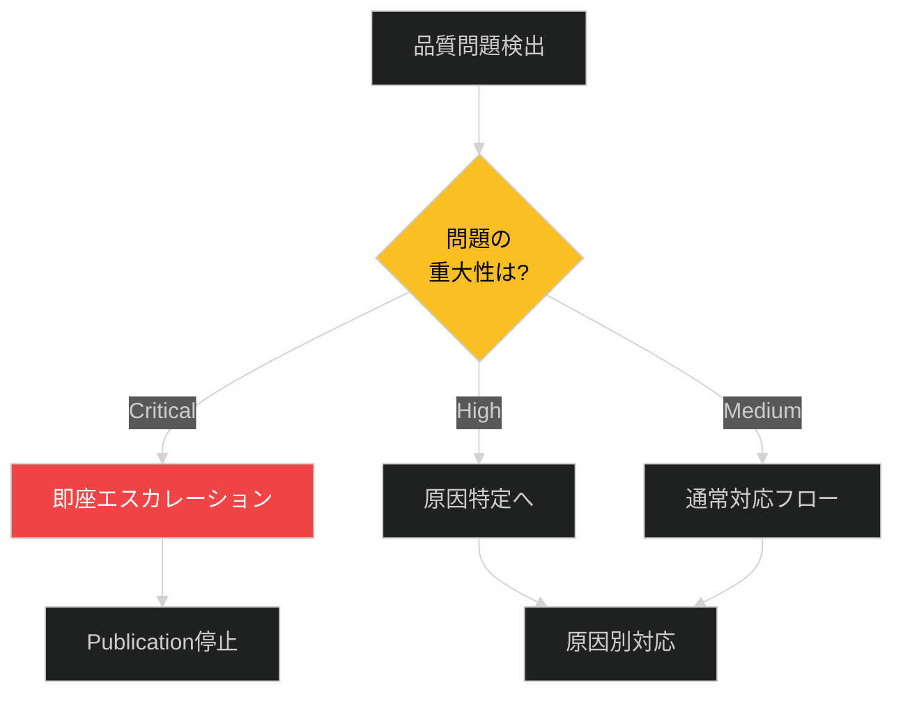
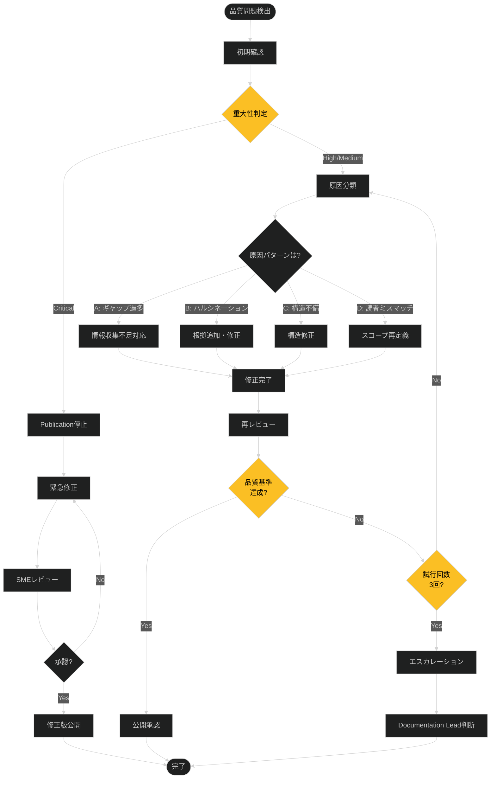

# ドキュメント品質問題対応プレイブック

> ⚠️ **重要度**: MEDIUM
> **最終テスト日**: 2025-12-10

## トリガー条件

**このプレイブックを使用するのは**：

- レビュー時にギャップマーカー（`[TODOCS:]`等）が全体の50%以上残存している
- 技術的不正確性（ハルシネーション）が報告された
- リンク切れ、Mermaid構文エラー、コードブロック実行不可などの構造的問題が検出された
- 対象読者とコンテンツ詳細レベルのミスマッチが指摘された
- ドキュメントタイプと内容が不一致（例: tutorialなのに手順が不完全）

**使用しないのは**：

- 単なる誤字・脱字（通常のレビュープロセスで対応）
- スタイルガイド逸脱のみ（軽微な場合は修正のみ）
- 新規ドキュメントの計画段階（プロセスドキュメントを参照）

## 初期対応（最初の5分）

### 1. 状況確認

**ギャップマーカー密度チェック**:
```bash
# ドキュメント全体のギャップマーカー数を集計
cd /path/to/docs
grep -rn "\[TODOCS:\|\[NEEDS_EXAMPLE:\|\[NEEDS_VERIFICATION:\|\[INCOMPLETE:\|\[SME_NEEDED:\|\[ASSUMPTION:\|\[OUTDATED:\|\[LINK_NEEDED:" . | wc -l

# 特定ファイルのギャップマーカー抽出
grep -n "\[.*_NEEDED:\|\[TODOCS:\|\[INCOMPLETE:\|\[ASSUMPTION:\|\[OUTDATED:" target-file.md
```

**構造的問題チェック**:
```bash
# リンク切れチェック（内部リンクのみ）
find docs -name "*.md" -exec grep -H "](\.\./" {} \; | while read line; do
  # [NEEDS_EXAMPLE: リンク切れ検証スクリプト]
done

# Mermaid構文エラーは手動プレビューで確認
```

### 2. 影響範囲の特定

| 確認項目 | 確認方法 | 結果記録 |
|----------|----------|----------|
| ギャップマーカー数 | 上記スクリプト実行 | □ 正常(<20%) / □ 異常(≥50%) |
| 技術的正確性 | SME/コードレビュー | □ 正常 / □ 異常（ハルシネーション検出） |
| 構造完全性 | リンク・コード実行テスト | □ 正常 / □ 異常（エラーあり） |
| 対象読者適合性 | レビュアー評価 | □ 正常 / □ 異常（ミスマッチ） |

### 3. 初期判断



**重大性判定基準**:

| レベル | 条件 | 例 |
|--------|------|-----|
| **Critical** | 誤情報が本番環境に影響 | データ消失リスクのあるコマンド例、セキュリティ脆弱性を含む設定 |
| **High** | ギャップマーカー≥70%、主要機能の説明が不正確 | チュートリアルが完走不可、APIリファレンスが実装と不一致 |
| **Medium** | ギャップマーカー50-69%、軽微な不正確性 | 一部ステップが未記述、バージョン情報欠如 |
| **Low** | ギャップマーカー<50%、構造的問題のみ | リンク切れ、Mermaid図の最適化不足 |

## 対応フロー



## 原因別対応手順

### パターン A: ギャップマーカー過多（≥50%）

**識別方法**：
- `grep`で抽出したギャップマーカーが全行数の50%以上
- 特に`[TODOCS:]`, `[INCOMPLETE:]`, `[NEEDS_EXAMPLE:]`が多数

**対応手順**：

1. **原因分析**
   - 調査フェーズ（Phase 2）が不十分だったか？
   - SMEへのアクセスが困難だったか？
   - スコープが大きすぎるか？

2. **再調査の実施**
   ```bash
   # ギャップマーカーを優先度別に分類
   grep -n "\[TODOCS:" target.md > gaps-high.txt
   grep -n "\[INCOMPLETE:" target.md >> gaps-high.txt
   grep -n "\[NEEDS_EXAMPLE:" target.md > gaps-medium.txt
   grep -n "\[LINK_NEEDED:" target.md > gaps-low.txt
   ```

3. **段階的解消**
   - HIGH優先度（`[TODOCS:]`, `[INCOMPLETE:]`）: 情報収集して記述
   - MEDIUM優先度（`[NEEDS_EXAMPLE:]`）: 実行可能なコード例を追加
   - LOW優先度（`[LINK_NEEDED:]`）: 関連ドキュメント作成後にリンク

4. **スコープ再定義（必要な場合）**
   - ドキュメントを分割（例: 大きなtutorialを複数の小さなhow-toへ）
   - MVP（Minimum Viable Publication）を定義し、残りは追跡タスクへ

**確認**：
```bash
# ギャップマーカー密度再計算
total_lines=$(wc -l < target.md)
gap_lines=$(grep -c "\[.*_NEEDED:\|\[TODOCS:\|\[INCOMPLETE:" target.md)
echo "Gap density: $(( gap_lines * 100 / total_lines ))%"
```

**完了条件**: ギャップマーカー密度が30%未満、またはMVP範囲でのギャップがゼロ

---

### パターン B: 技術的不正確性（ハルシネーション）

**識別方法**：
- レビュアー/SMEが「この情報は不正確」と指摘
- コード例が実行できない、または期待結果と異なる
- バージョン情報が欠如しているか、古いバージョンの情報

**対応手順**：

1. **不正確箇所の特定**
   - レビューコメントをリスト化
   - 各主張の根拠を確認（コード、ドキュメント、実験結果）

2. **根拠の追加・修正**
   - 実際のソースコードを参照
   - 実験・検証の再実施
   - `[ASSUMPTION:]`または`[NEEDS_VERIFICATION:]`マーカーで不確実性を明示

   **例**:
   ```markdown
   <!-- 修正前（ハルシネーション） -->
   デフォルトのタイムアウトは30秒です。

   <!-- 修正後（根拠付き） -->
   デフォルトのタイムアウトは60秒です（`config.py`の`DEFAULT_TIMEOUT`定数より）。
   [ASSUMPTION: バージョン2.0以降、変更されている可能性あり]
   ```

3. **バージョン情報の追加**
   - すべてのソフトウェア依存情報にバージョンを明記
   - 複数バージョンで動作が異なる場合は注釈

4. **SMEレビュー必須**
   - 修正内容をSMEに再レビュー依頼
   - `[SME_NEEDED: 専門家による最終確認が必要]`マーカー配置

**確認**：
```bash
# コード例の実行テスト
cd /path/to/test-environment
# ドキュメント内のコマンド例を実際に実行
bash -x commands-from-doc.sh
```

**完了条件**: すべての技術的主張に根拠があり、コード例が実行可能

---

### パターン C: 構造的不備（リンク切れ、Mermaid エラー等）

**識別方法**：
- markdownlintまたは手動確認でリンク切れ検出
- Mermaidプレビューで図が描画されない
- コードブロックに言語指定がない

**対応手順**：

1. **リンク切れ修正**
   ```bash
   # 内部リンクの一括確認（手動検証必要）
   find docs -name "*.md" -exec grep -H "](\.\./" {} \; > all-links.txt
   # 各リンク先ファイルの存在確認
   # [NEEDS_EXAMPLE: 自動リンク検証スクリプト]
   ```

2. **Mermaid構文修正**
   - 特殊文字を引用符で囲む: `A["ラベル (注釈)"]`
   - 予約語（`end`等）を避ける
   - ダークモード設定を追加: `%%{init: {'theme': 'dark'}}%%`

3. **コードブロック言語指定**
   - すべての```に言語指定を追加（```bash, ```python等）
   - 期待される出力を明記

**確認**：
- Markdownプレビューですべての図が正しく描画される
- すべてのリンクが有効（404エラーなし）

**完了条件**: 構造的エラーがゼロ

---

### パターン D: 対象読者ミスマッチ

**識別方法**：
- レビュアーが「初心者には難しすぎる」「専門家には冗長」と指摘
- tutorialなのに前提知識が多すぎる
- referenceなのに説明が長すぎる

**対応手順**：

1. **対象読者の再確認**
   - フロントマターの`difficulty`（beginner/intermediate/advanced）を確認
   - ドキュメントタイプとの整合性確認

2. **詳細レベルの調整**

   | ドキュメントタイプ | 詳細レベル | 前提知識 |
   |-------------------|-----------|---------|
   | tutorial | 手厚い説明、ステップバイステップ | 最小限 |
   | how-to | タスク完遂に必要な情報のみ | 基本理解済み |
   | reference | 網羅的、簡潔 | 十分な経験 |
   | concept | 理論・背景重視 | なし〜中程度 |

3. **コンテンツの再構成**
   - 初心者向けに変更: 背景説明追加、用語定義、図解増加
   - 上級者向けに変更: 冗長な説明削除、高度な例追加、リファレンスへのリンク

4. **分割検討**
   - 1つのドキュメントで複数の読者層をカバーしようとしていないか？
   - 必要に応じて初級/中級/上級で分割

**確認**：
- 対象読者のレビュアーによる再評価
- チュートリアルの場合、初心者が実際に完走可能か検証

**完了条件**: 対象読者と詳細レベルが一致

---

## エスカレーション基準

| 条件 | エスカレーション先 | 連絡方法 |
|------|-------------------|----------|
| Critical問題（本番影響リスク） | Tech Lead + Product Owner | 即座（Slack/Email） |
| 3回修正しても品質基準未達 | Documentation Lead | Issue/ミーティング |
| SMEが2週間以上未対応 | Product Owner | Email + Issue |
| スコープ大幅変更が必要 | Documentation Lead → Product Owner | ミーティング |
| ドキュメントタイプ変更が必要 | Documentation Lead | レビュー時 |

### エスカレーション時の報告内容

```text
【品質問題報告テンプレート】
ドキュメント: docs/path/to/file.md
問題タイプ: [ギャップ過多/ハルシネーション/構造不備/読者ミスマッチ]
重大性: [Critical/High/Medium/Low]
検出日時: YYYY-MM-DD HH:MM
検出者: [名前/ロール]

問題詳細:
- [具体的な問題内容]

影響範囲:
- [影響を受けるドキュメント/ユーザー]

実施した対応:
1. [対応1]
2. [対応2]

現在の状況:
- ギャップマーカー密度: XX%
- 修正試行回数: X回

必要な支援:
- [SMEレビュー/スコープ再定義/リソース追加等]

提案する解決策:
- [推奨アクション]
```

## ロールバック手順

**ロールバック判断基準**：
- Critical問題が公開済みドキュメントで発見された
- 修正に時間がかかり、誤情報が拡散するリスクがある

**手順**：

```bash
# 1. 問題のあるドキュメントを一時非公開
git mv docs/path/to/problematic.md docs/.unpublished/

# 2. README.mdから該当リンクを削除
sed -i '/problematic.md/d' docs/path/README.md

# 3. コミット・プッシュ
git add .
git commit -m "docs: rollback problematic.md due to critical issue #XXX"
git push

# 4. 修正完了後に再公開
git mv docs/.unpublished/problematic.md docs/path/to/
# README.md更新
git add .
git commit -m "docs: re-publish fixed problematic.md"
git push
```

**注意事項**：
- ロールバックは緊急時のみ使用
- 必ずIssueで追跡し、修正計画を明示
- 関係者への通知を忘れない

## 事後処理

### 1. 復旧確認

- [ ] ギャップマーカー密度が30%未満（またはMVP範囲でゼロ）
- [ ] 技術的不正確性が修正済み（SME承認済み）
- [ ] 構造的エラーがゼロ（リンク・Mermaid・コードブロック）
- [ ] 対象読者と詳細レベルが一致
- [ ] 関係者への復旧報告（レビュアー、Documentation Lead）

### 2. 記録

| 記録項目 | 内容 |
|----------|------|
| 発生日時 | YYYY-MM-DD HH:MM |
| 検知方法 | レビュー/自動チェック/ユーザー報告 |
| 問題タイプ | ギャップ過多/ハルシネーション/構造不備/読者ミスマッチ |
| 原因 | 調査不足/SME不在/スコープ過大/その他 |
| 対応内容 | 実施した修正内容（具体的に） |
| 復旧日時 | YYYY-MM-DD HH:MM |
| 再発防止策 | プロセス改善案、チェックリスト追加等 |

### 3. 振り返り

- [ ] インシデントレポート作成（Critical/High問題の場合）
- [ ] 再発防止策の検討（プロセス改善、チェックリスト強化）
- [ ] ドキュメント作成プロセスの更新必要性確認
- [ ] テンプレート・ガイドライン改訂の検討

## 関連ドキュメント

- **プロセス定義**: [ドキュメント作成プロセス](../01-processes/01-document-creation-process.md)
- **背景知識**: [LINK_NEEDED: 反ハルシネーション原則（概念）]
- **背景知識**: [LINK_NEEDED: ギャップマーカー仕様（概念）]
- **実行手順**: [LINK_NEEDED: ギャップマーカー使用ガイド（ハウツー）]
- **実行手順**: [LINK_NEEDED: レビューチェックリスト（ランブック）]

## 改訂・テスト履歴

| 日付 | 内容 | 担当 |
|------|------|------|
| 2025-12-10 | 初版作成 | Claude Code |
| [TODOCS: 実地テスト日] | 実地テスト実施 | [TODOCS] |

---

<!-- 検証チェックリスト（作成完了時に確認）
✅ トリガー条件が明確か
✅ 判断分岐がフローチャートで示されているか
✅ 各パターンの対応手順が具体的か
✅ エスカレーション基準が明確か
✅ ロールバック手順があるか
✅ 事後処理・記録フォーマットがあるか
⚠️ 定期的なテスト日が設定されているか（[TODOCS: 実地テスト予定]）
-->
