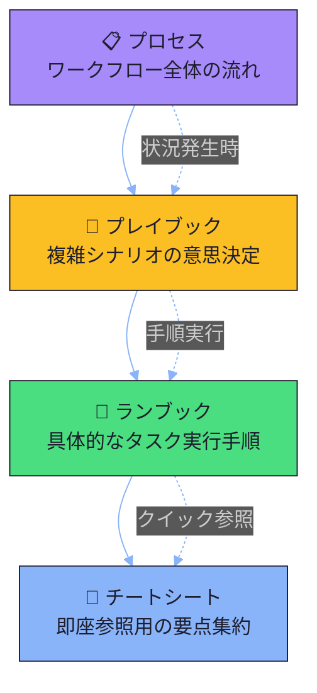
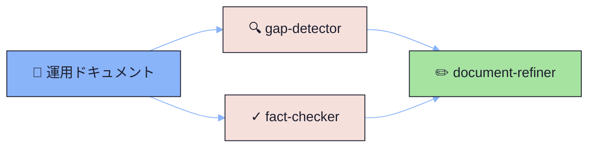

# 02_operations - 運用軸（実行）

運用ドキュメント階層に基づく実行・運用のためのドキュメント体系。

## 運用ドキュメント階層

| レベル | 抽象度 | 更新頻度 | 使用場面 |
|--------|--------|----------|----------|
| プロセス | 高 | 低 | 全体理解、オンボーディング |
| プレイブック | 中 | 中 | 問題発生時、判断が必要な時 |
| ランブック | 低 | 高 | 日常作業、定型タスク |
| チートシート | 最低 | 低 | 即座の確認、記憶の補助 |

## サブディレクトリ

### [01-processes/](./01-processes/README.md) - プロセス定義（Tier 2）
- **目的**: ワークフロー全体を図示
- **特徴**: 入力・出力を明確に、責任範囲の明記
- **関連**: playbook/runbookへのリンク
- **主要ドキュメント**: [ドキュメント作成プロセス](./01-processes/01-document-creation-process.md)

### [02-playbooks/](./02-playbooks/README.md) - 状況対応（Tier 2）
- **目的**: 複雑シナリオの意思決定枠組
- **特徴**: トリガー条件、判断分岐、エスカレーション基準
- **主要ドキュメント**: [品質問題対応プレイブック](./02-playbooks/01-quality-issues-playbook.md)

### [03-runbooks/](./03-runbooks/README.md) - 定常作業（Tier 2）
- **目的**: 具体的なタスク実行手順
- **特徴**: コピー&ペースト可能、ロールバック手順
- **主要ドキュメント**: [定期レビュー手順](./03-runbooks/01-periodic-document-review.md)

### [04-cheatsheets/](./04-cheatsheets/README.md) - クイックリファレンス（Tier 0/3）
- **目的**: 即座参照用の要点集約
- **特徴**: 1ページ以内、視覚的構成、印刷可能
- **主要ドキュメント**: [ギャップマーカー早見表](./04-cheatsheets/01-gap-markers-quick-reference.md)

## ティア対応

| フォルダ | ティア | ビジュアル/テキスト比率 |
|----------|--------|----------------------|
| 01-processes/ | Tier 2 | 40/60 |
| 02-playbooks/ | Tier 2 | 40/60 |
| 03-runbooks/ | Tier 2 | 40/60 |
| 04-cheatsheets/ | Tier 0/3 | 90/10 または 20/80 |

## このドキュメント群について

このディレクトリのドキュメントは、運用ドキュメント階層の**実例として機能**します。

### 自己言及的な実演

| ドキュメント | 説明していること | 実演していること |
|-------------|------------------|------------------|
| [ドキュメント作成プロセス](./01-processes/01-document-creation-process.md) | 作成ワークフロー | processes/の書き方 |
| [品質問題対応プレイブック](./02-playbooks/01-quality-issues-playbook.md) | 問題対応フロー | playbooks/の判断分岐 |
| [定期レビュー手順](./03-runbooks/01-periodic-document-review.md) | レビュー実行手順 | runbooks/のコマンド形式 |
| [ギャップマーカー早見表](./04-cheatsheets/01-gap-markers-quick-reference.md) | マーカー一覧 | cheatsheets/のレイアウト |

### 使用例

**問題が発生した場合**:
1. [プレイブック](./02-playbooks/) でトリガー条件を確認
2. 判断分岐に従って対応を決定
3. [ランブック](./03-runbooks/) で具体的な手順を実行

**定常作業を行う場合**:
1. [ランブック](./03-runbooks/) で手順を確認
2. [チートシート](./04-cheatsheets/) で要点を参照

## エージェント連携

運用ドキュメントの品質保証には、レビューチェーンを使用します。

- **gap-detector**: 不完全な手順、欠落したステップを検出
- **fact-checker**: コマンドの正確性、パスの存在を検証
- **document-refiner**: 検出された問題を修正

詳細は[プロジェクトビジョン](../01_knowledge/01-concepts/00-project-vision.md)を参照してください。

## 関連リンク

- [プロジェクトビジョン](../01_knowledge/01-concepts/00-project-vision.md) - フレームワークの目的と設計思想
- [Diátaxis軸（01_knowledge）](../01_knowledge/README.md)
- [C4軸（03_architecture）](../03_architecture/README.md)
