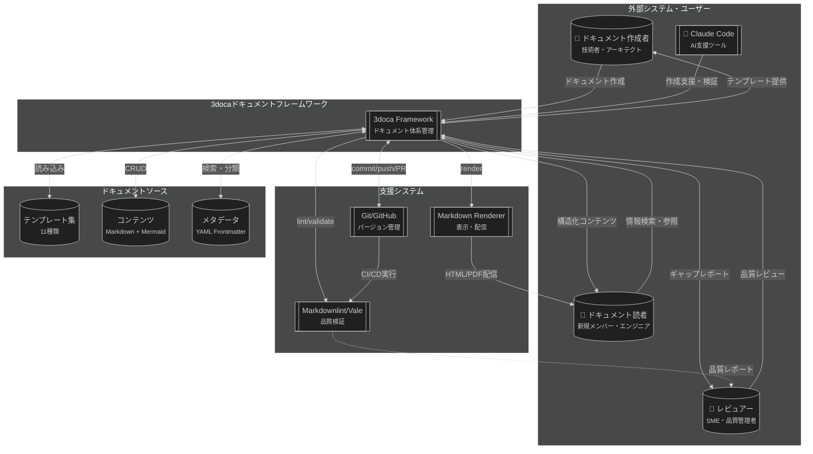

# 3doca技術ドキュメントフレームワーク - システムコンテキスト (C4 Level 1)

## 概要

3docaは技術ドキュメント（CFD、GIS、数値シミュレーション等）を体系的に作成・管理するためのフレームワークです。Diátaxis（理解・習得）、運用ドキュメント（実行）、C4モデル（構造）の3軸構造により、目的に応じた適切なドキュメントタイプを提供し、ドキュメントの品質と保守性を保証します。

**価値提供**: ドキュメント作成者が目的に応じた適切な構造・テンプレートを即座に選択でき、読者が必要な情報に素早くアクセスできる体系的なドキュメント管理を実現します。

## システムコンテキスト図

## ステークホルダー

| ステークホルダー | 役割 | システムとの関係 |
|------------------|------|------------------|
| ドキュメント作成者 | 技術ドキュメントの執筆 | テンプレートを使用してドキュメント作成、ギャップマーカーで不完全箇所を明示 |
| ドキュメント読者 | 情報の検索・参照 | 3軸構造から目的に応じたドキュメントタイプを選択、段階的に詳細にアクセス |
| レビュアー（SME） | 品質管理・技術レビュー | ギャップマーカーを確認し、技術的正確性を検証 |
| Claude Code | AI支援 | テンプレートに基づくドキュメント生成、ギャップマーカーの自動挿入、リンク検証 |

## 外部システム連携

| 外部システム | 連携方式 | データ/機能 | 方向 |
|--------------|----------|-------------|------|
| Git/GitHub | Git CLI / GitHub API | バージョン管理、PR、Issue | 双方向 |
| Markdownlint | CLI / VSCode拡張 | Markdown構文検証 | 出力 |
| Vale | CLI / GitHub Actions | 文書品質検証（スタイル、用語） | 出力 |
| Markdown Renderer | 各種ツール | HTML/PDF変換、Mermaid図レンダリング | 出力 |
| Claude Code | MCP / CLI | ドキュメント生成・検証支援 | 双方向 |

## 主要なデータフロー

| データ | 形式 | 頻度 | 備考 |
|--------|------|------|------|
| テンプレート | Markdown + YAML | 低（月次更新） | 11種類のテンプレート、フロントマター含む |
| ドキュメントコンテンツ | Markdown + Mermaid | 高（日次追加・更新） | ギャップマーカー付き、段階的完成度管理 |
| メタデータ | YAML Frontmatter | 高（ドキュメントと同時） | 分類・検索用、status/tags/version等 |
| ギャップレポート | テキスト（grep出力） | 中（週次生成） | 未完成箇所の一覧 |
| 品質レポート | JSON / テキスト | 高（push毎） | CI/CDで自動生成 |

## システム境界

**スコープ内**：
- ドキュメント構造の定義（3軸：Diátaxis、運用、C4）
- テンプレート管理（11種類）
- ギャップマーカー仕様の定義と検証ルール
- フロントマタースキーマ定義
- ドキュメント作成ガイドライン（CLAUDE.md）
- 反ハルシネーションルール（品質保証）

**スコープ外**：
- ドメイン固有の技術知識（CFD、GIS等は別途ドキュメント化）
- Markdownレンダリングエンジン本体
- Git/GitHub本体の機能
- CI/CDパイプラインの詳細設定（プロジェクト固有）

## 前提条件・制約

| 項目 | 内容 |
|------|------|
| ドキュメント形式 | Markdown + YAML Frontmatter（標準化） |
| 図形式 | Mermaid（ダークモード必須、C4図はflowchart+subgraphで代替） |
| バージョン管理 | Git必須 |
| AI支援 | Claude Code（推奨、必須ではない） |
| ギャップマーカー | 不完全箇所を明示する文化（推測禁止） |
| 品質基準 | "不完全でも正確"を"完全だが不正確"より優先 |

## 次のレベル

より詳細な構造については：

- **Container図**: [3doca Framework - コンテナ図](../02-containers/3doca-framework-containers.md)
  - 3軸のディレクトリ構造詳細
  - テンプレートエンジン
  - 検証システム
  - メタデータ管理

## 関連ドキュメント

- **概念説明**: [ドキュメント3軸構造の設計思想](../../01_knowledge/01-concepts/01-three-axis-framework.md)
- **プロセス**: [ドキュメント作成プロセス](../../02_operations/01-processes/01-document-creation-process.md)
- **ガイドライン**: [CLAUDE.md](/mnt/j/pcloud_sync/5agent/1conf/3doca/CLAUDE.md)
- **テンプレート一覧**: [_templates/00-INDEX.md](../../_templates/00-INDEX.md)

---

<!-- 検証チェックリスト
✅ 非技術者にも理解できるか
✅ すべての外部システム・ユーザーが含まれているか
✅ データフローの方向が正しいか
✅ システム境界が明確か
-->
