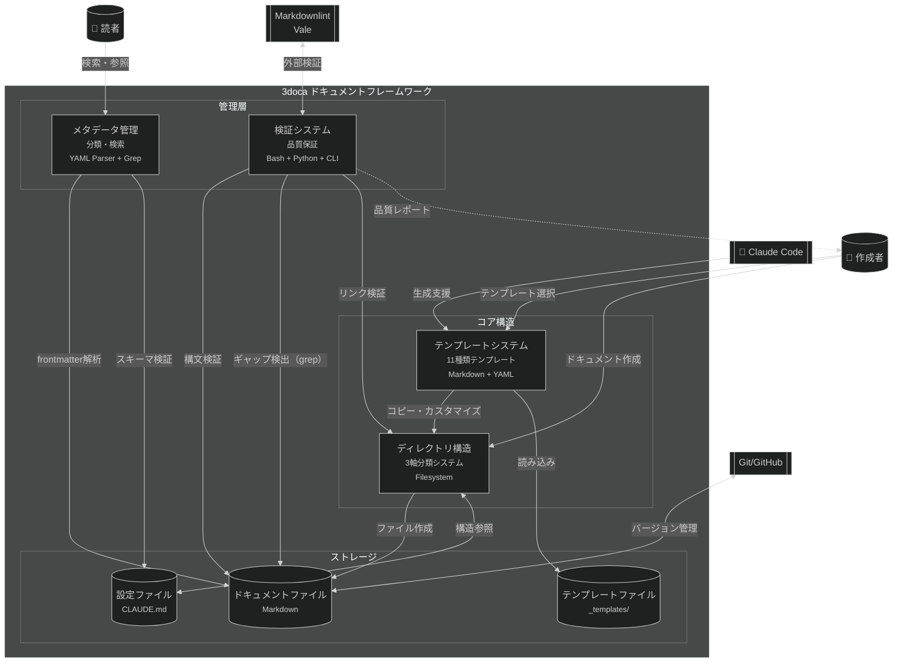
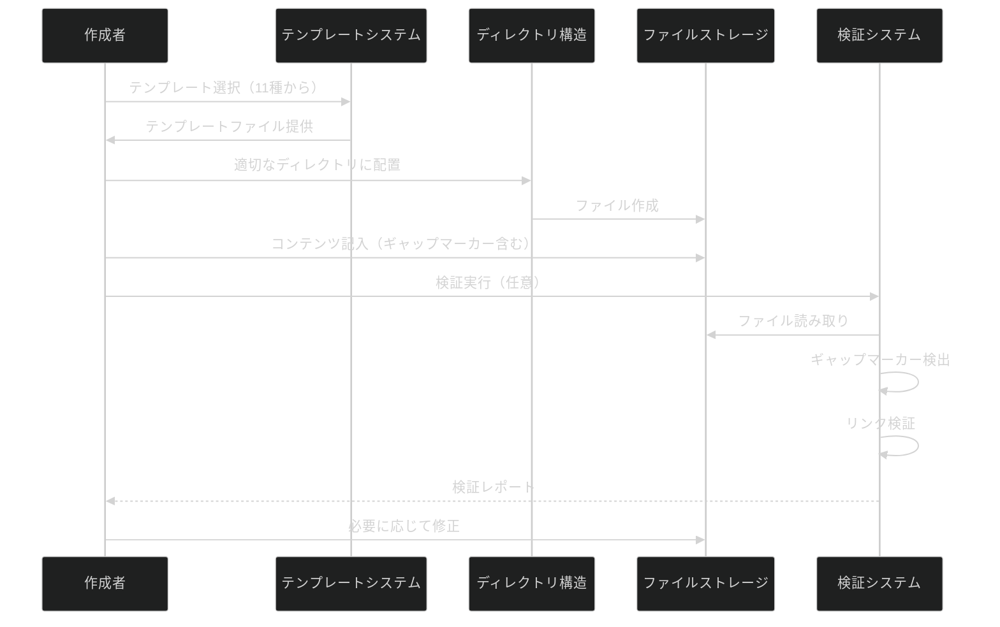
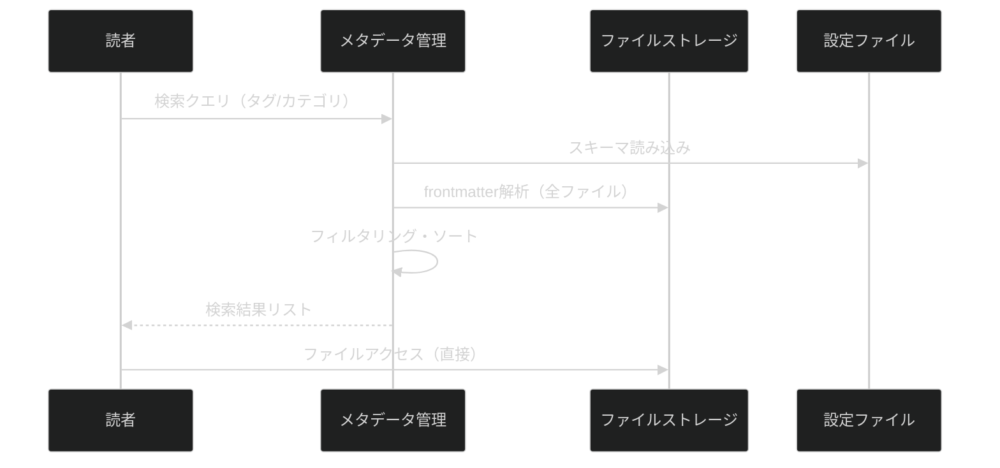
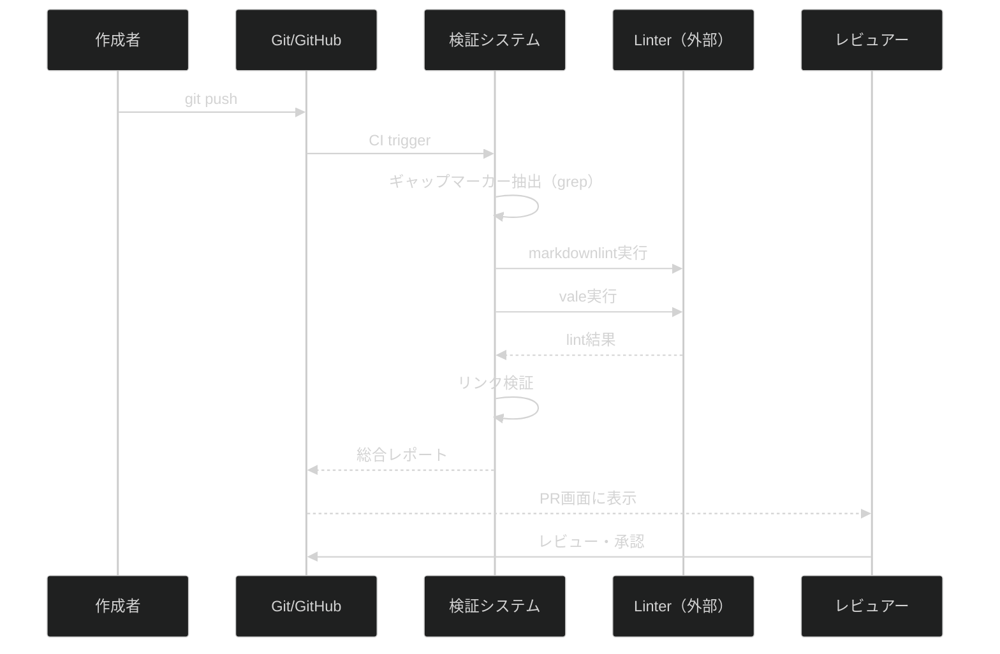

# 3doca技術ドキュメントフレームワーク - コンテナ図 (C4 Level 2)

## 概要

3docaフレームワークは4つの主要コンテナで構成されます：
1. **ディレクトリ構造**（3軸分類システム）
2. **テンプレートシステム**（11種類のテンプレート管理）
3. **メタデータ管理**（YAML Frontmatter + 検索機能）
4. **検証システム**（品質保証・ギャップ検出）

**上位レベル**: [Context図 - 3doca Framework](../01-context/3doca-framework-context.md)

## コンテナ図

## コンテナ一覧

| コンテナ | 技術 | 責務 | 備考 |
|----------|------|------|------|
| ディレクトリ構造 | Filesystem（標準ディレクトリ構造） | 3軸分類（Diátaxis/運用/C4）、階層管理、README連携 | 11個のサブディレクトリ、各階層にREADME配置 |
| テンプレートシステム | Markdown + YAML Frontmatter | 11種類テンプレート提供、ギャップマーカープレースホルダー管理 | `_templates/`配下、コピーベース |
| メタデータ管理 | YAML Parser（Python/Bash）、Grep | Frontmatter解析、タグ検索、分類管理、スキーマ検証 | `01-FRONTMATTER_SCHEMA.md`で仕様定義 |
| 検証システム | Bash Script、Python、CLI（markdownlint/vale） | 構文検証、ギャップマーカー検出、リンク検証、品質レポート生成 | CI/CD統合可能 |

## 技術選択の理由

### ディレクトリ構造 - Filesystem

**選択**: 標準的なファイルシステムディレクトリ構造

**理由**:
- ツール依存性なし（どの環境でも動作）
- Git/GitHub標準サポート
- エディタ・IDEで即座に参照可能
- 学習コスト最小

**検討した代替案**:
- データベース管理（却下理由：複雑性増加、ツール依存）
- Wiki システム（却下理由：Markdown標準からの逸脱）

---

### テンプレートシステム - Markdown + YAML Frontmatter

**選択**: Markdown本文 + YAML Frontmatterのハイブリッド形式

**理由**:
- 人間が読みやすい（プレーンテキスト）
- 機械処理可能（YAML解析）
- Jekyll、Hugo、Docusaurus等と互換性
- GitHub標準サポート

**検討した代替案**:
- JSON/XML（却下理由：可読性低下）
- カスタムDSL（却下理由：学習コスト、ツール開発コスト）

---

### メタデータ管理 - YAML Parser + Grep

**選択**: Python YAMLパーサー + Bash Grep

**理由**:
- YAML標準パーサー（PyYAML）
- 高速な全文検索（ripgrep/grep）
- スクリプト化が容易
- 外部DB不要

**検討した代替案**:
- 全文検索エンジン（Elasticsearch等、却下理由：オーバースペック）
- 専用CMSツール（却下理由：ロックイン、複雑性）

---

### 検証システム - Bash + Python + CLI

**選択**: スクリプトベース検証 + 既存CLIツール統合

**理由**:
- 段階的な検証実装が可能
- 既存ツール（markdownlint、vale）活用
- CI/CD統合が容易
- カスタム検証ルール追加可能

**検討した代替案**:
- 独自検証フレームワーク開発（却下理由：開発コスト）
- AIのみによる検証（却下理由：決定性不足、コスト）

## 通信プロトコル

| 通信経路 | プロトコル | 認証 | 備考 |
|----------|------------|------|------|
| User → Templates | File I/O | Filesystem権限 | コピー操作（cp/editor） |
| User → DirStruct | File I/O | Filesystem権限 | ファイル作成・編集 |
| Metadata → Files | File I/O | 読み取り専用 | frontmatter解析 |
| Validation → Files | File I/O | 読み取り専用 | 検証実行 |
| System → Git | Git protocol（HTTPS/SSH） | GitHub認証 | バージョン管理 |
| Validation → Linter | CLI（stdin/stdout） | 不要 | ローカルプロセス実行 |

## データフロー詳細

### ドキュメント作成フロー

### メタデータ検索フロー

### 品質検証フロー（CI統合）

## デプロイメント概要

| コンテナ | 実行環境 | スケーリング |
|----------|----------|--------------|
| ディレクトリ構造 | 任意のOS（Linux/Mac/Windows） | N/A（静的構造） |
| テンプレートシステム | ファイルシステム | N/A（コピー操作のみ） |
| メタデータ管理 | Python 3.8+、Bash 4.0+ | 垂直（ファイル数増加時） |
| 検証システム | CI/CD環境（GitHub Actions等）、ローカルCLI | 水平（並列実行可能） |

**配備方法**:
- Git cloneで全体を配備
- `_templates/`配下のテンプレートは即座に利用可能
- Python/Bash依存は最小限（標準ツール）

## 次のレベル

各コンテナの内部構造：

- [テンプレートエンジン - Component図](../03-components/template-engine-components.md)
  - テンプレート選択ロジック
  - ギャップマーカー管理
  - Frontmatterスキーマ検証
- 検証システム - Component図 [TODOCS: validation-system-components.md を作成予定]
  - ギャップ検出エンジン
  - リンク検証エンジン
  - CI統合モジュール

## 関連ドキュメント

- **上位**: [Context図 - 3doca Framework](../01-context/3doca-framework-context.md)
- **詳細**: [テンプレートエンジン - Component図](../03-components/template-engine-components.md)
- **運用**: [ドキュメント作成プロセス](../../02_operations/01-processes/01-document-creation-process.md)
- **設定**: [CLAUDE.md](/mnt/j/pcloud_sync/5agent/1conf/3doca/CLAUDE.md)
- **テンプレート**: [_templates/00-INDEX.md](../../_templates/00-INDEX.md)
- **スキーマ**: [01-FRONTMATTER_SCHEMA.md](../../_templates/01-FRONTMATTER_SCHEMA.md)

---

<!-- 検証チェックリスト
✅ すべての主要コンテナが含まれているか
✅ 技術選択の理由が明記されているか
✅ 通信プロトコルが明確か
✅ 上位・下位レベルへのリンクがあるか
-->
