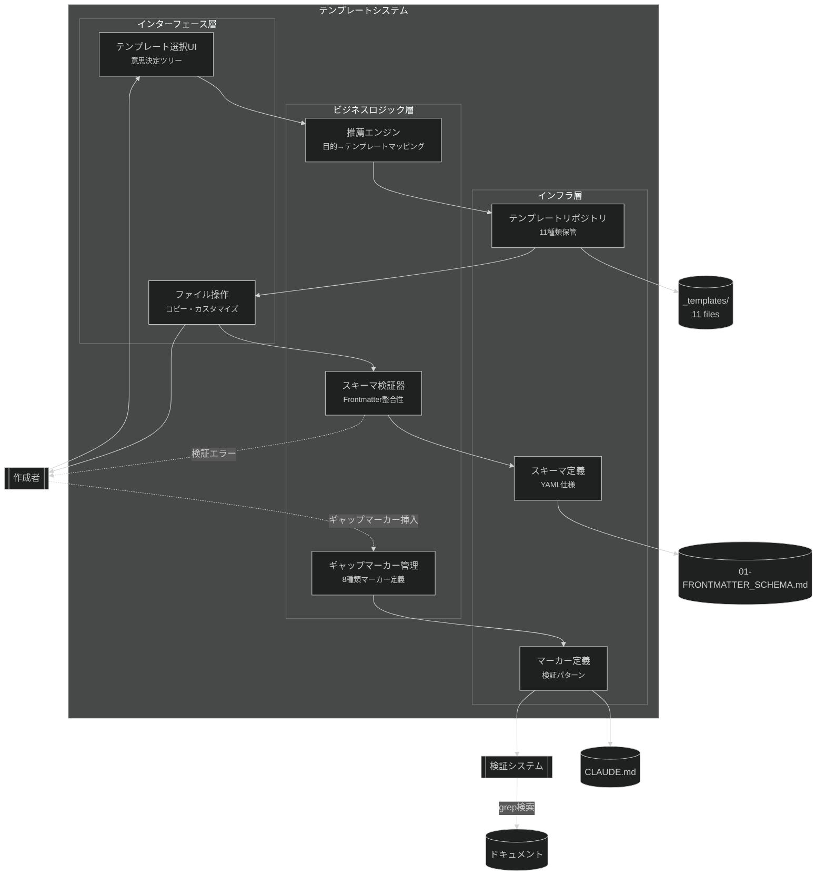
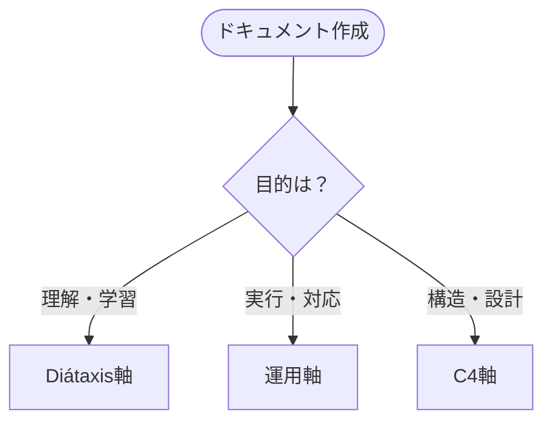
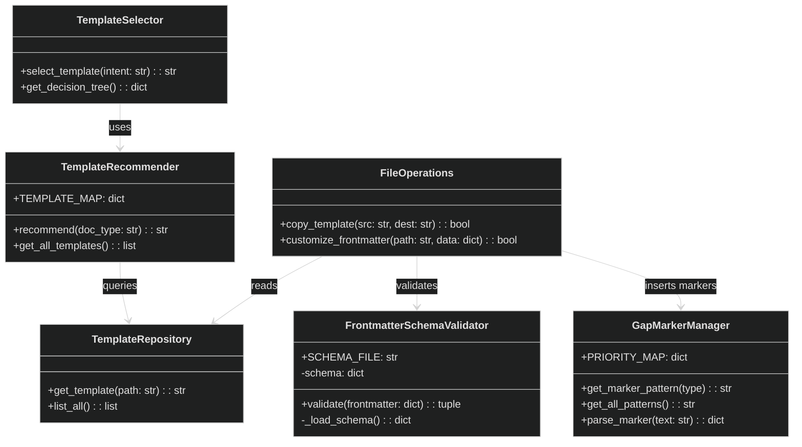
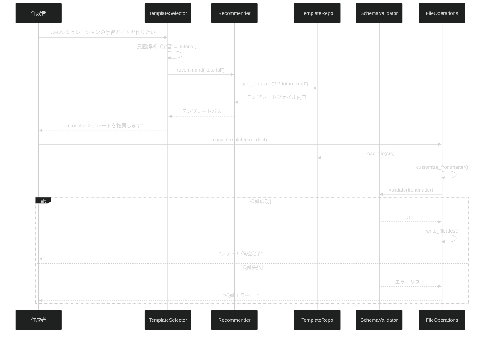

# テンプレートシステム - コンポーネント図 (C4 Level 3)

## 概要

テンプレートシステムは3docaフレームワークの中核コンポーネントで、11種類のドキュメントテンプレートを管理します。主に以下の3つのサブコンポーネントで構成されます：

1. **テンプレート選択ロジック**: ドキュメント目的に応じた適切なテンプレートの推薦
2. **ギャップマーカー管理**: 不完全箇所の明示と追跡システム
3. **Frontmatterスキーマ検証**: メタデータの整合性保証

**上位レベル**: [Container図 - 3doca Framework](../02-containers/3doca-framework-containers.md)

## コンポーネント図



## コンポーネント一覧

| コンポーネント | 種類 | 責務 | 依存先 |
|----------------|------|------|--------|
| テンプレート選択UI | Interface | ユーザーの意図を質問形式で引き出し | 推薦エンジン |
| 推薦エンジン | Service | 目的に応じた最適テンプレートを選択 | テンプレートリポジトリ |
| ギャップマーカー管理 | Service | 8種類のマーカー定義、優先度管理 | マーカー定義 |
| スキーマ検証器 | Service | Frontmatterの型・必須項目検証 | スキーマ定義 |
| ファイル操作 | Controller | テンプレートコピー、パス解決 | Filesystem |
| テンプレートリポジトリ | Repository | 11種類のテンプレートファイル管理 | `_templates/` |
| スキーマ定義 | Repository | Frontmatterスキーマ仕様 | YAML定義ファイル |
| マーカー定義 | Repository | ギャップマーカーの正規表現パターン | CLAUDE.md |

## 詳細設計

### テンプレート選択UI

**責務**: ドキュメント作成者の意図を質問形式で引き出し、適切なテンプレートを提案

**インターフェース**:

```python
# 意思決定ツリーの概念的表現
class TemplateSelector:
    def select_template(self, user_intent: str) -> str:
        """
        ユーザーの意図から適切なテンプレートを選択

        Args:
            user_intent: "理解・学習" | "実行・対応" | "構造・設計"

        Returns:
            テンプレートファイルパス
        """
        pass

    def get_decision_tree(self) -> dict:
        """
        意思決定ツリーのフローチャート構造を返す

        Returns:
            {
                "理解・学習": ["concept", "tutorial", "how-to", "reference"],
                "実行・対応": ["process", "playbook", "runbook", "cheatsheet"],
                "構造・設計": ["context", "container", "component"]
            }
        """
        pass
```

**実装例**（_templates/00-INDEX.md内のMermaidフローチャート）:


**依存関係**:
- 入力: ユーザーの意図（対話形式または明示的指定）
- 出力: 推薦エンジンへのクエリ

---

### 推薦エンジン

**責務**: テンプレート選択ロジックの中核、11種類のテンプレートから最適なものを選択

**インターフェース**:

```python
class TemplateRecommender:
    TEMPLATE_MAP = {
        # Diátaxis軸
        "concept": "_templates/01_knowledge/01-concept.md",
        "tutorial": "_templates/01_knowledge/02-tutorial.md",
        "how-to": "_templates/01_knowledge/03-how-to.md",
        "reference": "_templates/01_knowledge/04-reference.md",
        # 運用軸
        "process": "_templates/02_operations/01-process.md",
        "playbook": "_templates/02_operations/02-playbook.md",
        "runbook": "_templates/02_operations/03-runbook.md",
        "cheatsheet": "_templates/02_operations/04-cheatsheet.md",
        # C4軸
        "context": "_templates/03_architecture/01-context.md",
        "container": "_templates/03_architecture/02-container.md",
        "component": "_templates/03_architecture/03-component.md"
    }

    def recommend(self, doc_type: str) -> str:
        """
        ドキュメントタイプに応じたテンプレートパスを返す

        Args:
            doc_type: 11種類のいずれか

        Returns:
            テンプレートファイルの絶対パス
        """
        return self.TEMPLATE_MAP.get(doc_type)

    def get_all_templates(self) -> list[dict]:
        """
        全テンプレートのメタ情報を返す

        Returns:
            [{"type": "concept", "path": "...", "description": "..."}, ...]
        """
        pass
```

**依存関係**:
- 入力: テンプレート選択UIからのクエリ
- 出力: テンプレートリポジトリへのファイルパス要求

---

### ギャップマーカー管理

**責務**: 8種類のギャップマーカーの定義、優先度管理、検証パターン提供

**インターフェース**:

```python
from enum import Enum

class GapMarkerType(Enum):
    TODOCS = "TODOCS"              # 未完成セクション（HIGH）
    NEEDS_EXAMPLE = "NEEDS_EXAMPLE" # コード例必要（HIGH）
    NEEDS_VERIFICATION = "NEEDS_VERIFICATION" # 未検証（MEDIUM）
    INCOMPLETE = "INCOMPLETE"       # 情報不足（MEDIUM）
    SME_NEEDED = "SME_NEEDED"       # 専門家レビュー（LOW）
    ASSUMPTION = "ASSUMPTION"       # 仮定明示（INFO）
    OUTDATED = "OUTDATED"           # 古い可能性（MEDIUM）
    LINK_NEEDED = "LINK_NEEDED"     # リンク必要（LOW）

class GapMarkerManager:
    PRIORITY_MAP = {
        GapMarkerType.TODOCS: "HIGH",
        GapMarkerType.NEEDS_EXAMPLE: "HIGH",
        GapMarkerType.NEEDS_VERIFICATION: "MEDIUM",
        GapMarkerType.INCOMPLETE: "MEDIUM",
        GapMarkerType.OUTDATED: "MEDIUM",
        GapMarkerType.LINK_NEEDED: "LOW",
        GapMarkerType.SME_NEEDED: "LOW",
        GapMarkerType.ASSUMPTION: "INFO"
    }

    def get_marker_pattern(self, marker_type: GapMarkerType) -> str:
        """
        grep検索用の正規表現パターンを返す

        Args:
            marker_type: マーカータイプ

        Returns:
            正規表現パターン（例: "\[TODOCS:.*?\]"）
        """
        return rf"\[{marker_type.value}:.*?\]"

    def get_all_patterns(self) -> str:
        """
        全マーカーの検索パターン（OR結合）を返す

        Returns:
            "\[TODOCS:\|\[NEEDS_EXAMPLE:\|..."
        """
        pass

    def parse_marker(self, marker_text: str) -> dict:
        """
        マーカーテキストを解析

        Args:
            marker_text: "[TODOCS: 説明文]"

        Returns:
            {"type": "TODOCS", "priority": "HIGH", "description": "説明文"}
        """
        pass
```

**実装の詳細**:
- マーカー定義はCLAUDE.mdで一元管理
- 検証システムはgrep/ripgrepで高速検索
- 優先度別のレポート生成が可能

**依存関係**:
- 入力: CLAUDE.md内のマーカー仕様
- 出力: 検証システムへの検索パターン提供

---

### スキーマ検証器

**責務**: YAML Frontmatterの型・必須項目・値の妥当性を検証

**インターフェース**:

```python
from typing import Any
import yaml

class FrontmatterSchemaValidator:
    SCHEMA_FILE = "_templates/01-FRONTMATTER_SCHEMA.md"

    def __init__(self):
        self.schema = self._load_schema()

    def validate(self, frontmatter: dict) -> tuple[bool, list[str]]:
        """
        Frontmatterをスキーマに照らして検証

        Args:
            frontmatter: パースされたYAMLディクショナリ

        Returns:
            (is_valid, error_messages)
        """
        errors = []

        # 必須項目チェック
        required_fields = ["title", "type", "category", "status"]
        for field in required_fields:
            if field not in frontmatter:
                errors.append(f"必須項目 '{field}' が不足")

        # 型チェック
        if "tags" in frontmatter and not isinstance(frontmatter["tags"], list):
            errors.append("'tags' はリスト型である必要があります")

        # 値の妥当性チェック
        valid_statuses = ["draft", "review", "published", "archived"]
        if frontmatter.get("status") not in valid_statuses:
            errors.append(f"'status' は {valid_statuses} のいずれかである必要があります")

        return (len(errors) == 0, errors)

    def _load_schema(self) -> dict:
        """スキーマ定義ファイルを読み込み"""
        # 01-FRONTMATTER_SCHEMA.mdからスキーマ定義を抽出
        pass
```

**検証項目**:
1. 必須項目の存在確認
2. データ型の整合性（文字列、リスト、日付等）
3. 列挙値の妥当性（status、type等）
4. 相互依存関係（例: level=component → parent_container必須）

**依存関係**:
- 入力: スキーマ定義（01-FRONTMATTER_SCHEMA.md）
- 出力: 検証結果（エラーメッセージ）

## クラス図



## データモデル

### テンプレートメタデータ

| フィールド | 型 | 必須 | 説明 |
|------------|-----|------|------|
| type | string | Yes | ドキュメントタイプ（11種類） |
| title | string | Yes | ドキュメントタイトル |
| category | string | Yes | カテゴリ分類 |
| tags | list[string] | No | タグリスト |
| status | enum | Yes | draft/review/published/archived |
| created | date | Yes | 作成日（YYYY-MM-DD） |
| updated | date | Yes | 更新日（YYYY-MM-DD） |
| version | string | No | バージョン番号（セマンティックバージョニング推奨） |

### ギャップマーカー

| フィールド | 型 | 必須 | 説明 |
|------------|-----|------|------|
| marker_type | GapMarkerType | Yes | 8種類のマーカータイプ |
| priority | enum | Yes | HIGH/MEDIUM/LOW/INFO |
| description | string | Yes | 不完全箇所の具体的説明 |
| file_path | string | Yes | マーカーが存在するファイルパス |
| line_number | int | Yes | 行番号 |

## 処理フロー

### テンプレート選択とカスタマイズフロー



## エラーハンドリング

| エラー種別 | 発生箇所 | 処理方法 |
|------------|----------|----------|
| テンプレート不存在 | TemplateRecommender | 利用可能なテンプレートリストを表示 |
| スキーマ検証失敗 | FrontmatterSchemaValidator | 詳細なエラーメッセージを返す（どのフィールドが問題か明示） |
| ファイルコピー失敗 | FileOperations | 権限確認を促す、ディレクトリ作成を提案 |
| ギャップマーカー構文エラー | GapMarkerManager | 正しい構文例を表示 |

## 設定パラメータ

| パラメータ | デフォルト | 説明 |
|------------|------------|------|
| TEMPLATE_BASE_DIR | `_templates/` | テンプレートファイル格納ディレクトリ |
| SCHEMA_FILE | `01-FRONTMATTER_SCHEMA.md` | スキーマ定義ファイルパス |
| GAP_MARKER_PATTERN | `\[.*?:.*?\]` | ギャップマーカー検出用正規表現 |
| DEFAULT_STATUS | `draft` | 新規ドキュメントの初期ステータス |

詳細は [CLAUDE.md](/mnt/j/pcloud_sync/5agent/1conf/3doca/CLAUDE.md) を参照。

## テスト観点

| コンポーネント | テスト種別 | 観点 |
|----------------|------------|------|
| TemplateRecommender | Unit | 11種類全てのテンプレートが正しくマッピングされるか |
| GapMarkerManager | Unit | 8種類のマーカーパターンが正しく解析されるか |
| SchemaValidator | Unit | 必須項目不足、型不一致、無効な値を検出できるか |
| FileOperations | Integration | テンプレートコピー→カスタマイズ→検証の一連フロー |
| 全体 | E2E | ユーザー意図入力から完成ドキュメント生成まで |

## 関連ドキュメント

- **上位**: [Container図 - 3doca Framework](../02-containers/3doca-framework-containers.md)
- **テンプレート一覧**: [_templates/00-INDEX.md](../../_templates/00-INDEX.md)
- **スキーマ定義**: [01-FRONTMATTER_SCHEMA.md](../../_templates/01-FRONTMATTER_SCHEMA.md)
- **ガイドライン**: [CLAUDE.md](/mnt/j/pcloud_sync/5agent/1conf/3doca/CLAUDE.md)
- **運用プロセス**: [ドキュメント作成プロセス](../../02_operations/01-processes/01-document-creation-process.md)

---

<!-- 検証チェックリスト
✅ 各コンポーネントの責務が単一か
✅ 依存関係が明確か
✅ インターフェースが定義されているか
✅ エラーハンドリングが記載されているか
✅ 上位レベルへのリンクがあるか
-->
