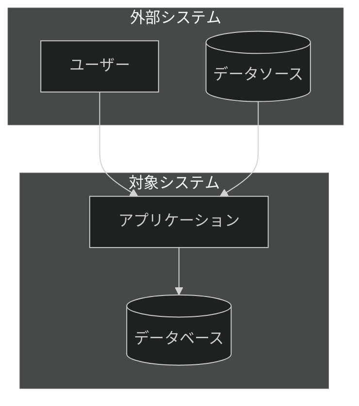

# 03_architecture - C4軸（構造）

C4モデルに基づくアーキテクチャドキュメント体系。4つのレベルでシステム構造を段階的に詳細化。

## C4モデル概要

```
Level 1: Context（コンテキスト）    ← システム全体と外部との関係
    ↓
Level 2: Containers（コンテナ）     ← 主要な技術コンポーネント
    ↓
Level 3: Components（コンポーネント）← 内部構造の詳細
    ↓
Level 4: Code（コード）             ← クラス・モジュール（通常省略）
```

## サブディレクトリ

### [context/](./context/README.md) - Level 1（Tier 0）
- **目的**: システム全体と外部との関係を示す
- **ビジュアル/テキスト比率**: 90/10
- **対象読者**: 非技術者、ステークホルダー、新規メンバー
- **特徴**: 60秒以内で理解可能

### [containers/](./containers/README.md) - Level 2（Tier 4）
- **目的**: 主要な技術コンポーネントを示す
- **ビジュアル/テキスト比率**: 25/75
- **特徴**: 通信プロトコル、データフロー、技術選択の理由

### [components/](./components/README.md) - Level 3（Tier 4）
- **目的**: 内部構造の詳細を示す
- **ビジュアル/テキスト比率**: 25/75
- **特徴**: クラス・モジュール関係、実装詳細へのリンク

## ティア対応

| レベル | ティア | ビジュアル/テキスト比率 | 更新頻度 |
|--------|--------|----------------------|----------|
| context/ | Tier 0 | 90/10 | 低（年1回程度） |
| containers/ | Tier 4 | 25/75 | 中（四半期） |
| components/ | Tier 4 | 25/75 | 高（変更多い） |

## Mermaid C4図の代替実装

MermaidのC4サポートは実験的なため、flowchart + subgraphで代替：



## 関連リンク

- [Diátaxis軸（01_knowledge）](../01_knowledge/README.md)
- [運用軸（02_operations）](../02_operations/README.md)
- [ティア設計仕様](../01_knowledge/reference/TIER-DESIGN-SPEC.md)
