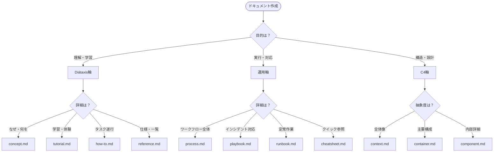

# テンプレート一覧

ドキュメント作成時は、該当するテンプレートをコピーして使用してください。

## 使用方法

```bash
# 例: ハウツーガイドを作成する場合
cp _templates/01_knowledge/03-how-to.md docs/01_knowledge/03-how-to/my-new-guide.md
```

## テンプレート構成

```
_templates/
├── 01_knowledge/           # Diátaxis軸
│   ├── 01-concept.md       # 説明・概念
│   ├── 02-tutorial.md      # チュートリアル
│   ├── 03-how-to.md        # ハウツーガイド
│   └── 04-reference.md     # リファレンス
│
├── 02_operations/          # 運用軸
│   ├── 01-process.md       # プロセス定義
│   ├── 02-playbook.md      # プレイブック（状況対応）
│   ├── 03-runbook.md       # ランブック（定常作業）
│   └── 04-cheatsheet.md    # チートシート
│
├── 03_architecture/        # C4軸
│   ├── 01-context.md       # Level 1 - システムコンテキスト
│   ├── 02-container.md     # Level 2 - コンテナ図
│   └── 03-component.md     # Level 3 - コンポーネント図
│
├── 00-INDEX.md             # このファイル
└── 01-FRONTMATTER_SCHEMA.md # フロントマター仕様
```

## テンプレート選択ガイド

### 何を伝えたいか？



### クイックリファレンス

| 書きたい内容 | テンプレート |
|--------------|--------------|
| 概念や理論の説明 | `concept.md` |
| 入門者向けの学習ガイド | `tutorial.md` |
| 特定タスクの実行方法 | `how-to.md` |
| APIやパラメータの一覧 | `reference.md` |
| 業務プロセスの定義 | `process.md` |
| 障害・エラー対応手順 | `playbook.md` |
| 定期実行する作業手順 | `runbook.md` |
| 1ページのクイック参照 | `cheatsheet.md` |
| システム全体と外部の関係 | `context.md` |
| 技術コンポーネントの構成 | `container.md` |
| モジュール・クラスの詳細 | `component.md` |

## 学習フローでの位置づけ

```
[初学者の学習パス]
concept → tutorial → how-to → reference → runbook/playbook

[経験者の参照パス]
cheatsheet → reference → runbook/playbook
```

## ギャップマーカーの扱い

各テンプレートには `[TODOCS:]` などのギャップマーカーが含まれています。

**作成時のルール**:
1. マーカーを実際の内容に置き換える
2. 不明な箇所はマーカーを残す（削除しない）
3. 推測で埋めない

**完成度の目安**:
- `[TODOCS:]` が0個 → 完成
- `[TODOCS:]` が残っている → draft/review ステータス
- `[NEEDS_VERIFICATION:]` → 検証待ち

## 関連ドキュメント

- [CLAUDE.md](../CLAUDE.md) - プロジェクトルール全体
- [01-FRONTMATTER_SCHEMA.md](./01-FRONTMATTER_SCHEMA.md) - フロントマター仕様
