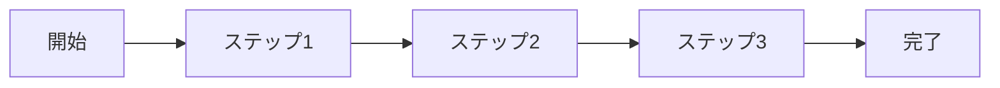

# [TODOCS: タイトル]

## 学習目標

このチュートリアルを完了すると、以下ができるようになります：

- [ ] [TODOCS: 目標1]
- [ ] [TODOCS: 目標2]
- [ ] [TODOCS: 目標3]

**所要時間**: [TODOCS: 目安時間]

## 前提条件

始める前に、以下が必要です：

- [TODOCS: 必要なソフトウェア/環境]
- [TODOCS: 必要な知識]
- [LINK_NEEDED: 事前に完了すべきチュートリアル]

### 環境確認

```bash
# [TODOCS: 環境確認コマンド]
[NEEDS_EXAMPLE: バージョン確認等のコマンド]
```

期待される出力：
```
[NEEDS_EXAMPLE: 期待される出力]
```

## 概要

[TODOCS: このチュートリアルで行うことの全体像（1-2段落）]



## Step 1: [TODOCS: ステップ名]

### このステップの目的

[TODOCS: なぜこのステップが必要か、簡潔に]

### 手順

1. [TODOCS: 具体的な操作]

```bash
# [TODOCS: コマンドの説明]
[NEEDS_EXAMPLE: 実行コマンド]
```

2. [TODOCS: 次の操作]

### 確認ポイント ✓

以下を確認してください：

- [ ] [TODOCS: 確認項目1]
- [ ] [TODOCS: 確認項目2]

期待される結果：
```
[NEEDS_EXAMPLE: 期待される出力/状態]
```

> **トラブルシューティング**: [TODOCS: よくある問題と対処法]
> [LINK_NEEDED: 詳細なトラブルシューティングへのリンク]

---

## Step 2: [TODOCS: ステップ名]

### このステップの目的

[TODOCS: なぜこのステップが必要か]

### 手順

1. [TODOCS: 操作]

```python
# [TODOCS: コードの説明]
[NEEDS_EXAMPLE: サンプルコード]
```

### 確認ポイント ✓

- [ ] [TODOCS: 確認項目]

---

## Step 3: [TODOCS: ステップ名]

### このステップの目的

[TODOCS: 目的]

### 手順

[TODOCS: 手順]

### 確認ポイント ✓

- [ ] [TODOCS: 確認項目]

---

## 完了確認

おめでとうございます！以下がすべて完了していれば、チュートリアルは成功です：

- [ ] [TODOCS: 最終確認項目1]
- [ ] [TODOCS: 最終確認項目2]
- [ ] [TODOCS: 最終確認項目3]

### 成果物

このチュートリアルで作成したもの：

- [TODOCS: 作成したファイル/成果物]

## まとめ

このチュートリアルで学んだこと：

1. [TODOCS: 学習ポイント1]
2. [TODOCS: 学習ポイント2]
3. [TODOCS: 学習ポイント3]

## 次のステップ

- **深く理解する**: [LINK_NEEDED: 関連する概念説明]
- **実践で使う**: [LINK_NEEDED: ハウツーガイド]
- **定常作業化**: [LINK_NEEDED: ランブック]
- **次のチュートリアル**: [LINK_NEEDED: 次の学習ステップ]

## よくある質問

### Q: [TODOCS: よくある質問1]

[TODOCS: 回答]

### Q: [TODOCS: よくある質問2]

[TODOCS: 回答]

---

<!-- 検証チェックリスト（作成完了時に確認）
□ 学習目標が明確か
□ 前提条件が具体的か
□ 各ステップに確認ポイントがあるか
□ コマンド/コードはコピー&ペーストで動作するか
□ 所要時間は適切か（目安: 15-30分で完走可能）
□ 途中で詰まるポイントがないか
□ 次のステップへの誘導があるか
-->
