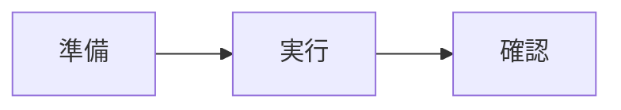

# [TODOCS: 〜する方法]

## 前提条件

このガイドを実行するには：

- [TODOCS: 必要な環境・ツール]
- [TODOCS: 必要な権限・アクセス]
- [LINK_NEEDED: 完了しているべき前提作業]

## 目的

[TODOCS: このガイドで達成すること（1-2文）]

## 手順概要



## 1. 準備

[TODOCS: 準備作業の説明]

```bash
[NEEDS_EXAMPLE: 準備コマンド]
```

## 2. 実行

### 2.1 [TODOCS: サブステップ]

[TODOCS: 説明]

```bash
[NEEDS_EXAMPLE: 実行コマンド]
```

### 2.2 [TODOCS: サブステップ]

[TODOCS: 説明]

```python
[NEEDS_EXAMPLE: コード例]
```

## 3. 結果の確認

以下を確認して、タスクが正常に完了したことを検証：

```bash
[NEEDS_EXAMPLE: 確認コマンド]
```

期待される結果：
```
[NEEDS_EXAMPLE: 期待される出力]
```

## バリエーション

### [TODOCS: 別のケース/オプション]

[TODOCS: 代替手順や追加オプションの説明]

```bash
[NEEDS_EXAMPLE: 代替コマンド]
```

## トラブルシューティング

| 症状 | 原因 | 対処法 |
|------|------|--------|
| [TODOCS] | [TODOCS] | [TODOCS] |
| [TODOCS] | [TODOCS] | [TODOCS] |

[LINK_NEEDED: 詳細なトラブルシューティングプレイブックへのリンク]

## 関連ドキュメント

- **概念理解**: [LINK_NEEDED: 背景となる概念説明]
- **定常作業**: [LINK_NEEDED: ランブック]
- **障害対応**: [LINK_NEEDED: プレイブック]
- **詳細仕様**: [LINK_NEEDED: リファレンス]

---

<!-- 検証チェックリスト（作成完了時に確認）
□ タイトルが「〜する方法」形式か
□ 前提条件が明確か
□ 1ドキュメント1タスクになっているか
□ 手順は実行可能か
□ 結果の確認方法があるか
□ トラブルシューティングがあるか
□ 運用ドキュメントへの遷移リンクがあるか
-->
