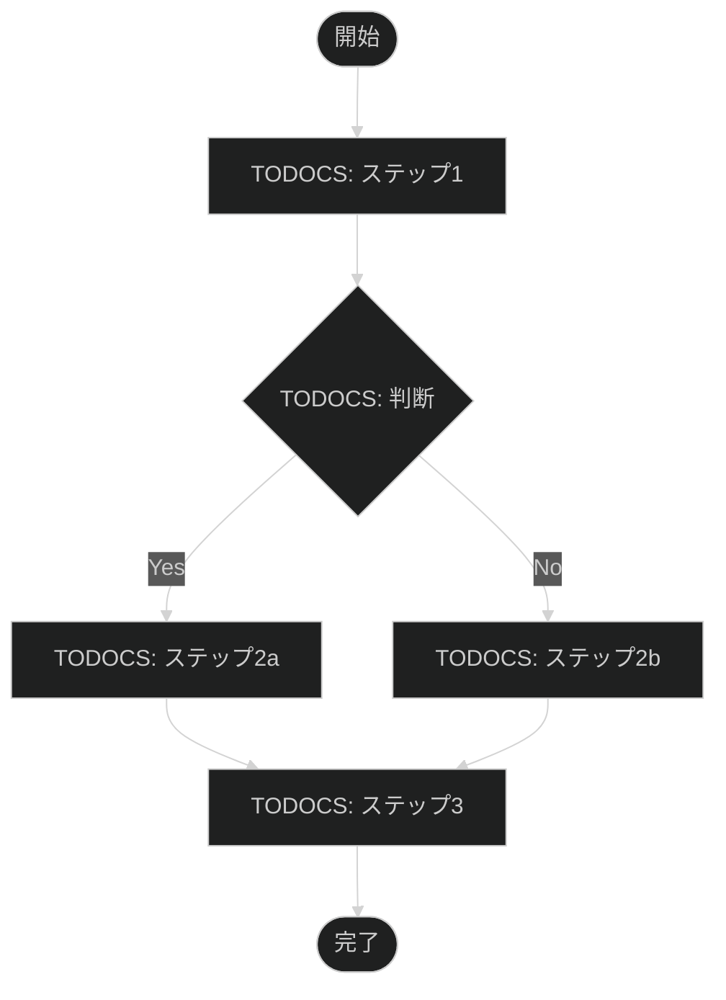

# [TODOCS: プロセス名]

## 概要

| 項目 | 内容 |
|------|------|
| **目的** | [TODOCS: このプロセスの目的] |
| **オーナー** | [TODOCS: 責任者] |
| **実行頻度** | [TODOCS: 頻度] |
| **所要時間** | [TODOCS: 目安時間] |

## プロセスフロー

## 入力

| 入力項目 | 形式 | 提供元 | 備考 |
|----------|------|--------|------|
| [TODOCS] | [TODOCS] | [TODOCS] | [TODOCS] |

## 出力

| 出力項目 | 形式 | 提供先 | 備考 |
|----------|------|--------|------|
| [TODOCS] | [TODOCS] | [TODOCS] | [TODOCS] |

## 詳細手順

### Phase 1: [TODOCS: フェーズ名]

**目的**: [TODOCS: このフェーズの目的]

**担当**: [TODOCS: 担当者/ロール]

1. [TODOCS: 手順1]
2. [TODOCS: 手順2]

**完了条件**: [TODOCS: このフェーズの完了条件]

**実行手順**: [LINK_NEEDED: ランブック/ハウツーへのリンク]

---

### Phase 2: [TODOCS: フェーズ名]

**目的**: [TODOCS: 目的]

**担当**: [TODOCS: 担当]

1. [TODOCS: 手順]

**完了条件**: [TODOCS: 完了条件]

**判断基準**:

| 条件 | 次のアクション |
|------|----------------|
| [TODOCS: 条件A] | [TODOCS: アクション] |
| [TODOCS: 条件B] | [TODOCS: アクション] |

---

### Phase 3: [TODOCS: フェーズ名]

[TODOCS: 同様に記述]

## 例外処理

| 例外状況 | 対応 | 担当 |
|----------|------|------|
| [TODOCS] | [TODOCS] | [TODOCS] |

**例外発生時**: [LINK_NEEDED: プレイブックへのリンク]

## 品質基準

| チェック項目 | 基準 | 確認方法 |
|--------------|------|----------|
| [TODOCS] | [TODOCS] | [TODOCS] |

## エスカレーション

| 状況 | エスカレーション先 | 期限 |
|------|-------------------|------|
| [TODOCS] | [TODOCS] | [TODOCS] |

## 関連ドキュメント

### 実行手順

- [LINK_NEEDED: Phase 1 ランブック]
- [LINK_NEEDED: Phase 2 ランブック]

### 障害対応

- [LINK_NEEDED: エラー対応プレイブック]

### 背景知識

- [LINK_NEEDED: 概念説明]

## 改訂履歴

| 日付 | バージョン | 変更内容 | 変更者 |
|------|------------|----------|--------|
| [TODOCS] | 1.0.0 | 初版作成 | [TODOCS] |

---

<!-- 検証チェックリスト（作成完了時に確認）
□ プロセスフロー図が全体を表現しているか
□ 入力・出力が明確か
□ 各フェーズの完了条件があるか
□ 例外処理が定義されているか
□ ランブック/プレイブックへのリンクがあるか
□ エスカレーションパスが明確か
□ オーナー/担当が明記されているか
-->
