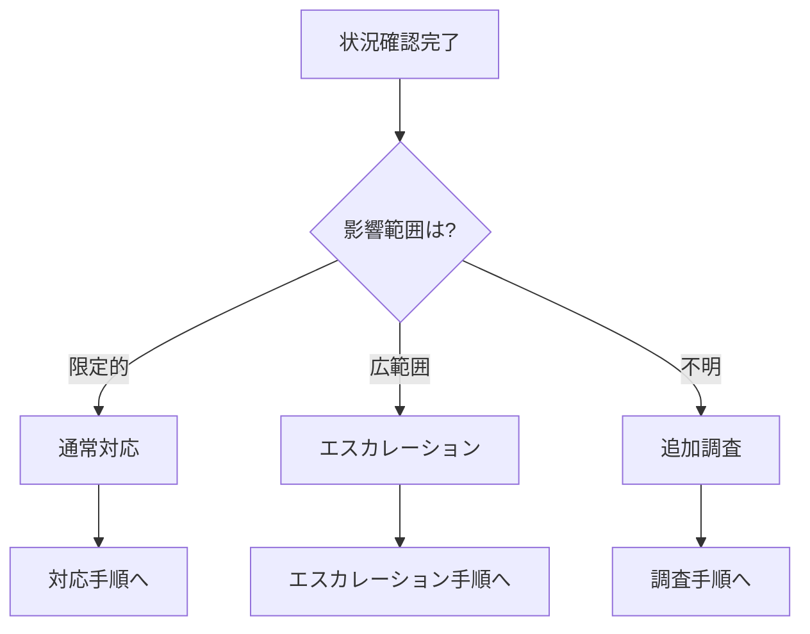
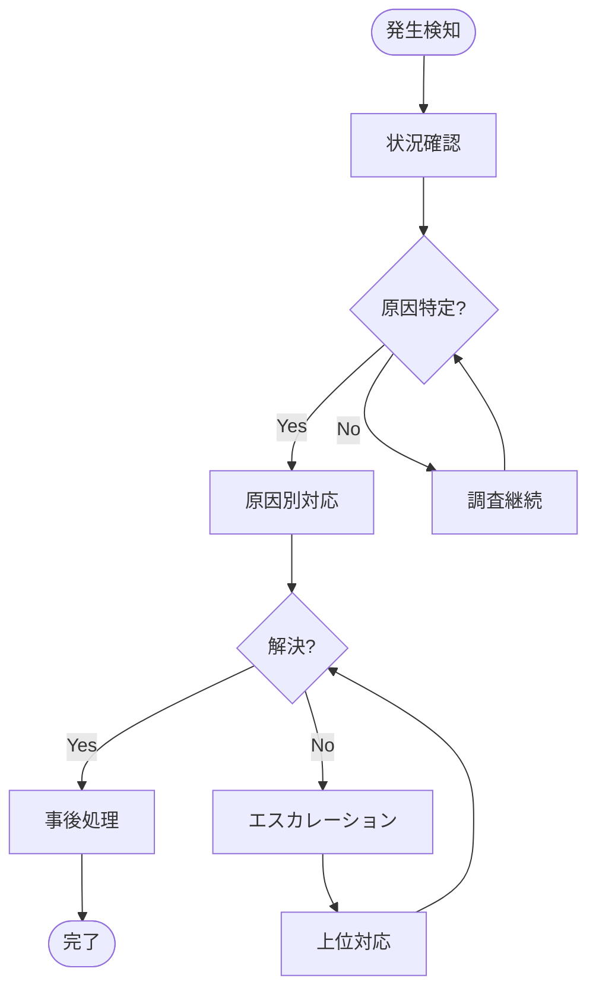

# [TODOCS: プレイブック名]

> ⚠️ **重要度**: [TODOCS: HIGH/MEDIUM/LOW]
> **最終テスト日**: [TODOCS: YYYY-MM-DD]

## トリガー条件

**このプレイブックを使用するのは**：

- [TODOCS: 条件1]
- [TODOCS: 条件2]
- [TODOCS: 条件3]

**使用しないのは**：

- [TODOCS: 除外条件]

## 初期対応（最初の5分）

### 1. 状況確認

```bash
[NEEDS_EXAMPLE: 状況確認コマンド]
```

### 2. 影響範囲の特定

| 確認項目 | 確認方法 | 結果記録 |
|----------|----------|----------|
| [TODOCS] | [TODOCS] | □ 正常 / □ 異常 |
| [TODOCS] | [TODOCS] | □ 正常 / □ 異常 |

### 3. 初期判断



## 対応フロー



## 原因別対応手順

### パターン A: [TODOCS: 原因パターン1]

**識別方法**：
- [TODOCS: この原因を特定する方法]

**対応手順**：

1. [TODOCS: ステップ1]

```bash
[NEEDS_EXAMPLE: 対応コマンド]
```

2. [TODOCS: ステップ2]

**確認**：
```bash
[NEEDS_EXAMPLE: 確認コマンド]
```

---

### パターン B: [TODOCS: 原因パターン2]

**識別方法**：
- [TODOCS: 識別方法]

**対応手順**：

1. [TODOCS: ステップ]

```bash
[NEEDS_EXAMPLE: コマンド]
```

---

### パターン C: 原因不明

**対応手順**：

1. ログ収集

```bash
[NEEDS_EXAMPLE: ログ収集コマンド]
```

2. 一時対処（可能な場合）

```bash
[NEEDS_EXAMPLE: 一時対処コマンド]
```

3. エスカレーション（下記参照）

## エスカレーション基準

| 条件 | エスカレーション先 | 連絡方法 |
|------|-------------------|----------|
| [TODOCS: 条件] | [TODOCS: 連絡先] | [TODOCS: 方法] |
| 30分以上解決しない | [TODOCS] | [TODOCS] |
| 影響範囲が拡大 | [TODOCS] | [TODOCS] |

### エスカレーション時の報告内容

```
【状況報告テンプレート】
発生日時: 
検知方法: 
影響範囲: 
現在の状況: 
実施した対応: 
必要な支援: 
```

## ロールバック手順

**ロールバック判断基準**：
- [TODOCS: ロールバックすべき条件]

**手順**：

```bash
[NEEDS_EXAMPLE: ロールバックコマンド]
```

**注意事項**：
- [TODOCS: ロールバック時の注意点]

## 事後処理

### 1. 復旧確認

- [ ] [TODOCS: 確認項目1]
- [ ] [TODOCS: 確認項目2]
- [ ] 関係者への復旧報告

### 2. 記録

| 記録項目 | 内容 |
|----------|------|
| 発生日時 | |
| 検知方法 | |
| 原因 | |
| 対応内容 | |
| 復旧日時 | |
| 再発防止策 | |

### 3. 振り返り

- [ ] インシデントレポート作成
- [ ] 再発防止策の検討
- [ ] ドキュメント更新の必要性確認

## 関連ドキュメント

- **詳細手順**: [LINK_NEEDED: 関連ランブック]
- **背景知識**: [LINK_NEEDED: 概念説明]
- **設定リファレンス**: [LINK_NEEDED: リファレンス]

## 改訂・テスト履歴

| 日付 | 内容 | 担当 |
|------|------|------|
| [TODOCS] | 初版作成 | [TODOCS] |
| [TODOCS] | 実地テスト | [TODOCS] |

---

<!-- 検証チェックリスト（作成完了時に確認）
□ トリガー条件が明確か
□ 判断分岐がフローチャートで示されているか
□ 各パターンの対応手順が具体的か
□ エスカレーション基準が明確か
□ ロールバック手順があるか
□ 事後処理・記録フォーマットがあるか
□ 定期的なテスト日が設定されているか
-->
