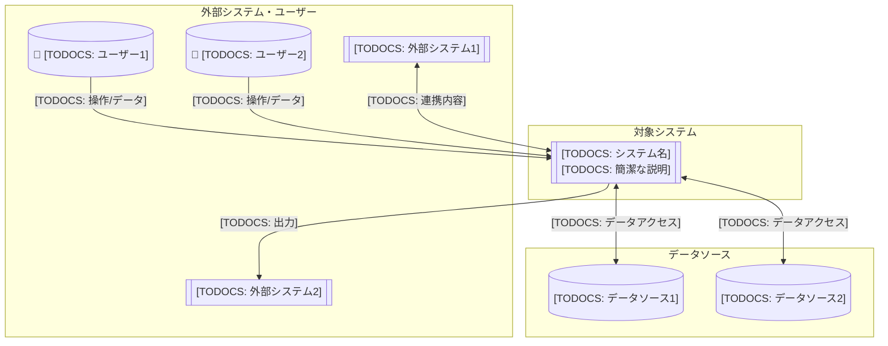
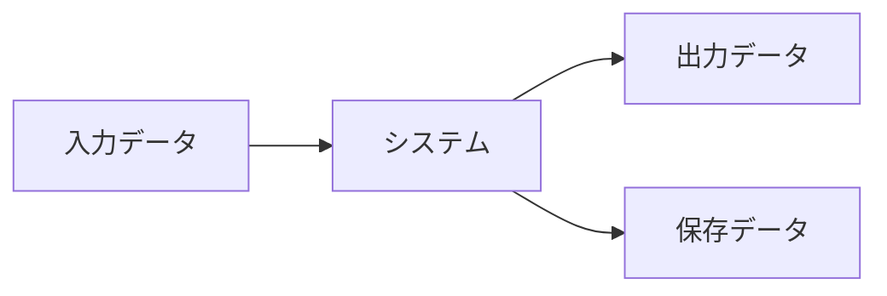

# [TODOCS: システム名] - システムコンテキスト (C4 Level 1)

## 概要

[TODOCS: システムの目的と価値（非技術者にも理解できる説明）]

## システムコンテキスト図

## ステークホルダー

| ステークホルダー | 役割 | システムとの関係 |
|------------------|------|------------------|
| [TODOCS] | [TODOCS] | [TODOCS] |
| [TODOCS] | [TODOCS] | [TODOCS] |

## 外部システム連携

| 外部システム | 連携方式 | データ/機能 | 方向 |
|--------------|----------|-------------|------|
| [TODOCS] | [TODOCS: API/ファイル/etc] | [TODOCS] | 入力/出力/双方向 |
| [TODOCS] | [TODOCS] | [TODOCS] | [TODOCS] |

## 主要なデータフロー

| データ | 形式 | 頻度 | 備考 |
|--------|------|------|------|
| [TODOCS: 入力] | [TODOCS] | [TODOCS] | [TODOCS] |
| [TODOCS: 出力] | [TODOCS] | [TODOCS] | [TODOCS] |

## システム境界

**スコープ内**：
- [TODOCS: このシステムが担う責務]

**スコープ外**：
- [TODOCS: このシステムが担わないこと]

## 前提条件・制約

| 項目 | 内容 |
|------|------|
| [TODOCS: 前提/制約] | [TODOCS: 詳細] |

## 次のレベル

より詳細な構造については：

- **Container図**: [LINK_NEEDED: Level 2 - 主要コンポーネント]

## 関連ドキュメント

- **概念説明**: [LINK_NEEDED: システムの背景・設計思想]
- **プロセス**: [LINK_NEEDED: 運用プロセス]

---

<!-- 検証チェックリスト
□ 非技術者にも理解できるか
□ すべての外部システム・ユーザーが含まれているか
□ データフローの方向が正しいか
□ システム境界が明確か
-->
