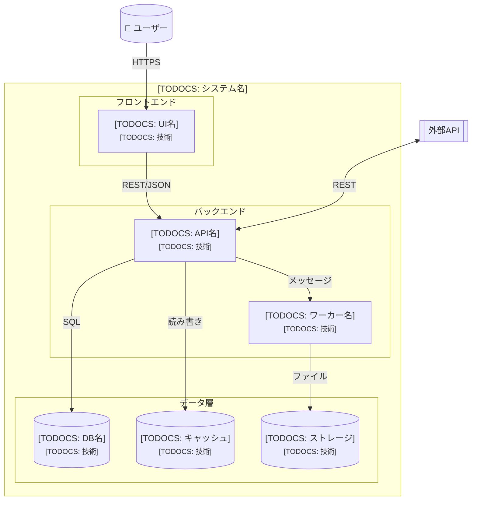
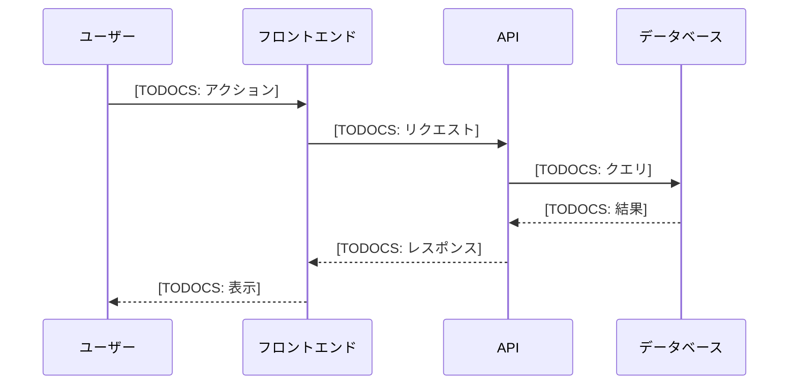

# [TODOCS: システム名] - コンテナ図 (C4 Level 2)

## 概要

[TODOCS: システムの技術構成の概要]

**上位レベル**: [LINK_NEEDED: Context図へのリンク]

## コンテナ図

## コンテナ一覧

| コンテナ | 技術 | 責務 | 備考 |
|----------|------|------|------|
| [TODOCS: 名前] | [TODOCS: 技術スタック] | [TODOCS: 主な責務] | [TODOCS] |
| [TODOCS: 名前] | [TODOCS: 技術スタック] | [TODOCS: 主な責務] | [TODOCS] |
| [TODOCS: 名前] | [TODOCS: 技術スタック] | [TODOCS: 主な責務] | [TODOCS] |

## 技術選択の理由

### [TODOCS: コンテナ/技術名]

**選択**: [TODOCS: 選択した技術]

**理由**:
- [TODOCS: 選択理由1]
- [TODOCS: 選択理由2]

**検討した代替案**: [TODOCS: 他の候補と却下理由]

[ASSUMPTION: 技術選択の背景に仮定がある場合]

---

### [TODOCS: コンテナ/技術名]

[TODOCS: 同様に記述]

## 通信プロトコル

| 通信経路 | プロトコル | 認証 | 備考 |
|----------|------------|------|------|
| UI → API | [TODOCS: HTTPS/REST] | [TODOCS] | [TODOCS] |
| API → DB | [TODOCS: TCP/SQL] | [TODOCS] | [TODOCS] |
| API → 外部 | [TODOCS] | [TODOCS] | [TODOCS] |

## データフロー詳細

### [TODOCS: フロー名]

## デプロイメント概要

| コンテナ | 実行環境 | スケーリング |
|----------|----------|--------------|
| [TODOCS] | [TODOCS: EC2/ECS/etc] | [TODOCS: 水平/垂直] |

[LINK_NEEDED: 詳細なデプロイメント図]

## 次のレベル

各コンテナの内部構造：

- [LINK_NEEDED: コンテナA - Component図]
- [LINK_NEEDED: コンテナB - Component図]

## 関連ドキュメント

- **上位**: [LINK_NEEDED: Context図]
- **詳細**: [LINK_NEEDED: Component図]
- **運用**: [LINK_NEEDED: デプロイメントプロセス]
- **設定**: [LINK_NEEDED: 設定リファレンス]

---

<!-- 検証チェックリスト
□ すべての主要コンテナが含まれているか
□ 技術選択の理由が明記されているか
□ 通信プロトコルが明確か
□ 上位・下位レベルへのリンクがあるか
-->
