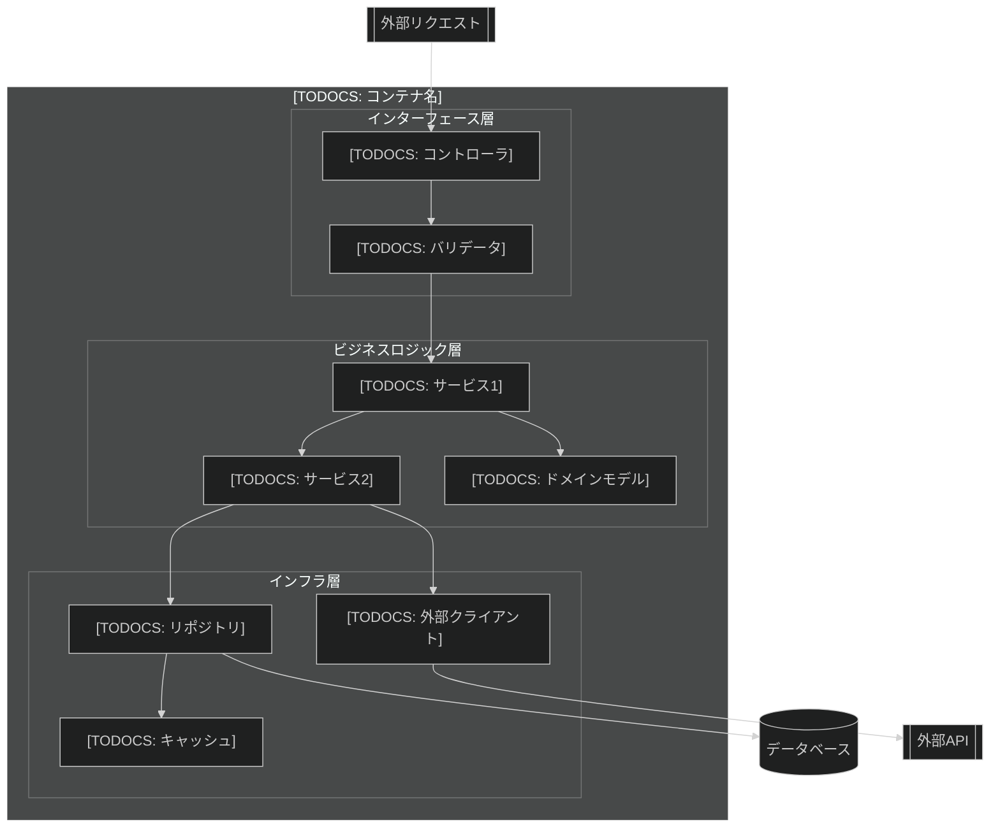
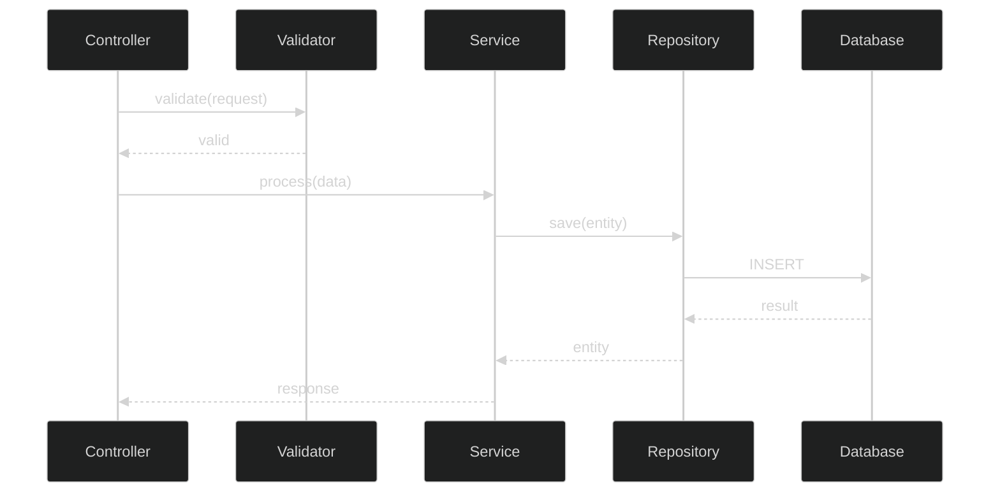

# [TODOCS: コンテナ名] - コンポーネント図 (C4 Level 3)

## 概要

[TODOCS: このコンテナの内部構造の概要]

**上位レベル**: [LINK_NEEDED: Container図へのリンク]

## コンポーネント図



## コンポーネント一覧

| コンポーネント | 種類 | 責務 | 依存先 |
|----------------|------|------|--------|
| [TODOCS] | [TODOCS: Controller/Service/etc] | [TODOCS] | [TODOCS] |
| [TODOCS] | [TODOCS] | [TODOCS] | [TODOCS] |
| [TODOCS] | [TODOCS] | [TODOCS] | [TODOCS] |

## 詳細設計

### [TODOCS: コンポーネント名]

**責務**: [TODOCS: 単一責任の説明]

**インターフェース**:

```python
# [TODOCS: 主要なインターフェース/クラス定義]
class [TODOCS: ClassName]:
    def [TODOCS: method](self, [TODOCS: params]) -> [TODOCS: return]:
        """[TODOCS: docstring]"""
        pass
```

[NEEDS_EXAMPLE: 実際のコード例]

**依存関係**:
- 入力: [TODOCS: 依存するコンポーネント]
- 出力: [TODOCS: 依存されるコンポーネント]

---

### [TODOCS: コンポーネント名]

[TODOCS: 同様に記述]

## クラス図

```mermaid
%%{init: {'theme': 'dark'}}%%
classDiagram
    class [TODOCS: ClassName] {
        +[TODOCS: attribute]: [type]
        +[TODOCS: method](): [return]
    }
    
    class [TODOCS: ClassName2] {
        +[TODOCS: attribute]: [type]
    }
    
    [TODOCS: ClassName] --> [TODOCS: ClassName2]: uses
```

## データモデル

### [TODOCS: エンティティ名]

| フィールド | 型 | 必須 | 説明 |
|------------|-----|------|------|
| [TODOCS] | [TODOCS] | Yes/No | [TODOCS] |
| [TODOCS] | [TODOCS] | Yes/No | [TODOCS] |

## 処理フロー

### [TODOCS: 処理名]



## エラーハンドリング

| エラー種別 | 発生箇所 | 処理方法 |
|------------|----------|----------|
| [TODOCS] | [TODOCS] | [TODOCS] |
| [TODOCS] | [TODOCS] | [TODOCS] |

## 設定パラメータ

| パラメータ | デフォルト | 説明 |
|------------|------------|------|
| [TODOCS] | [TODOCS] | [TODOCS] |

[LINK_NEEDED: 設定リファレンスへのリンク]

## テスト観点

| コンポーネント | テスト種別 | 観点 |
|----------------|------------|------|
| [TODOCS] | Unit | [TODOCS] |
| [TODOCS] | Integration | [TODOCS] |

## 関連ドキュメント

- **上位**: [LINK_NEEDED: Container図]
- **実装詳細**: [LINK_NEEDED: コードリファレンス]
- **API仕様**: [LINK_NEEDED: APIリファレンス]
- **運用**: [LINK_NEEDED: 関連ランブック]

---

<!-- 検証チェックリスト
□ 各コンポーネントの責務が単一か
□ 依存関係が明確か
□ インターフェースが定義されているか
□ エラーハンドリングが記載されているか
□ 上位レベルへのリンクがあるか
-->
