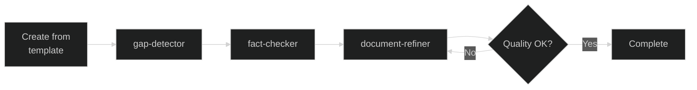
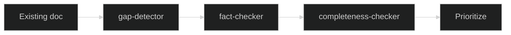
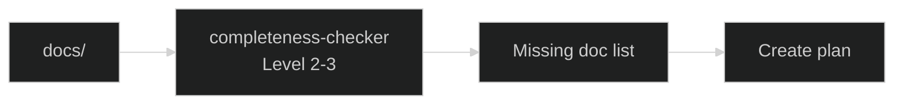

# Sub-agents Index / サブエージェント一覧

Documentation verification and improvement sub-agents.
ドキュメント検証・改善のための専門サブエージェント群。

## Directory Structure / ディレクトリ構成

```
.claude/agents/
├── INDEX.md                        # This file / このファイル
├── gap-detector/
│   ├── agent.ja.md                 # 日本語版
│   └── agent.en.md                 # English version
├── fact-checker/
│   ├── agent.ja.md
│   └── agent.en.md
├── completeness-checker/
│   ├── agent.ja.md
│   └── agent.en.md
└── document-refiner/
    ├── agent.ja.md
    └── agent.en.md

reports/                            # Agent output directory
├── gap-reports/
├── fact-check-reports/
├── completeness-reports/
└── refine-reports/
```

## Agent Overview / エージェント概要

| Agent | Purpose / 目的 | Permissions / 権限 |
|-------|----------------|-------------------|
| **gap-detector** | Detect gaps / ギャップ検出 | read: docs, write: reports |
| **fact-checker** | Verify facts / ファクト検証 | read: docs+src, write: reports, execute: syntax check |
| **completeness-checker** | Check coverage / 完全性確認 | read: docs+reports, write: reports |
| **document-refiner** | Improve docs / ドキュメント改善 | read: docs+reports, **write: docs**, write: reports |

## Permission Model / 権限モデル

```
┌─────────────────────────────────────────────────────────────┐
│                    Permission Levels                         │
├─────────────────────────────────────────────────────────────┤
│  gap-detector        : READ docs → WRITE reports            │
│  fact-checker        : READ docs+src → WRITE reports        │
│  completeness-checker: READ docs+reports → WRITE reports    │
│  document-refiner    : READ all → WRITE docs+reports        │
└─────────────────────────────────────────────────────────────┘

Only document-refiner can modify source documents.
document-refiner のみがソースドキュメントを修正可能。
```

## Recommended Workflow / 推奨ワークフロー

### New Document Creation / 新規ドキュメント作成



### Existing Document Audit / 既存ドキュメント監査



### Systematic Audit / 体系的監査



## Quick Reference / クイックリファレンス

### Commands / コマンド

```bash
# Gap detection / ギャップ検出
/gap-detect docs/path/to/file.md

# Fact check / ファクトチェック
/fact-check docs/path/to/file.md

# Completeness check / 完全性チェック
/completeness-check docs/

# Refine document / ドキュメント改善
/refine docs/path/to/file.md
```

### Auto-execution Hooks / 自動実行Hooks

| Trigger / トリガー | Agent | Action / アクション |
|-------------------|-------|---------------------|
| File created in docs/ | gap-detector | Auto-run / 自動実行 |
| File updated in docs/ | gap-detector | Suggest / 提案 |
| reference/**/*.md updated | fact-checker | Auto-run / 自動実行 |
| how-to/**/*.md updated | fact-checker | Suggest / 提案 |
| gap-detector complete | document-refiner | Suggest / 提案 |
| fact-checker complete | document-refiner | Suggest / 提案 |
| Weekly (Mon 9am) | completeness-checker | Auto-run / 自動実行 |

## Report Output / レポート出力

All reports are output to `reports/` directory with YAML frontmatter.
全レポートは YAML フロントマター付きで `reports/` ディレクトリに出力。

```markdown
---
report_type: gap-detection | fact-check | completeness | refine
source_file: "path/to/source.md"
generated_at: "YYYY-MM-DD HH:MM:SS"
agent: agent-name
summary:
  ...
---
```

## Language Selection / 言語選択

Each agent has Japanese (`.ja.md`) and English (`.en.md`) versions.
各エージェントに日本語版（`.ja.md`）と英語版（`.en.md`）があります。

Set preferred language in Claude Code settings or specify per command:
Claude Code設定で優先言語を設定するか、コマンドごとに指定：

```bash
/gap-detect --lang ja docs/file.md
/gap-detect --lang en docs/file.md
```

## Best Practices / ベストプラクティス

1. **Run detection before refinement**
   検出を改善の前に実行
   
2. **Use report integration for refinement**
   改善時はレポート統合を活用
   
3. **Human review for SME_NEEDED markers**
   SME_NEEDED マーカーは人間レビュー
   
4. **Weekly completeness audit**
   週次で完全性監査を実行

## Troubleshooting / トラブルシューティング

### Agent not triggered / エージェントが起動しない

```bash
# Check structure / 構造確認
ls -la .claude/agents/

# Check file exists / ファイル存在確認
cat .claude/agents/gap-detector/agent.ja.md
```

### Unexpected output / 期待した出力でない

- Check file path is correct / パスが正しいか確認
- Understand agent constraints / エージェントの制約を理解
- Explicitly specify agent name / エージェント名を明示的に指定
