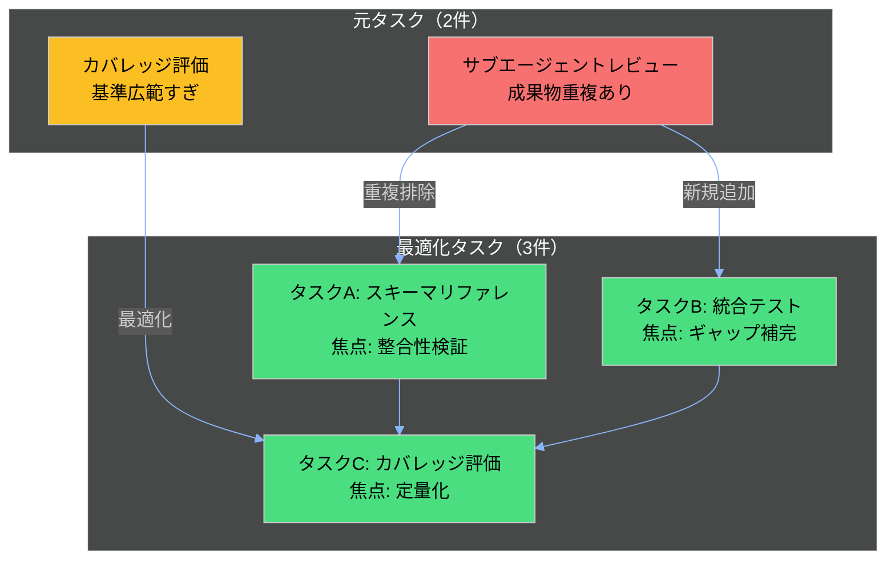
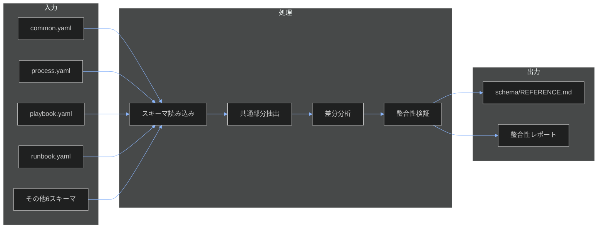
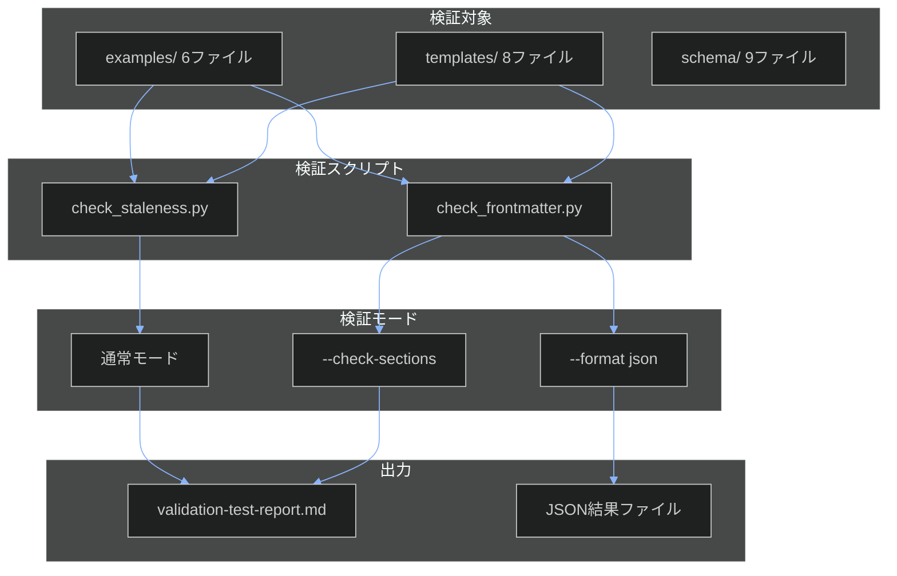
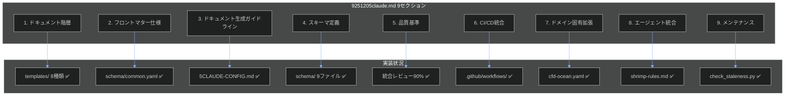
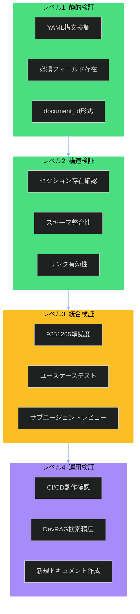
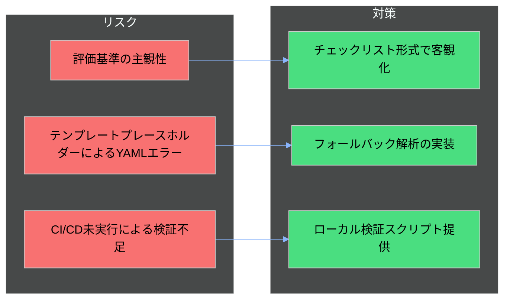

# 3doca 最適化実装計画

## 概要

本ドキュメントは、3docaプロジェクトのPhase 5タスクを最適化し、実効性・効果・検証方法を含む実装計画を定義します。

### 背景

- **元タスク数**: 2（サブエージェントレビュー、カバレッジ評価）
- **問題点**: 成果物重複、検証基準の広範さ、統合検証の欠如
- **最適化後**: 3タスクに再構成（焦点明確化、ギャップ補完）

---

## タスク再構成サマリー



---

## タスクA: スキーマリファレンス作成と整合性検証

### 目的

schema/ディレクトリの9スキーマを統合したリファレンスドキュメントを作成し、スキーマ↔テンプレート↔実例の三者整合性を検証する。

### 実効性分析

| 観点 | 評価 | 根拠 |
|------|------|------|
| **必要性** | 高 | スキーマ定義が分散しており、統合参照が困難 |
| **効果** | 中 | エージェントのドキュメント生成精度向上 |
| **工数** | 中 | 2-3時間（既存スキーマの統合） |
| **リスク** | 低 | 既存資産の整理のみ、破壊的変更なし |

### 実装方針



### 検証方法

**レベル1: 静的検証**
- [ ] 9スキーマすべてがYAML構文的に正しい
- [ ] common.yamlの必須フィールドが全スキーマで参照されている

**レベル2: 構造検証**
- [ ] 各スキーマのrequired sectionsがテンプレートに存在
- [ ] テンプレートのセクションがスキーマで定義されている

**レベル3: 統合検証**
- [ ] 実例がスキーマに準拠している（サンプル検証）

### 成果物

| ファイル | 説明 | 推定サイズ |
|---------|------|-----------|
| schema/REFERENCE.md | 統合スキーマリファレンス | 300行 |
| 02-project-records/quality-reviews/schema-consistency-report.md | 整合性レポート | 100行 |

### 成功基準

- [ ] 9スキーマすべてがリファレンスに記載
- [ ] 整合性エラーゼロ
- [ ] テンプレートとスキーマの対応表が完成

---

## タスクB: 検証スクリプト統合テスト

### 目的

check_frontmatter.pyとcheck_staleness.pyの統合動作確認を行い、全テンプレート・実例・スキーマでの検証を実行する。

### 実効性分析

| 観点 | 評価 | 根拠 |
|------|------|------|
| **必要性** | 高 | 個別テストのみで統合テスト未実施 |
| **効果** | 高 | CI/CD実行前の品質保証 |
| **工数** | 小 | 1時間（既存スクリプト実行） |
| **リスク** | 低 | 読み取り専用操作 |

### 実装方針



### 検証方法

**テストケース一覧**

| テストID | 対象 | スクリプト | オプション | 期待結果 |
|----------|------|-----------|-----------|----------|
| VT-001 | templates/*.md | check_frontmatter.py | なし | エラー0 |
| VT-002 | templates/*.md | check_frontmatter.py | --check-sections | 警告のみ許容 |
| VT-003 | examples/*.md | check_frontmatter.py | なし | エラー0 |
| VT-004 | examples/*.md | check_frontmatter.py | --format json | 有効JSON出力 |
| VT-005 | templates/*.md | check_staleness.py | なし | 正常終了 |
| VT-006 | examples/*.md | check_staleness.py | なし | 正常終了 |

### 成果物

| ファイル | 説明 | 推定サイズ |
|---------|------|-----------|
| 02-project-records/quality-reviews/validation-test-report.md | テスト結果レポート | 150行 |
| 02-project-records/quality-reviews/validation-results.json | JSON結果 | - |

### 成功基準

- [ ] 6テストケースすべてパス
- [ ] 終了コード0（エラーなし）または2（警告のみ）
- [ ] JSON出力が有効なJSON形式

---

## タスクC: フレームワークカバレッジ最終評価

### 目的

9251205claude.mdフレームワークへの準拠度を定量評価し、目標80%以上の達成を確認する。

### 実効性分析

| 観点 | 評価 | 根拠 |
|------|------|------|
| **必要性** | 高 | プロジェクト完了判定に必須 |
| **効果** | 高 | 定量的な達成度可視化 |
| **工数** | 大 | 3-4時間（スクリプト作成+評価） |
| **リスク** | 中 | 評価基準の主観性 |

### 9セクション評価マトリクス



### 評価基準（配点）

| セクション | 配点 | 評価項目 |
|-----------|------|---------|
| 1. ドキュメント階層 | 15% | テンプレート8種類、Diátaxis準拠 |
| 2. フロントマター仕様 | 15% | 必須6フィールド、拡張4フィールド |
| 3. 生成ガイドライン | 10% | CLAUDE-CONFIG.md存在、プロンプトパターン |
| 4. スキーマ定義 | 15% | 9スキーマ、セクション定義、依存関係 |
| 5. 品質基準 | 10% | 5軸基準、検証スクリプト |
| 6. CI/CD統合 | 10% | 4ジョブ定義、トリガー設定 |
| 7. ドメイン固有 | 10% | CFD/Ocean対応 |
| 8. エージェント統合 | 10% | shrimp-rules.md、Serenaメモリ |
| 9. メンテナンス | 5% | 陳腐化検出、レビューサイクル |

### 実装方針

```python
# coverage_report.py 概要（pseudocode）

SECTIONS = {
    "document_hierarchy": {"weight": 0.15, "checks": [...]},
    "frontmatter_spec": {"weight": 0.15, "checks": [...]},
    # ... 9セクション定義
}

def evaluate_section(section_name):
    """セクション別達成度を0-100%で評価"""
    checks = SECTIONS[section_name]["checks"]
    passed = sum(1 for c in checks if c.verify())
    return (passed / len(checks)) * 100

def calculate_total_score():
    """加重平均で総合スコア算出"""
    total = 0
    for name, config in SECTIONS.items():
        score = evaluate_section(name)
        total += score * config["weight"]
    return total

# 出力: Markdown形式のレポート
```

### 検証方法

**レベル1: 静的検証**
- [ ] 各セクションの成果物が存在する

**レベル2: 構造検証**
- [ ] check_frontmatter.py --check-sectionsがパス

**レベル3: 統合検証**
- [ ] 代表クエリ5件での応答確認

**レベル4: 運用検証**
- [ ] 新規ドキュメント作成テスト

### 成果物

| ファイル | 説明 | 推定サイズ |
|---------|------|-----------|
| coverage_report.py | 評価スクリプト | 200行 |
| 02-project-records/quality-reviews/framework-coverage-report.md | カバレッジレポート | 300行 |

### 成功基準

- [ ] 総合スコア80%以上
- [ ] 全9セクションで50%以上
- [ ] Critical欠損ゼロ

---

## 検証レベル体系



### 各レベルの実行タイミング

| レベル | 実行タイミング | 自動化 | 担当 |
|--------|---------------|--------|------|
| L1 | 毎コミット | 可能 | CI/CD |
| L2 | 毎PR | 可能 | CI/CD |
| L3 | Phase完了時 | 一部可能 | サブエージェント |
| L4 | プロジェクト完了時 | 不可 | 手動 |

---

## リスクと対策



### リスク詳細

| リスクID | リスク | 影響度 | 発生確率 | 対策 |
|----------|--------|--------|----------|------|
| R1 | 評価基準の主観性 | 中 | 高 | チェックリスト形式、二値判定 |
| R2 | YAMLエラー | 低 | 高 | フォールバック解析（check_frontmatter.py実装済み） |
| R3 | CI/CD未実行 | 中 | 中 | ローカル検証、手動実行手順 |
| R4 | DevRAG優先度制御なし | 高 | 確定 | ドキュメント構造最適化で代替 |

---

## 実行スケジュール

```mermaid
%%{init: {'theme': 'dark', 'themeVariables': {'doneTextColor0': '#1E1E2E'}}}%%
gantt
    title Phase 5 実行スケジュール
    dateFormat HH:mm
    axisFormat %H:%M

    section タスクA
    スキーマ読み込み        :a1, 00:00, 30m
    整合性検証              :a2, after a1, 60m
    REFERENCE.md作成        :a3, after a2, 60m

    section タスクB
    テストケース実行        :b1, 00:00, 30m
    レポート作成            :b2, after b1, 30m

    section タスクC
    coverage_report.py作成  :c1, after a3, 90m
    9セクション評価         :c2, after c1, 60m
    レポート作成            :c3, after c2, 60m
```



### 並行実行可能性

- **タスクA + タスクB**: 並行実行可能（依存関係なし）
- **タスクC**: タスクA, B完了後に実行（統合結果を使用）

---

## 完了判定基準

### 必須基準

- [ ] タスクA: スキーマリファレンス完成、整合性エラーゼロ
- [ ] タスクB: 6テストケースすべてパス
- [ ] タスクC: 総合スコア80%以上

### 推奨基準

- [ ] レベル4運用検証の一部実施
- [ ] 改善提案リストの作成
- [ ] 次フェーズ計画の策定

---

## 参照ドキュメント

- [TASK-SPECIFICATION.md](./TASK-SPECIFICATION.md) - タスク仕様書
- [TASK-HISTORY.md](./TASK-HISTORY.md) - 変更履歴
- [9251205claude.md](../01-doc-framework/9251205claude.md) - 基準フレームワーク
- [check_frontmatter.py](../check_frontmatter.py) - 検証スクリプト
