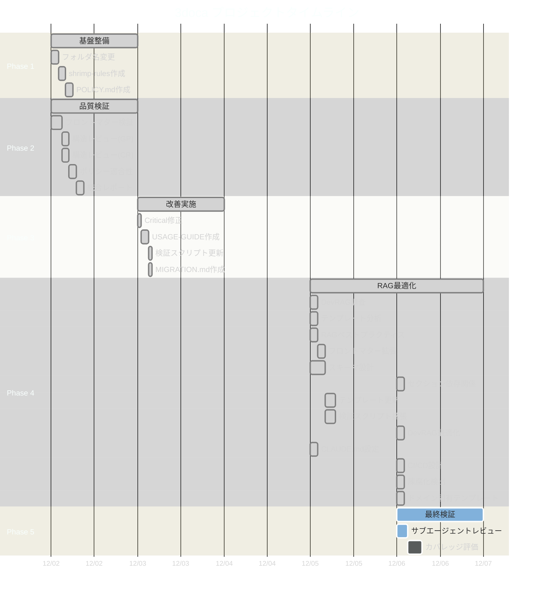
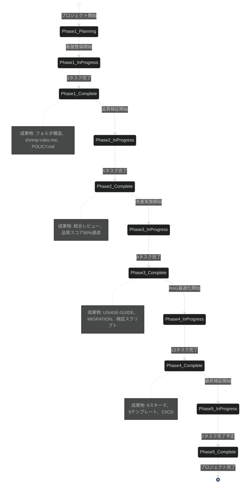
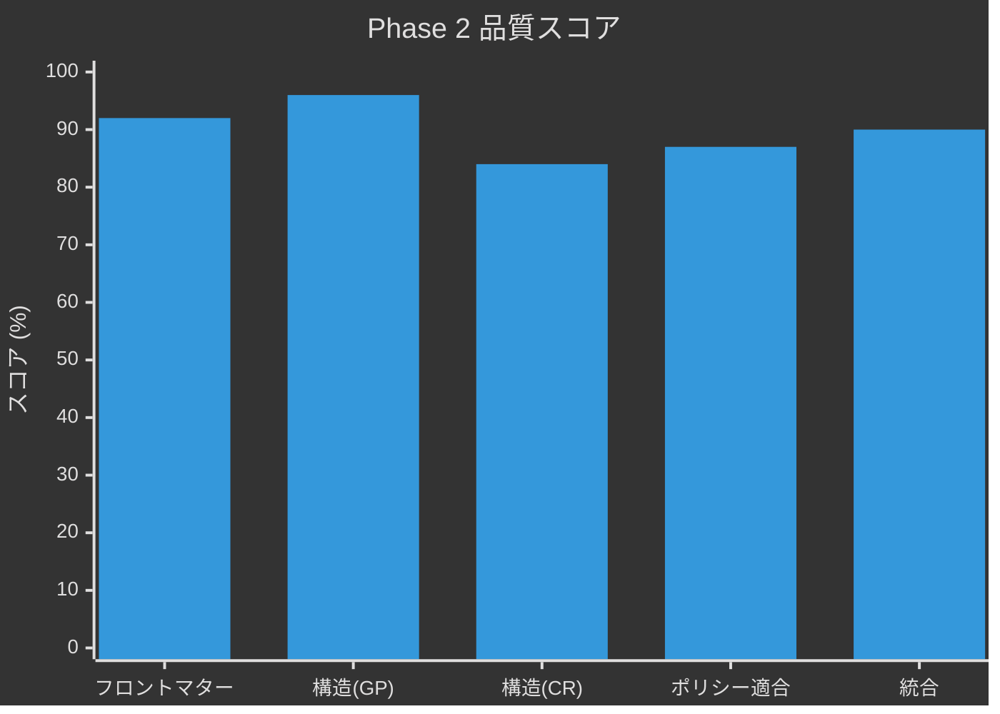
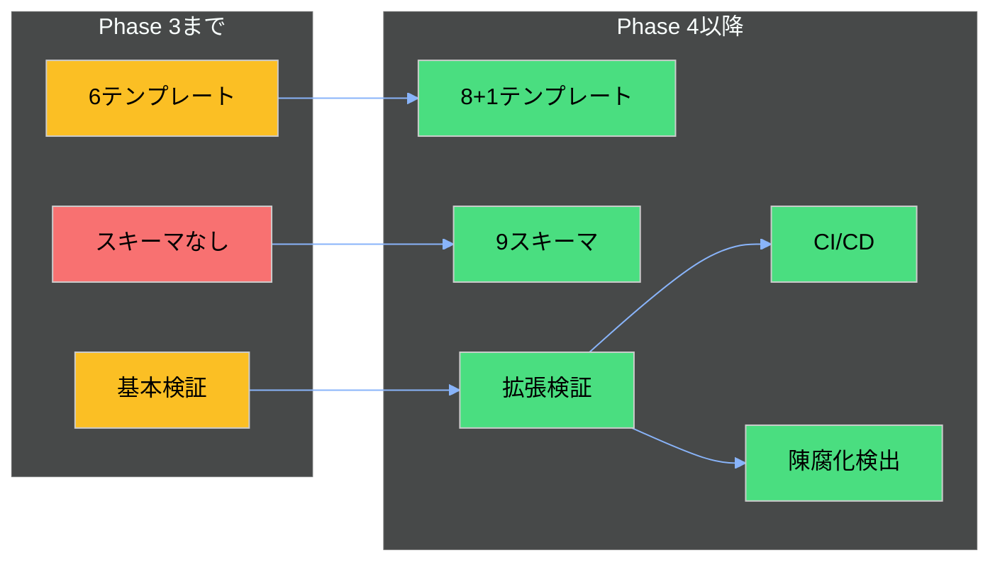
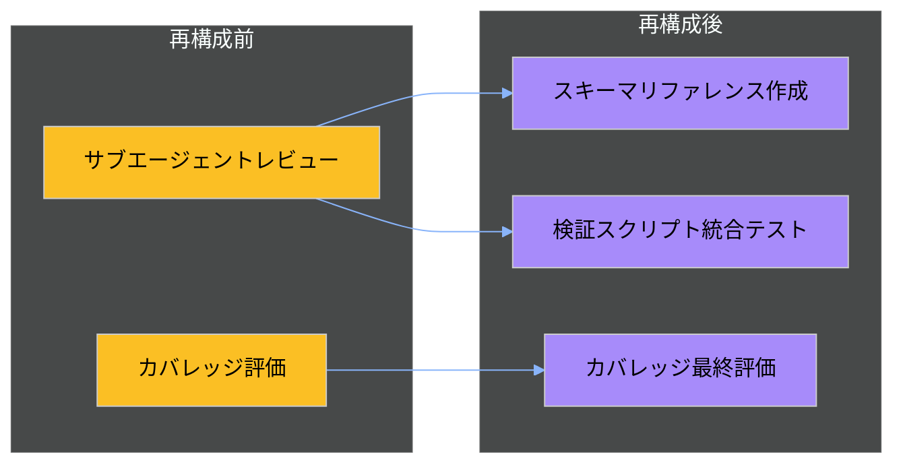
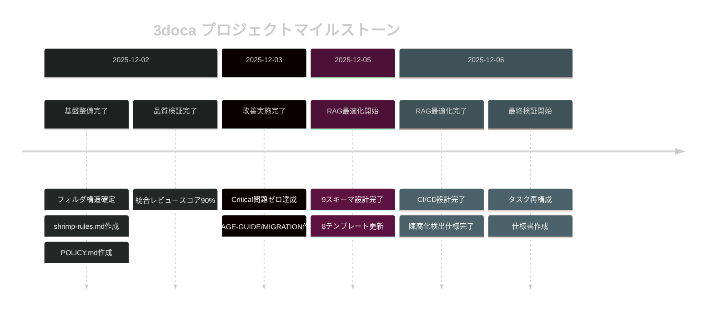

# 3doca タスク変更履歴

## 概要

本ドキュメントは、3docaプロジェクトの変更履歴、決定事項、状態遷移を記録します。

---

## プロジェクトタイムライン



---

## Phase状態遷移



---

## Phase別変更履歴

### Phase 1: 基盤整備 (2025-12-02)

#### 決定事項

| 決定ID | 決定内容 | 理由 | 代替案 |
|--------|---------|------|--------|
| D1-001 | フォルダ番号付け（01-, 02-） | 優先順位の視覚化、読む順番の明確化 | アルファベット順 |
| D1-002 | shrimp-rules.md形式 | init_project_rulesツールによる標準化 | 手動作成 |
| D1-003 | POLICY.mdの配置 | 01-doc-framework/内でフレームワークと一体化 | プロジェクトルート |

#### 変更ログ

```
2025-12-02 02:25 - タスク計画開始
2025-12-02 02:32 - フォルダ名変更完了 (tmp2 → 01-doc-framework)
2025-12-02 02:38 - shrimp-rules.md作成 (357行)
2025-12-02 02:41 - POLICY.md作成完了
```

---

### Phase 2: 品質検証 (2025-12-02)

#### 決定事項

| 決定ID | 決定内容 | 理由 | 代替案 |
|--------|---------|------|--------|
| D2-001 | 2サブエージェント並行レビュー | 多角的評価、見落とし防止 | 単一レビュー |
| D2-002 | 5軸品質基準 | 9251205claude.md準拠 | 3軸簡易版 |
| D2-003 | 統合レポート形式 | 4評価の比較可能性確保 | 個別レポートのみ |

#### 品質スコア推移



#### 変更ログ

```
2025-12-02 08:00 - フロントマター検証完了 (92%)
2025-12-02 11:30 - 構造レビュー(GP)完了 (96%)
2025-12-02 12:00 - 構造レビュー(CR)完了 (84%)
2025-12-02 13:13 - ポリシー適合性分析完了 (87%)
2025-12-02 13:31 - 統合レポート作成完了
```

#### 検出された問題

| 重大度 | 問題ID | 問題内容 | 対応状況 |
|--------|--------|---------|----------|
| Critical | C1 | examples/30-anti-patterns.md description欠落 | ✅ Phase 3で修正 |
| Important | I3 | category不一致 | ✅ Phase 3で修正 |
| Important | I7 | adoption-report.md未記載 | ✅ Phase 3で修正 |

---

### Phase 3: 改善実施 (2025-12-03)

#### 決定事項

| 決定ID | 決定内容 | 理由 | 代替案 |
|--------|---------|------|--------|
| D3-001 | USAGE-GUIDE 5-10分読了 | 実用性重視、クイックスタート | 詳細マニュアル |
| D3-002 | MIGRATION 3ステップ | シンプルさ優先 | 5ステップ詳細版 |
| D3-003 | エラーメッセージにガイド参照 | 自力問題解決促進 | エラーのみ表示 |

#### 変更ログ

```
2025-12-03 01:34 - Phase 3タスク計画
2025-12-03 01:36 - Critical修正完了
2025-12-03 01:52 - USAGE-GUIDE.md作成 (209行)
2025-12-03 02:00 - 検証スクリプト更新完了
2025-12-03 02:02 - MIGRATION.md作成 (174行)
```

---

### Phase 4: RAG最適化・9251205claude.md統合 (2025-12-05 - 2025-12-06)

#### 決定事項

| 決定ID | 決定内容 | 理由 | 代替案 |
|--------|---------|------|--------|
| D4-001 | DevRAG優先度制御なし | DevRAG v1.1.0の制限 | 代替RAGシステム |
| D4-002 | 代替戦略としてドキュメント構造最適化 | セマンティック検索強化 | メタデータ依存 |
| D4-003 | 9スキーマ分離 | ドキュメントタイプ別管理 | 単一統合スキーマ |
| D4-004 | Policy/SOPテンプレート追加 | 9251205claude.md準拠 | 既存6テンプレートのみ |
| D4-005 | CFD/海洋ドメイン固有テンプレート | 専門分野対応 | 汎用テンプレートのみ |

#### アーキテクチャ変更



#### 変更ログ

```
2025-12-05 02:08 - Phase 4タスク計画（13タスク）
2025-12-05 13:36 - DevRAG調査完了（優先度制御なし判明）
2025-12-05 13:36 - テンプレート分析完了
2025-12-05 13:36 - RAGベストプラクティス調査完了
2025-12-05 13:38 - フロントマター拡張仕様設計完了
2025-12-05 21:32 - ドキュメントスキーマ設計完了（9ファイル）
2025-12-05 21:45 - CLAUDE.md設定作成完了
2025-12-05 22:03 - テンプレート更新完了（8テンプレート、スコア92）
2025-12-05 23:01 - 検証スクリプト拡張完了（626行、スコア90）
2025-12-06 15:47 - セクション依存関係マップ作成完了
2025-12-06 15:49 - DevRAGインデックス最適化完了
2025-12-06 15:52 - CI/CDパイプライン設計完了
2025-12-06 15:55 - 陳腐化検出仕様設計完了
2025-12-06 15:59 - ドメイン固有テンプレート作成完了
```

---

### Phase 5: 最終検証 (2025-12-06 - 進行中)

#### 決定事項

| 決定ID | 決定内容 | 理由 | 代替案 |
|--------|---------|------|--------|
| D5-001 | タスク再構成（2→3） | 重複排除、焦点明確化 | 既存タスク維持 |
| D5-002 | 検証レベル4段階 | 段階的品質保証 | 単一レベル |
| D5-003 | カバレッジ目標80% | 実用的な達成基準 | 100%完全準拠 |

#### タスク再構成



---

## 重要マイルストーン



---

## 学んだ教訓

### 成功パターン

1. **2サブエージェント並行レビュー**: 多角的評価で見落とし防止
2. **process_thoughtによる分析**: 構造化された5ステップ思考
3. **段階的Phase構成**: 依存関係明確化、リスク低減
4. **既存フレームワーク準拠**: 9251205claude.mdによる一貫性確保

### 改善点

1. **DevRAG優先度制御**: 事前調査で制限を早期発見すべきだった
2. **タスク粒度**: 一部タスクが大きすぎた（Phase 4の13タスク）
3. **成果物重複**: RAG最適化ガイドとDevRAG調査の重複

### 次回への提言

- 外部ツール依存タスクは事前に機能調査を実施
- 1Phaseあたり最大8タスクを目安に
- 成果物の事前定義で重複防止

---

## 参照ドキュメント

- [TASK-SPECIFICATION.md](./TASK-SPECIFICATION.md) - タスク仕様書
- [IMPLEMENTATION-PLAN.md](./IMPLEMENTATION-PLAN.md) - 実装計画
- [2025-12-02-integrated-review.md](./quality-reviews/2025-12-02-integrated-review.md) - 統合レビュー
