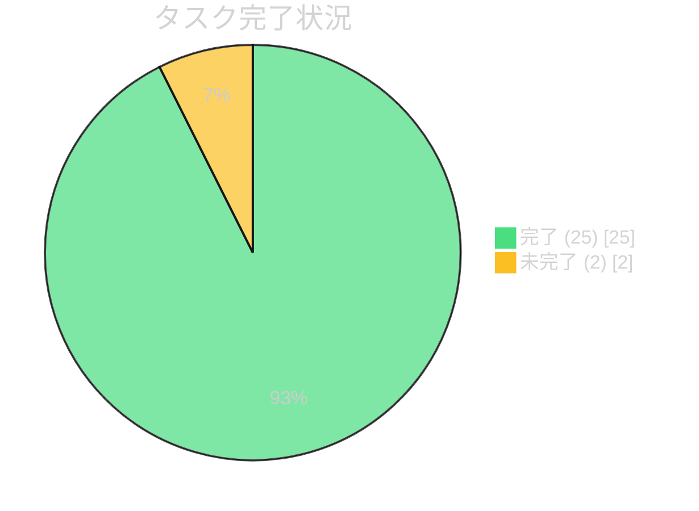
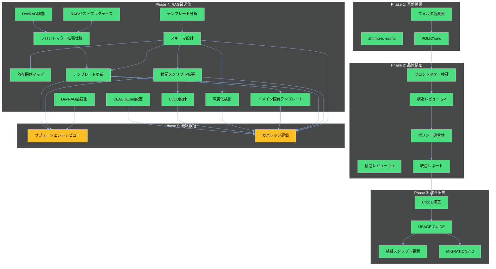

# 3doca タスク仕様書

## 概要

本ドキュメントは、3docaドキュメントフレームワークプロジェクトの全タスク（27件）の仕様・要求・依存関係を定義します。

### プロジェクト目的

Diátaxisフレームワークと9251205claude.mdに準拠した、RAG最適化された技術ドキュメント体系の構築。

### スコープ

- テンプレート体系: 8種類のドキュメントテンプレート
- スキーマ定義: 9種類のYAMLスキーマ
- 検証ツール: フロントマター検証、陳腐化検出
- CI/CD: GitHub Actionsによる品質自動検証

---

## タスク完了状況

---

## Phase別タスク一覧

### Phase 1: 基盤整備 (3タスク)

| ID | タスク名 | 目的 | ステータス | スコア |
|----|---------|------|-----------|--------|
| baa59392 | フォルダ名変更と番号付け | 優先順位の視覚化 | ✅ 完了 | - |
| 9e2a330d | shrimp-rules.md作成 | AIエージェント用ガイドライン | ✅ 完了 | - |
| 5f8d2760 | POLICY.md作成 | プロジェクトポリシー定義 | ✅ 完了 | - |

### Phase 2: 品質検証 (5タスク)

| ID | タスク名 | 目的 | ステータス | スコア |
|----|---------|------|-----------|--------|
| 4e8cea47 | フロントマター検証 | RAG対応標準適合確認 | ✅ 完了 | 92% |
| 6d37813c | 構造レビュー (GP) | 包括的構造分析 | ✅ 完了 | 96% |
| 3720538b | 構造レビュー (CR) | コード品質視点レビュー | ✅ 完了 | 84% |
| a2b6ea6c | ポリシー適合性分析 | 5軸品質基準評価 | ✅ 完了 | 87% |
| 9a536717 | 改善提案と統合レポート | 4評価の統合 | ✅ 完了 | - |

### Phase 3: 改善実施 (4タスク)

| ID | タスク名 | 目的 | ステータス | スコア |
|----|---------|------|-----------|--------|
| 43ea8c0a | Critical修正 | 重大問題の修正 | ✅ 完了 | - |
| a32a8a4a | USAGE-GUIDE.md作成 | テンプレート使用ガイド | ✅ 完了 | - |
| 2cf18e56 | 検証スクリプト更新 | エラーメッセージ改善 | ✅ 完了 | - |
| ceb36dab | MIGRATION.md作成 | 移行手順ガイド | ✅ 完了 | - |

### Phase 4: RAG最適化・9251205claude.md統合 (13タスク)

| ID | タスク名 | 目的 | ステータス | スコア |
|----|---------|------|-----------|--------|
| b4754f75 | DevRAG機能調査 | 優先度制御機能把握 | ✅ 完了 | - |
| 321d7b01 | テンプレート現状分析 | 6テンプレート分析 | ✅ 完了 | - |
| 9bb896d7 | RAGベストプラクティス調査 | 検索最適化手法調査 | ✅ 完了 | - |
| b66f5e7a | フロントマター拡張仕様設計 | priority, is_canonical等 | ✅ 完了 | - |
| f56e04c8 | ドキュメントスキーマ設計 | 9スキーマ作成 | ✅ 完了 | - |
| d340a78b | セクション依存関係マップ | Mermaid図で可視化 | ✅ 完了 | - |
| a0fbd5f1 | テンプレート更新 | Policy/SOP追加、8テンプレート更新 | ✅ 完了 | 92 |
| 4757f427 | 検証スクリプト拡張 | 9251205claude.md対応 | ✅ 完了 | 90 |
| d11660d5 | DevRAGインデックス最適化 | 代替戦略文書化 | ✅ 完了 | - |
| 07027586 | CLAUDE.md設定作成 | ドキュメント生成ガイドライン | ✅ 完了 | - |
| 5fa8c561 | CI/CDパイプライン設計 | GitHub Actions設定 | ✅ 完了 | - |
| 5f56367d | 陳腐化検出仕様設計 | レビューサイクル管理 | ✅ 完了 | - |
| af47ef8e | ドメイン固有テンプレート | CFD/海洋モデリング向け | ✅ 完了 | - |

### Phase 5: 最終検証 (2タスク - 未完了)

| ID | タスク名 | 目的 | ステータス | 依存関係 |
|----|---------|------|-----------|----------|
| 222eb0ac | 複数サブエージェントレビュー | 設計・実装品質検証 | ⏳ 未完了 | 3件完了済 |
| 4f7ee85c | カバレッジ評価・テスト | 9251205準拠度定量化 | ⏳ 未完了 | 7件完了済 |

---

## タスク依存関係図

---

## タスク詳細仕様

### Phase 1: 基盤整備

<strong>T1: フォルダ名変更と番号付け</strong>

**ID:** `baa59392-a7cb-4b3f-b228-7d0fc9662375`

**目的:**
tmp2フォルダを「01-doc-framework」に、project-recordsを「02-project-records」に変更し、優先順位に基づいた番号付けで読む順番を明確化する。

**要求仕様:**
- Git履歴を保持したリネーム
- 関連パスの全更新
- 番号プレフィックス: 01-, 02-

**検証基準:**
- `git log --follow`で履歴追跡可能
- 全参照パスが更新されている

**成果物:**
- 01-doc-framework/ ディレクトリ
- 02-project-records/ ディレクトリ

<strong>T2: shrimp-rules.md作成</strong>

**ID:** `9e2a330d-9f8d-4b3d-aff3-5a20dda2f4f3`

**目的:**
init_project_rulesツールを使用してAIエージェント用ガイドラインを生成。

**要求仕様:**
- プロジェクト固有ルールの体系化
- 10セクション以上の構成
- Diátaxisフレームワーク準拠

**検証基準:**
- 300行以上のコンテンツ
- 全セクションが実用的

**成果物:**
- shrimp-rules.md (357行)

<strong>T3: POLICY.md作成</strong>

**ID:** `5f8d2760-b31d-45ab-8433-107c87194a2a`

**目的:**
251129claude.mdの原則を実装レベルに落とし込んだプロジェクトポリシー文書を作成。

**要求仕様:**
- 10セクション構成
- 設計原則（Diátaxis、RAG対応）
- 品質基準、命名規則
- 01-doc-framework/からリンク

**検証基準:**
- 251129claude.mdの原則が反映されている
- README.mdからリンクされている

**成果物:**
- 01-doc-framework/3POLICY.md

### Phase 2: 品質検証

<strong>T4: フロントマター検証とリスト化</strong>

**ID:** `4e8cea47-dfcd-4b5e-9075-67408198cbdd`

**目的:**
全ドキュメントのフロントマターを検証し、RAG対応標準との適合性をチェック。

**要求仕様:**
- templates/とexamples/の全ファイル検証
- 必須フィールド存在確認
- Pythonスクリプトによる自動検証

**検証基準:**
- 12ファイル全て検証完了
- フロントマター存在率92%以上

**成果物:**
- check_frontmatter.py
- 02-project-records/quality-reviews/2025-12-02-frontmatter-check.md

<strong>T5: ドキュメント構造レビュー (general-purpose)</strong>

**ID:** `6d37813c-0c69-4dee-9bfd-1425f867c093`

**目的:**
general-purposeサブエージェントによる包括的構造分析。

**要求仕様:**
- 命名規則遵守確認
- README.mdリンク整合性
- ディレクトリ構成適切性

**検証基準:**
- 96/100以上のスコア
- 命名規則100%準拠

**成果物:**
- 02-project-records/quality-reviews/2025-12-02-structure-review.md

<strong>T6: ドキュメント構造レビュー (code-reviewer)</strong>

**ID:** `3720538b-501c-467d-8723-da2d97a7cb34`

**目的:**
code-reviewerサブエージェントによるコード品質視点レビュー。

**要求仕様:**
- 一貫性、完全性、可読性、正確性の4軸評価
- general-purposeとの比較検証

**検証基準:**
- 4軸すべて80%以上
- レポート16KB以上

**成果物:**
- 02-project-records/quality-reviews/structure-review-code-reviewer.md

<strong>T7: ポリシー適合性分析</strong>

**ID:** `a2b6ea6c-c1ef-4d9e-85a0-a0665fe2f14b`

**目的:**
process_thoughtによる5軸品質基準評価。

**要求仕様:**
- 1文書1概念
- 自己完結型セクション
- 代名詞回避
- キーワード前置
- チャンクサイズ最適化

**検証基準:**
- 5ステップ思考分析完了
- 総合スコア87%以上

**成果物:**
- 02-project-records/quality-reviews/2025-12-02-policy-compliance.md (516行)

<strong>T8: 改善提案と統合レポート</strong>

**ID:** `9a536717-39a8-418d-9352-bbd47324842e`

**目的:**
Phase 2の4評価を統合し、優先度付き改善リストを作成。

**要求仕様:**
- 4独立評価の統合
- 優先度付き改善リスト
- バッチ変換準備

**検証基準:**
- 619行以上のレポート
- 20KB以上

**成果物:**
- 02-project-records/quality-reviews/2025-12-02-integrated-review.md

### Phase 3: 改善実施

<strong>T9: Critical修正とREADME更新</strong>

**ID:** `43ea8c0a-2426-49d0-b42c-c75f585a2419`

**目的:**
統合レビューで検出されたCritical/Important問題を修正。

**要求仕様:**
- C1: description欠落修正
- I7: adoption-report.md未記載修正
- I3: category不一致修正

**検証基準:**
- 3ファイル修正完了
- Critical問題ゼロ

**成果物:**
- 修正済みテンプレート/実例ファイル

<strong>T10: USAGE-GUIDE.md作成</strong>

**ID:** `a32a8a4a-f7b6-4d29-a374-7bd849242519`

**目的:**
テンプレート利用者向けの簡潔な使用ガイド作成。

**要求仕様:**
- クイックスタート
- カスタマイズ手順
- よくある落とし穴（10項目）
- 品質チェックリスト
- 150-200行、5-10分で読了

**検証基準:**
- 209行以内
- 5セクション構成

**成果物:**
- 01-doc-framework/1USAGE-GUIDE.md

<strong>T11: フロントマター検証スクリプト更新</strong>

**ID:** `2cf18e56-3fe8-4a93-8830-8572e1da3f79`

**目的:**
エラーメッセージ改善とUSAGE-GUIDE.md参照リンク追加。

**要求仕様:**
- USAGE-GUIDE.mdへの参照リンク
- ベストプラクティス提案表示
- 自力問題解決サポート

**検証基準:**
- エラー時にガイド参照表示
- 改善提案が具体的

**成果物:**
- check_frontmatter.py (更新版)

<strong>T12: MIGRATION.md作成</strong>

**ID:** `ceb36dab-a627-4b98-aa65-e5245cead581`

**目的:**
別プロジェクトへの移行手順ガイド作成。

**要求仕様:**
- rsyncコマンド
- Git履歴保持方法
- カスタマイズポイント
- 3ステップで移行完了

**検証基準:**
- 50-80行（実際は174行、詳細版）
- 3ステップ構成

**成果物:**
- 01-doc-framework/2MIGRATION.md

### Phase 4: RAG最適化・9251205claude.md統合

<strong>T13-T25: RAG最適化タスク群</strong>

**概要:**
9251205claude.mdフレームワークへの完全準拠を目指した13タスク。

**主要成果物:**
- 9スキーマ定義 (schema/*.yaml)
- 8テンプレート更新 (templates/*.md)
- 検証スクリプト拡張 (check_frontmatter.py 626行)
- CI/CDパイプライン (.github/workflows/)
- 陳腐化検出 (check_staleness.py)
- ドメイン固有テンプレート (CFD/海洋)

**検証基準:**
- 全スキーマがYAML構文的に正しい
- 全テンプレートが必須セクションを含む
- CI/CDが構文的に正しい

### Phase 5: 最終検証

<strong>T26: 複数サブエージェントレビューと統合文書化</strong>

**ID:** `222eb0ac-e385-4ec9-8801-8d7426d70d8d`

**目的:**
general-purposeとcode-reviewerの並列レビューで設計・実装品質を検証。

**要求仕様:**
- 2つのサブエージェントによるレビュー
- レビュー指摘事項の対応
- RAG最適化ガイド更新
- スキーマリファレンス作成

**検証基準:**
- 2サブエージェントレビュー完了
- 指摘事項対応済み
- 成果物2件作成

**依存関係:**
- a0fbd5f1 (テンプレート更新) ✅
- 4757f427 (検証スクリプト拡張) ✅
- d11660d5 (DevRAG最適化) ✅

**ステータス:** ⏳ 未完了

<strong>T27: フレームワーク実装カバレッジ評価・テスト</strong>

**ID:** `4f7ee85c-1700-4692-94b8-e32795da715b`

**目的:**
9251205claude.mdフレームワークの実装カバレッジを評価し、応答パターンテストを実施。

**要求仕様:**
- 9セクション×達成度（0-100%）
- 加重平均による総合スコア算出
- 現状45%→目標88%の達成確認
- 代表クエリ10件での応答パターンテスト

**検証基準:**
- 9セクションすべてカバレッジ計測
- 総合スコア80%以上
- 構造検証テストパス
- related_docsリンク有効性確認
- 応答パターンテスト10件完了

**依存関係:** 7件すべて完了済み ✅

**成果物:**
- coverage_report.py
- 02-project-records/quality-reviews/framework-coverage-report.md

**ステータス:** ⏳ 未完了

---

## 成果物一覧

### ドキュメント

| ファイル | 行数 | 説明 |
|---------|------|------|
| 01-doc-framework/0README.md | - | メインREADME |
| 01-doc-framework/1USAGE-GUIDE.md | 209 | テンプレート使用ガイド |
| 01-doc-framework/2MIGRATION.md | 174 | 移行手順ガイド |
| 01-doc-framework/3POLICY.md | - | プロジェクトポリシー |
| 01-doc-framework/4FRONTMATTER-EXTENSION-SPEC.md | - | フロントマター拡張仕様 |
| 01-doc-framework/5CLAUDE-CONFIG.md | 280 | CLAUDE.md設定 |
| 01-doc-framework/5SECTION-DEPENDENCY-MAP.md | - | セクション依存関係マップ |
| 01-doc-framework/6DEVRAG-OPTIMIZATION-GUIDE.md | - | DevRAG最適化ガイド |
| 01-doc-framework/7CI-CD-GUIDE.md | - | CI/CDガイド |
| 01-doc-framework/8STALENESS-DETECTION-SPEC.md | - | 陳腐化検出仕様 |

### テンプレート (8ファイル)

| ファイル | ドキュメントタイプ |
|---------|------------------|
| 00process-document-template.md | Process |
| 01playbook-template.md | Playbook |
| 02runbook-template.md | Runbook |
| 03troubleshooting-template.md | Troubleshooting |
| 04adr-template.md | ADR |
| 05cheatsheet-template.md | Cheatsheet |
| 06policy-template.md | Policy |
| 07sop-template.md | SOP |
| 08cfd-ocean-sop-template.md | SOP (CFD/Ocean) |

### スキーマ (9ファイル)

| ファイル | 対象 |
|---------|------|
| common.yaml | 共通定義 |
| process.yaml | Process |
| playbook.yaml | Playbook |
| runbook.yaml | Runbook |
| troubleshooting.yaml | Troubleshooting |
| adr.yaml | ADR |
| cheatsheet.yaml | Cheatsheet |
| policy.yaml | Policy |
| sop.yaml | SOP |
| cfd-ocean.yaml | CFD/Ocean |

### 検証スクリプト

| ファイル | 行数 | 機能 |
|---------|------|------|
| check_frontmatter.py | 626 | フロントマター検証 |
| check_staleness.py | 350 | 陳腐化検出 |

### CI/CD

| ファイル | 機能 |
|---------|------|
| .github/workflows/docs-quality.yml | 品質検証 |
| .github/workflows/staleness-check.yml | 陳腐化検出 |

---

## 参照ドキュメント

- [TASK-HISTORY.md](./TASK-HISTORY.md) - 変更履歴・タイムライン
- [IMPLEMENTATION-PLAN.md](./IMPLEMENTATION-PLAN.md) - 実装計画
- [9251205claude.md](../01-doc-framework/9251205claude.md) - 基準フレームワーク
- [shrimp-rules.md](../shrimp-rules.md) - AIエージェント用ガイドライン
