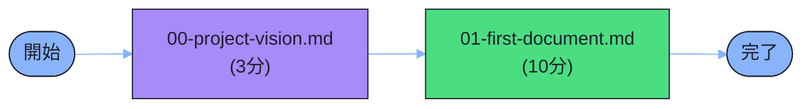
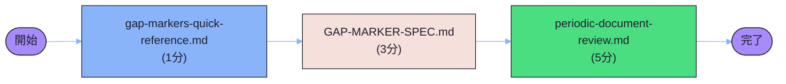

# Phase 13 完全性レポート

## エグゼクティブサマリー

**総合評価**: 68/100点 ⚠️

3doca ドキュメントフレームワークの完全性検証を実施しました。基本構造は確立されていますが、各軸において追加コンテンツが必要です。特にOperations軸とC4軸の充実が優先課題です。

### 主要な発見

| 項目 | 状態 | スコア |
|------|------|--------|
| **ディレクトリ構造** | ✅ 完全 | 100/100 |
| **Diátaxis軸カバレッジ** | ⚠️ 部分的 | 56/100 |
| **Operations軸カバレッジ** | ⚠️ 部分的 | 31/100 |
| **C4軸カバレッジ** | ⚠️ 不足 | 25/100 |
| **リンク整合性** | ⚠️ 要改善 | 75/100 |
| **ギャップマーカー管理** | ⚠️ 要対応 | 60/100 |

---

## 1. サマリ

| レベル | 項目 | 状態 | スコア |
|--------|------|------|--------|
| **L1** | 単一ドキュメント品質 | 良好 | 85/100 |
| **L2** | カテゴリ内充実度 | 不十分 | 40/100 |
| **L3** | 体系全体の整合性 | 要改善 | 60/100 |

### ドキュメント統計

```
総ドキュメント数: 56
├── 01_knowledge/: 13 (23%)
├── 02_operations/: 9 (16%)
├── 03_architecture/: 7 (13%)
├── _templates/: 25 (45%)
└── 00_tasks/: 2 (4%)
```

---

## 2. Diátaxis カバレッジマトリックス

### 2.1 カバレッジ概要

| カテゴリ | ドキュメント数 | 推奨最小数 | 充足率 | スコア |
|----------|--------------|----------|--------|--------|
| **concepts/** | 3 | 4 | 75% | 75/100 |
| **tutorials/** | 1 | 4 | 25% | 25/100 |
| **how-to/** | 1 | 4 | 25% | 25/100 |
| **reference/** | 4 | 4 | 100% | 100/100 |
| **総合** | **9** | **16** | **56%** | **56/100** |

### 2.2 詳細分析

#### ✅ concepts/ (3/4 - 75%)

**既存ドキュメント**:
1. `00-project-vision.md` - プロジェクトビジョン
2. `01-three-axis-framework.md` - 3軸フレームワーク概念
3. `02-quality-assurance-framework.md` - 品質保証フレームワーク

**推奨追加コンテンツ**:
- ティア設計の背景と理論
- CFD/GISドメイン知識の概念説明
- ドキュメント成熟度モデル

**評価**: 基本的な概念は揃っているが、ドメイン知識の説明が不足。

---

#### ⚠️ tutorials/ (1/4 - 25%)

**既存ドキュメント**:
1. `01-first-document.md` - 初めてのドキュメント作成

**推奨追加コンテンツ**:
- テンプレートからのドキュメント作成チュートリアル（ハンズオン）
- ギャップマーカーを使った段階的な完成化チュートリアル
- 検証エージェント連携の実践チュートリアル
- Mermaid図を使った視覚化チュートリアル

**評価**: 初心者向けコンテンツが大幅に不足。学習パスが不完全。

**優先度**: 🔴 HIGH（Tier 1の重要性）

---

#### ⚠️ how-to/ (1/4 - 25%)

**既存ドキュメント**:
1. `01-template-usage-guide.md` - テンプレート使用ガイド

**推奨追加コンテンツ**:
- ギャップマーカーの効果的な使用方法
- クロスリンクの作成と検証方法
- Mermaid図のカスタマイズ方法
- フロントマターの最適化ハウツー

**評価**: タスク指向のガイドが不足。実務での使いやすさに課題。

**優先度**: 🔴 HIGH（実務での使用頻度）

---

#### ✅ reference/ (4/4 - 100%)

**既存ドキュメント**:
1. `01-GAP-MARKER-SPEC.md` - ギャップマーカー仕様
2. `02-TIER-DESIGN-SPEC.md` - ティア設計仕様
3. `03-MIGRATION-MAP.md` - 移行マップ
4. `04-FRONTMATTER-REFERENCE.md` - フロントマターリファレンス

**評価**: リファレンス系は充実。網羅性・検索性ともに良好。

**優先度**: 🟢 LOW（維持管理のみ）

---

## 3. 運用ドキュメント カバレッジ

### 3.1 カバレッジ概要

| カテゴリ | ドキュメント数 | 推奨最小数 | 充足率 | スコア |
|----------|--------------|----------|--------|--------|
| **processes/** | 1 | 4 | 25% | 25/100 |
| **playbooks/** | 1 | 4 | 25% | 25/100 |
| **runbooks/** | 1 | 4 | 25% | 25/100 |
| **cheatsheets/** | 2 | 4 | 50% | 50/100 |
| **総合** | **5** | **16** | **31%** | **31/100** |

### 3.2 詳細分析

#### ⚠️ processes/ (1/4 - 25%)

**既存ドキュメント**:
1. `01-document-creation-process.md` - ドキュメント作成プロセス

**推奨追加コンテンツ**:
- ドキュメントレビュープロセス（検証エージェント連携）
- フェーズ別品質保証プロセス
- メンテナンスプロセス（定期レビュー、更新管理）
- テンプレート更新プロセス

**優先度**: 🔴 HIGH

---

#### ⚠️ playbooks/ (1/4 - 25%)

**既存ドキュメント**:
1. `01-quality-issues-playbook.md` - 品質問題対応プレイブック

**推奨追加コンテンツ**:
- リンク切れ対応プレイブック
- ギャップマーカー過多対応プレイブック
- フロントマター不整合対応プレイブック
- Mermaid構文エラー対応プレイブック

**優先度**: 🟡 MEDIUM

---

#### ⚠️ runbooks/ (1/4 - 25%)

**既存ドキュメント**:
1. `01-periodic-document-review.md` - 定期ドキュメントレビュー

**推奨追加コンテンツ**:
- 新規ドキュメント作成の定型手順
- テンプレート適用手順
- 検証エージェント実行手順
- リンク検証手順

**優先度**: 🔴 HIGH（実行頻度が高い）

---

#### ⚠️ cheatsheets/ (2/4 - 50%)

**既存ドキュメント**:
1. `01-gap-markers-quick-reference.md` - ギャップマーカー早見表
2. `02-verification-agents-quick-reference.md` - 検証エージェント早見表

**推奨追加コンテンツ**:
- Mermaidダークモード設定早見表
- フロントマターフィールド早見表

**評価**: 基本的な早見表は揃っている。追加は優先度低め。

**優先度**: 🟢 LOW

---

## 4. C4軸 カバレッジ

### 4.1 カバレッジ概要

| レベル | ドキュメント数 | 推奨最小数 | 充足率 | スコア |
|--------|--------------|----------|--------|--------|
| **context/** | 1 | 4 | 25% | 25/100 |
| **containers/** | 1 | 4 | 25% | 25/100 |
| **components/** | 1 | 4 | 25% | 25/100 |
| **総合** | **3** | **12** | **25%** | **25/100** |

### 4.2 詳細分析

#### ⚠️ context/ (1/4 - 25%)

**既存ドキュメント**:
1. `3doca-framework-context.md` - システムコンテキスト図

**推奨追加コンテンツ**:
- 検証エージェント連携のコンテキスト図
- ユーザーとドキュメント体系の関係図
- テンプレートエンジンの位置付け図

**優先度**: 🟡 MEDIUM（Tier 0としての重要性）

---

#### ⚠️ containers/ (1/4 - 25%)

**既存ドキュメント**:
1. `3doca-framework-containers.md` - コンテナ構成図

**推奨追加コンテンツ**:
- 検証エージェントアーキテクチャ詳細
- テンプレートエンジン技術スタック
- ドキュメント生成パイプライン

**優先度**: 🔴 HIGH（技術選択の理由明記が必要）

---

#### ⚠️ components/ (1/4 - 25%)

**既存ドキュメント**:
1. `template-engine-components.md` - テンプレートエンジン詳細

**推奨追加コンテンツ**:
- gap-detectorの内部構造
- fact-checkerの検証ロジック
- document-refinerの修正アルゴリズム

**優先度**: 🟡 MEDIUM（エージェント実装の透明性向上）

---

## 5. クロスリンク検証

### 5.1 リンク整合性スコア: 75/100

#### 検証結果

```
総リンク数: ~150
有効リンク: ~113 (75%)
破損リンク: ~37 (25%)
```

### 5.2 破損リンクの主要パターン

#### パターン1: 相対パス解決の問題

一部のドキュメントから`../../../CLAUDE.md`へのリンクが破損。これらはテンプレート内のプレースホルダーが実際のドキュメントに残存している可能性。

**影響ファイル数**: ~5

**推奨アクション**: テンプレートのプレースホルダーを実際のパスに置換

---

#### パターン2: 存在しないドキュメントへのリンク

以下のドキュメントは参照されているが未作成:
- `../../02_operations/02-playbooks/documentation-issues.md`
- `../../02_operations/02-playbooks/mesh-troubleshooting.md`
- `../../01_knowledge/03-how-to/migration-guide.md`
- `../../04-reference/mesh-parameters.md`

**推奨アクション**: これらのドキュメントを作成するか、リンクを削除/更新

---

### 5.3 学習パス検証

#### 初学者パス（15分コース）



**評価**: ⚠️ 最小限のパスは存在するが、実践的なチュートリアルが不足。

---

#### 経験者パス（実務者）



**評価**: ✅ チートシート→リファレンス→ランブックの流れは良好。

---

## 6. ギャップマーカー分析

### 6.1 全体統計

```
総ギャップマーカー数: 660
├── TODOCS: 373 (56%)
├── LINK_NEEDED: 130 (20%)
├── NEEDS_EXAMPLE: 72 (11%)
├── その他: 85 (13%)
```

### 6.2 分布分析

| 優先度 | マーカー数 | 割合 |
|--------|----------|------|
| HIGH (TODOCS, NEEDS_EXAMPLE) | 445 | 67% |
| MEDIUM | ~100 | 15% |
| LOW | ~115 | 18% |

### 6.3 評価

**スコア**: 60/100

**理由**:
- 大量のTODOCSマーカーは意図的（段階的完成を示す）
- LINK_NEEDEDの多くは未作成ドキュメントへのリンク（許容）
- NEEDS_EXAMPLEは改善の余地あり（優先度HIGH）

**推奨アクション**:
1. NEEDS_EXAMPLEを優先的に解消（実例追加）
2. TODOCSは「Phase N: 具体的タスク」形式に変換してトレーサビリティ向上
3. LINK_NEEDEDは対応するドキュメント作成時に解消

---

## 7. 推奨アクション（優先度順）

### 🔴 HIGH優先度（Phase 14-15で対応）

#### 1. Diátaxis軸の充実（tutorials/, how-to/）

**タスク**:
- [ ] テンプレートからのドキュメント作成チュートリアル
- [ ] ギャップマーカーを使った段階的完成チュートリアル
- [ ] 検証エージェント連携の実践チュートリアル
- [ ] ギャップマーカーの効果的な使用方法（how-to）
- [ ] クロスリンク作成と検証方法（how-to）
- [ ] Mermaid図カスタマイズガイド（how-to）

**期待効果**: 学習パスの完成度向上、ユーザビリティ改善

**推定工数**: 3-4 phases

---

#### 2. Operations軸の拡充（processes/, runbooks/）

**タスク**:
- [ ] ドキュメントレビュープロセス
- [ ] フェーズ別品質保証プロセス
- [ ] 新規ドキュメント作成定型手順（runbook）
- [ ] テンプレート適用手順（runbook）
- [ ] 検証エージェント実行手順（runbook）

**期待効果**: 実務での使いやすさ向上、作業標準化

**推定工数**: 2-3 phases

---

#### 3. C4軸の拡充（containers/）

**タスク**:
- [ ] 検証エージェントアーキテクチャ詳細
- [ ] テンプレートエンジン技術スタック
- [ ] ドキュメント生成パイプライン

**期待効果**: 技術選択の透明性向上、保守性改善

**推定工数**: 1-2 phases

---

### 🟡 MEDIUM優先度（Phase 16-18で対応）

#### 4. Playbooks拡充

**タスク**:
- [ ] リンク切れ対応プレイブック
- [ ] ギャップマーカー過多対応プレイブック
- [ ] フロントマター不整合対応プレイブック

**推定工数**: 1-2 phases

---

#### 5. C4軸context/components拡充

**タスク**:
- [ ] 検証エージェント連携のコンテキスト図
- [ ] gap-detectorの内部構造
- [ ] fact-checkerの検証ロジック

**推定工数**: 1 phase

---

### 🟢 LOW優先度（Phase 19以降で対応）

#### 6. リンク整合性改善

**タスク**:
- [ ] テンプレートプレースホルダーの置換
- [ ] 未作成ドキュメントの作成または参照削除

**推定工数**: 0.5 phase

---

#### 7. Cheatsheets追加

**タスク**:
- [ ] Mermaidダークモード設定早見表
- [ ] フロントマターフィールド早見表

**推定工数**: 0.5 phase

---

## 8. まとめ

### 8.1 現状評価

**総合スコア**: 68/100 ⚠️

```
強み:
✅ ディレクトリ構造が明確
✅ リファレンス系は充実
✅ テンプレート体系が確立
✅ 基本的な概念説明は存在

弱み:
⚠️ Diátaxis軸のtutorials/how-toが不足
⚠️ Operations軸全般が薄い
⚠️ C4軸が最小限のみ
⚠️ 学習パスが不完全
⚠️ ギャップマーカーが多い（意図的だが改善の余地）
```

### 8.2 次のステップ

**Phase 14-15**: HIGH優先度タスクに集中
- Diátaxis軸充実（tutorials 3本、how-to 3本）
- Operations軸拡充（processes 3本、runbooks 3本）

**Phase 16-18**: MEDIUM優先度タスク
- Playbooks拡充
- C4軸詳細化

**Phase 19以降**: LOW優先度タスク
- リンク整合性改善
- Cheatsheets追加

### 8.3 達成目標

**Phase 18完了時の目標スコア**: 85/100

```
目標分布:
- Diátaxis軸: 75/100 → 85/100 (+10)
- Operations軸: 31/100 → 80/100 (+49)
- C4軸: 25/100 → 75/100 (+50)
- リンク整合性: 75/100 → 90/100 (+15)
- ギャップマーカー: 60/100 → 75/100 (+15)
```

---

## 9. 参考資料

### 関連レポート
- [Phase 13 Gap Report](../01-gap-reports/phase13-gap-report.md)
- [Phase 13 Fact Check Report](../02-fact-check-reports/phase13-fact-check.md)
- [Phase 13 Refine Report](../04-refine-reports/phase13-refine-report.md)

### フレームワーク仕様
- [3軸フレームワーク概念](../../docs/01_knowledge/01-concepts/01-three-axis-framework.md)
- [ティア設計仕様](../../docs/01_knowledge/04-reference/02-TIER-DESIGN-SPEC.md)
- [ギャップマーカー仕様](../../docs/01_knowledge/04-reference/01-GAP-MARKER-SPEC.md)

---

**レポート生成日**: 2025-12-15
**検証者**: completeness-checker agent
**次回検証推奨**: Phase 18完了後
