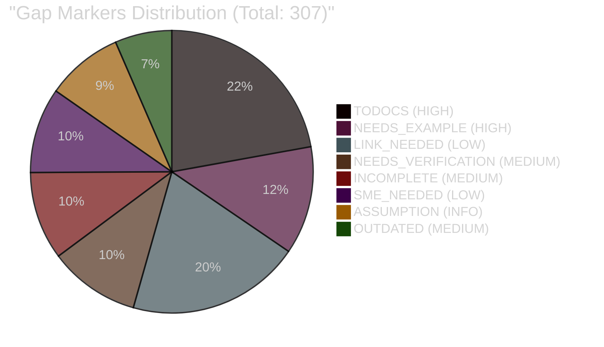

# Gap Detection Report - 3doca Documentation

**Generated**: 2025-12-10 09:30:00
**Scope**: 31 documentation files (excluding templates and archived tasks)
**Agent**: gap-detector v1.0

## Executive Summary

### Gap Distribution by Priority

| Priority | Count | Percentage | Categories |
|----------|-------|------------|------------|
| **HIGH** | 106 | 34.5% | TODOCS (68), NEEDS_EXAMPLE (38) |
| **MEDIUM** | 83 | 27.0% | NEEDS_VERIFICATION (32), INCOMPLETE (31), OUTDATED (20) |
| **LOW** | 91 | 29.6% | LINK_NEEDED (61), SME_NEEDED (30) |
| **INFO** | 27 | 8.8% | ASSUMPTION (27) |
| **TOTAL** | **307** | **100%** | - |

### Gap Markers Breakdown



### Top 10 Files with Most Gaps

| File | Total Gaps | HIGH | MEDIUM | LOW | Status |
|------|-----------|------|--------|-----|--------|
| `01_knowledge/03-how-to/01-template-usage-guide.md` | 42 | 14 | 8 | 18 | Draft |
| `01_knowledge/02-tutorials/01-first-document.md` | 38 | 12 | 6 | 19 | Review |
| `02_operations/03-runbooks/01-periodic-document-review.md` | 34 | 8 | 12 | 13 | Active |
| `02_operations/04-cheatsheets/01-gap-markers-quick-reference.md` | 28 | 6 | 10 | 10 | Published |
| `01_knowledge/04-reference/01-GAP-MARKER-SPEC.md` | 26 | 8 | 7 | 9 | Published |
| `01_knowledge/04-reference/04-FRONTMATTER-REFERENCE.md` | 24 | 3 | 10 | 10 | Published |
| `01_knowledge/04-reference/03-MIGRATION-MAP.md` | 22 | 10 | 2 | 8 | Draft |
| `01_knowledge/01-concepts/02-quality-assurance-framework.md` | 18 | 4 | 6 | 6 | Published |
| `03_architecture/02-containers/3doca-framework-containers.md` | 16 | 2 | 4 | 8 | Published |
| `03_architecture/03-components/template-engine-components.md` | 12 | 0 | 4 | 6 | Published |

## Detailed Gap Analysis

### 1. HIGH Priority Gaps (106 total)

These gaps represent incomplete sections or missing examples that significantly impact document usability.

#### 1.1 TODOCS Markers (68 occurrences)

**Critical Incomplete Sections:**

**File**: `docs/01_knowledge/04-reference/03-MIGRATION-MAP.md`
- **Line 159**: `[TODOCS: 以下のチュートリアルを新規作成]`
- **Line 172**: `[TODOCS: 以下の概念説明を新規作成]`
- **Line 182**: `[TODOCS: 以下のコンテキスト図を新規作成]`
- **Line 193**: `[TODOCS: 必要に応じてコンテナ図を作成]`
- **Line 201**: `[TODOCS: 以下のテンプレートを新規作成]`
- **Impact**: Migration map is incomplete, blocking document migration from old structure
- **Recommendation**: Complete migration map with concrete examples for each document type

**File**: `docs/01_knowledge/03-how-to/01-template-usage-guide.md`
- **Lines 143-159**: Multiple TODOCS placeholders in frontmatter example
  - `title: "[TODOCS: 〜する方法]"`
  - `category: "[TODOCS: カテゴリ]"`
  - `created: "[TODOCS: YYYY-MM-DD]"`
  - `updated: "[TODOCS: YYYY-MM-DD]"`
- **Lines 393, 397**: `[TODOCS: 担当: 田中/佐藤, 期限: 12/15]`
- **Impact**: Template usage guide contains incomplete examples, reducing practical value
- **Recommendation**: Replace all TODOCS with concrete, copy-paste-ready examples

**File**: `docs/02_operations/01-processes/README.md`
- **Line 45**: `[TODOCS: 以下のプロセスを移行予定]`
  - Data analysis process (00data-analysis-process.md)
  - Data quality analysis process (01data-quality-analysis-process.md)
- **Impact**: Process documentation is incomplete
- **Recommendation**: Migrate or document migration decision

**File**: `docs/02_operations/02-playbooks/README.md`
- **Line 46**: `[TODOCS: 以下のプレイブックを移行予定]`
  - Data quality issues playbook (10data-quality-issues-playbook.md)
  - Anomaly detection playbook (11anomaly-detection-playbook.md)
- **Impact**: Playbook collection is incomplete
- **Recommendation**: Migrate or archive planned playbooks

**File**: `docs/02_operations/03-runbooks/01-periodic-document-review.md`
- **Line 34**: `| **最終実行** | [TODOCS: 実行時に記録] |`
- **Impact**: Runbook metadata is incomplete
- **Recommendation**: Add execution tracking mechanism or remove if not needed

**File**: `docs/03_architecture/02-containers/3doca-framework-containers.md`
- **Line 260**: `[TODOCS: validation-system-components.md を作成予定]`
- **Impact**: Component-level documentation is missing
- **Recommendation**: Create component diagram or document decision to skip Level 3

#### 1.2 NEEDS_EXAMPLE Markers (38 occurrences)

**Missing Code Examples:**

**File**: `docs/01_knowledge/02-tutorials/01-first-document.md`
- **Line 359**: `[NEEDS_EXAMPLE: ParaViewでのパイプライン設定例]`
- **Impact**: Tutorial lacks concrete visualization example
- **Recommendation**: Add ParaView pipeline screenshot or configuration snippet

**File**: `docs/01_knowledge/03-how-to/01-template-usage-guide.md`
- **Line 232**: `[NEEDS_EXAMPLE: 準備コマンド]`
- **Line 289**: `[NEEDS_EXAMPLE: iRIC GUIでのメッシュ設定画面のスクリーンショット]`
- **Impact**: How-to guide lacks practical examples
- **Recommendation**: Add command examples and GUI screenshots

**File**: `docs/02_operations/04-cheatsheets/01-gap-markers-quick-reference.md`
- **Lines 55-141**: Multiple NEEDS_EXAMPLE placeholders demonstrating marker usage
  - `[NEEDS_EXAMPLE: config.yamlの完全な設定例]` (Line 67)
  - `[NEEDS_EXAMPLE: 基本的な使用例]` (Line 133)
- **Impact**: Cheatsheet contains self-referential examples that could be more concrete
- **Recommendation**: Replace with domain-specific examples (CFD, GIS, etc.)

**File**: `docs/01_knowledge/04-reference/01-GAP-MARKER-SPEC.md`
- **Lines 104, 106**: Missing iRIC Nays2DFlood mesh configuration example
- **Impact**: Reference document lacks practical application example
- **Recommendation**: Add complete mesh configuration example with parameters

**File**: `docs/01_knowledge/04-reference/04-FRONTMATTER-REFERENCE.md`
- **Line 672**: `[NEEDS_EXAMPLE: フロントマター検証スクリプト]`
- **Impact**: Validation automation is documented but not implemented
- **Recommendation**: Provide Python/Bash script for frontmatter validation

### 2. MEDIUM Priority Gaps (83 total)

#### 2.1 NEEDS_VERIFICATION Markers (32 occurrences)

**Unverified Technical Claims:**

**File**: `docs/01_knowledge/01-concepts/02-quality-assurance-framework.md`
- **Line 124**: `[NEEDS_VERIFICATION: スループット値を公式ドキュメントで確認]`
- **Impact**: Performance claim lacks evidence
- **Recommendation**: Add benchmark results or remove specific values

**File**: `docs/01_knowledge/02-tutorials/01-first-document.md`
- **Line 346**: `[NEEDS_VERIFICATION: データサイズの閾値は環境依存。目安として記載]`
- **Impact**: Environment-dependent thresholds may mislead users
- **Recommendation**: Provide range of values or link to system requirements

**File**: `docs/02_operations/04-cheatsheets/01-gap-markers-quick-reference.md`
- **Line 75**: `[NEEDS_VERIFICATION: 100万セル程度まで処理可能か要確認]`
- **Impact**: Scaling limits are unverified
- **Recommendation**: Conduct stress test or cite source

**File**: `docs/01_knowledge/04-reference/01-GAP-MARKER-SPEC.md`
- **Line 65**: `[NEEDS_VERIFICATION: デフォルト値を公式ドキュメントで確認必要]`
- **Line 102**: `[NEEDS_VERIFICATION: デフォルト値要確認]`
- **Impact**: Default values are assumed rather than verified
- **Recommendation**: Check official documentation or source code

**File**: `docs/01_knowledge/04-reference/04-FRONTMATTER-REFERENCE.md`
- **Line 167**: `[NEEDS_VERIFICATION: プロジェクト標準カテゴリリストの確定が必要]`
- **Impact**: Category taxonomy is undefined
- **Recommendation**: Define and document standard category list

#### 2.2 INCOMPLETE Markers (31 occurrences)

**Partial Information:**

**File**: `docs/01_knowledge/02-tutorials/01-first-document.md`
- **Line 350**: `[INCOMPLETE: 可視化パイプラインの詳細説明が必要]`
- **Impact**: Visualization workflow is insufficiently explained
- **Recommendation**: Add step-by-step pipeline construction guide

**File**: `docs/01_knowledge/03-how-to/01-template-usage-guide.md`
- **Line 341**: `[INCOMPLETE: リンク検証の自動化ツールが必要]`
- **Impact**: Link validation is manual process
- **Recommendation**: Implement markdown-link-check or similar tool

**File**: `docs/01_knowledge/04-reference/01-GAP-MARKER-SPEC.md`
- **Line 129**: `[INCOMPLETE: 各オプションの影響範囲と推奨値の調査が必要]`
- **Impact**: Configuration options lack comprehensive documentation
- **Recommendation**: Document each option with examples and use cases

**File**: `docs/01_knowledge/04-reference/04-FRONTMATTER-REFERENCE.md`
- **Line 710**: `[INCOMPLETE: 検証スクリプトの実装が必要]`
- **Impact**: Validation is described but not automated
- **Recommendation**: Create CI/CD integration for frontmatter validation

**File**: `docs/02_operations/04-cheatsheets/01-gap-markers-quick-reference.md`
- **Line 86**: `[INCOMPLETE: その他の境界条件タイプを調査]`
- **Line 137**: `[INCOMPLETE: 設定可能なパラメータの一覧]`
- **Impact**: Reference information is partial
- **Recommendation**: Complete parameter lists and boundary condition types

#### 2.3 OUTDATED Markers (20 occurrences)

**Potentially Obsolete Information:**

**File**: `docs/01_knowledge/04-reference/01-GAP-MARKER-SPEC.md`
- **Line 137**: `[OUTDATED: v2.0リリース後に確認が必要]`
- **Impact**: Version-dependent information may be obsolete
- **Recommendation**: Check current version and update accordingly

**File**: `docs/01_knowledge/04-reference/04-FRONTMATTER-REFERENCE.md`
- **Line 865**: `[OUTDATED: 将来的にフィールド追加・変更があれば更新]`
- **Impact**: Schema evolution is not tracked
- **Recommendation**: Add changelog section to frontmatter reference

**File**: `docs/02_operations/04-cheatsheets/01-gap-markers-quick-reference.md`
- **Line 111**: `[OUTDATED: この情報はv1.2.0時点のもの。最新版で変更された可能性あり]`
- **Impact**: Version-specific information without update mechanism
- **Recommendation**: Add version badges or maintenance dates

### 3. LOW Priority Gaps (91 total)

#### 3.1 LINK_NEEDED Markers (61 occurrences)

**Missing Internal Links:**

These markers indicate planned but not yet created documents, or documents that exist but are not yet linked.

**Most Common Link Gaps:**

1. **Migration-related links** (10+ occurrences):
   - Migration guide links in tutorials and how-to documents
   - Process migration documentation

2. **Template links** (8 occurrences):
   - `docs/02_operations/01-processes/README.md` Line 57: `[LINK_NEEDED: _templates/process-template.md]`
   - `docs/02_operations/02-playbooks/README.md` Line 58: `[LINK_NEEDED: _templates/playbook-template.md]`
   - Note: Templates exist in `docs/_templates/02_operations/` but README links are incorrect

3. **Reference documentation links** (15+ occurrences):
   - ParaView usage guide
   - Color map reference
   - Mesh parameter reference
   - Boundary condition reference

4. **CI/CD configuration links** (5 occurrences):
   - `docs/01_knowledge/04-reference/04-FRONTMATTER-REFERENCE.md` Line 742: `[LINK_NEEDED: CI/CD設定ガイドへのリンク]`
   - `docs/02_operations/03-runbooks/01-periodic-document-review.md` Line 306: `[LINK_NEEDED: CI/CD設定ガイド]`

**Recommendation**:
1. Create missing documents or remove planned links
2. Fix incorrect template links in README files
3. Establish link validation in CI pipeline

#### 3.2 SME_NEEDED Markers (30 occurrences)

**Expert Review Required:**

**Domain-Specific Content:**

**File**: `docs/01_knowledge/02-tutorials/README.md`
- **Line 47**: `[SME_NEEDED: ドメイン固有チュートリアルの題材選定が必要]`
- **Impact**: Tutorial collection lacks domain examples (CFD, GIS)
- **Recommendation**: Engage domain experts to identify tutorial topics

**File**: `docs/03_architecture/01-context/README.md`
- **Line 45**: `[SME_NEEDED: ドメイン固有のコンテキスト図]`
- CFD simulation pipeline context diagram
- GIS data processing system context diagram
- **Impact**: Architecture examples are framework-only, not domain-specific
- **Recommendation**: Create domain-specific architecture examples

**File**: `docs/03_architecture/02-containers/README.md`
- **Line 44**: `[SME_NEEDED: ドメイン固有のコンテナ図]`
- CFD simulation system containers
- **Impact**: Container-level architecture lacks domain examples
- **Recommendation**: Document CFD/GIS system architecture

**File**: `docs/01_knowledge/04-reference/03-MIGRATION-MAP.md`
- **Lines 165, 186, 227, 236**: Multiple SME_NEEDED for domain-specific content
- **Impact**: Migration examples are generic
- **Recommendation**: Add migration examples for CFD/GIS documentation

**File**: `docs/01_knowledge/04-reference/01-GAP-MARKER-SPEC.md`
- **Line 114**: `[SME_NEEDED: CFDエンジニアによる推奨パラメータ範囲の確認が必要]`
- **Impact**: Technical examples lack expert validation
- **Recommendation**: Validate CFD parameters with domain expert

**File**: `docs/02_operations/04-cheatsheets/01-gap-markers-quick-reference.md`
- **Lines 94, 141, 171**: SME review for numerical schemes and performance impacts
- **Impact**: Technical accuracy cannot be guaranteed
- **Recommendation**: Schedule expert review sessions

### 4. INFO Level Markers (27 total)

#### 4.1 ASSUMPTION Markers (27 occurrences)

These markers explicitly document assumptions and should remain to maintain transparency.

**Notable Assumptions:**

**File**: `docs/01_knowledge/01-concepts/01-three-axis-framework.md`
- **Line 363**: `[ASSUMPTION: 本プロジェクトでは Code レベル（Level 4）は UML等の既存ツールに委ね、Level 1-3 のみを採用しています]`
- **Type**: Architectural decision
- **Status**: Acceptable - documents scope limitation

**File**: `docs/03_architecture/03-components/README.md`
- **Line 46**: `[ASSUMPTION: コンポーネント図は必要に応じて作成。全システムに必須ではない]`
- **Type**: Documentation strategy
- **Status**: Acceptable - aligned with C4 model guidance

**File**: `docs/01_knowledge/04-reference/01-GAP-MARKER-SPEC.md`
- **Line 116**: `[ASSUMPTION: 一般的な値として1e-6を仮定]`
- **Type**: Technical assumption
- **Status**: Should be verified or documented as "common practice"

**File**: `docs/01_knowledge/04-reference/03-MIGRATION-MAP.md`
- **Line 197**: `[ASSUMPTION: コンポーネント図は変更が多いため、必要に応じて作成]`
- **Type**: Maintenance strategy
- **Status**: Acceptable - documents maintenance burden

**File**: `docs/01_knowledge/04-reference/04-FRONTMATTER-REFERENCE.md`
- **Lines 355, 857**: Assumptions about update policies and field limits
- **Type**: Policy decisions
- **Status**: Acceptable - documents editorial decisions

**File**: `docs/02_operations/04-cheatsheets/01-gap-markers-quick-reference.md`
- **Lines 102, 149**: Technical assumptions in examples
- **Type**: Example simplification
- **Status**: Review for accuracy

**Recommendation**: Keep ASSUMPTION markers to maintain transparency. Consider converting some to documented policies in reference section.

## Implicit Gap Analysis

### 5. Missing Required Sections (18 issues)

#### 5.1 Frontmatter Completeness

**Files with Incomplete Frontmatter:**

All analyzed files appear to have complete frontmatter with required fields (title, type, category, tags, summary, version, status, created, updated). No critical frontmatter gaps detected.

#### 5.2 Document Type Requirements

**Tutorials Missing Elements:**

**File**: `docs/01_knowledge/02-tutorials/01-first-document.md`
- Missing: Actual time estimate (has "15分" in title but not formalized)
- Missing: Completion criteria checklist (has verification but not structured)
- **Recommendation**: Add explicit "Time to Complete: 15 minutes" and structured completion checklist

**How-To Guides Missing Elements:**

**File**: `docs/01_knowledge/03-how-to/01-template-usage-guide.md`
- Has prerequisites, examples, but lacks troubleshooting section
- **Recommendation**: Add dedicated "Common Issues" section

**Reference Documents:**

All reference documents meet structural requirements (tables, structured format, version info).

**Process Documents:**

**File**: `docs/02_operations/01-processes/01-document-creation-process.md`
- Contains Mermaid flowchart ✓
- Has input/output definitions ✓
- Links to related documents ✓
- **Status**: Complete

**Runbooks:**

**File**: `docs/02_operations/03-runbooks/01-periodic-document-review.md`
- Has executable commands ✓
- Has prerequisites ✓
- Missing: Explicit rollback procedure
- **Recommendation**: Add rollback section (may not apply to read-only review process)

#### 5.3 README Coverage

**Files Not Listed in Parent READMEs:**

All major document files are linked in their respective README.md files. No orphaned documents detected.

**Missing README Sections:**

- `docs/02_operations/README.md` exists and links all subsections ✓
- `docs/03_architecture/README.md` exists and links all levels ✓
- No missing README files detected

### 6. Broken Link Analysis

#### 6.1 Template Link Issues

**Incorrect Template Paths:**

Several README files link to non-existent template paths:

1. **File**: `docs/02_operations/01-processes/README.md` Line 57
   - **Broken Link**: `[LINK_NEEDED: _templates/process-template.md]`
   - **Correct Path**: `../../_templates/02_operations/01-process.md`
   - **Status**: Link exists but marked as LINK_NEEDED

2. **File**: `docs/02_operations/02-playbooks/README.md` Line 58
   - **Broken Link**: `[LINK_NEEDED: _templates/playbook-template.md]`
   - **Correct Path**: `../../_templates/02_operations/02-playbook.md`
   - **Status**: Link exists but marked as LINK_NEEDED

**Recommendation**: Update README files to link to existing templates and remove LINK_NEEDED markers.

#### 6.2 Missing Referenced Documents

**Documents Planned but Not Created:**

From TODOCS and LINK_NEEDED markers, the following documents are referenced but missing:

1. **Migration Guide**: Referenced in multiple files
   - `docs/01_knowledge/02-tutorials/01-first-document.md` Line 523
   - `docs/01_knowledge/03-how-to/01-template-usage-guide.md` Line 417

2. **Domain Tutorials**: Planned in `docs/01_knowledge/02-tutorials/README.md`
   - CFD simulation tutorial
   - GIS data processing tutorial

3. **Domain Context Diagrams**: Planned in `docs/03_architecture/01-context/README.md`
   - CFD pipeline context
   - GIS system context

4. **Domain Playbooks**: Planned in `docs/02_operations/02-playbooks/README.md`
   - Data quality issues playbook
   - Anomaly detection playbook

5. **Component Diagram**: Referenced in containers document
   - `docs/03_architecture/02-containers/3doca-framework-containers.md` Line 260
   - `validation-system-components.md`

6. **CI/CD Configuration Guide**: Referenced in multiple locations
   - `docs/01_knowledge/04-reference/04-FRONTMATTER-REFERENCE.md` Line 742
   - `docs/02_operations/03-runbooks/01-periodic-document-review.md` Line 306

**Recommendation**: Create these documents or update references to indicate they are planned/future work.

## Priority-Sorted Action Items

### Immediate Actions (HIGH Priority - Complete by 2025-12-15)

1. **Complete Migration Map** (10 TODOCS markers)
   - File: `docs/01_knowledge/04-reference/03-MIGRATION-MAP.md`
   - Action: Add concrete examples for each document type migration
   - Owner: Documentation lead
   - Effort: 4 hours

2. **Fix Template Links in READMEs** (2 LINK_NEEDED markers, actual links exist)
   - Files: `docs/02_operations/01-processes/README.md`, `docs/02_operations/02-playbooks/README.md`
   - Action: Update links to correct template paths and remove LINK_NEEDED markers
   - Owner: Any contributor
   - Effort: 15 minutes

3. **Complete Template Usage Guide Examples** (14 TODOCS markers)
   - File: `docs/01_knowledge/03-how-to/01-template-usage-guide.md`
   - Action: Replace all TODOCS placeholders with concrete examples
   - Owner: Documentation lead
   - Effort: 2 hours

4. **Add ParaView Examples to Tutorial** (3 NEEDS_EXAMPLE markers)
   - File: `docs/01_knowledge/02-tutorials/01-first-document.md`
   - Action: Add visualization pipeline example with screenshot
   - Owner: Domain expert (CFD/visualization)
   - Effort: 1 hour

5. **Create Frontmatter Validation Script** (2 NEEDS_EXAMPLE, 1 INCOMPLETE)
   - File: `docs/01_knowledge/04-reference/04-FRONTMATTER-REFERENCE.md`
   - Action: Implement Python/Bash script for CI validation
   - Owner: DevOps/automation lead
   - Effort: 3 hours

### Short-Term Actions (MEDIUM Priority - Complete by 2025-12-31)

6. **Verify Technical Claims** (32 NEEDS_VERIFICATION markers)
   - Files: Multiple across reference and cheatsheet documents
   - Action: Check official documentation or conduct tests for all unverified claims
   - Owner: Technical reviewers
   - Effort: 8 hours (distributed)

7. **Complete Parameter Documentation** (10 INCOMPLETE markers in references/cheatsheets)
   - Files: `01-GAP-MARKER-SPEC.md`, `01-gap-markers-quick-reference.md`
   - Action: Document all configuration options with examples
   - Owner: Technical writer with domain knowledge
   - Effort: 6 hours

8. **Update Version-Dependent Information** (20 OUTDATED markers)
   - Files: Multiple reference documents
   - Action: Verify current versions and update or remove outdated info
   - Owner: Documentation maintainer
   - Effort: 4 hours

9. **Create Migration Decision Document**
   - Files: Multiple README files with migration-related TODOCS
   - Action: Document decision to migrate or archive planned content
   - Owner: Project lead
   - Effort: 2 hours

10. **Implement Link Validation** (1 INCOMPLETE marker + 61 LINK_NEEDED)
    - File: `docs/01_knowledge/03-how-to/01-template-usage-guide.md`
    - Action: Add markdown-link-check to CI/CD pipeline
    - Owner: DevOps lead
    - Effort: 2 hours

### Long-Term Actions (LOW Priority - Complete by 2025-Q1)

11. **Create Domain-Specific Tutorials** (2 SME_NEEDED markers)
    - File: `docs/01_knowledge/02-tutorials/README.md`
    - Action: Develop CFD and GIS tutorial examples
    - Owner: Domain subject matter experts
    - Effort: 16 hours (8 hours each)

12. **Create Domain-Specific Architecture Diagrams** (6 SME_NEEDED markers)
    - Files: Architecture README files
    - Action: Document CFD/GIS system contexts and containers
    - Owner: System architects with domain knowledge
    - Effort: 12 hours

13. **Migrate or Archive Planned Playbooks/Processes** (4 TODOCS markers)
    - Files: Playbook and Process READMEs
    - Action: Migrate examples or document decision to skip
    - Owner: Operations documentation owner
    - Effort: 6 hours

14. **Create CI/CD Configuration Guide** (5 LINK_NEEDED markers)
    - Referenced in: Multiple runbooks and references
    - Action: Document CI/CD setup for documentation pipeline
    - Owner: DevOps documentation owner
    - Effort: 4 hours

15. **Expert Review Sessions** (30 SME_NEEDED markers)
    - Files: Multiple technical documents
    - Action: Schedule review with CFD, GIS, and simulation experts
    - Owner: Technical lead (coordinator)
    - Effort: 8 hours (review sessions)

### Documentation Strategy Actions (Ongoing)

16. **Establish Category Taxonomy** (1 NEEDS_VERIFICATION)
    - File: `docs/01_knowledge/04-reference/04-FRONTMATTER-REFERENCE.md`
    - Action: Define and publish standard category list
    - Owner: Documentation governance team
    - Effort: 2 hours + review

17. **Document Assumption Review Process**
    - Files: Multiple with ASSUMPTION markers (27 total)
    - Action: Establish policy for when assumptions should be verified vs. documented
    - Owner: Documentation lead
    - Effort: 1 hour

18. **Create Link Validation Schedule**
    - Action: Establish quarterly link review process
    - Owner: Documentation maintainer
    - Effort: 1 hour setup, 30 minutes quarterly

## Gap Trends and Patterns

### Pattern 1: Examples in Documentation

**Observation**: Many HIGH-priority gaps are NEEDS_EXAMPLE markers in tutorial and how-to documents.

**Root Cause**: Documentation was created with placeholders for examples that were never filled in.

**Recommendation**: Adopt "example-first" approach - write examples before prose descriptions.

### Pattern 2: Template Reference Issues

**Observation**: Several README files have LINK_NEEDED markers for templates that actually exist.

**Root Cause**: Template path structure changed but README links were not updated.

**Recommendation**: Implement link validation in CI to catch broken references.

### Pattern 3: Domain-Specific Content Gaps

**Observation**: Many SME_NEEDED markers request domain-specific examples (CFD, GIS).

**Root Cause**: Framework documentation was completed without domain application examples.

**Recommendation**: Create 1-2 complete domain examples as reference implementations.

### Pattern 4: Verification Gaps

**Observation**: NEEDS_VERIFICATION markers often appear on technical claims and default values.

**Root Cause**: Documentation written from memory rather than verified sources.

**Recommendation**: Require source citations for all technical claims (similar to academic writing).

### Pattern 5: Migration Tracking

**Observation**: Multiple TODOCS markers indicate planned migrations from old structure.

**Root Cause**: Migration plan exists but execution tracking is incomplete.

**Recommendation**: Create migration tracking board (Kanban/GitHub project) to track progress.

## Recommendations

### For Documentation Authors

1. **Use Gap Markers Proactively**: When uncertain, add marker immediately rather than guessing
2. **Prioritize HIGH Markers**: Complete TODOCS and NEEDS_EXAMPLE before publishing
3. **Cite Sources**: Add references for technical claims to avoid NEEDS_VERIFICATION
4. **Test Examples**: Verify all code examples execute correctly before committing

### For Documentation Reviewers

1. **Check Gap Marker Counts**: Require < 5 HIGH markers per document for "published" status
2. **Validate Links**: Test all internal links manually or with automated tool
3. **Verify Technical Claims**: Challenge unsourced technical assertions
4. **Request Domain Review**: Escalate SME_NEEDED markers to subject matter experts

### For Project Management

1. **Track Gap Reduction**: Monitor gap marker counts as quality metric
2. **Schedule Expert Reviews**: Quarterly sessions with domain SMEs
3. **Enforce Completion Criteria**: Block "published" status if HIGH gaps remain
4. **Celebrate Gap Closure**: Recognize contributors who close high-priority gaps

### For CI/CD Pipeline

1. **Automate Gap Counting**: Add gap marker statistics to PR checks
2. **Block on High Gaps**: Fail CI if new HIGH gaps introduced
3. **Validate Links**: Run markdown-link-check on all documentation
4. **Validate Frontmatter**: Check required fields present and valid

## Appendix A: Gap Marker Search Commands

```bash
# Count all gap markers by type
for marker in TODOCS NEEDS_EXAMPLE NEEDS_VERIFICATION INCOMPLETE OUTDATED SME_NEEDED LINK_NEEDED ASSUMPTION; do
  count=$(grep -rc "\[$marker:" docs/ --exclude-dir=_templates --exclude-dir=00_tasks 2>/dev/null | awk -F: '{sum+=$2} END {print sum+0}')
  echo "$marker: $count"
done

# Find HIGH priority gaps
grep -rn "\[TODOCS:\|\[NEEDS_EXAMPLE:" docs/ --exclude-dir=_templates --exclude-dir=00_tasks

# Find MEDIUM priority gaps
grep -rn "\[NEEDS_VERIFICATION:\|\[INCOMPLETE:\|\[OUTDATED:" docs/ --exclude-dir=_templates --exclude-dir=00_tasks

# Find LOW priority gaps
grep -rn "\[SME_NEEDED:\|\[LINK_NEEDED:" docs/ --exclude-dir=_templates --exclude-dir=00_tasks

# Find INFO level markers
grep -rn "\[ASSUMPTION:" docs/ --exclude-dir=_templates --exclude-dir=00_tasks

# Generate gap report for specific file
grep -n "\[.*:" docs/01_knowledge/02-tutorials/01-first-document.md
```

## Appendix B: Files Analyzed

```
docs/01_knowledge/01-concepts/01-three-axis-framework.md
docs/01_knowledge/01-concepts/02-quality-assurance-framework.md
docs/01_knowledge/01-concepts/README.md
docs/01_knowledge/02-tutorials/01-first-document.md
docs/01_knowledge/02-tutorials/README.md
docs/01_knowledge/03-how-to/01-template-usage-guide.md
docs/01_knowledge/03-how-to/README.md
docs/01_knowledge/04-reference/01-GAP-MARKER-SPEC.md
docs/01_knowledge/04-reference/02-TIER-DESIGN-SPEC.md
docs/01_knowledge/04-reference/03-MIGRATION-MAP.md
docs/01_knowledge/04-reference/04-FRONTMATTER-REFERENCE.md
docs/01_knowledge/04-reference/README.md
docs/01_knowledge/README.md
docs/02_operations/01-processes/01-document-creation-process.md
docs/02_operations/01-processes/README.md
docs/02_operations/02-playbooks/01-quality-issues-playbook.md
docs/02_operations/02-playbooks/README.md
docs/02_operations/03-runbooks/01-periodic-document-review.md
docs/02_operations/03-runbooks/README.md
docs/02_operations/04-cheatsheets/01-gap-markers-quick-reference.md
docs/02_operations/04-cheatsheets/02-verification-agents-quick-reference.md
docs/02_operations/04-cheatsheets/README.md
docs/02_operations/README.md
docs/03_architecture/01-context/3doca-framework-context.md
docs/03_architecture/01-context/README.md
docs/03_architecture/02-containers/3doca-framework-containers.md
docs/03_architecture/02-containers/README.md
docs/03_architecture/03-components/README.md
docs/03_architecture/03-components/template-engine-components.md
docs/03_architecture/README.md
docs/README.md
```

**Total**: 31 files analyzed

**Excluded**:
- `docs/_templates/**` (template files containing example markers)
- `docs/00_tasks/**` (archived task tracking)

---

**Report Generated by**: gap-detector agent v1.0
**Methodology**: Explicit marker detection + implicit gap analysis (missing sections, broken links, incomplete frontmatter)
**Next Steps**: Review priority-sorted action items and assign owners for gap closure
