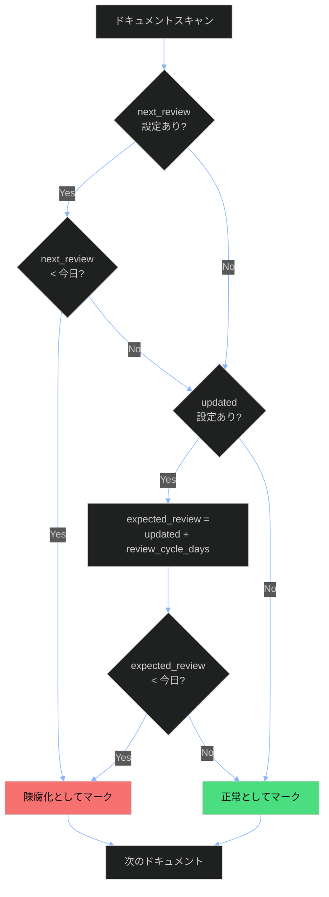
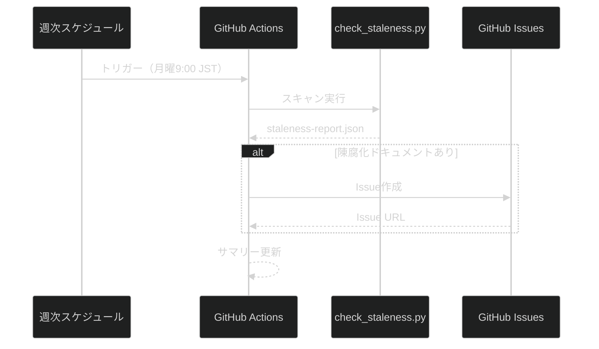

# 陳腐化検出仕様

## 概要

このドキュメントは、3docaフレームワークにおけるドキュメント陳腐化検出の仕様を定義します。定期的なレビューを促進し、古い情報が放置されることを防ぎます。

## 1. フロントマターフィールド

### 1.1 陳腐化検出用フィールド

| フィールド | 型 | 必須 | デフォルト | 説明 |
|-----------|---|------|----------|------|
| `next_review` | date | 任意 | - | 次回レビュー予定日（YYYY-MM-DD） |
| `review_cycle_days` | integer | 任意 | 180 | レビューサイクル日数 |
| `owner` | string | **必須** | - | 責任チーム（@team-name形式） |
| `updated` | date | **必須** | - | 最終更新日（YYYY-MM-DD） |

### 1.2 フロントマター例

```yaml
---
title: "データベースバックアップ手順"
document_id: RUN-DB-001
owner: "@database-team"
updated: 2025-06-15
next_review: 2025-12-15
review_cycle_days: 180
---
```

## 2. 検出ロジック

### 2.1 陳腐化判定フロー



### 2.2 陳腐化レベル

| レベル | 超過日数 | 説明 | アクション |
|-------|---------|------|----------|
| **CRITICAL** | 365日以上 | 1年以上未レビュー | 即時対応必須 |
| **HIGH** | 180日以上 | 6ヶ月以上未レビュー | 優先対応 |
| **MEDIUM** | 90日以上 | 3ヶ月以上未レビュー | 計画的対応 |
| **LOW** | 30日以上 | 1ヶ月以上超過 | 次回スプリントで対応 |

### 2.3 検出ロジック詳細

**条件1: next_reviewが過ぎた**
```
if next_review < today:
    is_stale = True
    days_overdue = today - next_review
```

**条件2: updated + review_cycle_daysを超過**
```
expected_review = updated + timedelta(days=review_cycle_days)
if expected_review < today:
    is_stale = True
    days_overdue = today - expected_review
```

**両方の条件を満たす場合**: `staleness_reason = "both_conditions"`

## 3. 自動化ワークフロー

### 3.1 GitHub Actions週次ジョブ

**ファイル**: `.github/workflows/staleness-check.yml`

**スケジュール**: 毎週月曜日 9:00 JST（cron: `0 0 * * 1` UTC）

**ワークフロー**:



### 3.2 Issue作成フォーマット

```markdown
## 📋 Document Staleness Report

**Scan Date**: 2025-12-06
**Stale Documents**: 3

### 🚨 Documents Requiring Review

#### 🔴 CRITICAL (1)

- [ ] **データベースバックアップ手順** (RUN-DB-001)
  - File: `01-doc-framework/examples/20-data-cleansing-runbook.md`
  - Owner: @database-team
  - Days overdue: 400
  - Last updated: 2024-10-01
```

## 4. 検出スクリプト

### 4.1 使用方法

```bash
# 基本的な使用
python check_staleness.py 01-doc-framework/examples

# JSON出力
python check_staleness.py 01-doc-framework --format json --output report.json

# GitHub Issue形式
python check_staleness.py 01-doc-framework --format github-issue

# 詳細出力
python check_staleness.py 01-doc-framework --verbose --show-all
```

### 4.2 出力フォーマット

| フォーマット | 用途 |
|------------|------|
| `text` | コンソール出力（デフォルト） |
| `json` | 機械処理用 |
| `github-issue` | GitHub Issue作成用 |

### 4.3 終了コード

| コード | 意味 |
|-------|------|
| 0 | 陳腐化ドキュメントなし |
| 1 | 陳腐化ドキュメントあり |

## 5. ベストプラクティス

### 5.1 レビューサイクル推奨値

| ドキュメントタイプ | 推奨サイクル | 理由 |
|------------------|-------------|------|
| Policy | 365日 | 年次レビューが一般的 |
| SOP | 180日 | 半期レビュー |
| Runbook | 90日 | 頻繁に変更される |
| Troubleshooting | 180日 | 問題解決後の振り返り |
| ADR | 365日 | 決定の再評価 |
| Cheatsheet | 90日 | ツールバージョン更新に追従 |

### 5.2 ownerの設定

```yaml
# 推奨: チーム単位
owner: "@database-team"
owner: "@cfd-team"
owner: "@platform-team"

# 非推奨: 個人単位（異動リスク）
owner: "@john-doe"  # 避ける
```

### 5.3 next_reviewの設定

```yaml
# 明示的な次回レビュー日を設定（推奨）
next_review: 2025-06-15

# または、review_cycle_daysのみ設定（自動計算）
review_cycle_days: 90
# → updated + 90日が超過日として使用される
```

## 6. 将来の拡張

### 6.1 Slack通知（未実装）

```yaml
# .github/workflows/staleness-check.yml に追加予定
- name: Send Slack notification
  if: steps.staleness.outputs.stale_count != '0'
  uses: slackapi/slack-github-action@v1
  with:
    channel-id: ${{ secrets.SLACK_CHANNEL_ID }}
    slack-message: |
      📋 Document Staleness Alert
      Found ${{ steps.staleness.outputs.stale_count }} stale documents
      See: ${{ github.server_url }}/${{ github.repository }}/actions/runs/${{ github.run_id }}
```

### 6.2 オーナー別通知（未実装）

陳腐化ドキュメントを`owner`フィールドでグループ化し、各チームに個別通知する機能。

## 関連ドキュメント

- [schema/common.yaml](./schema/common.yaml) - フロントマターフィールド定義
- [check_staleness.py](./check_staleness.py) - 検出スクリプト
- [CI-CD-GUIDE.md](./7CI-CD-GUIDE.md) - CI/CDパイプラインガイド
