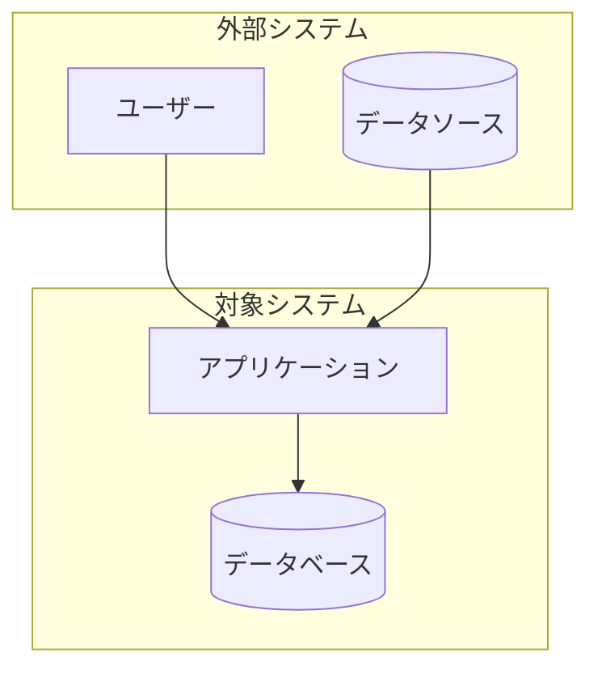

# CLAUDE.md - 技術ドキュメント作成ルールブック

## プロジェクト概要

技術ドキュメント（CFD、GIS、数値シミュレーション等）の体系的な作成・管理プロジェクト。
Diátaxis + 運用ドキュメント + C4モデルの3軸構造で管理する。

## ドキュメント構造

```
docs/
├── 01_knowledge/       # Diátaxis軸（理解・習得）
│   ├── concepts/       # 説明（なぜ・何）
│   ├── tutorials/      # チュートリアル（学習）
│   ├── how-to/         # ハウツー（タスク）
│   └── reference/      # リファレンス（仕様）
├── 02_operations/      # 運用軸（実行）
│   ├── processes/      # プロセス定義
│   ├── playbooks/      # 状況対応
│   ├── runbooks/       # 定常作業
│   └── cheatsheets/    # クイックリファレンス
├── 03_architecture/    # C4軸（構造）
│   ├── context/        # Level 1
│   ├── containers/     # Level 2
│   └── components/     # Level 3
└── _templates/         # テンプレート格納
```

## ギャップマーカー仕様（CRITICAL）

ドキュメント作成時、不完全・未検証・要確認の情報には必ずギャップマーカーを挿入する。
**推測や仮定で補完してはならない。マーカーを残すことが品質を保証する。**

### マーカー一覧

| マーカー | 用途 | 優先度 |
|----------|------|--------|
| `[TODOCS: 説明]` | 未完成セクション、後で記述が必要 | HIGH |
| `[NEEDS_EXAMPLE: 説明]` | コード例・実行例が必要 | HIGH |
| `[NEEDS_VERIFICATION: 説明]` | 未検証の主張、要確認 | MEDIUM |
| `[INCOMPLETE: 説明]` | 情報不足、追加調査が必要 | MEDIUM |
| `[SME_NEEDED: 説明]` | 専門家レビューが必要 | LOW |
| `[ASSUMPTION: 説明]` | 仮定に基づく記述（明示的に） | INFO |
| `[OUTDATED: 説明]` | 古い可能性がある情報 | MEDIUM |
| `[LINK_NEEDED: 説明]` | 関連ドキュメントへのリンクが必要 | LOW |

### マーカー使用ルール

1. **推測禁止**: 不明な点はマーカーで明示し、推測で埋めない
2. **具体的に記述**: `[TODOCS: 何が必要か具体的に]`
3. **優先度考慮**: HIGH → MEDIUM → LOW の順で解消を推奨
4. **検索可能性**: すべてのマーカーは `\[.*?:` で検索可能

### 使用例

```markdown
## メッシュ生成パラメータ

最小メッシュサイズは通常 [NEEDS_VERIFICATION: デフォルト値要確認] に設定される。

[NEEDS_EXAMPLE: iRIC Nays2DFloodでのメッシュ設定コード例]

境界条件の設定については [LINK_NEEDED: 境界条件リファレンスへのリンク] を参照。
```

## 反ハルシネーションルール（CRITICAL）

1. **ソース参照**: 技術的主張には根拠を示す（コード、ドキュメント、実験結果）
2. **不確実性の明示**: 確信度が低い場合は `[ASSUMPTION:]` または `[NEEDS_VERIFICATION:]` を使用
3. **存在しないリンク禁止**: 実在しないファイル・URLへのリンクを作成しない
4. **バージョン明記**: ソフトウェアバージョンに依存する情報は必ずバージョンを記載
5. **不完全でも正確に**: 完全だが不正確 より 不完全だが正確 を優先

## ドキュメントタイプ別ルール

### Diátaxis軸

#### concepts/（説明）
- 「なぜ」「何」に焦点
- 背景・理論・設計意図を説明
- コード例は最小限（理解を助ける範囲で）
- C4 Level 1-2 と連携

#### tutorials/（チュートリアル）
- 学習目標を冒頭に明記
- 完走可能な手順（途中で詰まらない）
- 各ステップに検証ポイント
- 所要時間の目安を記載
- Tier 1 相当（15分で初回成功）

#### how-to/（ハウツー）
- 前提条件を明確に
- 1ドキュメント1タスク
- 結果の確認方法を含める
- 運用ドキュメントへの遷移リンク

#### reference/（リファレンス）
- 網羅性を重視
- 構造化された形式（テーブル、定義リスト）
- 検索しやすいキーワード配置
- バージョン情報必須

### 運用軸

#### processes/（プロセス）
- ワークフロー全体を図示（Mermaid flowchart）
- 入力・出力を明確に
- 関連するplaybook/runbookへのリンク
- 責任範囲の明記

#### playbooks/（プレイブック）
- トリガー条件を冒頭に
- 判断分岐を明確に（フローチャート推奨）
- エスカレーション基準
- 完了条件・確認事項

#### runbooks/（ランブック）
- 実行可能なコマンド・手順
- コピー&ペースト可能なコードブロック
- 前提条件チェックリスト
- ロールバック手順

#### cheatsheets/（チートシート）
- 1ページ以内（Tier 0相当）
- 視覚的構成（テーブル、コードブロック中心）
- 説明は最小限
- 印刷可能なレイアウト

### C4軸

#### context/（Level 1）
- システム全体と外部との関係
- 非技術者にも理解可能
- Mermaid C4Context または flowchart

#### containers/（Level 2）
- 主要な技術コンポーネント
- 通信プロトコル・データフロー
- 技術選択の理由（概要）

#### components/（Level 3）
- 内部構造の詳細
- クラス・モジュール関係
- 実装詳細へのリンク

## Mermaid使用ガイドライン

### 推奨する図タイプ

| 用途 | 図タイプ | 例 |
|------|----------|-----|
| ワークフロー | flowchart TD/LR | プロセス定義 |
| 状態遷移 | stateDiagram-v2 | シミュレーション状態 |
| シーケンス | sequenceDiagram | API連携 |
| クラス構造 | classDiagram | データモデル |
| 構成図 | flowchart + subgraph | C4代替 |

### C4図の代替実装

MermaidのC4サポートは実験的なため、flowchart + subgraph で代替する：



### LLM生成時の注意

- 特殊文字を含むラベルは引用符で囲む: `A["ラベル (注釈)"]`
- 矢印構文: `-->` (実線), `-.->` (点線), `==>` (太線)
- 小文字の `end` は予約語のため避ける
- 生成後は必ず構文検証

## 検証チェックリスト

### 作成時チェック（自動実行）

ドキュメント作成完了時、以下を自己検証する：

```
□ フロントマターは完全か（type, category, tags, summary）
□ ギャップマーカーは適切に配置されているか
□ 内部リンクは実在するファイルを指しているか
□ コードブロックに言語指定があるか
□ Mermaid図は構文エラーがないか
□ 次のステップ/関連ドキュメントのリンクがあるか
□ バージョン依存情報にはバージョンが明記されているか
```

### レビュー時チェック

```
□ 技術的主張に根拠があるか
□ 対象読者に適切な詳細レベルか
□ 手順は実際に実行可能か
□ ギャップマーカーの解消状況
```

## コマンド

### ギャップレポート生成

```bash
# すべてのギャップマーカーを抽出
grep -rn "\[TODOCS:\|\[NEEDS_EXAMPLE:\|\[NEEDS_VERIFICATION:\|\[INCOMPLETE:\|\[SME_NEEDED:\|\[ASSUMPTION:\|\[OUTDATED:\|\[LINK_NEEDED:" docs/
```

### リンク検証

```bash
# 内部リンクの検証（markdownlint等と併用）
find docs -name "*.md" -exec grep -l "\](\.\./" {} \;
```

## テンプレート使用

新規ドキュメント作成時は `_templates/` 内の該当テンプレートをコピーして使用する。
テンプレートにはフロントマター、必須セクション、ギャップマーカーのプレースホルダーが含まれる。

---

**Remember**: 不完全でも正確なドキュメントは、完全だが不正確なドキュメントより価値がある。