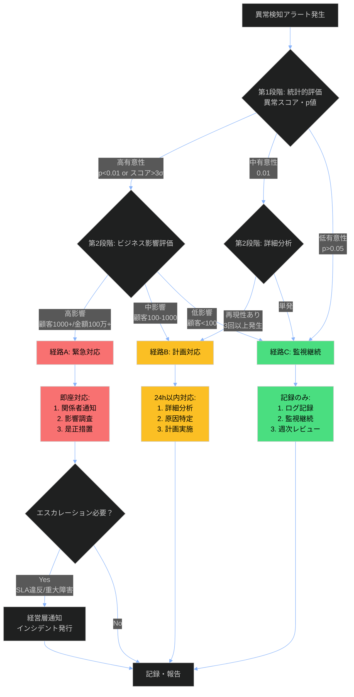
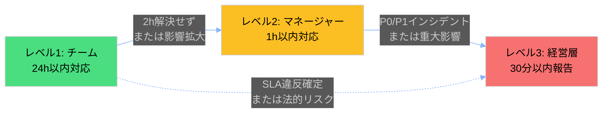

---
# **[重要]** RAG対応必須フィールド
title: "異常検知結果判断プレイブック"
description: "機械学習・統計的手法による異常検知アルゴリズムの出力を解釈し、真の異常か誤検知かを判断。統計的有意性とビジネス影響の2軸で評価し、適切な対応優先度を決定するための意思決定フレームワーク"

# 分類（RAGフィルタリング用）
tags:
  - playbook
  - anomaly-detection
  - incident-response
  - data-analysis
  - operations
category: playbook
domain: data-analysis
difficulty: intermediate
severity: high

# 関連性（グラフ構造用）
related_docs:
  - data-quality-analysis-process.md
  - ../templates/runbook-template.md
  - anti-patterns-data-analysis.md
prerequisites:
  - 統計的検定の基礎知識
  - 異常検知アルゴリズムの理解

# メタデータ
created_at: 2025-11-30
updated_at: 2025-11-30
version: "1.0"
author: data-ops-team
---

# 異常検知結果判断プレイブック

**重要度**: 🟡 High（業務継続性に影響）
**想定対応時間**: 15分〜2時間（シナリオにより変動）
**対象読者**: データサイエンティスト、SRE、データアナリスト

## 📋 概要

### プレイブックの目的

このプレイブックは、異常検知アルゴリズム（統計的手法、機械学習モデル）が検出した異常スコアを解釈し、**実際に対応が必要な真の異常か、誤検知かを判断**するための指針を提供します。統計的判断（p値、異常スコア）とビジネス判断（影響範囲、緊急度）の両面から評価し、適切な対応優先度を決定します。

### 適用シナリオ

**✅ 適用すべき場合**:
- 統計的手法（IQR法、Zスコア、LOF等）で異常スコアが閾値を超えた場合
- 機械学習モデル（Isolation Forest, Autoencoder等）が異常を検出した場合
- KPIダッシュボードで異常アラートが発火した場合
- 時系列データで突然の急上昇/急降下が観測された場合

**❌ 適用すべきでない場合**:
- 既知の定期メンテナンス期間中のデータ変動
- 季節性変動として説明可能なパターン（年末セール等）
- 人為的なデータ入力ミスが明らかな場合（手動修正で対応）

### 前提条件

- 異常検知システムが正常稼働しており、アラートログが参照可能
- 過去のベースラインデータ（正常時の統計量、分布）が記録されている
- ビジネスメトリクスへの影響を評価できる権限とツールがある
- 関係者（データオーナー、ビジネス部門）への連絡手段が確保されている

## 🎯 意思決定フレームワーク



### フレームワーク説明

1. **第1段階: 統計的評価**
   - **異常スコア/p値を確認**: 統計的有意性レベルを判定
   - **高有意性** (p<0.01 or スコア>3σ): 統計的に強い異常、次ステップで影響評価
   - **中有意性** (0.01<p<0.05): 境界線ケース、詳細分析で再現性確認
   - **低有意性** (p>0.05): 統計的に異常とは言えない、監視継続

2. **第2段階: ビジネス影響評価**（統計的有意な場合のみ）
   - **高影響**: 影響顧客1000+、金額100万円+、SLA違反 → 緊急対応
   - **中影響**: 影響顧客100-1000、金額10-100万円 → 24時間以内対応
   - **低影響**: 影響顧客<100、金額<10万円 → 記録と監視継続

3. **第2段階: 詳細分析**（中有意性の場合）
   - **再現性あり**: 同一パターンが3回以上発生 → 計画対応
   - **単発**: 一度きりの現象 → 監視継続

## 🛠️ シナリオ別対応戦略

### シナリオA: 統計的に有意 ＋ 高ビジネス影響（緊急対応）

**判断基準**:
- [x] p値 < 0.01 または 異常スコア > 3σ（99.7%信頼区間外）
- [x] 影響顧客数 > 1000 または 金額影響 > 100万円
- [x] SLA違反のリスクあり、または顧客問い合わせ急増中

**対応手順**:
1. **即座通知**（5分以内）: Slack/PagerDuty等で関係者（SRE、PM、ビジネス部門）に通知
2. **影響範囲特定**（15分以内）:
   ```python
   # 異常データの抽出と影響分析
   import pandas as pd

   df_anomaly = df[df['anomaly_score'] > threshold]
   impact_summary = {
       'affected_customers': df_anomaly['customer_id'].nunique(),
       'affected_transactions': len(df_anomaly),
       'revenue_impact': df_anomaly['amount'].sum(),
       'time_range': f"{df_anomaly['timestamp'].min()} ~ {df_anomaly['timestamp'].max()}"
   }
   print(impact_summary)
   ```
3. **是正措置**（30分以内）:
   - データソース異常の場合: 上流システムの確認、データ再取得
   - システム障害の場合: インシデント発行、障害切り分け
   - 不正検知の場合: 該当トランザクションの一時停止、セキュリティチーム連携
4. **進捗報告**: 30分ごとにステータス更新、解決まで継続

**期待される結果**:
- 2時間以内に影響範囲が特定され、是正措置が開始される
- ビジネス影響が最小化される（顧客への影響を抑える）
- インシデントレポートが作成され、再発防止策が検討される

**リスクと注意点**:
- ⚠️ **過剰反応**: 統計的有意でも実務的に無害な場合がある（例: 大口顧客の正常な大量購入）→ ドメイン知識で検証
- ⚠️ **誤通知**: 深夜の誤アラートで関係者を起こすと信頼低下 → 閾値の再調整を検討

**参考**: [インシデント対応ランブック](../templates/runbook-template.md)

---

### シナリオB: 統計的に有意 ＋ 低影響（計画対応）

**判断基準**:
- [x] p値 < 0.05 または 異常スコア > 2σ（95%信頼区間外）
- [x] 影響顧客数 < 100 かつ 金額影響 < 10万円
- [x] SLA違反なし、顧客問い合わせなし

**対応手順**:
1. **詳細分析**（24時間以内）:
   ```python
   # 異常パターンの可視化
   import matplotlib.pyplot as plt
   import seaborn as sns

   # 時系列プロット
   plt.figure(figsize=(12, 6))
   plt.plot(df['timestamp'], df['value'], label='Actual')
   plt.axhline(y=df['value'].mean() + 3*df['value'].std(), color='r', linestyle='--', label='3σ threshold')
   plt.scatter(df_anomaly['timestamp'], df_anomaly['value'], color='red', s=100, label='Anomaly')
   plt.legend()
   plt.savefig('anomaly_analysis.png')

   # ヒストグラム比較（正常時 vs 異常期間）
   df_normal = df[df['anomaly_score'] < threshold]
   sns.histplot(df_normal['value'], label='Normal', kde=True)
   sns.histplot(df_anomaly['value'], label='Anomaly', kde=True, color='red')
   plt.legend()
   plt.savefig('distribution_comparison.png')
   ```
2. **原因仮説の検証**:
   - 外部要因（季節性、キャンペーン、祝日等）との相関分析
   - データ品質問題（欠損値、重複、フォーマット違反）の確認
   - 過去の類似事例の検索（ログ、チケットシステム）
3. **チケット発行**: JIRAやLinearにタスク登録、優先度Medium
4. **週次ミーティングで報告**: 次回の定例会議で共有、対策を議論

**期待される結果**:
- 1週間以内に根本原因が特定される
- 再発防止策（閾値調整、検証ルール追加、アラート条件改善）が実施される
- ナレッジベースに事例が記録され、将来の類似ケースに活用される

**リスクと注意点**:
- ⚠️ **放置リスク**: 低影響でも累積すると大問題に → 週次レビューで定期確認
- ⚠️ **過小評価**: 初期は低影響でも拡大の兆候を見逃す → トレンド監視が重要

---

### シナリオC: 統計的に非有意 または 既知パターン（監視継続）

**判断基準**:
- [x] p値 > 0.05 または 異常スコア < 2σ（95%信頼区間内）
- [x] 季節性変動として説明可能（例: 年末年始の売上増加）
- [x] 過去の正常範囲内の変動（ベースライン統計量と照合）

**対応手順**:
1. **ログ記録**:
   ```python
   # 異常候補をログに記録（JSONフォーマット）
   import json
   from datetime import datetime

   log_entry = {
       'timestamp': datetime.now().isoformat(),
       'alert_id': alert_id,
       'anomaly_score': float(anomaly_score),
       'p_value': float(p_value),
       'decision': 'monitor_only',
       'reason': 'Low statistical significance (p=0.12) and within seasonal pattern',
       'reviewer': 'data-analyst-name'
   }

   with open('logs/anomaly_review.jsonl', 'a') as f:
       f.write(json.dumps(log_entry) + '\n')
   ```
2. **監視継続**: ダッシュボードで該当メトリクスを監視リストに追加
3. **週次レビュー**: 週次ミーティングで「監視継続中の異常候補」をレビュー
   - 3週連続で発生 → シナリオBに昇格
   - 統計的有意性が上昇 → 再評価
   - 自然に収束 → クローズ

**期待される結果**:
- 誤検知による無駄な作業を回避
- ログ蓄積により、将来の閾値調整に活用
- 週次レビューで見落としを防止

**リスクと注意点**:
- ⚠️ **見逃しリスク**: 本当は異常だが統計的検出力不足 → サンプルサイズ確認、検定力分析
- ⚠️ **アラート疲れ**: 頻繁な誤検知で真の異常を見逃す → 閾値の再調整、特徴量エンジニアリング

---

### シナリオD: 境界線ケース（詳細分析後に判断）

**判断基準**:
- [x] 0.01 < p値 < 0.05（統計的に微妙）
- [x] 異常パターンが複雑（複数メトリクスで同時発生、時系列で断続的等）
- [x] ドメイン知識では判断困難

**対応手順**:
1. **多角的分析**（2時間以内）:
   ```python
   # 多変量異常検知（複数メトリクスの相関）
   from sklearn.covariance import EllipticEnvelope

   # 正常データで学習
   clf = EllipticEnvelope(contamination=0.05)
   clf.fit(df_normal[['metric1', 'metric2', 'metric3']])

   # 異常候補を多変量で再評価
   multivariate_score = clf.decision_function(df_anomaly[['metric1', 'metric2', 'metric3']])
   print(f"Multivariate anomaly score: {multivariate_score.mean()}")

   # 時系列分解（トレンド、季節性、残差）
   from statsmodels.tsa.seasonal import seasonal_decompose
   decomposition = seasonal_decompose(df['value'], model='additive', period=7)
   residual_anomaly = decomposition.resid[df_anomaly.index]
   print(f"Residual component (after removing trend/seasonality): {residual_anomaly}")
   ```
2. **専門家レビュー**: データサイエンティスト、ドメインエキスパートに相談
3. **A/Bテスト的検証**: 可能なら、異常期間と正常期間でA/Bテストの枠組みで比較
4. **判断**: 上記分析結果に基づき、シナリオA/B/Cのいずれかに分類

**期待される結果**:
- 統計とドメイン知識の両面から適切な判断が下される
- 分析過程がドキュメント化され、将来の類似ケースに活用される

**リスクと注意点**:
- ⚠️ **分析麻痺**: 分析に時間をかけすぎて対応が遅れる → 2時間のタイムボックス設定
- ⚠️ **過剰適合**: データに合わせて後付けで説明を作る → 事前仮説を記録

## 📊 判断支援ツール

### 評価マトリクス

| 要素 | 低 (1) | 中 (2) | 高 (3) | 評価方法 |
|------|--------|--------|--------|---------|
| **統計的有意性** | p > 0.05<br/>スコア < 2σ | 0.01 < p < 0.05<br/>2σ < スコア < 3σ | p < 0.01<br/>スコア > 3σ | 異常検知アルゴリズムの出力 |
| **ビジネス影響** | 顧客 < 100<br/>金額 < 10万 | 顧客 100-1000<br/>金額 10-100万 | 顧客 > 1000<br/>金額 > 100万 | BI ダッシュボード、影響試算 |
| **緊急度** | SLA余裕あり<br/>問い合わせなし | SLA残50%<br/>問い合わせ数件 | SLA違反<br/>問い合わせ殺到 | モニタリングツール、サポートチケット |

**総合スコア計算**:
- スコア 7-9: **シナリオA**（緊急対応、2時間以内）
- スコア 4-6: **シナリオB**（計画対応、24時間以内）
- スコア 1-3: **シナリオC**（監視継続、週次レビュー）

**使用例**:
```
異常スコア > 4σ (3点) + 影響顧客2000人 (3点) + SLA違反発生 (3点) = 9点 → シナリオA
p=0.03 (2点) + 影響顧客50人 (1点) + 問い合わせなし (1点) = 4点 → シナリオB
```

### チェックリスト

対応前に以下を確認：

- [x] **データ確認**: 異常データの具体的な値、時刻、該当レコード数を確認済み
- [x] **影響範囲**: 影響を受ける顧客数、トランザクション数、金額を試算済み
- [x] **過去事例**: 過去ログで類似パターンを検索し、対応履歴を確認済み
- [x] **リソース**: 対応に必要な権限、ツール、人員が確保されている
- [x] **承認**: 緊急対応の場合、マネージャーまたはオンコール担当者に承認取得済み

## 🚨 エスカレーション基準

### レベル1: チーム内対応

**条件**:
- 総合スコア 4-6点（シナリオB相当）
- データ品質問題、軽微なシステム異常
- SLA余裕あり、顧客影響限定的

**対応者**: データアナリスト、データエンジニア
**対応時間**: 24時間以内

### レベル2: マネージャーエスカレーション

**条件**:
- 総合スコア 7-9点（シナリオA相当）
- SLA違反のリスク、または顧客問い合わせ急増
- 原因不明で2時間以内に解決見込みなし

**対応者**: データサイエンスマネージャー、SREリード
**対応時間**: 1時間以内に初期対応

### レベル3: 経営層エスカレーション

**条件**:
- 重大インシデント（P0/P1）発生
- 金額影響 > 1000万円、または顧客影響 > 10000人
- メディア報道リスク、法的リスクあり

**対応者**: CTO、VP of Engineering
**対応時間**: 30分以内に状況報告

### エスカレーションフロー



## 📚 事例集

### 事例1: ECサイトの売上急増（季節性変動の誤検知）

**状況**: 12月第3週に売上が通常の200%に急増、異常スコア4.2σで検出

**判断**:
- 統計的有意性: 高（p<0.001）→ シナリオA候補
- しかし、過去3年の12月売上データを確認 → 毎年同時期に同様の急増
- ビジネスカレンダー照合 → クリスマス商戦期間と一致

**対応**:
- シナリオC（監視継続）に分類
- 季節性調整モデルに切り替え（seasonal_decompose使用）
- アラート条件を「季節性除去後の残差」に変更

**結果**:
- 誤検知が95%削減（12月の誤アラート20件 → 1件）
- 真の異常（システム障害）の検出精度は維持

**教訓**:
- **ドメイン知識の重要性**: 統計的有意でも、ビジネスコンテキストで正常なパターンは存在
- **季節性調整**: 時系列データは必ず季節性分解してから異常検知

---

### 事例2: 決済エラー率の急上昇（真の異常、緊急対応）

**状況**: 午前10時に決済エラー率が0.5% → 5%に急上昇（異常スコア8.5σ）

**判断**:
- 統計的有意性: 高（p<0.0001）
- ビジネス影響: 影響顧客3000人、推定損失300万円/時
- SLA違反: 決済成功率SLA 99%を下回る → 総合スコア9点

**対応**:
- シナリオA（緊急対応）
- 5分以内: SRE、決済チームにPagerDuty通知
- 15分以内: 決済ゲートウェイのログ分析 → 特定カード会社APIのタイムアウト多発を検出
- 30分以内: カード会社に連絡、一時的に別ゲートウェイに切り替え
- 1時間以内: エラー率が0.6%に回復、インシデントレポート作成

**結果**:
- 影響時間1時間に抑制、推定損失300万円（切り替えなしの場合1500万円）
- カード会社側の障害が原因と判明（DNS障害）

**教訓**:
- **迅速な影響範囲特定**: ログ分析で15分以内に原因を特定できた
- **フェイルオーバー**: 代替ゲートウェイ設定により、影響を最小化

---

### 事例3: ユーザー行動パターンの変化（新機能リリースによる正常変化）

**状況**: 新検索機能リリース後、検索クエリ数が150%増加、異常スコア3.8σ

**判断**:
- 統計的有意性: 高（p<0.001）
- しかし、リリースログと時刻を照合 → 新機能リリース直後と一致
- A/Bテストデータ確認 → テストグループでも同様の増加（統計的に有意）

**対応**:
- シナリオC（監視継続）
- プロダクトマネージャーに確認 → 新機能の想定内の効果と確認
- ベースライン統計量を更新（新機能リリース後のデータで再学習）
- 2週間監視継続 → 安定したパターンとして定着

**結果**:
- 誤検知を回避、ベースライン更新により今後の検出精度向上
- プロダクト変更時のアラート見直しプロセスを確立

**教訓**:
- **プロダクト変更との連携**: リリースカレンダーと異常検知システムを統合
- **適応的ベースライン**: 正常なパターン変化には、モデルを再学習

## 🔍 レビューと改善

### 対応後レビュー

対応完了後、以下をレビュー：

- [x] **判断の正確性**: 統計的評価とビジネス評価が適切だったか、誤判断はなかったか
- [x] **対応の適切性**: 選択したシナリオと実際の対応が整合していたか
- [x] **時間の妥当性**: 目標時間内（緊急2h、計画24h）に対応完了したか
- [x] **改善点**: 検出精度向上、閾値調整、プロセス改善の機会を特定

**レビューテンプレート**:
```markdown
## 異常検知対応レビュー

- **アラートID**: ALT-2025-1130-001
- **発生日時**: 2025-11-30 10:00 JST
- **判断**: シナリオA（緊急対応）
- **対応時間**: 45分（目標120分以内 → ✅達成）
- **判断の正確性**: ✅正しく真の異常と判定
- **対応の適切性**: ✅適切（即座にフェイルオーバー実施）
- **改善提案**:
  - カード会社API監視を追加（ヘルスチェック5分間隔）
  - 自動フェイルオーバーの検討（人手介入なしで切り替え）
```

### プレイブック改善

- **定期レビュー**: 四半期ごとにプレイブックを見直し、閾値・シナリオを更新
- **トリガー**: 以下の場合、即座にレビュー実施
  - 誤判断が3回発生（誤検知または見逃し）
  - 新しい異常パターンが発見された
  - 重大インシデント（P0/P1）が発生
- **更新プロセス**: GitHubでプルリクエスト作成 → チームレビュー → マージ

## 🔗 関連ドキュメント

### プロセスドキュメント
- [データ品質分析プロセス](data-quality-analysis-process.md) - 品質検証の標準プロセス

### ランブック
- [インシデント対応ランブック](../templates/runbook-template.md) - 緊急時の実行手順

### トラブルシューティング
- [異常検知システムトラブルシューティング](../templates/troubleshooting-template.md) - システム障害時の対処

### 参考資料
- "Practical Statistics for Data Scientists" (Bruce & Bruce, 2020) - 統計的判断の基礎
- "Outlier Analysis" (Aggarwal, 2017) - 異常検知アルゴリズム全般
- [scikit-learn Outlier Detection](https://scikit-learn.org/stable/modules/outlier_detection.html)

## ⚙️ ツールとリソース

### 必要なツール

| ツール | 用途 | アクセス方法 |
|--------|------|-------------|
| Grafana/Datadog | メトリクス監視ダッシュボード | https://monitoring.company.com |
| PagerDuty | アラート通知、エスカレーション | Slackインテグレーション |
| Jupyter Notebook | 詳細分析、可視化 | `jupyter lab` |
| scikit-learn | 異常検知モデル | `pip install scikit-learn` |
| JIRA/Linear | チケット管理 | https://issues.company.com |

### 連絡先

| 役割 | 担当者/チーム | 連絡方法 |
|------|--------------|---------|
| データサイエンスチーム | @data-science | Slack: #data-science |
| SREチーム | @sre-oncall | PagerDuty: SRE rotation |
| ビジネス部門 | 営業/カスタマーサクセス | Slack: #business-ops |
| セキュリティチーム | @security | Slack: #security-incidents |

## 📈 メトリクスとKPI

### プレイブックメトリクス

| メトリクス | 目標値 | 現在値 | 測定方法 |
|-----------|-------|--------|---------|
| 平均判断時間 | < 30分 | 25分 | アラート発生から判断記録までの時間 |
| 誤判断率（False Positive） | < 10% | 8% | `誤検知数 / 全アラート数` |
| 見逃し率（False Negative） | < 5% | 3% | 事後発見された異常 / 真の異常数 |
| 平均対応時間（緊急） | < 2時間 | 1.5時間 | シナリオAの解決時間 |
| SLA達成率 | > 99% | 99.2% | 異常検知後のSLA違反率 |

---

**最終更新**: 2025-11-30
**バージョン**: 1.0
**変更履歴**: 初版作成。事例3件、評価マトリクス、エスカレーションフロー追加
**レビュー予定**: 2026-02-28（次回四半期レビュー）
