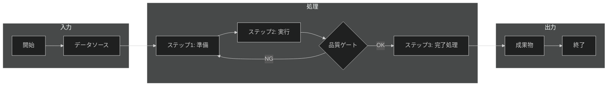

---
# === 必須：識別情報 ===
document_id: "PRC-DOMAIN-NNN"  # 例: PRC-DATA-001, PRC-CFD-001
title: "<!-- TEMPLATE: プロセス名を記載（例: データ品質分析プロセス） -->"
type: process
version: "1.0"
status: active  # draft | review | approved | active | deprecated

# === 所有権 ===
owner: "@team-name"
author: "<!-- TEMPLATE: 作成者名 -->"
created: <!-- TEMPLATE: YYYY-MM-DD -->
updated: <!-- TEMPLATE: YYYY-MM-DD -->

# === RAG最適化 ===
tags:
  - process
  - <!-- TEMPLATE: ドメイン関連タグ（例: data-analysis, quality-assurance） -->
  - <!-- TEMPLATE: ツール関連タグ（例: pandas, great-expectations） -->
key_concepts:
  - "<!-- TEMPLATE: セマンティック用語1（例: データ品質分析） -->"
  - "<!-- TEMPLATE: セマンティック用語2（例: 品質ゲート） -->"
summary: "<!-- TEMPLATE: 検索結果用の一文説明 -->"

# === ドメインコンテキスト ===
category: process
domain: <!-- TEMPLATE: data-analysis | cfd | gis | visualization | infrastructure -->
difficulty: <!-- TEMPLATE: beginner | intermediate | advanced -->
audience: <!-- TEMPLATE: developers | operators | architects | scientists -->

# === 関連ドキュメント ===
related_docs:
  - path: "<!-- TEMPLATE: /playbooks/xxx.md -->"
    relationship: "references"
  - path: "<!-- TEMPLATE: /runbooks/xxx.md -->"
    relationship: "implements"
prerequisites:
  - <!-- TEMPLATE: 前提条件ドキュメントへのパス -->

# === メンテナンス ===
next_review: <!-- TEMPLATE: YYYY-MM-DD -->
review_cycle_days: 180
---

# <!-- TEMPLATE: プロセス名 --> プロセスドキュメント

**対象読者**: <!-- TEMPLATE: 役割・経験レベル（例: データエンジニア、解析初心者〜中級者） -->
**プロセスオーナー**: <!-- TEMPLATE: 責任者名または役割 -->
**所要時間**: <!-- TEMPLATE: 目安時間（例: 30-60分） -->

---

## 必須セクション一覧

このテンプレートには以下の必須セクションが含まれています：

| セクション | 目的 | 省略時の影響 |
|-----------|------|-------------|
| 概要 | プロセスの目的と範囲を明確化 | 実行者がプロセス全体を理解できない |
| プロセスフロー | ワークフローを視覚的に表現 | 実行順序や分岐が不明確になる |
| ステップ詳細 | 各ステップの具体的な作業内容 | 実行者が具体的な作業を理解できない |
| 品質ゲート | 各段階での品質チェック基準 | 品質問題が後段階で発覚する |
| 検証とレビュー | 完了確認と品質保証 | 不完全な状態で完了と判断される |

---

## 📋 概要

<!--
なぜ必要か: プロセスの目的と範囲を明確にし、実行者の理解を促進する
省略するとどうなるか: プロセス全体の目的が不明確になり、部分的な実行になる
-->

### プロセスの目的

<!-- TEMPLATE: 2-3文でプロセスの目的を記述 -->
<!-- 例: このプロセスは、データ品質を体系的に分析し、ビジネス利用に適したデータであることを保証します。データソースから取得したデータに対し、完全性・一貫性・正確性・適時性の4つの観点で品質を評価し、問題があれば是正措置を講じます。 -->

### スコープ

**対象範囲**:
- <!-- TEMPLATE: 含まれる作業1 -->
- <!-- TEMPLATE: 含まれる作業2 -->
- <!-- TEMPLATE: 含まれる作業3 -->

**対象外**:
- <!-- TEMPLATE: 含まれない作業1 -->
- <!-- TEMPLATE: 含まれない作業2 -->

### 入力・出力

| 項目 | 説明 | 形式 |
|------|------|------|
| **入力** | <!-- TEMPLATE: 入力データ/成果物 --> | <!-- TEMPLATE: ファイル形式/データ形式 --> |
| **出力** | <!-- TEMPLATE: 出力データ/成果物 --> | <!-- TEMPLATE: ファイル形式/データ形式 --> |

## 🔄 プロセスフロー

<!--
なぜ必要か: ワークフロー全体を視覚的に表現し、実行順序と分岐を明確にする
省略するとどうなるか: 実行順序が不明確になり、ステップの抜け漏れが発生する
-->

**⚠️ [重要]** 以下のMermaidフローチャートを実際のプロセスフローに合わせて調整してください。



### フロー説明

1. **入力**: <!-- TEMPLATE: データソースや前提条件を説明 -->
2. **処理**: <!-- TEMPLATE: 主要な処理ステップを説明 -->
3. **品質ゲート**: <!-- TEMPLATE: 品質チェック基準を説明 -->
4. **出力**: <!-- TEMPLATE: 成果物を説明 -->

## 📝 ステップ詳細

<!--
なぜ必要か: 各ステップの具体的な作業内容を定義し、再現性を確保する
省略するとどうなるか: 実行者ごとに作業内容が異なり、品質がばらつく
-->

### ステップ1: <!-- TEMPLATE: ステップ名 -->

**目的**: <!-- TEMPLATE: このステップの目的 -->

**実施内容**:
<!-- TEMPLATE: 具体的な作業内容を箇条書きで記載 -->
1. <!-- TEMPLATE: 作業1 -->
2. <!-- TEMPLATE: 作業2 -->
3. <!-- TEMPLATE: 作業3 -->

**入力**: <!-- TEMPLATE: このステップへの入力 -->
**出力**: <!-- TEMPLATE: このステップからの出力 -->

**コマンド例**:
```bash
# TEMPLATE: 実際のコマンド例をここに記載
# 例:
# python analyze.py --input data.csv --output report.html
```

**期待される結果**:
<!-- TEMPLATE: このステップが成功した場合の結果を具体的に記述 -->

---

### ステップ2: <!-- TEMPLATE: ステップ名 -->

**目的**: <!-- TEMPLATE: このステップの目的 -->

**実施内容**:
<!-- TEMPLATE: 具体的な作業内容を箇条書きで記載 -->

**入力**: <!-- TEMPLATE: このステップへの入力 -->
**出力**: <!-- TEMPLATE: このステップからの出力 -->

**コマンド例**:
```python
# TEMPLATE: 実際のコード例をここに記載
# 例:
# import pandas as pd
# df = pd.read_csv('data.csv')
# quality_report = df.describe()
```

**期待される結果**:
<!-- TEMPLATE: このステップが成功した場合の結果を具体的に記述 -->

---

### ステップ3: <!-- TEMPLATE: ステップ名 -->

**⚠️ 必要に応じてステップを追加または削除してください**

<!-- TEMPLATE: 上記と同様の構造でステップを記述 -->

## ✅ 品質ゲート

<!--
なぜ必要か: 各段階での品質チェック基準を設定し、問題の早期発見を促す
省略するとどうなるか: 品質問題が後段階で発覚し、手戻りコストが増大する
-->

**[重要]** プロセスの各段階で品質を確保するための基準を定義します。

### ゲート1: <!-- TEMPLATE: ゲート名（例: データ取得完了） -->

**評価基準**:
- [ ] <!-- TEMPLATE: 基準1（例: データ件数が期待値の範囲内） -->
- [ ] <!-- TEMPLATE: 基準2（例: 必須カラムが全て存在する） -->
- [ ] <!-- TEMPLATE: 基準3 -->

**NG時の対応**:
<!-- TEMPLATE: 基準を満たさない場合の対応手順 -->

---

### ゲート2: <!-- TEMPLATE: ゲート名（例: 品質検証完了） -->

**評価基準**:
- [ ] <!-- TEMPLATE: 基準1 -->
- [ ] <!-- TEMPLATE: 基準2 -->
- [ ] <!-- TEMPLATE: 基準3 -->

**NG時の対応**:
<!-- TEMPLATE: 基準を満たさない場合の対応手順 -->

## 🔍 検証とレビュー

<!--
なぜ必要か: プロセス完了を客観的に確認し、品質を保証する
省略するとどうなるか: 不完全な状態で完了と判断され、後続プロセスに影響する
-->

### 完了確認チェックリスト

プロセス完了前に以下を確認：

- [ ] 全ステップが完了している
- [ ] 全ての品質ゲートを通過している
- [ ] 出力成果物が生成されている
- [ ] <!-- TEMPLATE: プロセス固有の確認項目1 -->
- [ ] <!-- TEMPLATE: プロセス固有の確認項目2 -->

### レビュー基準

| 観点 | 確認内容 | 合格基準 |
|------|---------|---------|
| **完全性** | <!-- TEMPLATE: 確認内容 --> | <!-- TEMPLATE: 合格基準 --> |
| **一貫性** | <!-- TEMPLATE: 確認内容 --> | <!-- TEMPLATE: 合格基準 --> |
| **正確性** | <!-- TEMPLATE: 確認内容 --> | <!-- TEMPLATE: 合格基準 --> |

## 📊 成果物とドキュメント

### 成果物一覧

| 成果物 | 形式 | 保存先 | 備考 |
|--------|------|--------|------|
| <!-- TEMPLATE: 成果物名 --> | <!-- TEMPLATE: ファイル形式 --> | <!-- TEMPLATE: パス --> | <!-- TEMPLATE: 備考 --> |

### ドキュメント

- **プロセス記録**: <!-- TEMPLATE: 記録方法と保存先 -->
- **レビュー記録**: <!-- TEMPLATE: 記録方法と保存先 -->
- **変更履歴**: <!-- TEMPLATE: 記録方法と保存先 -->

## 🔗 関連ドキュメント

### プレイブック
- [<!-- TEMPLATE: プレイブック名 -->](<!-- TEMPLATE: パス -->) - <!-- TEMPLATE: 説明 -->

### ランブック
- [<!-- TEMPLATE: ランブック名 -->](<!-- TEMPLATE: パス -->) - <!-- TEMPLATE: 説明 -->

### リファレンス
- [<!-- TEMPLATE: リファレンス名 -->](<!-- TEMPLATE: パス -->) - <!-- TEMPLATE: 説明 -->

## ⚙️ ツールと環境

### 必要なツール

| ツール | バージョン | 用途 |
|--------|-----------|------|
| <!-- TEMPLATE: ツール名 --> | <!-- TEMPLATE: バージョン --> | <!-- TEMPLATE: 用途 --> |

### 環境要件

- **OS**: <!-- TEMPLATE: 対応OS -->
- **メモリ**: <!-- TEMPLATE: 必要メモリ -->
- **ディスク**: <!-- TEMPLATE: 必要ディスク容量 -->
- **権限**: <!-- TEMPLATE: 必要な権限 -->

## 📈 メトリクスとKPI

### プロセスメトリクス

| メトリクス | 目標値 | 測定方法 |
|-----------|-------|---------|
| <!-- TEMPLATE: メトリクス名（例: 処理時間） --> | <!-- TEMPLATE: 目標値 --> | <!-- TEMPLATE: 測定方法 --> |
| <!-- TEMPLATE: メトリクス名（例: エラー率） --> | <!-- TEMPLATE: 目標値 --> | <!-- TEMPLATE: 測定方法 --> |

### 改善サイクル

<!-- TEMPLATE: プロセス改善の方法と頻度を記述 -->

## 🚨 トラブルシューティング

よくある問題と対処法：

| 問題 | 原因 | 対処法 |
|------|------|--------|
| <!-- TEMPLATE: 問題の症状 --> | <!-- TEMPLATE: 考えられる原因 --> | <!-- TEMPLATE: 対処手順 --> |

詳細は [トラブルシューティングガイド](<!-- TEMPLATE: パス -->) を参照。

## 📚 参考資料

- <!-- TEMPLATE: 参考資料1 -->
- <!-- TEMPLATE: 参考資料2 -->
- <!-- TEMPLATE: 参考資料3 -->

---

**最終更新**: <!-- TEMPLATE: YYYY-MM-DD -->
**バージョン**: 1.0
**変更履歴**: <!-- TEMPLATE: 主な変更内容 -->
