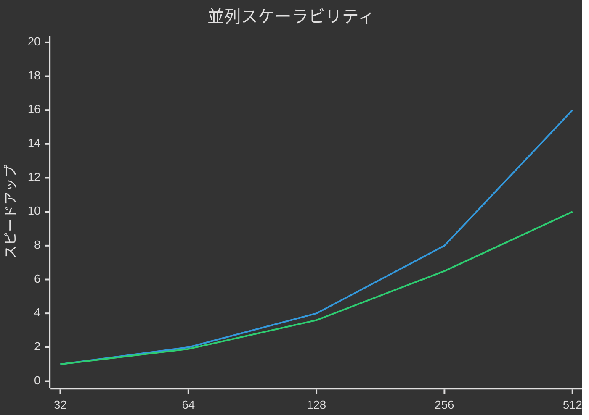

---
# =============================================================================
# CFD/海洋モデリング SOP テンプレート
# =============================================================================
# 基本情報
document_id: SOP-CFD-NNN  <!-- TEMPLATE: SOP-CFD-001, SOP-OCEAN-001 等 -->
title: "<!-- TEMPLATE: 手順書タイトル -->"
type: sop
version: "1.0"
status: draft  <!-- TEMPLATE: draft | review | approved | active -->

# 所有権
owner: "@cfd-team"  <!-- TEMPLATE: @your-team -->
author: <!-- TEMPLATE: author-name -->
created: <!-- TEMPLATE: YYYY-MM-DD -->
updated: <!-- TEMPLATE: YYYY-MM-DD -->

# RAG最適化
tags:
  - cfd
  - <!-- TEMPLATE: simulation, mesh, preprocessing, postprocessing 等 -->
key_concepts:
  - <!-- TEMPLATE: 主要概念（自然言語フレーズ） -->
summary: "<!-- TEMPLATE: 150文字以内の検索用説明 -->"

# ドメインコンテキスト
domain: scientific
audience: scientists  <!-- TEMPLATE: scientists | developers | operators -->

# CFD/海洋モデリング固有
validation_cases:
  - name: "<!-- TEMPLATE: 検証ケース名 -->"
    reference: "<!-- TEMPLATE: 参照文献 -->"
    metrics:
      - name: "<!-- TEMPLATE: メトリクス名 -->"
        expected: <!-- TEMPLATE: 期待値 -->
        tolerance: "<!-- TEMPLATE: ±N% -->"

verification:
  grid_convergence:
    method: GCI  <!-- TEMPLATE: GCI | Richardson | Grid-sequencing -->
    grids: [coarse, medium, fine]
    observed_order: <!-- TEMPLATE: 観測収束次数 -->
  solution_verification:
    iterative_convergence: "residuals < 1e-6"
    mass_conservation: "< 1e-8"

standards:
  - "ASME V&V 20-2009"
  - <!-- TEMPLATE: 追加標準 -->

hpc_requirements:
  cores: <!-- TEMPLATE: コア数 -->
  memory_per_core: "<!-- TEMPLATE: 4GB -->"
  walltime: "<!-- TEMPLATE: HH:MM:SS -->"
  storage: "<!-- TEMPLATE: 500GB -->"
  parallel_model: MPI  <!-- TEMPLATE: MPI | OpenMP | Hybrid | GPU -->

solver_config:
  solver: "<!-- TEMPLATE: OpenFOAM, ROMS, MOM6 等 -->"
  version: "<!-- TEMPLATE: バージョン -->"
  turbulence_model: "<!-- TEMPLATE: k-epsilon, k-omega SST 等 -->"
  time_integration: "<!-- TEMPLATE: Crank-Nicolson, RK4 等 -->"

domain_config:
  dimensions: "<!-- TEMPLATE: 1000km x 500km x 4000m -->"
  grid_resolution: "<!-- TEMPLATE: 1/12°, 10m -->"
  total_cells: <!-- TEMPLATE: 総セル数 -->
  boundary_conditions:
    - "<!-- TEMPLATE: 境界条件1 -->"
    - "<!-- TEMPLATE: 境界条件2 -->"

# メンテナンス
next_review: <!-- TEMPLATE: YYYY-MM-DD -->
review_cycle_days: 180

# 関連ドキュメント
related_docs:
  - path: "<!-- TEMPLATE: 関連ドキュメントパス -->"
    relationship: references
---

# <!-- TEMPLATE: 手順書タイトル -->

## 必須セクション一覧

このテンプレートには以下の必須セクションが含まれています：

| セクション | 目的 |
|-----------|------|
| 目的 | この手順が何を達成するか |
| 適用範囲 | 対象システム・プロセス |
| 前提条件 | アクセス、ツール、知識要件 |
| 計算領域と境界条件 | ドメイン、グリッド、境界条件 |
| 手順 | 番号付きステップ |
| 品質メトリクス | 定量的閾値と検証コマンド |
| 検証と妥当性確認（V&V） | コード/ソリューション検証 |
| 不確かさ定量化 | 入力/モデル/数値誤差 |
| HPC要件とリソース | 計算リソース要件 |
| トラブルシューティング | 問題・原因・解決策 |
| ロールバック手順 | 失敗時の復旧方法 |
| コミュニティ標準参照 | 準拠する品質標準 |

---

## 目的

<!-- TEMPLATE: この手順が何を達成するかを2-3文で説明 -->

**[重要]** この手順は<!-- TEMPLATE: 主要な目標 -->を目的としています。

## 適用範囲

<!-- TEMPLATE: 対象システム・プロセスを明確に定義 -->

- **対象モデル**: <!-- TEMPLATE: ROMS, OpenFOAM 等 -->
- **対象領域**: <!-- TEMPLATE: 日本海、黒潮領域 等 -->
- **対象ユーザー**: <!-- TEMPLATE: CFDエンジニア、海洋研究者 等 -->

## 前提条件

| 要件 | 詳細 | 検証方法 |
|------|------|----------|
| HPCアカウント | <!-- TEMPLATE: クラスタ名 --> | `ssh user@cluster` で接続確認 |
| ソルバー | <!-- TEMPLATE: OpenFOAM v2312 --> | `<!-- TEMPLATE: 確認コマンド -->` |
| メモリ | <!-- TEMPLATE: 最小4GB/コア --> | `free -h` |
| 前提知識 | <!-- TEMPLATE: CFD基礎、Linux操作 --> | - |

## 計算領域と境界条件

### ドメイン定義

```
<!-- TEMPLATE: ドメイン図（ASCII art or 説明） -->
```

| パラメータ | 値 | 備考 |
|-----------|---|------|
| 水平範囲 | <!-- TEMPLATE: 東経120-140°、北緯20-45° --> | |
| 水平解像度 | <!-- TEMPLATE: 1/12° (約9km) --> | |
| 鉛直層数 | <!-- TEMPLATE: 40層（sigma座標） --> | |
| 総セル数 | <!-- TEMPLATE: 1.2億 --> | |

### 境界条件

| 境界 | 条件 | 備考 |
|-----|------|------|
| 西側開境界 | <!-- TEMPLATE: FRS（緩和スキーム） --> | HYCOM再解析データ |
| 東側開境界 | <!-- TEMPLATE: 同上 --> | |
| 海面 | <!-- TEMPLATE: ECMWF風応力 --> | 6時間平均 |
| 海底 | <!-- TEMPLATE: 対数則摩擦 --> | |

## 手順

### ステップ1: 環境設定

**目的:** 計算環境を準備する

```bash
# モジュールロード
module load <!-- TEMPLATE: ソルバーモジュール -->

# 作業ディレクトリ作成
mkdir -p $SCRATCH/<!-- TEMPLATE: プロジェクト名 -->
cd $SCRATCH/<!-- TEMPLATE: プロジェクト名 -->
```

**期待出力:**
```
<!-- TEMPLATE: 期待される出力 -->
```

**検証:** `echo $PATH` でソルバーパスを確認

### ステップ2: 入力ファイル準備

**目的:** 計算に必要な入力ファイルを準備する

```bash
# 設定ファイルコピー
cp /path/to/templates/<!-- TEMPLATE: 設定ファイル --> .

# パラメータ編集
vi <!-- TEMPLATE: 設定ファイル -->
```

⚠️ **停止条件**: 設定ファイルが見つからない場合は、管理者に連絡

### ステップ3: メッシュ生成/確認

**目的:** 計算メッシュを生成または確認する

```bash
<!-- TEMPLATE: メッシュ生成/確認コマンド -->
```

**期待出力:**
```
Mesh quality check:
  - Minimum cell volume: <!-- TEMPLATE: 期待値 -->
  - Maximum aspect ratio: <!-- TEMPLATE: 期待値 -->
  - Orthogonality: OK
```

### ステップ4: 計算実行

**目的:** シミュレーションを実行する

```bash
# ジョブスクリプト作成
cat << 'EOF' > job.sh
#!/bin/bash
#SBATCH --job-name=<!-- TEMPLATE: ジョブ名 -->
#SBATCH --nodes=<!-- TEMPLATE: ノード数 -->
#SBATCH --ntasks-per-node=<!-- TEMPLATE: タスク数 -->
#SBATCH --time=<!-- TEMPLATE: HH:MM:SS -->
#SBATCH --partition=<!-- TEMPLATE: パーティション名 -->

module load <!-- TEMPLATE: モジュール -->
mpirun -np $SLURM_NTASKS <!-- TEMPLATE: ソルバー実行コマンド -->
EOF

# ジョブ投入
sbatch job.sh
```

**期待出力:**
```
Submitted batch job <!-- TEMPLATE: ジョブID -->
```

### ステップ5: 結果確認

**目的:** 計算結果を確認する

```bash
# ログ確認
tail -100 <!-- TEMPLATE: ログファイル -->

# 収束確認
<!-- TEMPLATE: 収束確認コマンド -->
```

## 品質メトリクス

| メトリクス | 閾値 | 検証コマンド |
|-----------|------|--------------|
| 残差 | < 1e-6 | `grep "Final residual" log` |
| 質量保存誤差 | < 1e-8 | `<!-- TEMPLATE: 確認コマンド -->` |
| CFL数 | < 0.5 | `grep "CFL" log` |
| エネルギー保存 | < 1% | `<!-- TEMPLATE: 確認コマンド -->` |

## 検証と妥当性確認（V&V）

### グリッド収束評価

**手法:** GCI（Grid Convergence Index）

| グリッド | セル数 | 代表値 | GCI(%) |
|---------|-------|-------|--------|
| Coarse | <!-- TEMPLATE --> | <!-- TEMPLATE --> | - |
| Medium | <!-- TEMPLATE --> | <!-- TEMPLATE --> | <!-- TEMPLATE --> |
| Fine | <!-- TEMPLATE --> | <!-- TEMPLATE --> | <!-- TEMPLATE --> |

**観測収束次数:** <!-- TEMPLATE: p = 2.1 -->

### 検証ケース結果

| ケース | 参照値 | 計算値 | 相対誤差 | 判定 |
|-------|-------|-------|---------|------|
| <!-- TEMPLATE: ケース名 --> | <!-- TEMPLATE --> | <!-- TEMPLATE --> | <!-- TEMPLATE -->% | ✅/❌ |

### 妥当性確認

<!-- TEMPLATE: 観測データとの比較、統計量の評価 -->

## 不確かさ定量化

### 不確かさ源

| 源 | タイプ | 大きさ | 備考 |
|----|-------|-------|------|
| 入力パラメータ | 認識的 | <!-- TEMPLATE: ±10% --> | 風応力データ精度 |
| 境界条件 | 認識的 | <!-- TEMPLATE: ±5% --> | 親モデル精度 |
| モデル構造 | 認識的 | 定性的 | 乱流モデル仮定 |
| 数値誤差 | 偶然的 | <!-- TEMPLATE: <5% --> | グリッド収束誤差 |

### 不確かさ伝播

```
総合不確かさ = √(入力² + 境界² + 数値²) = <!-- TEMPLATE: ±12% -->
```

## HPC要件とリソース

| パラメータ | 値 | 備考 |
|-----------|---|------|
| コア数 | <!-- TEMPLATE: 256 --> | MPI並列 |
| メモリ/コア | <!-- TEMPLATE: 4GB --> | |
| 総メモリ | <!-- TEMPLATE: 1TB --> | |
| 実行時間 | <!-- TEMPLATE: 24時間 --> | 1年分シミュレーション |
| ストレージ | <!-- TEMPLATE: 500GB --> | 出力ファイル |
| I/O | <!-- TEMPLATE: 10GB/h --> | 出力頻度による |

### スケーラビリティ



## トラブルシューティング

| 問題 | 原因 | 解決策 |
|------|------|--------|
| 計算が発散 | CFL条件違反 | タイムステップを半分に |
| メモリ不足 | ノードあたりセル数過多 | ノード数を増加 |
| I/Oボトルネック | 出力頻度過高 | 出力間隔を増加 |
| 収束しない | 初期条件不良 | スピンアップ期間延長 |

## ロールバック手順

**ロールバック条件:**
- 計算が発散した場合
- 品質メトリクスを満たさない場合

```bash
# 最新のリスタートファイルから再開
cd $SCRATCH/<!-- TEMPLATE: プロジェクト名 -->
cp restart.<!-- TEMPLATE: タイムステップ --> restart.latest
<!-- TEMPLATE: リスタートコマンド -->
```

## コミュニティ標準参照

本手順は以下の標準およびベストプラクティスに準拠しています：

- **ASME V&V 20-2009**: Standard for Verification and Validation in Computational Fluid Dynamics and Heat Transfer
- **ERCOFTAC Best Practice Guidelines**: Best Practice Guidelines for Industrial CFD
- **AIAA G-077-1998**: Guide for the Verification and Validation of Computational Fluid Dynamics Simulations
- <!-- TEMPLATE: 追加標準 -->

## 関連ドキュメント

- [<!-- TEMPLATE: 関連ドキュメント名 -->](<!-- TEMPLATE: パス -->)
- [schema/cfd-ocean.yaml](../schema/cfd-ocean.yaml) - CFD/海洋モデリングスキーマ

---

**作成日**: <!-- TEMPLATE: YYYY-MM-DD -->
**バージョン**: 1.0
**次回レビュー**: <!-- TEMPLATE: YYYY-MM-DD -->
