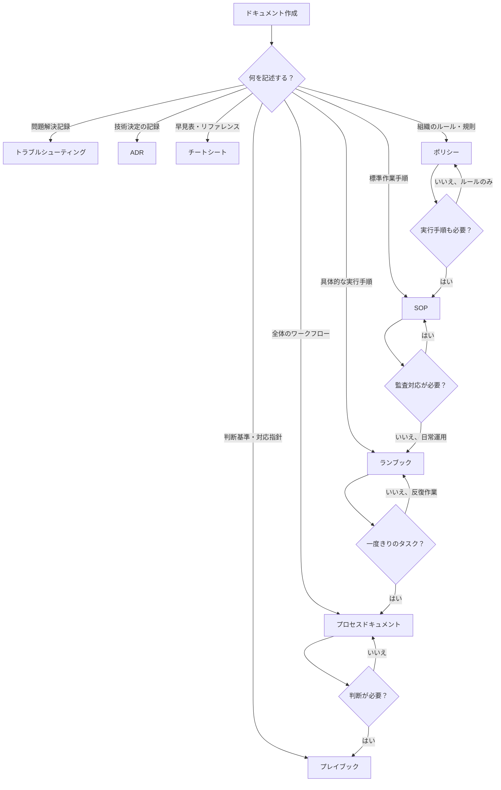

# テンプレート一覧

このディレクトリには、技術ドキュメント作成用のテンプレートが含まれています。

## テンプレートファイル一覧

### 📄 [00-process-document-template.md](./00-process-document-template.md)
**優先度**: ★★★★★
**用途**: ワークフロー全体の流れを記述
**特徴**: Mermaidフローチャート、品質ゲート設定、各ステップの入力/処理/出力を明示

### 📄 [01-playbook-template.md](./01-playbook-template.md)
**優先度**: ★★★★☆
**用途**: 判断を伴う複雑なシナリオへの対応指針
**特徴**: Mermaid意思決定ツリー、シナリオ別対応手順、エスカレーション基準

### 📄 [02-runbook-template.md](./02-runbook-template.md)
**優先度**: ★★★★☆
**用途**: 具体的なタスク実行手順書（判断不要）
**特徴**: チェックリスト形式、具体的なコマンド例、ロールバック手順

### 📄 [03-troubleshooting-template.md](./03-troubleshooting-template.md)
**優先度**: ★★★★☆
**用途**: 問題解決記録と再発防止
**特徴**: 症状・原因・解決手順の構造化、予防策の明示

### 📄 [04-adr-template.md](./04-adr-template.md)
**優先度**: ★★★★★
**用途**: 技術決定の記録と理由の文書化
**特徴**: MADR形式（業界標準）、検討した選択肢の記録、ツール比較表

### 📄 [05-cheatsheet-template.md](./05-cheatsheet-template.md)
**優先度**: ★★★☆☆
**用途**: 即座参照用の要点集約
**特徴**: 表形式中心、コピー＆ペースト可能なコード例

### 📄 [06policy-template.md](./06policy-template.md)
**優先度**: ★★★★★
**用途**: 組織のルール・規則の文書化
**特徴**: コンプライアンスマッピング、承認ワークフロー、執行セクション、役割と責任

### 📄 [07sop-template.md](./07sop-template.md)
**優先度**: ★★★★★
**用途**: 標準作業手順書（判断不要の定型作業）
**特徴**: 前提条件テーブル、番号付き手順（目的・コマンド・期待出力・検証）、品質メトリクス、ロールバック

### 📄 [08cfd-ocean-sop-template.md](./08cfd-ocean-sop-template.md)
**優先度**: ★★★★☆
**用途**: CFD/海洋モデリング向け標準作業手順書
**特徴**: V&Vセクション、不確かさ定量化、HPC要件、コミュニティ標準参照、グリッド収束評価
**ドメイン固有スキーマ**: [schema/cfd-ocean.yaml](../schema/cfd-ocean.yaml)

---

## テンプレートタイプと使い分け

### プロセスドキュメント (`process-document-template.md`)

**用途**: ワークフロー全体の流れを記述

**適用場面**:
- データ解析パイプライン全体
- 開発ワークフロー
- 品質保証プロセス
- リリースプロセス

**特徴**:
- Mermaidフローチャートでワークフロー可視化
- 各ステップの入力/処理/出力を明示
- 品質ゲートの設定

**重要度**: ★★★★★ - プロジェクトの標準ワークフローを定義

---

### プレイブック (`playbook-template.md`)

**用途**: 判断を伴う複雑なシナリオへの対応指針

**適用場面**:
- 異常検知結果の解釈
- 障害対応（インシデント対応）
- リリース判断
- トレードオフ判断が必要なケース

**特徴**:
- Mermaid意思決定ツリー
- シナリオ別対応手順
- エスカレーション基準
- 判断基準の明確化

**重要度**: ★★★★☆ - 経験に基づく判断をドキュメント化

**プロセスドキュメントとの違い**: プロセスは「何をするか」、プレイブックは「どう判断するか」

---

### ランブック (`runbook-template.md`)

**用途**: 具体的なタスク実行手順書（判断不要）

**適用場面**:
- データクレンジング作業
- 定期メンテナンス
- デプロイ手順
- バックアップ手順

**特徴**:
- チェックリスト形式
- 具体的なコマンド例
- 期待される結果の明示
- ロールバック手順

**重要度**: ★★★★☆ - 反復作業の標準化と効率化

**プロセスドキュメントとの違い**: プロセスは全体の流れ、ランブックは特定タスクの詳細手順

---

### トラブルシューティング (`troubleshooting-template.md`)

**用途**: 問題解決記録と再発防止

**適用場面**:
- エラー解決手順
- 性能問題の診断
- データ品質問題の対処
- 過去の障害記録

**特徴**:
- 症状・原因・解決手順の構造化
- 予防策の明示
- 関連ドキュメントへのリンク

**重要度**: ★★★★☆ - 知識の蓄積と学習コスト削減

---

### ADR (Architecture Decision Record) (`adr-template.md`)

**用途**: 技術決定の記録と理由の文書化

**適用場面**:
- ツール選定（データベース、フレームワーク、ライブラリ）
- アーキテクチャ設計決定
- データモデル設計
- API設計

**特徴**:
- MADR形式（業界標準）
- 検討した選択肢の記録
- 決定理由と影響の明示
- ツール比較表

**重要度**: ★★★★★ - 将来の意思決定の参考資料

**推奨ルール**: 重要な技術決定は必ずADRを作成

---

### チートシート (`cheatsheet-template.md`)

**用途**: 即座参照用の要点集約

**適用場面**:
- コマンドリファレンス
- 設定ファイルテンプレート
- よく使うコードスニペット
- クイックトラブルシュート

**特徴**:
- 表形式中心
- 簡潔な説明
- コピー＆ペースト可能なコード例
- 関連リンク

**重要度**: ★★★☆☆ - 日常作業の効率化

**作成タイミング**: 同じことを3回以上調べたらチートシート化を検討

---

### ポリシー (`policy-template.md`)

**用途**: 組織のルール・規則の文書化

**適用場面**:
- セキュリティポリシー
- データ管理ポリシー
- アクセス制御ポリシー
- コンプライアンス要件

**特徴**:
- コンプライアンスマッピング（ISO、NISTなど）
- 承認ワークフロー
- 役割と責任の明確化
- 執行セクション（違反時の対応）

**重要度**: ★★★★★ - ガバナンスの基盤

**SOPとの違い**: ポリシーは「何をすべきか」、SOPは「どうやるか」

---

### SOP (Standard Operating Procedure) (`sop-template.md`)

**用途**: 標準作業手順書（判断不要の定型作業）

**適用場面**:
- 定期作業（バックアップ、メンテナンス）
- セットアップ手順
- 監査対応作業
- 品質検査手順

**特徴**:
- 前提条件テーブル（アクセス権、ツール、知識）
- 番号付きステップ（目的・コマンド・期待出力・検証）
- 品質メトリクス（定量的成功基準）
- ロールバック手順

**重要度**: ★★★★★ - 品質管理と監査対応の要

**ランブックとの違い**: SOPは監査対応を意識した正式手順、ランブックは日常運用の実践手順

---

## テンプレート選択フローチャート

## 使用例

### データ解析プロジェクトの場合

1. **プロセスドキュメント**: データ品質分析プロセス全体
2. **プレイブック**: 異常検知結果の解釈と判断
3. **ランブック**: データクレンジング手順
4. **トラブルシューティング**: 解析エラー対処法
5. **ADR**: 解析ツール（Pandas vs Polars）選定記録
6. **チートシート**: Pandas操作早見表

### システム運用の場合

1. **プロセスドキュメント**: デプロイプロセス全体
2. **プレイブック**: 障害対応（インシデント対応）
3. **ランブック**: 定期メンテナンス手順
4. **トラブルシューティング**: 過去の障害対処記録
5. **ADR**: 監視ツール選定記録
6. **チートシート**: kubectl/docker コマンド早見表

## テンプレート利用の原則

1. **コピー＆カスタマイズ**: テンプレートを直接編集せず、コピーして使用
2. **`<!-- TEMPLATE: ... -->` コメント**: 必ず具体的な内容に置き換える
3. **フロントマター**: 全フィールドを適切に埋める
4. **重要箇所マーク**: `**[重要]**`, ⚠️ はそのまま活用
5. **Mermaidダイアグラム**: 実際のフローに合わせて調整

## 次のステップ

1. テンプレートを選択
2. プロジェクトディレクトリにコピー
3. `examples/` ディレクトリの実例を参照
4. カスタマイズして完成

---

**作成日**: 2025-11-29
**バージョン**: 1.0
