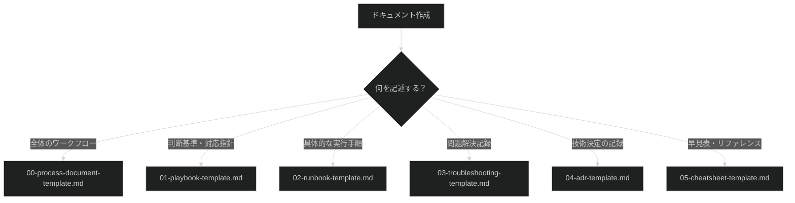

# 3doca プロジェクト開発ガイドライン

## 1. プロジェクト概要

### プロジェクト目的
- 理想的な技術ドキュメント環境のベース構築
- 将来のプロジェクトでテンプレートとして再利用可能な体系を提供

### 技術スタック
- **フォーマット**: Markdown
- **可視化**: Mermaid（ダークモード）
- **フレームワーク**: Diátaxis
- **RAG対応**: PostgreSQL/pgvector統合を見据えたフロントマター標準化

### 対象外
- ❌ コードの実装（このプロジェクトはドキュメントフレームワークであり、コード非対象）
- ❌ ソフトウェア開発のベストプラクティス（ドキュメント作成に焦点）

---

## 2. ディレクトリ構造ルール

### ルートディレクトリ構成

```
3doca/
├── .serena/                      # Serena設定（変更禁止）
├── 01-doc-framework/             # メイン：ドキュメントフレームワーク（最優先）
│   ├── POLICY.md                 # プロジェクトポリシー文書
│   ├── 251129claude.md           # ベースドキュメント
│   ├── templates/                # テンプレート（6種類）
│   ├── examples/                 # 実例（8種類）
│   └── README.md
├── 02-project-records/           # プロジェクト記録
│   ├── serena-memories/
│   ├── shrimp-tasks/
│   └── quality-reviews/
├── migration-log.md
└── shrimp-rules.md               # このファイル
```

### 番号プレフィックスルール

**必須**: 全てのルートレベルフォルダに番号プレフィックスを付ける

| 番号 | フォルダ名 | 優先度 | 説明 |
|-----|----------|-------|------|
| 01- | doc-framework | 最優先 | メインのドキュメント体系 |
| 02- | project-records | 2番目 | プロジェクト記録・履歴 |

**新規フォルダ追加時**:
- ✅ 優先順位に基づいて番号を振ること（01-, 02-, 03-...）
- ✅ 読む順番、重要度を考慮すること
- ❌ 番号なしでフォルダを作成しないこと

---

## 3. ドキュメント作成原則

### Diátaxisフレームワーク（4タイプ）

| タイプ | 目的 | 想定読者の状態 | 配置場所 |
|--------|------|---------------|---------|
| チュートリアル | 学習体験の提供 | 「学んでいる」 | tutorials/ |
| ハウツーガイド | 特定タスクの解決 | 「やろうとしている」 | how-to/ |
| リファレンス | 技術仕様の提供 | 「調べている」 | reference/ |
| 説明 | 概念理解の促進 | 「理解しようとしている」 | concepts/ |

### 運用系ドキュメント階層（5タイプ）

```
ポリシー（原則・方針）           ← 変更頻度：年1回程度
    ↓
プレイブック（状況対応指針）     ← 複雑シナリオの意思決定枠組
    ↓
プロセスドキュメント            ← ワークフロー全体の流れ
    ↓
ランブック（運用手順書）        ← 具体的なタスク実行手順
    ↓
チートシート（早見表）          ← 即座参照用の要点集約
```

**テンプレート番号体系**（01-doc-framework/templates/）:
- `00-process-document-template.md`
- `01-playbook-template.md`
- `02-runbook-template.md`
- `03-troubleshooting-template.md`
- `04-adr-template.md`
- `05-cheatsheet-template.md`

**実例番号体系**（01-doc-framework/examples/）:
- `0x`: プロセスドキュメント実例（00, 01）
- `1x`: プレイブック実例（10, 11）
- `2x`: ランブック実例（20）
- `3x`: リファレンス実例（30）

### RAG対応設計

**必須**:
- 全ドキュメントにYAMLフロントマターを含めること
- セマンティック検索に最適化された文書構造を維持すること

**品質基準**:
- ✅ 1文書1概念（各ドキュメントは単一の主題を扱う）
- ✅ 自己完結型セクション（各見出し配下が独立して意味を持つ）
- ✅ 代名詞の回避（「それ」「この」を避け、具体的な用語を繰り返す）
- ✅ キーワードの前置（重要な概念は段落・文の冒頭に配置）
- ✅ チャンクサイズ最適化（セクションは250〜512トークン、約1000〜2000文字を目安）

### Mermaidダイアグラム

**必須設定**:
```markdown
%%{init: {'theme': 'dark'}}%%
```

**ダークモード最適化**:
- `pieOuterStrokeColor`: 背景色と同じ暗い色（`#1E1E2E`等）
- `pieOuterStrokeWidth`: `0.5px`
- `primaryBorderColor`: 背景色と同じ暗い色
- ノードスタイリング: `stroke-width:1px`

**推奨色**:
- 完了/Done: `#4ade80`（bright green）
- 進行中/In Progress: `#fbbf24`（bright orange）
- 未着手/Not Started: `#a78bfa`（bright purple）

---

## 4. 命名規則

### ファイル名規則

| 規則 | 推奨 | 避けるべき |
|------|------|----------|
| ケース | `kebab-case.md` | `CamelCase.md`, `spaces in name.md` |
| プレフィックス | `01-`, `02-`（2桁ゼロ埋め） | `1-`, `2-`（ソート乱れ） |
| 特別ファイル | `README.md`, `POLICY.md` | `readme.md`, `policy.md` |
| 長さ | 31文字以下推奨 | 過度に長い名前 |

**良い例**:
- ✅ `01-data-analysis-process.md`
- ✅ `10-data-quality-issues-playbook.md`
- ✅ `00-process-document-template.md`

**悪い例**:
- ❌ `DataAnalysisProcess.md`（CamelCase）
- ❌ `data analysis process.md`（スペース）
- ❌ `1-process.md`（1桁番号）

### フォルダ名規則

**ルートレベル**:
- ✅ 番号プレフィックス必須（`01-`, `02-`）
- ✅ kebab-case

**サブディレクトリ**:
- ✅ kebab-case
- 番号プレフィックスは任意（順序が重要な場合のみ使用）

---

## 5. フロントマター標準

### 必須フィールド

**全ドキュメント**に以下のYAMLフロントマターを含めること:

```yaml
---
# 必須フィールド（6項目）
title: "ドキュメントタイトル"
description: "150文字以内の検索用説明"
tags:
  - tag1
  - tag2
category: process | playbook | runbook | reference | concepts
domain: data-analysis | cfd | gis | visualization
difficulty: beginner | intermediate | advanced

# 推奨フィールド
related_docs:
  - path/to/related-doc
prerequisites:
  - path/to/prerequisite-doc

# メタデータ
created_at: YYYY-MM-DD
updated_at: YYYY-MM-DD
version: "1.0"
author: your-name
---
```

### フィールド説明

| フィールド | 必須/推奨 | 説明 | 例 |
|----------|---------|------|---|
| `title` | 必須 | ドキュメントタイトル | "データ品質分析プロセス" |
| `description` | 必須 | 150文字以内の検索用説明 | "データ品質を評価するための..." |
| `tags` | 必須 | 検索用タグ（3-5個推奨） | `[data-analysis, quality, process]` |
| `category` | 必須 | ドキュメントタイプ | `process`, `playbook`, `runbook` |
| `domain` | 必須 | 適用ドメイン | `data-analysis`, `cfd`, `gis` |
| `difficulty` | 必須 | 難易度 | `beginner`, `intermediate`, `advanced` |
| `related_docs` | 推奨 | 関連ドキュメントパス | `[tutorials/01-intro.md]` |
| `prerequisites` | 推奨 | 前提条件ドキュメント | `[getting-started/setup.md]` |

### 禁止事項

- ❌ フロントマターを省略しないこと
- ❌ 必須フィールドを欠落させないこと
- ❌ `category`や`domain`に任意の値を使用しないこと（定義済みの値のみ）

---

## 6. README.mdリンク必須化

### ルール

**新規ファイル作成時**:
1. ✅ 親ディレクトリの`README.md`に必ずリンクを追加すること
2. ✅ リンクには以下の情報を含めること:
   - ファイル名（リンク）
   - 優先度（★1-5）
   - 用途
   - 対象読者（オプション）

**良い例**:
```markdown
### 📄 [01-data-analysis-process.md](./01-data-analysis-process.md)
**優先度**: ★★★★★
**用途**: データ解析の標準ワークフロー
**対象読者**: データアナリスト、初学者
```

### 多層構造の場合

**例**: `01-doc-framework/templates/00-process-document-template.md`を作成した場合

1. ✅ `01-doc-framework/templates/README.md`にリンク追加
2. ✅ `01-doc-framework/README.md`に`templates/`へのリンクが存在することを確認

### 禁止事項

- ❌ README.mdへのリンクを忘れないこと
- ❌ リンクのないドキュメントを作成しないこと（発見されにくく、メンテナンスされない）

---

## 7. 禁止事項

### ドキュメント作成時

| 禁止事項 | 理由 | 正しい対処 |
|---------|------|----------|
| ❌ フロントマターを省略する | RAG対応に必須 | 必ず6つの必須フィールドを含める |
| ❌ README.mdへのリンクを忘れる | 発見可能性の低下 | 新規ファイル作成後すぐにリンク追加 |
| ❌ 一般的な開発知識を追加する | プロジェクト固有ルールに焦点 | 3docaプロジェクト固有のルールのみ記載 |
| ❌ CamelCaseやスペース入りファイル名 | ソートと可読性の問題 | kebab-caseを使用 |
| ❌ 1桁の番号プレフィックス | ソート順の乱れ | 2桁ゼロ埋め（01-, 02-） |
| ❌ Mermaidでライトモード使用 | 視認性の低下 | `%%{init: {'theme': 'dark'}}%%`を使用 |

### テンプレート使用時

| 禁止事項 | 理由 | 正しい対処 |
|---------|------|----------|
| ❌ `<!-- TEMPLATE: ... -->`を残す | テンプレート未完成 | 必ず具体的な内容に置き換える |
| ❌ テンプレートを直接編集 | 再利用性の損失 | コピーしてから編集 |

### ディレクトリ構造

| 禁止事項 | 理由 | 正しい対処 |
|---------|------|----------|
| ❌ 番号なしでルートフォルダ作成 | 優先順位不明 | 01-, 02-で番号付け |
| ❌ .serena/を変更 | Serena設定の破壊 | .serena/は変更禁止 |

---

## 8. AI意思決定基準

### 新規ドキュメント作成時の判断

```
ドキュメント作成依頼
    ↓
1. ドキュメントタイプを特定
   - チュートリアル/ハウツー/リファレンス/説明？
   - プロセス/プレイブック/ランブック/ADR/チートシート？
    ↓
2. 適切なテンプレートを選択
   - templates/から該当テンプレートをコピー
    ↓
3. フロントマター設定
   - 必須6フィールドを埋める
    ↓
4. 番号プレフィックス決定
   - 既存ファイルの番号体系に従う
    ↓
5. README.mdリンク追加
   - 親README.mdに優先度付きリンク追加
```

### テンプレート選択の決定木



---

## 9. ワークフロー標準

### 新規ドキュメント作成フロー

1. **テンプレート選択** - `01-doc-framework/templates/`から選択
2. **コピー＆リネーム** - 適切な番号とkebab-caseで命名
3. **フロントマター設定** - 必須6フィールドを埋める
4. **内容記述** - テンプレートコメント（`<!-- TEMPLATE: ... -->`）を具体的な内容に置き換え
5. **README.mdリンク追加** - 親README.mdに優先度付きリンク追加
6. **検証** - フロントマター必須フィールド、README.mdリンク、命名規則を確認

### ドキュメント更新フロー

1. **フロントマター更新** - `updated_at`と`version`を更新
2. **内容更新** - 品質基準（1文書1概念、代名詞回避等）を遵守
3. **関連ドキュメント確認** - `related_docs`フィールドを確認、必要に応じて更新

---

## 10. 重要な注意事項

### このプロジェクトの性質

- **ドキュメントフレームワーク**: コードではなく、ドキュメント作成のためのテンプレート・実例を提供
- **再利用可能**: 将来のプロジェクトでテンプレートとして活用される
- **AIエージェント最適化**: この`shrimp-rules.md`はAIエージェントの指針として機能

### 品質維持の原則

1. **一貫性**: 全ドキュメントで命名規則、フロントマター、README.mdリンクを統一
2. **発見可能性**: README.mdリンクとフロントマターで検索性を最大化
3. **再利用性**: テンプレートは常に最新の状態に保つ
4. **拡張性**: より良い方針があれば積極的にアップデート

---

**作成日**: 2025-12-02
**バージョン**: 1.0
**メンテナー**: Claude Code (Shrimp Task Manager)
